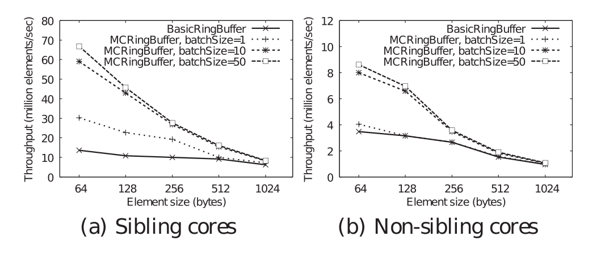

## 译者序

论文 *A Lock-Free, Cache-Efficient Shared Ring Buffer for Multi-Core Architectures* 介绍了一种专为多核架构设计、用于*单生产者\/单消费者模型*的环形缓冲区，称为 *MCRingBuffer*。论文性能测试表明，其吞吐量数倍于 Lamport 提出的 *BasicRingBuffer*。

MCRingBuffer 将环形缓存区划分为多个块，块划分为多个槽。

论文基于基础的环形缓冲区，从以下两方面着手提高性能：

1. 降低读共享控制变量的频率：维护私有变量，仅在缓冲区可能满/空时读取共享控制变量。

写者维护私有变量`localRead`，记录写者看到的读者最近一次读取位置。当写者发现`NEXT(nextWrite)==localRead`时，说明缓冲区可能已满。这时去读取共享控制变量`read`判断缓存区是否真的已满。读者也有类似逻辑。

2. 降低写共享控制变量的频率：批量更新控制变量。

按块更新`read`和`write`。读者读完一个块后更新`read`，写者写完一个块后更新`write`。因此写者维护的`localRead`/读者的`read`落后于读者当前读取到的槽（读者读了几个槽，但没读完块，不更新`read`）。

以下是写者视角的 MCRingBuffer。


## 版权

> Permission to make digital or hard copies of all or part of this work for personal or classroom use is granted without fee provided that copies are not made or distributed for profit or commercial advantage and that copies bear this notice and the full citation on the first page. To copy otherwise, or republish, to post on servers or to redistribute to lists, requires prior specific permission and/or a fee.
>
> ICS’09, June 8–12, 2009, York Town Heights, New York, USA. Copyright 2009 ACM 978-1-60558-498-0/09/06...$5.00.

<center><b>A Lock-Free, Cache-Efficient Shared Ring Buffer for Multi-Core Architectures</b></center>

## 摘要

我们提出一个无锁、缓存高效的共享环形缓冲区  *MCRingBuffer*，在多核架构中提供跨线程的高速数据访问。MCRingBuffer 通过并发的无锁数据访问来降低跨核通信的开销，并改善访问用于线程同步的控制变量的缓存局部性。在 Intel Xeon 多核机器上的性能测试表明 MCRingBuffer 的吞吐量是现存其他无锁并发环形缓冲区的 4.9 倍。MCRingBUffer 的一个重要应用是*并行网络流量检测*(*parallel network traffic monitorin*)，MCRingBuffer 有利于多核架构下以*线速*（*line rate*）处理网络包。

## 类别和主题

D.4.1 [**Operating Systems**]: Process Management—Synchronization

## 关键词

Design, Experimentation, Performance

## 简介

我们提出 *MCRingBuffer*，一个无锁、缓存高效的环形缓冲区，用于加速多线程的多核流量检测系统的的共享数据访问。MCRingBuffer 通过提高引用*缓冲区槽*（*buffer slot*)的控制变量的缓存局部性来最小化线程同步的内存访问开销。注意，MCRingBuffer 在通用 CPU 上工作，不依赖任何硬件同步原语的软件方法。MCRingBuffer 的性能提升与传输的数据元素的类型和多线程应用的实现无关。

MCRingBuffer 的一个重要应用是高速网络中的数据流量监控系统。多核架构通过*并行化*（*parallelizing*）数据包的处理，提供了一种潜在的线速流量监控方案。

MCRingBuffer 力求开发多核架构的全部潜力，它最小化跨核通信的开销，以便不同核心上的线程可以高效交换信息用于网络数据分析。

## 设计

我们聚焦于单生产者/单消费者模型。Lamport [2] 提出了一个我们称之为 *BasicRingBuffer* 的并发无锁环形缓冲区，它不需要任何硬件同步原语（比如 compare-and-swap）。BasicRingBuffer 的正确性依赖于读写控制变量（整数类型）是不可分隔的原子操作。现代硬件架构通常满足这一假设。

其他无锁环形缓冲区 [1,3] 通过直接比较控制变量和保存数据的缓冲区槽来优化 BasicRingBuffer。然而，这种数据/控制耦合的方案要求环形缓冲区必须定义一个不可以被应用使用的空数据元素，因此将环形缓冲区用于通用数据类型时引入了额外约束。

我们提出 MCRingBuffer，一个支持并发无锁访问的环形缓冲区。MCRingBuffer 基于 BasicRingBuffer，专门优化了控制变量的缓存局部性。图 1 展示了 MCRIngBuffer 的框架，包括控制变量的放置和生产者/消费者执行的插入/提取过程。MCRingBuffer 包括两个主要的设计特性：(i) 缓存行保护和 (ii) 批量更新控制变量。

**缓存行保护**。把控制变量放置在缓存中。为了避免*伪共享*（*false sharing*)（比如两个线程都访问同一缓存行中的变量），我们这样放置控制变量以便不同线程的局部、非共享变量不会存放于同一缓存行。通过缓存行保护，我们可以最小化访问共享控制变量的开销。当生产者（消费者）将要插入（提取）元素，它首先检查它自己缓存行中的局部控制变量`localRead`(`localWrite`)来决定缓存区是否**可能**满（空）。如果是，生成者（消费者）再进一步检查`read`(`write`)来决定缓冲区是否**真的**满（空）。生产者（消费者）将在缓冲区不可能或没有真的满（空）时插入（提取）元素。直觉上看，从内存重新加载`read`(`write`)时，它可能已经被消费者（生产者）递增多次以指向前面的缓冲区槽。因此，生产者（消费者）只需要在多于一个插入（提取）操作后访问`read`(`write`)。因此，*MCRingBUffer 降低了从内存读取共享控制变量的频率*。

**批量更新控制变量**。在 BasicRingBuffer 中，在每次提取（插入）操作后更新共享变量`read`(`write`)。这里，我们在控制变量`read`和`write`上应用批量更新，所以我们更少更新它们。我们将环形缓冲区划分为块，每个块包含`batchSize`个槽。我们只在`batchSize`个元素被提取（插入）后递增`read`(`write`)指向下一个块。因此，*我们降低了写共享变量到内存的频率*。注意，我们的批量更新策略只用于控制变量，对如何调度数据元素上的插入、提取操作是透明的。

批量更新策略假定数据元素始终可用，以便可以更新控制变量。 这对包含大量数据包的高速网络共享数据包信息的环形缓冲区是合理的。

```
/* Variable definitions */
1: char cachePad0[CACHE LINE];
2: /*shared control variables*/
3: volatile int read;
4: volatile int write;
5: char cachePad1[CACHE LINE - 2 * sizeof(int)];
6: /*consumer’s local control variables*/
7: int localWrite;
8: int nextRead;
9: int rBatch;
10: char cachePad2[CACHE LINE - 3 * sizeof(int)];
11: /*producer’s local control variables*/
12: int localRead;
13: int nextWrite;
14: int wBatch;
15: char cachePad3[CACHE LINE - 3 * sizeof(int)];
16: /*constants*/
17: int max;
18: int blockOnEmpty;
19: int batchSize;
20: char cachePad4[CACHE LINE - 3 * sizeof(int)];
21: T* element;

function Insert(T element)
1: int afterNextWrite = NEXT(nextWrite);
2: if afterNextWrite == localRead then
3:   while afterNextWrite == read do
4:   /*busy waiting*/
5:   end while
6:   localRead = read;
7: end if
8: buffer[nextWrite] = element;
9: nextWrite = afterNextWrite;
10: wBatch++;
11: if wBatch ≥ batchSize then
12:   write = nextWrite;
13:   wBatch = 0;
14: end if

function Extract(T* element)
1: if nextRead == localWrite then
2:   while nextRead == write do
3:     if blockOnEmpty == 0 then
4:       return -1; /*no element is read*/
5:     end if
6:   /*busy waiting*/
7:   end while
8:   localWrite = write;
9: end if
10: *element = buffer[nextRead];
11: nextRead = NEXT(nextRead);
12: rBatch++;
13: if rBatch ≥ batchSize then
14:   read = nextRead;
15:   rBatch = 0;
16: end if
17: return 0; /*an element is read*/
```

## 评估

我们在配备 2.66 GHz CPU 和 32 GB RAM 的 Intel Xeon 5355 四核 Linux 机器上评估 BasicRingBuffer 和 MCRingBuffer。 CPU 包括双核模块的两个副本，每个副本都有一对核心和一个共享的二级 (L2) 缓存。 如果一对核心位于同一个模块中，我们称它们为同级核心，否则称为非同级核心。 环形缓冲区是用 C++ 编写的，并使用带有 -O2 选项的 GCC 4.1.2 编译。

在我们的评估中，生产者线程插入 10M 元素，消费者线程依次提取插入的元素。我们测量*吞吐量*（*throughput*），例如每秒执行的插入/提取操作对数。每个数据点平均进行超过 30 次实验。

图 2 展示了环形缓冲区容量为 2000 个元素的时，BasicRingBuffer 和不同 MCRingBuffer 变种的吞吐量与数据元素大小的关系。总体而言，MCRingBuffer 实现了比 BasicRingBuffer 更大的吞吐量。例如，当元素大小为 64 字节时，`bachSize=50`的 MCRingBuffer 的吞吐量分别是同级和不同级核心上的 BasicRingBuffer 的 4.9 被和 2.5 倍。



## 结论

我们介绍了 MCRingBuffer，一个实现高效多核架构线程通信的无锁、缓存高效的环形缓冲区。MCRingBuffer 通过缓存行保护和批量更新控制变量改善了控制变量的缓存局部性。

## 参考

[1] J. Giacomoni, T. Moseley, and M. Vachharajani. FastForward for Efficient Pipeline Parallelism - A Cache-Optimized Concurrent Lock-Free Queue. In PPoPP, 2008.

[2] L. Lamport. Proving the Correctness of Multiprocess Programs. IEEE Trans. on Software Engineering, 3(2), Mar 1977.

[3] J. Wang, H. Cheng, B. Hua, and X. Tang. Practice of Parallelizing Network Applications on Multi-core Architectures. In ISC, 2009.
