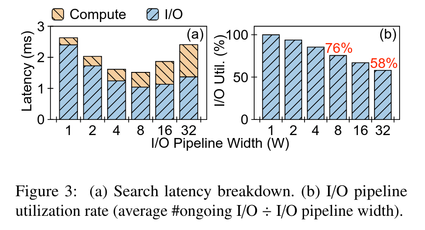
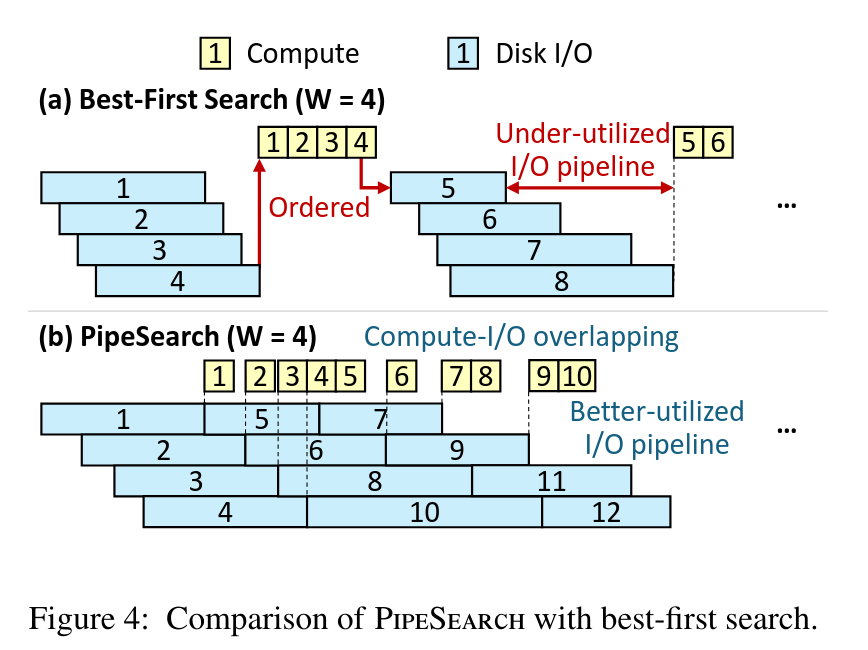
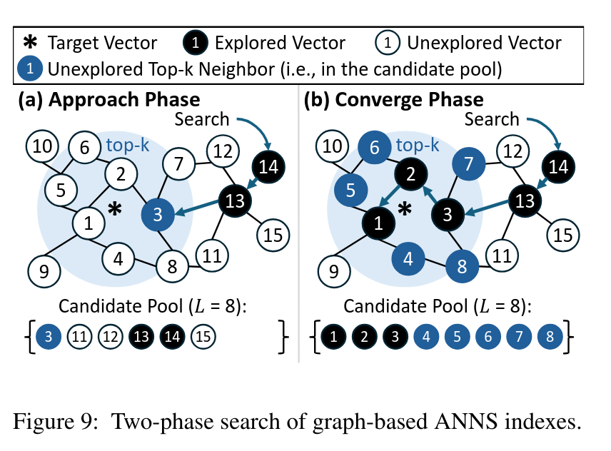
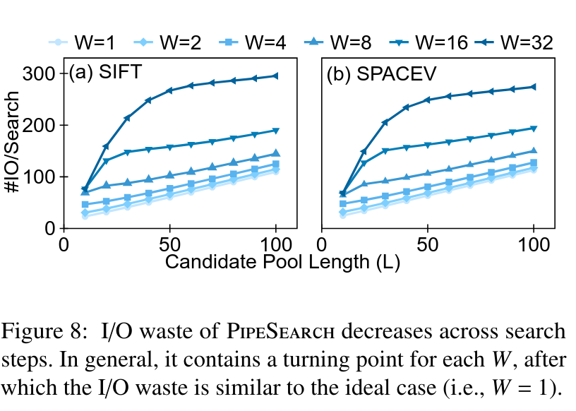

## Background
Vector searching aims to search for the closest neighbors given a target vector. When the vector is high dimensional, accurate vector search is prohibitively expensive, necessitating approximation nearest neighbor search (ANNS) which returns top-K nearest similar vectors instead of accurate results.

To support large-scale datasets, ANNS indexes has to be offloaded to SSD due to the limited CPU memory capacity. However, existing on-SSD graph-based vector search suffers from high latency, due to the misalignment between search algorithms and SSD I/O characteristics. Vector searching acts like BFS, which computes and loads the nearest neighbor in each steps until the target is reached. This I/O compute dependency leads to synchronous I/O pattern, contradicting modern SSD's parallel I/O characteristics.

This paper proposes a on-SSD graph-based ANNS system which leverages sophisticated I/O pipelining, fulling utilizing parallel I/O and achieving remarkably low latency on SSDs.
## Motivation
The original best-first search algorithm is listed as follows:

```c
1: G ← graph, q ← query vector, W ← I/O pipeline width
2: procedure BestFirstSearch(G, q, W)
3:   s ← starting vector, L ← candidate pool length
4:   candidate pool P ← {<s>}, explored pool E ← ∅
5:   while P ⊄ E do
6:     V ← top-W nearest vectors to q in P, not in E
7:     Read V from memory or disk
8:     E.insert(V)
9:     for nbr in V.neighbors do
10:       P.insert(<nbr, Distance(nbr, q)>)
11:     end for
12:    P ← L nearest vectors to q in P
13:  end while
14:  return k nearest vectors to q in E
15: end procedure

```
The candidate pool maintains all found nodes including unexplored and explored nodes. In each round of search, it selects the top-W nearest unexplored nodes from the candidate pool, loads them, computes nearest neighbors and puts into the candidate pool. The candidate pool is capped at `l` to avoid unlimited expansion.

It's worthy to note that the W is pipeline width which is 1 for in-memory ANNS system by default, where W nodes are computed in batch. Obviously, every round of search follows a I/O and then compute pattern, and this dependency prevents the overlapping of I/O and compute.

However, the pseudo-dependency of I/O and compute can be broken. the best-first search only estimates a **short** path in the graph, but not the **unique** path. Searching through multiple paths do not prohibit the convergence and brings opportunities to the overlaying of I/O and computing.

## Methods
In the original best-first search, dependency arises from the need to select the accurately near node, and thus I/O can only occur after the nearest node is computed. This paper looses the restriction by selecting **approximately** nearest nodes based on the current state of candidate pool, and thereby break the pseudo-dependency.

Another prerequisite of pipelining is the symmetric I/O and computation time, otherwise the I/O latency cannot be fully hidden. Fortunately, analysis shows that compute can match I/O cost when the pipeline width is 32. Note, increased pipeline width enlarge the candidate pool, and thus results in more heavy computation whose grow outpaces parallel I/O, narrowing the gap.




The pipelined ANNS search algorithm is listed as follows. In each round, it select the nearest loaded node from the unexplored set `U`, where every node is prefetched. In other words, the approximated approach searches from different paths whose nodes are speculatively prefetched, whereas the best-first search go thought the greedily shortest path.
```c
1:  G ← graph, q ← query vector, L ← candidate pool length
2:  Lm ← candidate pool length of the in-memory index
3:  procedure PipeSearch(G, q, L)
4:    W ← 4 ▷ Starting pipeline width.
5:    // Approach phase: entry point optimization.
6:    candidate pool P ← InMemSearch(q, min(L, Lm))
7:    explored pool E ← ∅
8:    unexplored set U ← ∅, unfinished I/Os Q ← ∅
9:    // Converge phase: dynamic pipeline.
10:   while P ⊄ E do
11:     if Q.size() < W then ▷ I/O pipeline not full.
12:       V ← top-1 nearest vectors to q in P, not in E
13:       Q.insert(V) ▷ send read requests.
14:     end if
15:     v ← nearest vector to q in U ▷ overlap with I/O.
16:     E.insert(v), U.remove(v) ▷ explore v.
17:     for nbr in v.neighbors do
18:       dis ← PQ_distance(nbr, q)
19:       P.insert(<nbr, dis>)
20:     end for ▷ update candidate pool.
21:     P ← L nearest vectors to q in P ▷ PQ distance.
22:     F ← finished I/Os in Q ▷ poll for completion.
23:     W ← AdaptPipelineWidth(P, F)
24:     U.insert(F), Q.remove(F)
25:   end while
26:   return k nearest vectors to q in E ▷ exact distance.
27: end procedure

```



Although the approximated path results in IO wastes compared to the best-first search, and thus leads to lower throughput but lower latency due to the overlapping of I/O and computation.

### Dynamic Pipeline Width
Once the pipeline implementation challenge is solved, the paper proceeds to tackle the subsequent low throughput issue, a side effect of the pipeline. The low throughput is attributed to IO waste, where a number of nodes are speculatively prefetched but end up being no longer on the critical path.



By analysis, the search process can falls into two stages: the first stage is approaching and the second stage is convergence. In the approach stage, the current position is far from the target vector, and thereby many speculatively prefetched nodes are not in the critical path (i.e. the newly-computed nearest neighbors evicts the speculatively-prefetched nodes to the back of the candidate pool). For instance, in figure (a), node 3, 11 and 12 is prefetched, but only node 3 is in the critical path and nodes 11 and 12 will be moved to the back because node 2, 7, 8 will be loaded as soon. In comparison, in the converge stage, most speculatively prefetched nodes are in the critical path, leading to less I/O wastes. The analysis shows that the pipeline can achieve almost the same I/O utilization of the ideal case (i.e. width is 1) after a tuning point.



To reduce IO wastes, the pipeline dynamically adjust it's pipeline width based on the stage; the pipeline width is small in approach phase and increases in the converge phase heuristically. In the converge phase, most newly prefetched node's neighbors are already in the candidate pool such that the hit rate can serve as an indicator. This paper sets the threshold to 0.9, meaning if 90% neighbors are already in the candidate pool, the search enters convergence phase.
### Optimizations
The root cause of I/O waste is missing neighbor information in the fetched nodes. In the original best-first search, it misses 0 record information, while pipelined version misses no more than W records because it speculatively prefect W nodes.

Ideally, if I/O completions arrive uniformly and the empty slots are filled up immediately, so that the number of missed information is W (W on-flight I/Os). However, I/O completions are unstable and may arrive simultaneously, filling up the pipeline may make I/O miss the neighbor information on more records (W on-flight I/O and N prefetched-but-not-explored nodes).

To tackle this issue, this paper repeatedly sends on I/O and explores one nearest node after multiple I/O finishes.
## Evaluation

The latency gains are mainly from the converge phase which is highly pipelined. Thus, this approach performs well under workloads with short approach phase but long converge phase. In other words, it is suitable for large-scale (i.e. billion vectors) datasets and workloads with high recall rate. high recall rate requires more I/O and enlarge the converge phase, thus narrow the gap between best-first.

Analysis shows this approach can achieve almost the same level of I/O wastes compared to best-first when recall rate is greater than 95%. When the recall rate is low, severe I/O wastes increases average service time (i.e. more computation time) and thereby lower throughput.

## References
PAPER *Achieving Low-Latency Graph-Based Vector Search via Aligning Best-First Search Algorithm with SSD*
