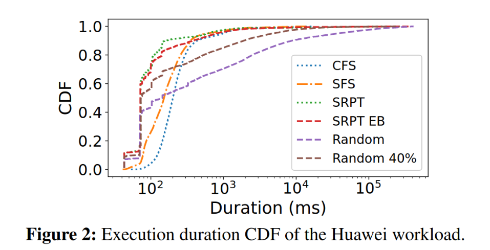
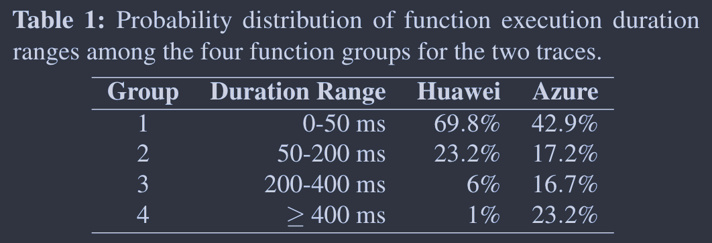
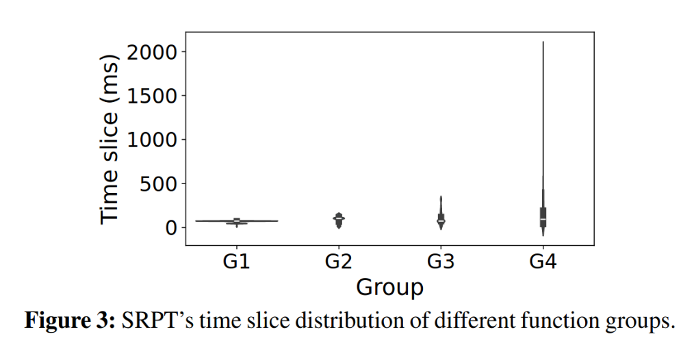
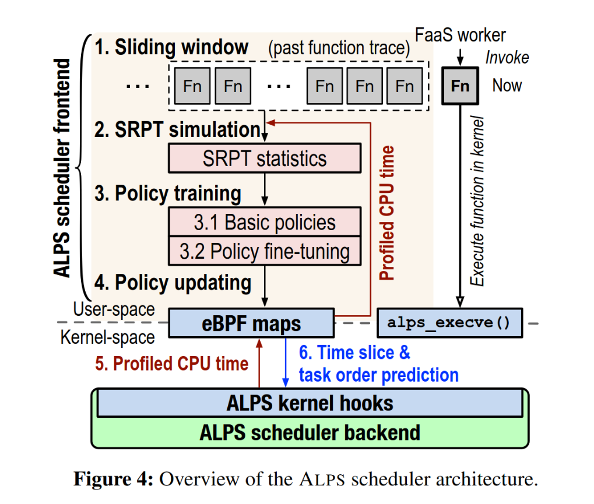

## Motivation
FaaS 环境下存在大量短生命周期的函数，这些函数作为进程调度到 OS 上。同时创建数千个函数都是家常便饭。由于 Faas Function 生命周期通常很短，研究表明 99% 的 Azure Function 都在 224s 以内。因此，OS 调度策略会对 FaaS function 的周转时间（turnaround time）产生重大影响。然而，Linux CFS 在大量短生命周期任务的 FaaS 下表现并不好。

论文开发了一个 OS 调度器 ALPS，用函数的历史运行数据预测未来的负载，并模拟 SRPF(Shortest Remaining Processing Time) 的调度，最终实现逼近 SRPF 的性能。ALPS 实际上是在 CFS 的基础上，为 FaaS function 添加了定制的调度策略。
## CFS
CFS(Complete Fair Scheduler) 是 Linux 默认的调度器，目标是公平性（fairness）。[Linux 内核文档](https://docs.kernel.org/index.html)将 CFS 的设计目标描述为：
>80% of CFS’s design can be summed up in a single sentence: CFS basically models an “ideal, precise multi-tasking CPU” on real hardware.
>
>“Ideal multi-tasking CPU” is a (non-existent :-)) CPU that has 100% physical power and which can run each task at precise equal speed, in parallel, each at 1/nr_running speed. For example: if there are 2 tasks running, then it runs each at 50% physical power --- i.e., actually in parallel.

简而言之，CFS 让系统的所有进程按照 weight（通过`nice(1)`设置）按比例（默认平分）共享 CPU。

在实现机制上，CFS 引入了 vruntime 在逻辑上表示进程运行时间，所有进程都按 vruntime 大小放到一刻红黑树中，其中 vruntime 最小的进程在红黑树最左边。新创建的进程会被分配最小的 vruntime。每次调度决策时，CFS 选择 vruntime 最小的进程（迄今运行时间最短）。weight 影响的 vruntime 的增长速度，weight 越大（`nice(1)`越小），其 vruntime 增长速度就越慢，意味着有更多的机会被调度，也就能分配到更多 CPU 资源。weight 对 vruntime 的影响，就类似于“天上一日，地下一年”。

显然，CFS 的机制无法应对同时创建大量短任务的负载。大量同时创建的短任务之间会发生大量的进程切换，导致周转时间延长。
## 设计
对于大量短任务的负载，最佳的调度策略是 SRPF。尽管 SRPF 在现实中难以实现，但 SRPF 可以作为性能评估的基准，并给新的调度算法提供了方向——模拟 SRPF。

论文首先分析了 FaaS 负载（实验数据来自 Huawei 和 Azure）下，SRPF、RR(Round Robin) 、FIFO（First In First Out）、SFS 和 CFS 等调度策略的优劣和特征。细节不赘述，总结如下

| 策略   | 优势           | 劣势                         |
| ---- | ------------ | -------------------------- |
| SRPF | 短任务最佳算法      | 1. 对长任务不友好 2. 无法实现         |
| CFS  | 久经考验，长任务不会饿死 | 对 FaaS 负载不友好。              |
| SFS  | 性能比 CFS 好    | 1. 应用态/内核态通信成本 2. 需要修改用户代码 |

CFS 虽然不够好，但久经考验，而且提供了调整策略的机制。论文将基于 CFS 开发新的调度器。

论文首先测试了 FaaS 负载下多种 SRPF 模拟算法（预测进程执行时间）的性能，获得两个重要发现：
1. 如果所有的预测都不准确，但是误差可控，仍能实现逼近 SRPF 的性能。
2. 只要有一部分预测是准确的，即使另一部分预测完全是随机的，也能逼近 SRPF 的性能。

这一发现意味着模拟 SRPF 是可行的方案。此外，论文发现函数的执行时间存在规律，并将其划分成 4 个函数组。

函数组有不同的 SRPF 时间片（指在 SRPF 策略下的时间片）特征：
- 短任务的 SRPF 时间片长度非常集中
- 长任务的 SRPF 时间片长度跨度很大

ALPS 学习函数组（见 *#Q[[#Q&A]]A*）中函数的历史执行信息，预测未来的时间片，并用于调度策略。ALPS 将问题拆分成两个子问题：
1. 如何学习调度的进程次序（优先级），即调度时那个进程先被调度。
2. 如何学习进程的时间片，即让被调度进程运行多久。

## 架构

1. ALPS frontend 收集上一个滑动窗口（默认一分钟）的函数执行信息，包括 function ID、到达时间、使用的 CPU 时间（这个时间通过 eBPF 获取）、结束时间（没有结束的函数不记录结束时间）。
2. frontend 用收集到的函数执行信息模拟 SRPT 调度，得到 SRPT 每个 function deployment 下函数的 SRPF 时间片、等待时间等指标。
3. 用 SRPT 指标预测下一次的时间片和调度次序（调度优先级）
    1. 预测时间片和调度优先级
    2. 微调以应对负载迁移（workload shift）和误差
4. 更新 eBPF map，内核态的 ALPS backend 会用 eBPF map 中记录的优先级和时间片调整调度策略。

## 学习
### 进程次序
论文发现，在 SRPF 下，等待时间（waiting time，指进程进入系统到第一次被调度的时间）越小的进程，其剩余执行时间（指进程到结束所用的 CPU 时间）也越小。因此可以用等待时间预测剩余运行时间。

frontend 根据 SRPT 等待时间给函数（组）赋予优先级，等待时间越短，优先级越高。优先级越高的函数，会优先被调度。

### 时间片长度
SRPT simulation 得到某个 function group 的时间片，frontend 用这些时间片预估下次的时间片长度。论文给了几种策略，如平均值、随机森林等。

$$
ts_i = train_{ts}(\vec{ts_i})
$$
$ts_i$ 是预估时间片，$train_{ts}$ 是训练函数（平均值、随机森林等）。$\vec{ts_i}$ 是 SRPT simulation 得到的时间片历史。

## 微调
ALPS 考虑到了误差和负载迁移两种 corner case。误差包括高估和低估两种情况，ALPS 将预测的时间片调整为：
$$
ts^u_i = max(α × ts_i − β × stdev(ts_i), 0)
$$
其中 $α$ 用来补偿低估的情况，$β × stdev(ts_i)$ 补偿高估的情况。$max$ 回退到 CFS 的调度策略。

另一个 cornner case 是负载暴增，例如突然有大量并发请求导致系统负载暴涨。这种情况下，SRPF 无法保证公平性，可能导致长任务饿死。ALPS 会在系统负载高时，减小函数时间片长度，从而给其他任务更多被调度的机会。调整后的时间片长度公式如下：

$$
ts^{s}_i = min(p × ts^u_i ,ts^u_i)
$$
惩罚因子 $p$ 公式如下：

$$
p =
\begin{cases}
  1 & \text{if } l < \theta \\
  \frac{100 + \theta - l}{100 \times \gamma} & \text{if } l \geq \theta
\end{cases}
$$

其中：
- $l$ 表示实时 CPU 利用率。
- $\theta$ 表示 CPU 利用率的阈值，用于决定是否应用惩罚。
- $\gamma$ 表示对高负载的响应敏感度。

论文说 $\gamma$  越小，$p$ 越大，ALPS 越接近 CFS。但是从公式看，似乎是 $p$ 越小，ALPS 越接近 CFS。$p$ 越小，对时间片的调整就越大，但 $p$ 大到一定程度，最终计算的结果就变成了$ts^s_i$，相当于没有惩罚。

## 后端
ALPS 实际上是通过前端预测的时间片长度有优先级，微调 CFS 调度策略，在 CFS 之上添加了针对 FaaS 的调度策略。

ALPS 通过 eBPF hook 了以下两个函数：
- `sched/bpf_time_slice`：决定是否调度其他进程。
- `sched/bpf_task_ordering`：决定两个进程的调度次序。

对于 SRPF 时间片，ALPS 的逻辑如下：
1. `sched/bpf_time_slice`判断该进程是否耗尽 SRPF 时间片，如果未耗尽则继续执行当前进程；如果该进程耗尽 SRPF 时间片或没有被 ALPS 记录，回退到 CFS 自己的调度策略。
2. `sched/bpf_task_ordering`通过 rank 决定进程调度次序，rank 小（高优先级）的进程优先调度，rank 相同的进程回退到 CFS 的调度逻辑。

## 实现
论文的 [Github 仓库](https://github.com/ds2-lab/ALPS/)完整给出了代码。论文对前端滑动窗口和 SRPF 模拟的细节不够清晰，可以从代码得到补充。

1. 滑动窗口不需要记录进程结束时间。只需要记录 CPU 时间，并将这个时间作为进程结束时间进行 SRPF 模拟即可，是否真的结束并不重要。
2. 一个函数在 SRPF 模拟中可能被调度多次，每次占据 CPU 的时间就是论文所谓的 SRPF 时间片。前端会记录 function deployment 的所有 SRPF 时间片。
3. 前端的调用者是后端。后端会定期调用前端，发送当前函数的优先级和时间片长度。前端在学习时会考虑上次的优先级和时间片长度。

## 评估
评估的结果非常好，我主要关注到两点：
1. OS 调度对 FaaS 函数整体性能的影响。论文发现 FaaS 平台的 overhead 很小（1%-10%），由于函数普遍是短任务，OS 调度策略对整体性能（周转时间）影响很大。对于 Huawei 的工作负载，ALPS 甚至可以减少 40% 总体执行时间。
2. 与 CFS 和 SFS 的性能比较。ALPS 对于四种函数组，相比 SFS，总体执行时间减少 20.6% 到 27.3%；相比 CFS，总体执行时间减少 34.1% 到 57.2%。

## Q&A
- [x] 函数组和 function deployment 的关系？
这应该是从两个角度看一个东西。函数组是按函数执行时长将函数分组，function deployment 是 FaaS 部署的单位。function deployment 内的函数相同，因此其执行时长也可以认为相似。因此，一个 function deployment 可以认为属于某个函数组。

从代码逻辑上看，每个函数都有一个所属的`class_id`，应该就是论文中 function deployment 的 ID。

- [x] 代码细节
  - class_id 相当于 function deployment
  - workload 记录的不需要是完成的 function，只要有运行时间就可以进行 SRPF simulation
  - simulation 得到的是一个  funciton deployment 的所有 function 的 timeslice 和 waiting time。timeslice 是 SRPF 下一个 function 单次调度运行的时间。
  - SRPF simulation 中，一个 function 运行 6 单位的 timeslice 后才可能被抢占，因此 timeslice 最小是 6。
  - 代码里最终计算时间片还考虑到了上次时间片长度，如果上次时间片长度大于 1，则计算得到的 timeslice x 0.7 + 0.3 x last-timeslice

- [ ] OpenLambda 怎么知道在为哪个 URL 启动哪个容器
- [x] 代码中 ol 到底是啥？仓库好像没提供代码
ol 就是修改后的 OpenLambda。不确定有没有提供代码，experiment/ 下的 python 文件可能是。

backend 不断调用 frontend，逻辑在`handleClient`中。backend 将上一次的 policy（包含 priority 和 timeslice）发送给 frontend，frontend 根据这次的运行结果，进行 simulation 和微调，返回新的 policy 给 backend。

simulation 时，从 workload 读取运行信息，相当于论文中的 sliding window。但是没找到 workload 文件写入的地方。

simulation 结束后输出一个 csv（data.csv，本次 simulation 的结果），微调用这个 cvs 进行。

---
## References
- https://docs.kernel.org/scheduler/sched-design-CFS.html
