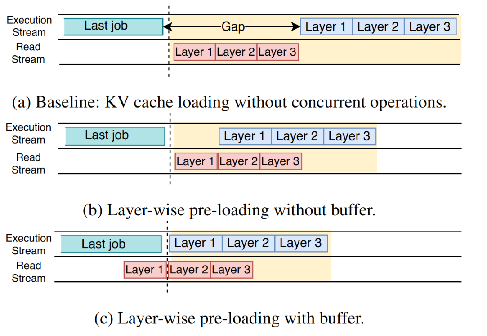
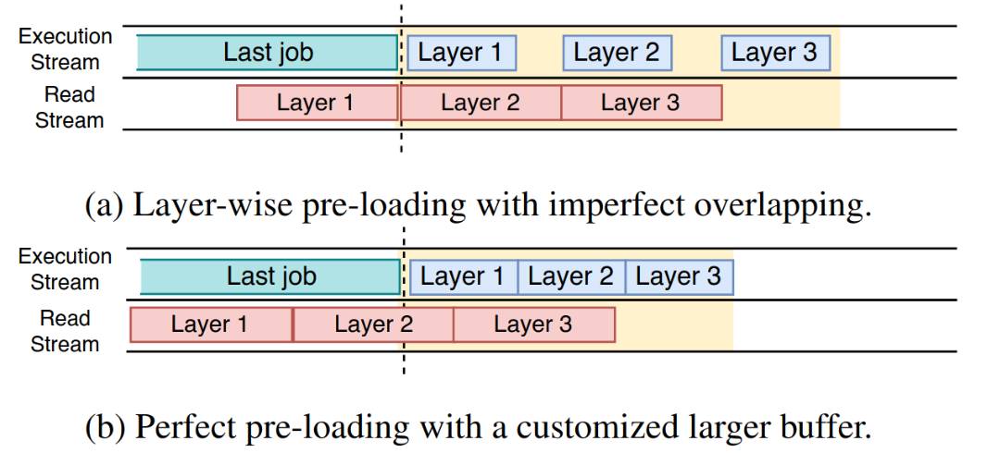
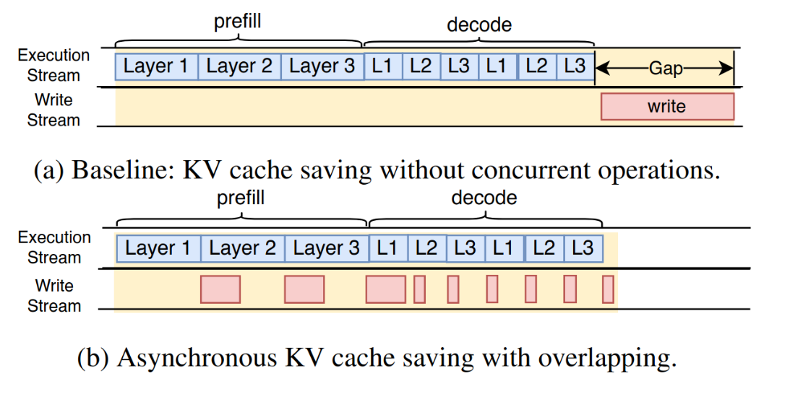
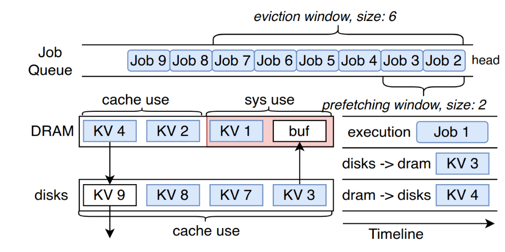

## Core Ideas

Offloading KV caches to larger-but-slower medium can significantly improves cache hit rates, thereby improving TTFT. latency issues caused by slower medium can be reduced by the following techniques:
1. Asynchronous IO can be deployed to hide IO delay, such as layer-wise pre-loading, asynchronous saving.
2. Scheduler-aware caching is feasible in LLM serving because the future jobs are knowable.
## Motivation
Existing systems like [SGLang](https://kongjun18.github.io/posts/sglang-efficient-execution-of-structured-language-model-programs) leverage prefix sharing to improve prefilling cache reuse in multi-turn conservation and long context scenarios. However, existing prefix sharing methods only stores KV
caches in VRAM and DRAM, which is highly restricted in capacity and constrains cache reuse. Moreover, existing system can only retain user sessions (prefix cache) for a short time due to the capacity limitation, which is not suitable for multi-turn conservation scenarios. 

For instance, when using 4 A100 GPUs with 80GiB HBM to run LLaMA-65B, the prefilling process KV cache generation speed is about 13.9 GiB/s. As 130GB of HBM space is allocated to store the model, the remaining 190GB of free HBM space will be fully occupied by the KV caches with 14s. Even if offloadn KV caches in DRAM (e.g., 512G), the DRAm will be filled in less then 1m.

Evaluation also demonstrates that cache reuse rate will be significantly improved if the space is massively extended.

However, There are several challenges to offload KV caches to larger but slower medium:
1. KV cache system requires extremely low latency, otherwise the GPU will be idle. How to achieve low latency using slow medium?
2. Offloading KV caches to SSD introduces an extra layer to memory hierarchy, forming a VRAM-DRAM-SSD hierarchy. How to manage caching policy and data flow between different hierarchy.
## Methods

For challenge 1, many traditional *data de-duplicaiton* techniques can be applied to hide IO latency. In this paper, asynchronous IO and pre-loading are heavily deployed. 

For challenge 2, scheduler-aware pre-loading and caching can be deployed due the the scheduler have the foreknowledge about requests in the immediate future.

### Async IO
The magic behind hiding IO latency is to launch asynchronous preloading and saving to overlay IO and computation.  
#### Layer-Wise Preloading
In transformer architecture, each layer has its own independent KV caches and computes in a pipeline parallelism manner. Thus, layers are not dependent to preceding layers' KV caches except for the current token's QKV vector, enabling asynchronous layer-wise pre-loading. Specifically, layer-wise preloading scheme transfer the KV caches of the next layer at the same time the current layer is computing. If the IO timing is selected properly, pre-loading can overlay IO and computation perfectly.

This paper  studies the pre-loading buffer and timing in depth:
1. Buffer size: a pre-loading buffer should be deployed to fill up the gap between last job and the first layer of the current job.
2. Timing: a **larger** pre-loading buffer should be applied to pre-load early on when the loading time is longer than computation time. 

For fist insight, read stream cannot commence before the layer 1's computation because due to the lack of pre-loading buffer.

For second observation, IO cannot fully overlap with computation if loading time is longer than computation. The solution is to pre-load earlier, which necessitates a larger buffer. Specifically, the buffer size should be large enough to fill up the time gap $T_{prefill}L_{new}-T_{load}L_{history}$, where each denotes time to prefill, length of new generated tokens, time to load and length of history tokens respectively.  Hence, the pre-loading buffer should be additionally expanded $B(T_{prefill}L_{new}-T_{load}L_{history})$, where B is the PICe bandwith.

#### Asynchronous Saving
Asynchronous saving shares the same goal of layer-wise pre-loading but for write, using asynchronous write-back to overlap the KV cache write-back IO with computation. Because prefill stage computes KV caches concurrently, leaving a restricted time fame, most asynchronous saving overlaps with decode phrase.

A job returns after the execution of prefill/decode and write-back. If the write-back is slow, the write-back IO cannot fully overlap with decoding phase, blocking the next job. Therefore, asynchronous saving scheme also reserves a HBM write-back buffer like pre-loading scheme and move unfinished write-backs to this buffer when the decode has already finished to avoid blocking.

### Memory Hierarchy Placement: Scheduler-Aware Preloading and Eviction

The scheduler knows waiting jobs in the immediate future, so scheduler-aware caching is possible. AttentionStore proactively looks ahead at future jobs to promote KV caches in SSD to DRAM early on and evict not accessed KV caches in the immediate future. Like *vLLM*, AttentionStore evicts KV caches at request level because KV caches in a request are guaranteed to be read together.

Concretely, AttentionStore scans the prefetching window and promotes all hit KV caches from SSD to DRAM. For eviction policy, AttentionStore prioritizes evicting jobs at queue tail (the last executed jobs) and exempts jobs in eviction window (the jobs executes in the immediate future).

### De-coupled KV Cache Truncation

Once the context length exceeded the model's context window (maximum context length), LLM serving systems directly truncate the history tokens and only retain latest tokens. By doing so, the positional encoding of retained KV caches will be invalidated, resulting in broken KV caches.

Many modern models use relative position encoding (RPE) rather than traditional absolute positional encoding (APE). AttenionStore works with RPE and only stores position-independent KV caches. Position encoding will be added to position-independent KV caches to form "normal" KV caches before prefilling. In this way, KV caches will not be invalidated even if truncation happens.                                                                            
## Evaluation

Cache hit rate is significantly improved because of extended cache capacity.

Layer-wise pre-loading increases throughput by 63% while the improvements gained from asynchronous saving is relatively smaller, because the imbalanced read and write KV cache workload.
## Advantages

Improves KV caches capacity, thereby significant improves cache hit rate.
## Limitations 
1. Asynchronous saving not works in dis-aggregated architecture because write-back cannot overlap.
2. Data strictly flows between adjacent layers within the memory hierarchy.
## Thoughts
1. Methods used in this paper are *data de-duplication* techniques. More data de-duplication techniques can be used to hide IO lantency.
2. More complex data flow between memory hierarchy should be studied.
## Questions & Answers

**Evicting cache at request-level while scheduling requests at iteration-level (*continuous batching*). Does it causes the next jobs to cache miss?** 

No. AttentionStore evicts the last job, so all jobs benefit,  except for the last job.

---
## References
