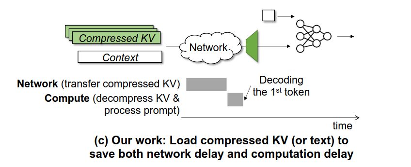
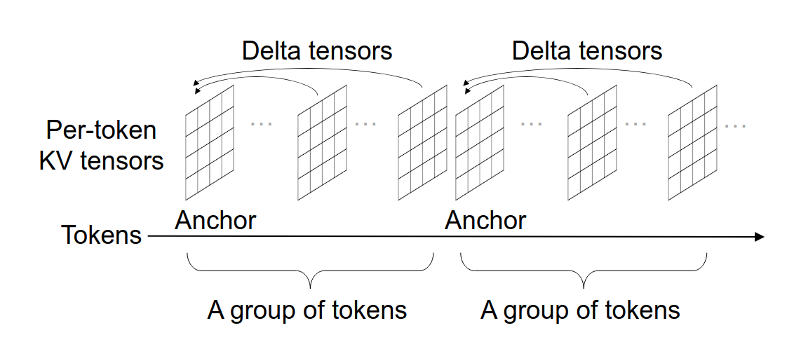
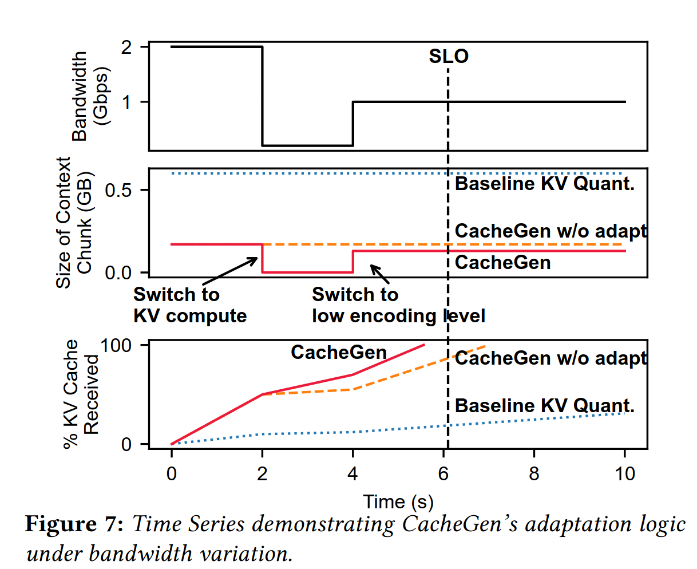

## Core Ideas

1. Optimizing KV cache network transfer size and cost is valuable.
2. Traditional video compressing techniques can be applied.

## Abstract

In the long context scenario, long context is too long to fit into GPU memory, necessitating the need of KV cache storage system which stores and transmits KV cache via network. However, the transmission cost of fetching of KV cache can be non-trivial. The size of a KV cache grows with both the model size and context length and can easily reach 10s GB. Specially, although most GPUs attached with high-speed RDMA network, with the prevalence of long context, we may construct KV cache storage system with high-speed GPUs and low-speed network.

This paper aims to reduce the **transmission size** of KV cache and hence reduce the network delay, which ultimately reduce the time to first token(TTFT). This paper gains ideas from video coding and propose unique methods to compress and transmit KV cache, according to some observed characteristics of KV cache value. Moreover, this method is orthogonal to other methods to reduce **runtime size** of KV cache, such as *quantization* and *context compression*.

In short, the paper reduces transmission size from two ways:

1. Compression
	1. Change-based compression: compresses and transmits deltas between the anchor token instead of original tokens.
	  2. Non-uniform quantization levels: lower quantization level for upper layers and higher quantization level for low layers.
	  3. Loss-less *arithmetic compression*(AC) grouped by layers and channels(hidden state dimensions of KV cahce).
2. Transmission: dynamic adjust *configuration*(compression levels) of chunks with respect to instant network bandwidth to adapt bandwidth fluctuation.

Lastly, this paper showcase some valuable insights:

1. Traditional system techniques can be applied in LLM serving, such as video coding technique used in this paper.
2. KV cache storage system with disks and ordinary network is also meaningful, if
	1. context is long enough: stores KV cache in GPU memory is impossible and stores in disk and send though network makes sense.
	2. reused frequently: GPU compute cost will be greater then KV cache storage cost.

Actually, CacheGen is a showcase of the concept of *Knowledge Delivery Network (KDN)* which a analogous to Content Delivery Network (CDN).

>[!NOTE]
>Context Compression is a technique that reduce the context (KV cache) size by eliminating non-important KV cache, based on the observation that some KVs contributes more than other KVs. This insight is leveraged by [IMPRESS An Importance-Informed Multi-Tier Prefix KV Storage System for Large Language Model Inference](https://kongjun18.github.io/posts/impress-an-importance-informed-multi-tier-prefix-kv-storage-system-for-large-language-model-inference).
## Architecture

The architecture of CacheGen is some kind of obscure and obfuscating. Actually, the more concrete architecture is explained in another paper *Do Large Language Models Need a Content Delivery Network* and this paper focuses on KV cache transfer.

CacheGen is a backend of KV cache and all KV access goes through CacheGen. When the context(prompt) comes in, the context goes to CacheGen. CacheGen computes KV cache, stores them and then sends them through network to the LLM serving system, which is modified to receive context(KV cache) and generate token. If the bandwidth is limited, CacheGen directly sends the original context text and leaves KV computation to the LLM serving system.



## Methods
### Compression

This paper makes those following valuable observations on characteristics on KV cache values:

1. *Token-wise locality*. Within the same layer and channel, tokens in closer proximity have more similar K/V tensor values compared to tokens that are further apart.
2. *Layer-wise sensitivity to loss*. The output quality of the LLM is more sensitive to losses in the KV cache values of the shallower layers than to losses in those of the deeper layers.
3. *Distribution along layers, channels, and tokens*. Each value in a KV cache is indexed by its channel, layer, and token position. The information gain of grouping values by their channel and layer is significantly higher than the information gain of grouping values by their token position.

For the observation 1, KV cache of each position is calculated based on preceding tokens, leading to token-wise locality. For the observation 2, an intuitive explanation is lost primitive information due to quantization of early layers propagate to the deeper layers, leading to chain effect. For observation there is no available explanation and it is leaved to future researches.

This paper propose the novel compression strategy based on the aforementioned insights:

1. Changed-based compression with respect to toke-wise locality. CacheGen divide the KV cache bitstream into groups and select the first token as *anchor token*. CacheGen compresses and transmits the delta of each token relative to the anchor token instead of origin tokens. For concurrent delta computation, CacheGen calculates delta between the anchor token rather then the adjacent preceding token.
2. Non-uniform quantization inspired by layer-wise sensitivity to loss. CacheGen classifies the layers into first 1/3, middle 1/3 and last 1/3 and uses lower quantization level for upper layers and higher quantization level for low layers.
3. Loss-less AC encoding grouped by layers and channels, because lowest entropy bits are archived by grouping by layers and channels, which lead to shortest AC encoding length.

Quantization aims to reduce the runtime-time size of KV cache and also reduce the transmission size as a byproduct. AC encoding is used to compress the KV cache while keeping float point precision.



### Transmission
CacheGen is designed to adapt network bandwidth fluctuation. To tackle bandwidth fluctuation, CacheGen splits a context into multiple chunks of consecutive tokens and use the aforementioned compression algorithm to encode each chunk into bitstream, wherein each chunk may spans multiple groups. The trick is to encode each chunk independently and decode them independently. By doing so, CacheGen sets different encoding level called *configuration* for each chunk based on the instant network bandwidth.

When the network bandwidth suddenly shrinks, CacheGen detects the bandwidth shift and use a high compression level to reduce transmission size. When the network bandwidth is extremely limited, Cache switch to plain text mode, sending the original prompt and calculating KV cache on the LLM serving system side.



For chunk length, there is a trade-off regarding two considerations:

1. The chunk length should be long enough for more aggressive concurrent delta computation.
2. The chunk length should be small enough for more agile reaction to bandwidth fluctuation.

The paper uses a bandwidth detection based on round-trip time resembling to TCP protocol. CacheGen sends chunks one by one and estimate the delay; hence, CacheGen can reaction to bandwidth fluctuation will only be delay by at most one chunk. In particular, CacheGen tries its best to switch to higher compression level even text mode to satisfy the Service-Level Objective (SLO).

>[!NOTE]
>It seems that CacheGen will incur head-of-line blocking and can not be addressed directly because it's bandwidth estimation depends on this behaviour. 

```c
chunks_to_send <- context chunks

while chunks_to_send != empty do
    get chunk_data
    throughput <- network throughput
    remaining_time <- SLO − time_elapsed

    if time_recompute <= remaining_time then
        cur_chunk <- text of chunk_data
    else
        level <- max(level | size(chunks_to_send, level) / throughput <= remaining_time)
        cur_chunk <- encode(chunk_data, level)
    end if

    send cur_chunk
    chunks_to_send <- concatenate(chunks_to_send, chunk_data)
end while
```

---

## References
