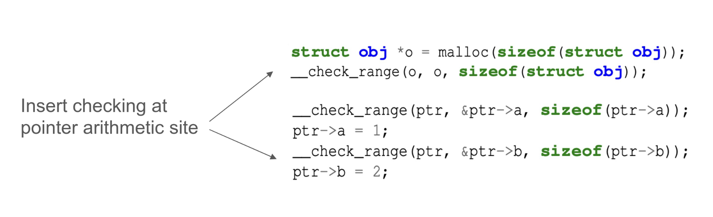

## 背景
以往的内存安全 bug 检测方法，通常由编译器或内存分配器独立进行。编译器只理解程序语义，但无法在运行时工作；内存分配器只能在运行时工作，却无法感知程序语义。本文让编译器和内存分配器协同工作检测内存安全 bug。

## 目标
通过编译器和内存分配器协同设计，针对堆上的 buffer overflow 和 use-after-free 两种存安全 bug，提出更快且准确率高的检测方法。

论文主要面向 C/C++，并且要求源程序不存在整型到指针的转换。
## 方法
编译器在编译期插入内存检测指令和进行逃逸分析，内存分配器在运行时记录内存分配和回收信息，程序运行时执行到内存检测指令，完成内存安全 bug 检测。

buffer overflow 检测逻辑：
- 内存分配器运行时记录已分配的内存区域。
- 编译器插在内存访问前插入内存访问范围检测指令，包含起始地址、访问地址和元素类型大小。
程序运行时执行到内存访问范围检测指令，该指令（内存分配器库）检测访问的地址是否在已分配内存范围内，越界则终止程序。

use-after-free 检测逻辑：
- 编译器进行指针逃逸分析，在指针拷贝操作前插入逃逸指令。
- 逃逸指令接收指针的地址，以及指针指向缓冲区的起始地址。
- 运行时逃逸指令将上述两个参数（point-to 关系，即两个指针指向同一内存）记录到内存分配器中。
- 内存分配器 free 时，将所有指向同一缓冲区的指针指向一块特殊的区域。
- 用户 use-after-free 时，访问该特殊区域，程序终止。

## 实现

编译器基于 LLVM 做修改，实现了上述指令插入和逃逸分析功能。内存分配器基于 tcmalloc 修改。

tcmalloc 使用分离链表，分离链表指向不同大小的 span，一个 span 是一块包含多个相同大小对象的连续内存区域。CAMP 利用 tcmalloc 的分离链表实现快速地运行时支持，包括 O(1) 的指针范围检测和高效的 point-to 关系记录。

CAMP 内存分配器分配内存时会记下该 span 的位置和 span 中的元素大小，给一个堆指针，就能快速得到该指针的对象在 span 中的下标，从而判断指针访问是否发生 buffer overflow。这个查找过程显然是 O(1) 的。

每个 span 都维护了对象上的 point-to 关系，指向对象的指针被串联到对象的 point-to 指针链表中，只需要通过对象下标就可以定位到该链表，显然也是 O(1)。

## 评价
这个工作很有意思，别出心裁通过编译器、内存分配器协同设计在高性能的前提下实现了精确的 buffer-overflow  和 use-after-free 的检测。

论文的工作只是一个原型，但有两个明显的优点：
1. 不破坏内存分配器的内存安全 bug 检测功能。
2. 不需要修改原始代码。

如果 GCC/LLVM 可以在编译器和标准库内存分配器上实现论文的工作，应该可以显著提高软件内存安全性。

论文的工作对源代码的编程模式做了限制，如不能存在整型到指针的转换等。实际的 C/C++ 程序存在大量这种反模式（anti-pattern），对于实际程序的检测效果会打一定的折扣，但这也是 C/C++ 编程语言的一大问题。

论文基于 LLVM 魔改编译器，而 LLVM 可以用于多个语言的后端，是不是可以直接修改 LLVM，让本论文的内存检测方法直接用于所有 LLVM 支持的语言？也许论文没提到这一点是因为其他语言带 GC 不太存在 C/C++ 的这种问题？

## Q&A
- [x] 如何实现高性能？

    通过编译器和内存分配器协作。

    编译器：编译期优化

    - 利用类型信息减少 range check

    - 消除多余的指令

        - 多次检测同一内存地址

        - 检测同一内存区域的多个地址（编译器确定）

    - 合并运行时调用：检测同一内存区域的多个地址（运行时确定），直接获取该区域的边界，判断地址是否超过避免。从而避免每次 range check 都要进入 library 获取内存区域边界。
    内存分配器：分离链表实现 O(1) 的查找

- [x] 为什么要设置 point-to cache，point-to 关系先记录在 cache 中，满了批量再记录到内存分配器的 point-to 链表中？
    1. 为了减少内存分配器中 point-to 链表的大小。程序可能存在循环等反复创建 point-to 关系的情况，CAMP 在 cache 中删除相同的 point-to 关系，从而减少内存分配器中的 point-to 链表大小。这里的场景比较模糊，大致意思是减少重复的、不必要记录的 point-to 关系。
    2. CAMP 认为从程序代码切换到内存分配器代码（论文称为上下文切换）执行操作的成本比较高，这中批量写入可以减少上下文切换。

- [x] 什么是 in-bound overflow？
    这里比较模糊，下面是我的理解。
    in-bound overflow 指发生在内存块内，程序分配对象外的访问。例如，程序分配一个 16 字节的数组，但内存分配器分配了 32 的内存，如果访问发生在数组外内存块内就发生了 in-bound overflow。in-bound overflow 会修改对象外的数据，可能是内存分配器自己的元数据。

---
## References
- [CAMP: Compiler and Allocator-based Heap Memory Protection](zotero://open-pdf/library/items/72QACGLW)
