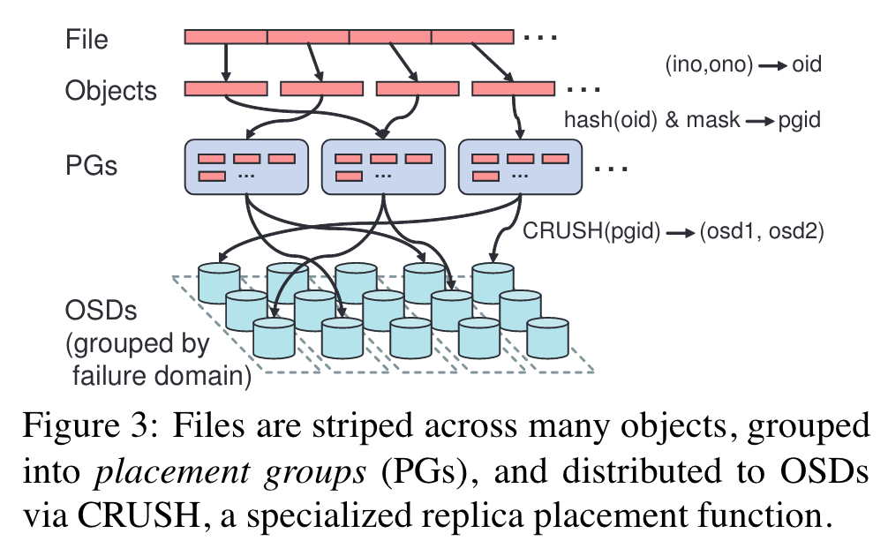

## 背景

Ceph 是一个高性能、可靠的、可拓展的分布式文件系统。Ceph 最主要的目标是可拓展性，即如何使得文件系统支持任意多的数据量。

Ceph 面临以下难题：
- 如何高效地管理元数据？
	- 如何确保一致性？
	- 如何服务热点？
	- 如何服务动态的工作负载？
- 如何高效地管理数据？
	- 数据容错
	- 复制

## 设计
元数据管理是实现高性能分布式文件系统的一大难点，元数据操作甚至占典型工作负载的 50。由于元数据存在较多的依赖，导致无法像文件 IO 一样水平拓展。此外，POSIX 的 per-file metadata 在小文件场景下海限制了存储利用率。*Finding a needle in haystack Facebook's photo storage*使用小文件聚合的方式减少元数据带来的磁盘 IO。*The Google file system*虽然提供了命名空间的抽象，但实现上改为了 key，这极大地减少了锁争用，而且简化了垃圾回收。

文件系统难以实现高拓展性的一大根源在于元数据和数据的耦合，为了管理数据，必须管理大量的元数据，使得系统难以拓展。典型的例子是传统文件系统使用的分配表，分配回收甚至是访问文件都需要先访问分配表。

Ceph 通过最大程度解耦数据和元数据实现高拓展性。Ceph 专门的元数据管理集群管理元数据，使用对象存储解决数据的拓展性问题。

## 架构

Ceph 由 client、metadata cluster 和 object storage cluster 三部分组成。其中 client 是一个 fuse 文件系统；metadata cluster 负责管理 metadata；object storage clsuter 是一个对象存储系统，存储整个文件系统的数据（包括 metadata cluster 的日志等）。

Ceph 的架构图清晰地体现了数据和元数据管理的分离，数据不再是传统文件系统中依赖于元数据管理的死物，而是一个智能（原文指对象存储设备具有 CPU、内存等组件，实际上指对象存储系统可以独立进行数据复制等工作）的对象存储系统，利用对象存储的拓展性解决数据的可拓展性，之后 Ceph 的核心问题就是如何进行高效的元数据管理。

客户端和服务端紧密协作实现 POSIX 文件系统，此外还提供了一致性更加松散的非 POSIX 接口以服务高性能编程的需求。

Metadata Cluster 使用动态子树划分算法支持动态工作负载，并实现元数据管理的高拓展性。

Object Storage Cluster 使用 *CRUSH: Controlled, scalable, decentralized placement of replicated data* 取代传统的分配表，使用分布式算法实现数据负载等功能。

### Client

打开文件时，客户端向 MDS 发送请求。MDS 遍历文件系统层次，找到对应的 inode（其中包括文件所有者等元数据）。此外，MDS 还授予客户端响应的 capability，如允许缓存读、缓存写、读、写等。MDS 可以动态地撤销或授予客户端权限，这个机制就类似于 *The Google file system* 通过撤销 lease 阻止 chunk 被写入。

#### 文件 IO 一致性
对于文件 IO，Ceph 选择了“正确性优先于性能”，以牺牲性能为代价，提供正确的 POSIX 语义。POSIX 要求原子写和写后读，因此当读写者同时存在时，MDS 会撤销客户端缓存读、缓存写的 capability，所有的读写都直接打到对象存储上，在 OSD 返回 ACK 后 write()/read() 才返回。Ceph 利用对象存储的一致性保证实现原子写和写后读，这也是许多 OSS-backend 文件系统的做法，例如 [s3-fuse/s3fs-fuse](https://github.com/s3fs-fuse/s3fs-fuse) 将读写 fallback 到后端对象存储中，S3 保证读后写，因此 s3fs-fuse 只在后端为 S3 时保证读后写。

#### 元数据操作一致性
对于命名空间操作，Ceph 仍然保持比较高的一致性。但对于 readdir 操作，出于局部性考虑（readdir 操作通常会连续读取目录的条目），Ceph 选择同时获取整个目录的条目，以牺牲一定的一致性（客户端看到过期的目录结构）为代价，获得更高的性能。

> [!QUESTION] 为什么要为 readdir 开后门？
> readdir 的典型操作是`ls -al`。readdir 非常影响性能，但 readdir 具有局部性，一次获取大量目录条目（dentry），工作负载大概率会在之后使用到这些数据。https://github.com/kahing/goofys 之类的 S3-backend 也要专门利用局部性优化 readdir。

Ceph 选择“正确性优先于性能”，在常规 API 外提供了一套高性能 API。这一套 API 专门服务于高性能需求，放松一致性和 POSIX 语义。

#### 文件到对象的映射
Ceph 将文件条带（strip）到对象上，并用文件的 inode 编号和 strip 编号命名对象，因此 Ceph 不需要向传统的设计那样，向元数据管理集群（如 *The Google file system* 的 master 节点）获取数据的位置。Ceph 在 OSD 集群同样发挥了这种“直接计算出结果，避免分配表”的思路。

### Metadata Cluster: 动态元数据管理

MDS 维护文件系统命名空间，即文件名到 inode 的映射。

#### 存储
类似其他分布式系统的设计，MDS 使用内存数据结构满足客户端请求，因此所有元数据修改操作都要先写日志。Ceph 使用流式日志优化日志性能。论文没有提到内存中的文件系统命名空间会持久化到磁盘中，但 MDS 的日志被持久化，节点故障并恢复后利用日志快速恢复内存数据结构即可。

MDS 的另一个优化是，将 inode 嵌入到目录中，并且同样以文件的条带方式存储在 OSD 中。这样可以一次 OSD 请求获取整个目录的条目，高效实现上面提到的 readdir 优化。

MDS 自身没有利用复制实现容错，而是将所有持久化数据存储在 OSD 中，由对象存储后端实现容错。MDS 的持久化数据包括日志、目录和 inode 等。

MDS 不使用固定的多副本策略，当元数据存在多副本时，由 primary 负责维持副本的 coherence。

#### 流量控制：征服热点

Ceph 对热点的处理方式如下：
- 读：使用多副本策略，复制元数据到不同的 MDS，每个 MDS 都可以服务读请求。
- 写：使用哈希算法分配将写到不同的节点，以牺牲局部性为代价提高性。只有 primary 可以服务写请求，所有传递给 secondary 写请求都要转发给 primary。

#### 动态子树划分
面对规模庞大到无法用单机内存存储的海量元数，分布式文件系统选择将元数据分区管理。常规的做法有静态子树划分和基于哈希的划分，静态子树划分无法使用动态工作负载，基于哈希的划分会丧失目录的局部性。

Ceph 认为在大型分布式文件系统是增量构建的，工作负载总是动态的，因此上面两种方法都无法满足需求。Ceph 使用 *Dynamic metadata management for petabyte-scale file systems* 的动态子树划分方法服务动态工作负载，文件命名空间被动态地划分为多个子树并存储在不同的 MDS 中。此外，Ceph 将元数据进一步划分成不同特性的多个类别，对它们使用不同的策略，以降低锁争用和实现一致性的成本。例如，Ceph 将 inode 的信息划分为安全（所有者等）、文件（大小、mtime等）和不可变信息（inode 编号等），访问不可变信息显然不用加锁，安全和文件信息也是用锁争用较少的访问模式。

### Object Storage Cluster：分布式对象存储
Ceph 的对象存储称为 RADOS(Ceph’s Reliable Autonomic Distributed Object Store)，CADOS 以分布式的方式实现存储容量和总体性的线性拓展。

#### CRUSH: Controlled Replication Under Scalable Hashing
Ceph 完全抛弃了传统的分配表，使用 CRUSH 计算对象的存储位置。在 MDS 中，文件按照 inode 和条带编号映射为对象，对象使用简单的哈希函数影射到 PG(placement group)。对象存储集群使用 CRUSH 将 PG 影射到一个 OSD，一个 OSD 可能会被影射到不同的 PG，Ceph 通常配置为一个 OSD 平均被影射到 100 个 PG。

>[!NOTE] 一个 OSD 可以存储很多对象，因此一个 OSD 可以被影射到不同的 PG。

CRUSH 的一大特性的，只要给定 PG 和 Cluster map，就可以计算出 PG 对应的 OSD 列表。Cluster map 层次化地描述了集群中 OSD 的布局，如机房中机架的分布情况，机架中机器等分布情况等等。Cluster map 标示了集群中的故障域，因此对分布式系统实现容错至关重要。CRUSH 可以根据放置规则（placement rule）将对象分配到不同级别的容错域。*f4 Facebook’s Warm BLOB Storage System* 详细介绍了一种充分利用容错域的容错策略。

RADOS 的一大核心问题就是如何维护 Cluster map，RADOS 使用完全分布式的算法在集群中扩散最新的 cluster map。Ceph 设置一个小的的 monitor 集群收集故障报告，并维护一致的 cluster map。由于故障或加入新节点而导致 cluster map 变化时，将 cluster map 增量发送给受影响的节点，这些节点通过 OSD 间连接将其扩散到整个集群。

>[!NOTE] 论文没有详细介绍维护 cluster map 的算法，但可以猜测这种分布式算法类似于路由表的更新。

#### 复制
PG 的 OSD 列表中第一个 OSD 是 primary，其他为 secondary，复制使用 primary-backup 策。OSD 的多副本策略只为了容错，secondary 不服务请求。此外，OSD 的副本数可以动态调整。

写入时，客户端将数据发送给 primary，primary 将数据转发给 secondary。所有副本均应用修改后，primary 向客户端返回 ACK。读取时，请求被转发给 primary，只有 primary 能服务读请求。*The Google file system* 的数据流和 Ceph 类似。

Ceph 解耦写的同步（别的客户端能读取到写入）和安全（持久性存储）。传统的设计是每个副本均 commit 后，primary 返回 ACK，客户端 write 返回，数据被持久性存储并且其他客户端能读取到写入。Ceph 修改了客户端接口，客户端 write 返回后只保证其他客户端能读取到写入，过段时间再保证持久性。OSD 接收到数据后，只将数据写入到内存缓冲区。primary 在所有副本均接受数据并应用于缓存区后返回 write ACK，客户端 write 返回，但缓存 write 的数据。primary 确保部分副本 commit，能容忍一个 OSD 故障后返回 commit，客户端再丢弃自己缓存的 write 数据。

#### 故障检测

- peer-to-peer monitor：PG 是多副本的，primary 和 secondary 之间的复制消息通信可以作为心跳检测故障，只在一段时间没有复制相关的消息时主动发送 ping。

- 区分无法到达和未分配数据两种 liveness 状态，无法到达的节点标记为 down，未分配数据的节点标记为 out，只有 out 时才需要 re-replication。

#### 恢复和集群更新

OSD 为对象维护一个版本号和 PG 更新日志。
当 OSD 收到更新后的 cluster map，它使用 CRUSH 计算自己是否仍然在 PG 中，以及自己是 primary 还是 secondary。primary 具有绝对权威，负责裁定当前正确的 PG 内容。如果恢复的节点不是 primary，它要向 primary 发送自己的信息；如果恢复的节点是 primary，它要收集其他伙伴的版本号，如果 primary 缺少 PG 最近的更新，则从它的伙伴获取更新。等到 PG 中所有的 OSD 都对 PG 内容达成共识，再开始服务用户请求。

