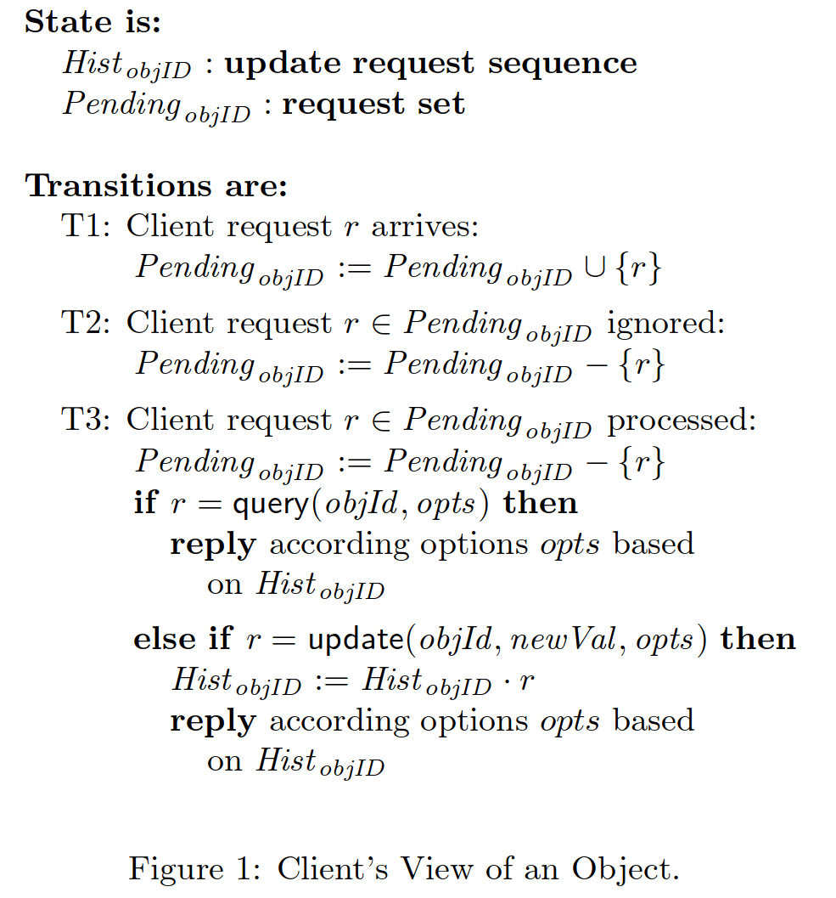
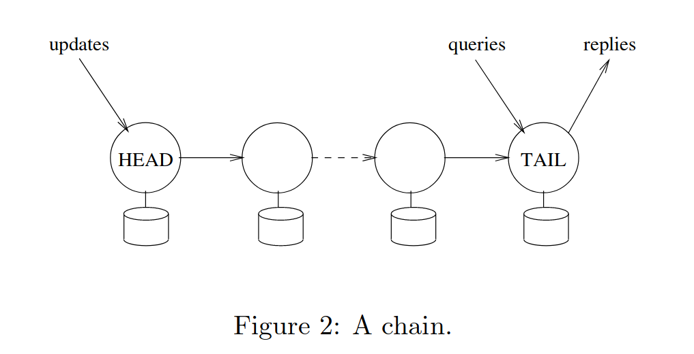
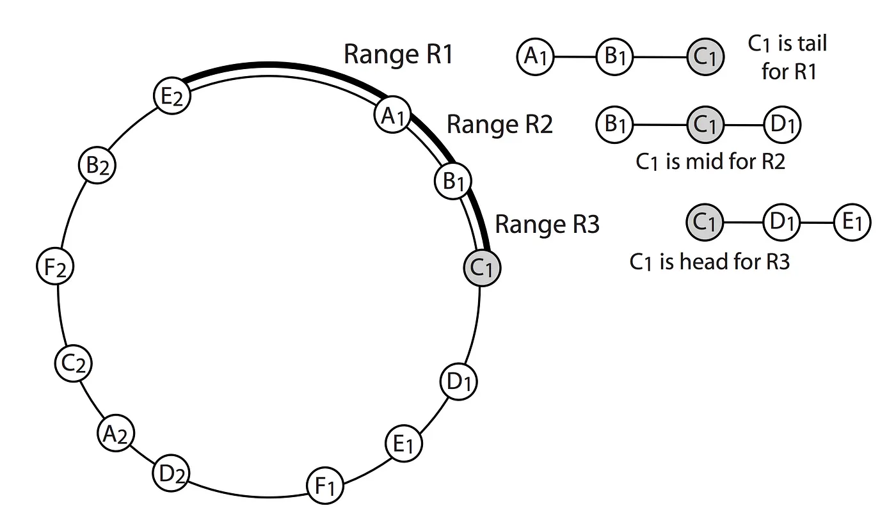

## 背景和驱动
GFS(Google File System) 等存储系统为了高吞吐和高可用牺牲强一致性，本论文提出一种新复制协议链式复制（Chain Replication，简称 CR），在保持强一致性的前提下实现高吞吐和高可用。

本论文用 CR 协议讨论了对象存储的设计和实现。论文讨论的对象存储只有 query 和 update 两种操作，update 原子地更新对象。
## 接口
对象存储只提供两个接口：
- `query(objId , opts )`：查询某个对象的值。
- `update(objId , newVal , opts )`：原子地更新对象，允许根据条件进行计算。
## 架构
CR 实际上是 PB（Primary/Backup）策略的改进版本，将 PB 的并发消息传递改为串行的链式传播，以此实现了和 PB 持平甚至更好的性能。

论文介绍和推导 CR 协议的方式非常学术，首先定义客户端视角的对象状态迁移，根据对象状态迁移提出 CR 协议，然后标示出 CR 协议的不变量，最终证明发生故障也能维持这些不变量。

对象主要有两个状态，`Hist`和`Pending`分别标示对象的更新请求序列和对象存储未响应的客户端请求。对象状态存在三种迁移：
1. 客户端请求到达，将其附加到`Pending`。
2. 集群服务请求：
    1. 从`Pending`删除该请求。
    2. 服务请求
        - READ：返回对象的`Hist`最新的值。
        - UPDATE：将更新附加对象`Hist`。
3. 集群忽略请求：从`Pending`删除该请求。

实际的存储实现上，对象的多个副本串联成一条链。客户端看到的两个状态在实现上定义为：
- $Hist_{obj}$ 定义为 $Hist^{T}\_{objID}$ 。$Hist^{T}_{objID}$ 即尾节点记录的更新序列。
- $Pending_{objID}$ 定义为链上任何节点接收到但尾节点未响应的请求。

链上的节点（副本）可以分为三种角色：
1. 首节点：接收客户端的 update 请求，并计算结果。HEAD 将最终结果转发给后继节点。
2. 中间节点：接收前继节点转发的数据，应用于自己的副本并转发给下一个节点。
3. 尾节点：向客户端返回 UPDATE 的响应，以及服务 query。因为消息从头到尾串行传播，尾节点的 $Hist^{T}_{objID}$就是链上已提交的更新序列，可以直接响应 query 序列。

CR 链只负责复制，故障检测、领导者选举等由中心化的 master 节点完成。master 节点通常利用 Raft（*In Search of an Understandable Consensus Algorithm*）等共识协议或 *ZooKeeper wait-free coordination for internet-scale systems* 进行容错。

链式复制有以下几个特点：
- 只在 HEAD 计算，中间节点只是转发数据。
- 只有 TAIL 向客户端返回响应。
- 读请求和写请求分别由 HEAD 和 TAIL 服务。

链式复制的过程中存在两个不变量：
- Update Propagation Invariant：链中节点的 $Hist$ 是前继节点的前缀。update 消息从头到尾传播，因此很显然未故障时满足此不变量。
- Inprocess Requests Invariant：链中前继节点 i 的 $Hist_i$ 是后继节点 j 的 $Hist_j$ 和前继节点 i 未 ACK 消息（记作 $Sent_i$）的并集（$Hist$ 和 $Sent_i$ 均要保持 update 发送的次序） 。链上所有节点的 update 消息都由其前继节点转发，显然未故障时满足此不变量。

>[!NOTE]
>节点 i 在收到后继节点返回的 ACK 后，从 $Sent_i$ 删除对应的消息。$Sent_i$  和 ACK 只用于故障恢复。

## 故障恢复

发生故障时，故障恢复必须也保持这两个不变量。故障恢复时 master 从配置中删除故障节点：
- HEAD 故障：Master 检测到故障，选择其后继节点作为新的 HEAD 节点，然后通知给客户端。
- 中间节点 S 故障：Master 检测到故障，首先通知后继节点 $S^{+}$ 新配置，然后再通知前继节点 $S^{-}$。为了确保 $S$ 故障前收到的消息全部转发给后续节点，$S^{-}$ 要将自己的未 ACK 消息 $Sent_{S^{-}}$ 发送给 $S^{+}$。最后，Master 通知客户端新配置。
>[!NOTE]
>论文说不继续转发 $S$ 故障前的接收到的消息会破坏 Update Progapagion Invariant。考虑这种情况，节点不记录 $Sent{i}$，节点 $S$ 故障后，$S^{-}$ 不向 $S^{+}$ 转发 $Sent_{S^{-}}$，此时客户端发送 update 请求并且 CR 链服务了此请求。此时，从 $S+$ 开始的节点的 $Hist$ 不再是 $S^{-}$ 及以前的节点的 $Hist$ 的前缀。

- TAIL 故障：Master 检测到故障，通知 TAIL 的前继节点成为新的 TAIL 节点，并通知客户端新配置。

故障恢复的成本主要取决于
- Master 检测到故障的延迟
- 删除故障节点并广播新配置
- 新添加的节点从前继节点同步数据

CR 协议中，客户端不识别请求消息丢失和集群忽略（ignore）请求，因此没有引入新的故障模式。当集群故障而无法响应请求时，客户端超时而不区分请求消息丢失还是集群故障无法服务。当 CR 链上的故障恢复的足够快（在客户端超时前恢复）时，客户端不会识别到故障，只是经历了一次延时比较大的请求。

CR 协议的可用性略优于 PB 协议。
- 最差情况：PB 的 primary 故障，CR 的 TAIL 故障。
    考虑 PB 协议下 primary 故障后的恢复流程，Master 节点要检测到故障，然后获取所有 backup 的状态，选择状态最新的 backup 为新的 primary，再将新配置同步给客户端。而 CR 协议下，TAIL 故障只需要删除 TAIL 即可，因此最差情况下 CR 的服务中断时间不长于 PB。
- 最佳情况下：PB 的 backup 故障，CR 的中间节点故障。
    论文说 PB 策略只在无进行中的 update 时可以服务 query。论文的意思可能是要实现 *ZooKeeper wait-free coordination for internet-scale systems* 的流水线和异步接口，因此 query 必须等待先前的 update 完成。论文的描述非常模糊，实际上要实现线性一致性只需要确保 query 不能读取到未提交的 update 即可，query 不需要等待进行中的 update。如果要实现 *ZooKeeper wait-free coordination for internet-scale systems#一致性模型*，CR 也必须等待 update 完成。因此，我倾向于认为最佳情况下 PB 和 CR 的可用性相差无几。

## 添加节点
理论上可以将节点添加到 CR 链的任意位置，实践上通常添加到 CR 链末尾。

添加节点流程如下：
1. Master 告知 TAIL 节点向新节点转发 $Hist^T$，并记录 $Sent_T$。TAIL 节点向新节点转发数据时，它仍然可以正常服务客户端请求。显然，始终满足 Update Progatation Invariant。
2. 等到新节点同步了足够多的数据时（满足 Inprocess Progatation Invariant），通知 TAIL 节点转化为中间节点。TAIL 节点可以将为处理的 query 请求转发给新 TAIL 节点。
3. 通知新添加的节点作为 TAIL 节点，并通知客户端新配置。

CR 协议添加新节点的方式和 *Raft 配置变更*时将新加入节点作为 Learner，只从 Leader 同步数据，但不参与集群 quota 有异曲同工之妙。

## 分片
一个 CR 链只能保存 1 个对象的 N 个副本，对象存储将多个对象聚合为一个 volume，当成一个对象存储在一条 CR 链中。为了索引对象在 volume 中的位置，对象存储需要一个 dispatcher 将客户端请求（对象）转换为对 CR 链中的 volume 的请求。后文只考虑 CR 链存储对象的情况。
>[!INFO]
>*Finding a needle in haystack Facebook's photo storage* 将海量小文件聚合成一个文件存储。

一条 CR 链只能存储一个 volume/object，为了实现高吞吐，必须进行分片，使用多条 CR 链存储对象。使用分片策略可以带来以下好处：
- 并发故障恢复。一台主机上放置 N 条 CR 链（作为 TAIL），故障恢复时该主机可以从它的 N 个前继并发同步数据。
- 负载均衡。CR 链中 HEAD 和 TAIL 的负载最重（update 多则 HEAD 重，query 多则 TAIL 重），一台主机上放置多条链，主机可以同时作为不同链的 HEAD/MIDDLE/TAIL，从而平衡负载。
- 动态调整对象的可用性。低优先级的对象所在 CR 链长度可以设置为 3，高优先级对象所在 CR 链长度可以设置为 5 甚至更大。

论文介绍了三种分片策略：
- ring：结合一致性哈希，CR 链按圆环分布在主机上。
- rndpar：随机选择副本所在的主机，这种策略可以提高故障恢复的并发度，但存在多个副本在一台主机的概率。
- rndseq：限制了故障恢复并法度的 rndpar。现实中没有使用，可以用于 benchmark 基准。

*FAWN a fast array of wimpy nodes* 使用了 ring 策略。

## 对比

|                  | PB   | CR   | Quorum |
|------------------|------|------|--------|
| 容错             | N-1  | N-1  | 少数派 |
| 容忍单个缓慢节点 | 否   | 否   | 是     |
| 复杂程度         | 简单 | 简单 | 复杂   |
## 评价
Chain Replication 作为“更好的”Primary/Backup 协议，将 PB 的 primary 职责拆分成了 HEAD 和 TAIL 两个节点，降低了 primary 的压力，并通过合理的分片实现了更好的性能。

CR 协议的故障模型非常理想化，由独立的 Master 负责故障检测，Master 很难处理网络分区和脑裂，Master 很难处理 CR 节点可以和 Master 通信，但 CR 节点间发生分区的情况。

尽管 CR 可以容纳 N-1 个节点故障，但却会被单个节点拖垮整体性能，这也限制了 CR 的使用。

## Q&A
- [x] 论文所谓的“没有暴露新的故障模式”指什么？

    没有暴露新的故障模式指，当集群无法服务请求时，在客户端看来相当于请求消息丢失。

- [x] Evaluation 5.1 中，为什么说 weak chain 的 HEAD 上的 query 需要等待 update 完成？

    论文没有介绍 weak chain 的实现，只说允许任务节点服务 query 请求，也没有说 weak chain 的 consistency。
    考虑不等待的情况，节点直接返回变量的值，节点在响应 query 后，转发 update 到下一个节点前故障，此 update 丢失，但却向客户端返回了不存在的 update 的值。
    这样说的话，不仅是 head 需要等待，middle server 也要等待。

- [x] 为什么 Evaluation 中，发生故障后，update 性能上升？

    update 性能上升是因为链长度变短，forward 成本下降。

- [x] 为什么 Evaluation 中，发生故障并恢复后，query  性能下降？
    这是因为恢复过程中创建了新的 chain，恢复后的服务器不相比于其他服务器，所在的 chain 更少，但它是所有它所在的 chain 的 tail。这导致 chain 在服务器上的分布不再均衡，故障的节点上 chain 少，其他节点 chain 多，从而导致查询性能下降。

