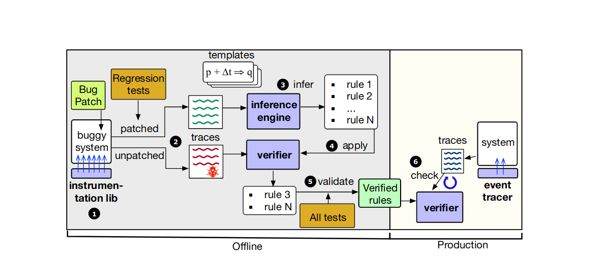

这个工作太神奇了，阅读 [Understanding, detecting and localizing partial failures in large system software](https://kongjun18.github.io/posts/understanding-detecting-and-localizing-partial-failures-in-large-system-software) 的时候，在思考怎样检测 silent semantic violation，论文里说一个难点就是不知道正确的语义是什么，我想到也许可以用 LLM 推测。完全没想到可以用论文如此简洁的方式推测。

论文的思路很简单，从系统的 regression test 入手。尽管这些 test 通常是真的特定的 bug 的，但这些 test 仍然蕴含了系统的语义。论文要做的就是从 regression test 中推导出这些语义，并在运行时检测系统是否违背了语义。

首先，推导以操作和事件为中心。分析 patch 找到其中的关键状态，这些状态被操作更新就是事件，OathKeeper 会在状态更新时插入 hook 用于更新事件。

在 OathKeeper 中，语义规则表达为操作和事件之间必须满足的关系，形式上有些类似于 Lamport 的 happens-before 关系。

论文提出了 template 的概念，template 就是预设的语义规则模板。例如 p->q 表示一个规则，即事件 p 发生后，必须发生事件 q。有了template 的概念后，OathKeeper 会执行 regression test，分析出其中所有的规则。

得到 regression test 中通过的所有规则后，对存在 bug 的版本（称作
buggy version）执行这个 regression test 并检测违背了哪些规则。显然，buggy version 中违反的规则，就是系统应该遵守的规则。

拿到系统的语义规则后，就可以在系统运行时动态检测是否违反语义规则。违反则说明发生了 silent semantic violation。

## Questions & Answers

- [x] 如何推导 sementic rule
1.  regression test 中的 rule
2. 推导出 buggy version 中违反但 regression test 中持有的 rule，
这些 rule 就是 regression test 希望系统需要遵守的 rule。

- [x] 为什么 regression test 没用，但是推导出来的 template 却有用。

用的不是 template，而是 regression test 通过的 rule 和 buggy version 通过的 rule 的差集。

- [x] 论文中 p->q 的推导和检测算法？
这个算法和匹配括号类似。p->q 意味着 p 和 q 是成对出现的，p 发生时 p->q 计数器递增，p 发生时 p->q 计数器递减。如果满足 p->q，则 p->q 计数器必为 0。

## 思考
有没有可能在 API 文档或者注释中语义，并通过某种方式生成机器可检查的语义规则，并在运行时检查？
这样不仅让 API 对于用户和开发者语义清晰，还可以保证不违背语义。
似乎可以用 LLM 理解语义，但是好像没法生成机器可检查的规则，而且可能不准确。

在 maintain 中容易出错，所以需要在 operator 中进行检查。但是目前 operator 的正确性也堪忧，[Acto Automatic End-to-End Testing for Operation Correctness of Cloud System Management](https://kongjun18.github.io/posts/acto-automatic-end-to-end-testing-for-operation-correctness-of-cloud-system-management) 研究了这个问题。

