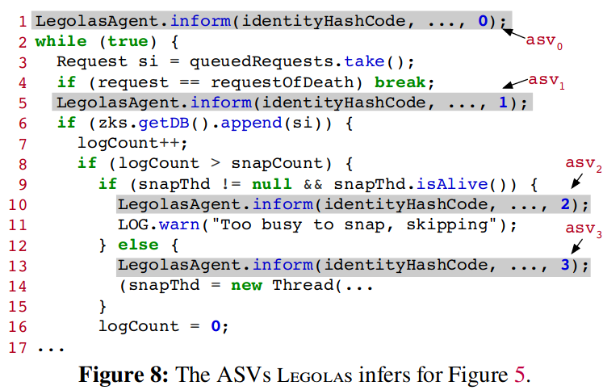
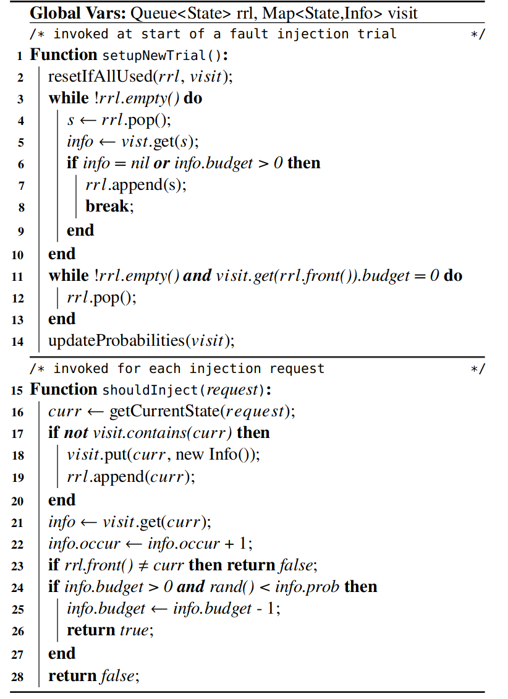

## Motivation
目前分布式系统中的故障注入不够高效，主要是由于以下原因：
1. 许多故障是 partial failure。发生故障时，系统仍然在运行，只是系统的某个组件或服务受影响。
2. 故障的触发条件非常罕见。例如，某些故障只在特定时刻的特定网络故障下发生，并且只影响某个组件。
3. 成熟的分布式系统有比较好的容错性。许多混沌工程的实践随机注入故障，成熟的分布式系统可以容忍大部分故障，大量的注入是无效的，无法检测出新 bug。

故障注入的一大难点是“如何在无数中可能的故障注入点中找到最可能暴露 bug 的故障注入点”。论文认为，大多数的 bug 都发生在特殊情况下，因此故障注入框架也应该找到这些“特殊情况”，并在这些容易出错的地方注入故障。论文提出了一个新的故障注入框架 Legolas，Legolas 通过静态分析，找到程序的状态机，并在这些故障迁移时根据 bsrr（*budgeted-state-round-robin*）策略通过插入 hook 注入故障。
## ASV（Abstract State Variable）
论文认为，程序中虽然有数不清的可能的故障注入点，但绝大多数的故障注入点效果都是相同的。因此，可以想办法将相同效果的故障注入点“合并同类项”，只考虑在效果不同的故障注入点注入故障。论文发现，程序通常可以划分成多个阶段，而且通常代码的结构是`if <condition> then <stage>`。 例如，如果满足某种条件，则保存快照。

同一阶段中的故障注入点可以认为效果是相同的，因此要高效地注入故障，就应该往以阶段为粒度注入故障。阶段有固定的代码结构，因此，程序的各阶段是可以通过静态代码分析获得的，代码分析的结果就是一个状态机（状态就是先前所述的阶段）。

显然，静态分析应该将重点放在`if <condition>`的条件中。通常，条件的核心是某个变量，论文将这个变量成为 SV(State Variable)。考虑这段代码片段：
```c
serve();
count++;
if (count > threshold) {
    snapshot();
}
```
显然，`count`是其中最关键的状态变量，但直接追踪`count`的状态迁移没有意义。`count`可能递增无数次，这会产生无数个状态。实际上，真正让程序状态发生迁移（从`serve()`迁移到`snapshot()`）的不是简单的`count++`，而是`count > threshold`。因此，静态分析实际上要追踪的是 ASV(Abstract State Variable)，即程序的某个执行阶段，驱动状态迁移的是代码中的`if <condition>`。

虽然论文的原理并不局限于 Java 编写的分布式系统，但实现的故障注入框架 Legolas 针对的是 Java 的分布式系统。Legolas 静态分析的对象不是整个程序，而是 task class 和它的入口函数。通常，Java 中一个任务（线程）会被实现为一个继承`Thread`的类，任务逻辑写在入口函数`run`中。因此 Legolas 可以很方便地通过 task class 找到系统中的任务，并且实验表明只针对这些 task class 的入口函数进行 ASV 的推导就已经能指导 Legolas 故障。

## 故障注入点选择策略：bsrr（budgeted-state-round-robin）
Legolas 会在程序进入状态的位置插入一条指令，用于通知 Legolas 程序状态的迁移。


推导出 ASV 后，Legolas 还面临在哪个状态中以及在状态的哪个位置注入故障。这里有几种策略：
1. new-state-only，即只在迁移到新状态时注入故障。
2. random，即随机注入故障。
3. 在比较少进入的状态中注入故障，这对应代码中偶尔执行的代码块。
4. 在最经常执行的状态中注入故障，对应代码中最常执行的代码块。
然而，这些策略都有自己自己的问题：
1. new-state-only  可能会错过状态未迁移时发生的 bug，而且需要 ASV 推导极为精准。
2. random 的选择太多了，就像大海捞针。
3. 偶尔才执行的代码确实很容易有 bug，但不能保证这一点。如果只盯着偶尔才执行的代码，很可能浪费大量的故障注入点。
4. 执行次数太多，注入故障会消耗大量资源，而且出 bug 的概率可能不高，性价比太低了。

论文设计了 bsrr 算法，bsrr 算法兼顾每一个阶段。测试分为多轮，Legolas server 在多轮间保持不变，但被测试的系统每一轮都会重新搭建。bsrr 会记录先前几轮程序执行过的状态到队列`rrl`中，并按照 roud-robin 的策略在每一轮完成后轮转（rotate）。每一轮都只对一个状态注入故障，`rrl`队头的状态就是本轮故障注入的目标状态，只有程序执行到这个状态时才可能注入故障。

bsrr 还用 budget 和随机数，调整一轮中目标状态被注入故障的最大次数以及在该状态的注入故障的位置，原理如下：
- budget（默认为 5）：budget 决定了一轮中目标状态被注入故障的最大次数。每个状态都有一个 budget，注入故障前 Legolas 会判断 budget 是否充足，只在充足时注入故障。
- 随机数：决定了目标状态中被注入故障的位置。注入故障前 Legolas 会生成一个随机数，并和提前设置好的数值（阈值）比较，只有当随机数小于阈值时才注入故障。阈值太小，可能会由于随机数小于阈值的概率太小而浪费一轮测试；阈值太大，会导致随机数小于阈值的概率太大，总是批准状态前期的故障注入请求。因此，阈值的设置目标是保证每个状态都能有至少一次故障注入，并且注入的时机既不太早，也不太晚。论文给出的阈值设置公式与状态出现的次数和概率有关，并且会在每一轮开始时初始化。

伪代码如下，其中第 3-10 行 rotate `rrl`，第 11-13 行删除 budget 耗尽的状态。

## 故障注入

论文通过在故障注入点插入 injection hook 的方式注入故障，当程序执行到故障注入点时，injection hook 向 Legolas controller 发送故障注入请求，如果请求被允许，则注入故障。

论文中提到的故障包括延迟和异常：
- 延迟：直接调用`sleep`模拟延迟，默认延迟是 1 分钟。
- 异常：抛出异常，尤其是`IOException`及其子类。

论文详细描述了如何注入异常。显然，有三个问题需要回答：
- 注入何种异常：通过分析函数签名（Java 的函数签名包含抛出的异常）和函数的实现（Java 函数可能抛出签名中没有的异常），判断某个函数会抛出何种异常。
- 在何处注入异常：在尽可能深的地方注入异常。
- 如何构造异常实例：用默认值填充异常。
## 测试
用户会先用 Legolas 对被测试的系统进行动态分析，并注入 hook。被测试系统会链接一个 Legolas 的库。测试分成多轮，每一轮都会重新搭建一个被测试的系统。被测试的系统的 task 状态迁移时，都会往 Legolas controller 发送一个状态迁移通知；被测试的系统的 task 执行到故障注入点时，会向 Legolas controller 发送一个故障注入请求，controller 通过 bsrr 算法决定是否批准。

测试的负载由 workload driver 生成，论文提到两点：
1. driver 生成多个客户端，并且每个客户端都和服务器的不同 node 交互。这样更容易暴露 bug。
2. driver 将测试分成多个阶段，只有当前阶段完成才进行下一阶段。这样容易在暴露 bug 后定位。

由 failure checker 检测是否发生了 bug，包括：
- crash checker：系统 crash 说明暴露了 bug。
- client checker：结果不符合 client 的预期说明发生了 bug。比如某个 node 被注入故障，但和其他 node 交互的客户端观测到 bug。
- log checker：日志有报错说明有 bug。
## 评估
论文详细测试了 Legolas 发现新 bug 的能力，并与其他框架和工具进行了比较。

我比较关注的有三点：
- 几个流行的分布式系统推导出来的 ASM 数量。
- Legoloas 测试的总耗时和发现的 bug 数。
- 和其他流行的故障注入工具的比较。

关注第一点是因为，ASM 数量代表了 task class 的种类，从某种程度上讲，可能也代表了系统的复杂度。从直觉上看，Kafka 的代码量是 ZooKeeper 的 30 倍，但 Kafka 推导出来的 ASM 只是 ZooKeeper 的 1.5 倍。从这个角度看，代码量的大小并不能完全表征系统的复杂度。从一个软件工程师的角度看，为了系统的可维护性和可理解性，要努力控制系统的复杂性，Kafka 作为一个被广泛应用的系统，这个 ASM 数量似乎也key理解。

关注第二点是因为想了解最新最先进的测试框架性能如何，开发中通常会将各种测试集成到 CI 中，效率过低的测试会严重消耗 CI 资源和拖慢上线流程。很多公司的 CI 需要跑几个钟头，而且很多还只是最简单的 e2e 测试。Legolas 的效率非常震撼，在几十分钟内完成上百轮测试而且能发现隐蔽的 bug，简直是外星科技。

关注第三点是因为现实中大部分公司的系统都没有完善的测试，一大原因是没有现成的框架和工具。论文测试的几个流行的故障测试工具基本都没法暴露 bug，而且耗时极长。测试结果出人意料又在情理之内，目前应该在大多数语言的生态中，都缺少完善的、可拓展的混沌工程框架。

## 思考
静态分析是 Legolas 的一把杀手锏，让 Legolas 可以在最合适的位置注入故障，但对于 C++ 这种语法复杂，而且编程范式不同一的语言不一定可行。尽管如此，通过静态分析推导 ASV 为故障注入点的选择提供了一种统一的思考框架。

## Q&A
- [x] 为什么需要 ASV？
因为希望更有意义地划分代码。简单的 SV 会导致过多的状态迁移，无法用来指导故障注入。ASV 将 task 划分成多个阶段，粒度正合适，可以用来知道故障注入点的选择。

ASV 可以在两个方面帮助选择故障注入点：
1. 寻找更可能出错的位置。
2. 跳过大概率不出错的位置。

- [x] 为什么将 non-static 且 non-constant 的成员变量视作 SV？
这样的设计简单，并且在 Java OOP 的编程范式下很有效。

局部变量其实也可能是 SV，例如某些函数可以用局部变量记录状态迁移。但是在  Java OOP 的编程范式下，任务通常会被实现为一个类，状态被实现为成员变量。

论文也提到可以拓展 ASV 的推导方式，例如考虑局部变量，考虑递归得分析函数。

- [x] 如果程序不是按 s1、s2 的次序执行，但每一轮只有一个目标状态，岂不是会永远浪费轮次?
每一轮的目标状态并不是在静态分析时就决定好的，而是在测试时动态决定的。初始时 rrl 为空，程序运行过程中服务器会记下来程序运行经过的状态，状态记为 s0、s1 直至 sN，而不是提前预设要一个次序。测试的 workload 每一轮应该都是相同的，所以每一轮测试走过的状态应该是相同的。因此，每一轮测试的目标状态都是会达到的。

- [x] bsrr 算法逻辑
测试开始前:
1. rotate rrl。最前面的放坐后面。
2. 清理 budget 用完的 ASV。
3. 更新可能性。
每次接受到注入请求：
1. 状态第一次碰到就 push 到 rrl 末尾。
2. 如果状态刚好是本轮目标状态，则按概率批准。
- [x] 客户端不发送 ASV，服务器怎么知道当前客户端处于哪个 ASV？
论文说客户端进入新 ASV 时，会告知服务器。猜测服务器提前记录了程序的状态机，只需要客户端在进入新 ASV时通知一下，就能追踪到程序最新的状态。
- [x] ASV 是不是越多越细越好？
ASV 用来将相同的效果的故障注入合并在一起，过多的 ASV 会导致过大的注入空间，反而违背了 ASV 的初心。
- [X] 伪阳性的来源？
- failure checker 判定标准不完善。
- 构造出了不合法的异常。
- 构造出了实际上不可能发生的异常。


