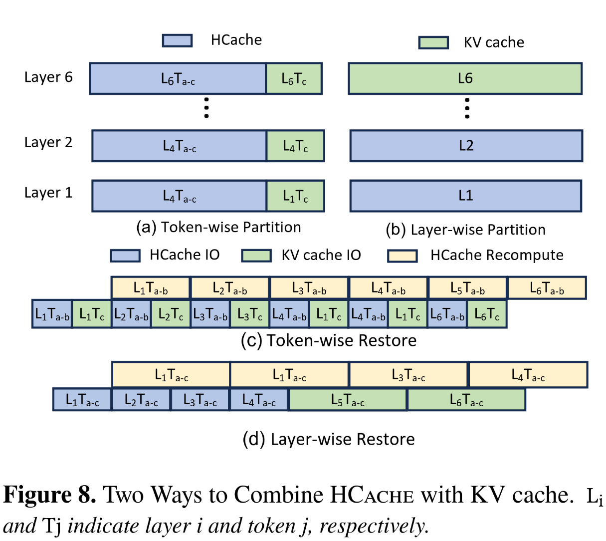

## Motivation
In stateful LLM serving workloads (i.e. RAG and multi-turn conversation), existing works use either token recomputation or KV cache offloading to restore LLM contexts, introducing substantial compute or I/O overheads. In the transformer architecture, the KV cache is derived from the activation (aka. hidden states), and thus KV cache can be restored from the activation.

The activation input of a layer is the output of it's prior layer. A transformer layer receives the activation input, and then projects it into Q, K and V vectors for attention calculation. That is to say, KV cache can be re-computed from the activation. Mathematically, restoring from activation has lower CPU compute and I/O overheads, as activation recomputation cost is 6x lesss than token recomputation and it's I/O overhead is 0.5 of offloaded KV cache transmission.

Hence, this paper proposes HCache which leverages activation restore alongside token recompute and KV cache offloading.

## Math Modeling

HCache restoration consists of two stages:
1. Loading hidden states from storage, and
2. Recomputing KV caches from hidden states.

Hidden states IO time is:
$$IO_{hidden} = \frac{N_{seq} \times D_{hidden}}{BW}$$
Where $N_{seq}$, $D_{hidden}$ and $BW$ represents the sequence length, hidden state dimension and bandwidth between GPU and storage respectively.

The computation time from hidden states to KV cache is:
$$C_{hidden} = \frac{4\times N_{seq} \ times D_{hidden} \times D_{hidden}}{FLOPS}$$
Hence, the restoration time of HCache is:
$$T_{activation} = max (IO_{hidden}, C_{hidden})$$

---
Restoration time with KV cache offloading is:
$$T_{kv}=IO_{KV}=\frac{2\times N_{seq} \times D_{hidden}}{BW}$$
Restoration time with recomputation (the time required to transfer tokens is ignored and the detailed calculation is:
$$T_{recompute} = C_{attention} + C_{ffn} = \frac{24\times N_{seq} \times D^2_{hidden}+N^2{seq \times D_{hidden}}}{FLOPS}$$

---
Compared to token recomputation, restoration time with HCache can achieve at least 6x speedup regarding computing cost.

$$
\frac{T_{recompute}}{C_{hidden}} = 6 + \frac{N_{seq}}{4 \times D_{hidden}}
$$
## Methods

### Bubble-Free Scheduler
For HCache restoring, it's cost is $1/6 \times token\_recompute + 1/2 kvcache\_loading$.

The restoring procedure can be divided into computation and I/O transmission. Therefore, HCache proposes a scheduling scheme to maximize compute and I/O overlaying, following the prior works (i.e. *NEO*, [AttentionStore](https://kongjun18.github.io/posts/attentionstore-cost-effective-attention-reuse-across-multi-turn-conversations-in-large-language-model-serving) and so on) .

In ideal situations, HCache can only store activation and restore KV cache from them. However, this native strategy suffers from severe pipeline bubble, due to the imbalance of activation recompute and loading. The key is to add complementary tasks (i.e. token recompute and KV cache offloading) to balance compute and I/O. 

There are two partition strategy: token-wise partition and layer-wise partition. token-wise partition partitions a layer into HCache and KV cache and overlay **intra-layer** compute and I/O. Likewise, layer-wise partition leverage **inter-layer** compute and IO overlaping.

Due to transformer's general matrix multiply (GEMM) nature, layer-wise partition can achieve more regular matrix size which is highly optimized. Thus, HCache adpts layer-wise partition.

To eliminate bubbles, HCache has to balance I/O and compute, including activation/KVcache loading and token/activation recomputing respectively. This question can be transformed into a min-max optimization question.

$$
\textbf{Objective:} \quad
\min_{\,l_H,\,l_K}\ \max\Big(
    l_H \, t_H, \;
    l_H \, t_C + l_K \, t_K
\Big)
\quad
\text{s.t.} \;
l_H + l_K = L, \;
0 \le l_H, l_K \le L
$$

where,
$L$: total number of layers
$l_H$: number of layers restored from HCache (hidden → KV reconstruction)
$l_K$: number of layers restored via KV offload or token recompute
$t_H$: per-layer hidden-state I/O time
$t_C$: per-layer compute time (hidden → KV GEMM)
$t_K$: per-layer time of the alternative path (KV offload or recompute)

The pipeline is bubble-free, if $l_H \, t_H \;=\; l_H \, t_C \;+\; l_K \, t_K$.That is to say, If I/O is slower, assign more layers to recompute, reducing I/O and increasing computing; otherwise, assign more layers to KVCache offloading to keep I/O busy.

### Storage Management: Two-stage saving and GPU-direct 
The activation is stored in a temporary buffer in GPU HBM and discarded after the computation of a layer finished. Thus, HCache has to move activation to storage immediately, or else it is discard. Even with GPU-Direct SSD, saving to SSD causes a bottleneck to the critical path. As a result, HCache leverage a two-stage saving, writing to CPU memory buffers and then flushing to SSDs.

For restore transition, HCache leverages GPU-Direct to bypass CPU-GPU data copy, unleashing SSD throughput.

### Storage Format: Layer-First Layout
Consider the prefill stage, it calculates KV caches concurrently for each token layer by layer. As a result, tokens of a certain layer are contiguous in the layer, which is so-called *layer-first layout* and is adapted in GPU computation due to transformer's layer-by-layer nature. Let's look t: Two-stage saving and GPU-direct 

The activation is stored in a temporary buffer in GPU HBM and discarded after the computation of a layer finished. Thus, HCache has to move activation to storage immediately, or else it is discard. Even with at the decode phrase, the LLM generate tokens sequentially layer-by-layer, leading to *page first layout* (i.e. `[T1_L1, T1_L2, T2_L1, T2_L2]`).

This claims page-first layout is suitable for saving but suffer from high random I/O overheads in restoring (load all tokens of a layer). HCache is optimized for restore, so it adopts layer-first layout.

>[!NOTE]
>This claim is contradictory to [Strata Hierarchical Context Caching for Long Context Language Model Serving](https://kongjun18.github.io/posts/strata-hierarchical-context-caching-for-long-context-language-model-serving) which suggests page-first layout is more efficient in GPU-assisted IO.

## Evaluation

| Scenario                                 | vs. KV Offload                              | vs. Recomputation     |
| ---------------------------------------- | ------------------------------------------- | --------------------- |
| **Multi-round conversation (ShareGPT4)** | **1.27×–1.90×**                             | **2.21×–3.57×**       |
| **Long-context tasks (L-Eval)**          | **1.62×–1.93×**                             | **2.66×–5.73×**       |
| **With on-GPU KV reuse (varying skew)**  | **1.67×** (uniform) → **1.15×** (high skew) | **1.98×** (high skew) |

## Limitations
The primary weakness is it's complexity. HCache requires offline profiling as it selects from token recompute, HCache restoration and KV cache loading dynamically. Moreover, the benchmark shows the TBT (time between token) reduce by 4%.

The another issue is the KV cache transmission time prediction is not precise like computing, reported by prior works (i.e. [Strata](https://kongjun18.github.io/posts/strata-hierarchical-context-caching-for-long-context-language-model-serving)). They preload next request's offloaded KV caches when processing the current request, and fallback to token recomputation once the next request is scheduled but KV caches are not loaded, due to the versatile I/O latency.

---
## References
 - PAPER *Fast State Restoration in LLM Serving with HCache*