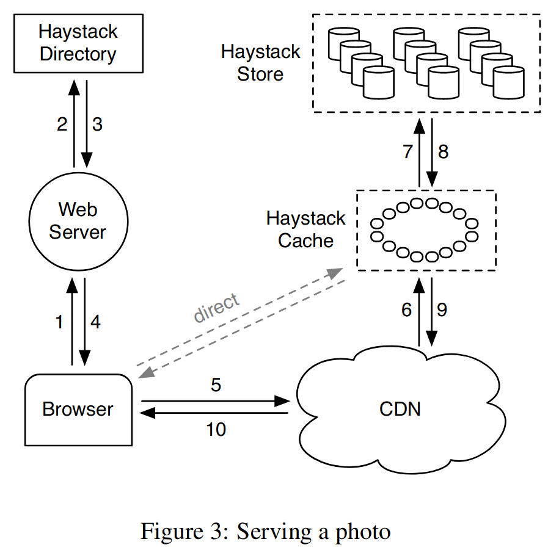
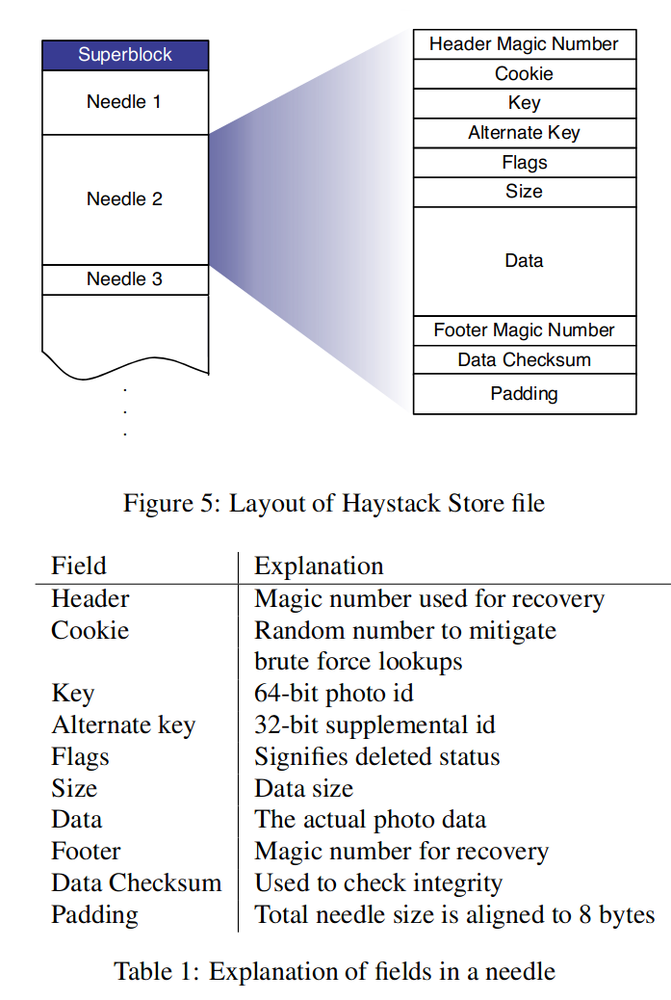

## 背景

Facebook 存储 2600 亿张照片，数据量超过 20 PB，且处于迅速增长中。Facebook 照片的工作流有以下特征：
- 单次写，多次读，很少删除。
- 长尾：用户会访问旧照片，这些照片不在 CDN 中。

Facebook 一开始直接将照片存储在文件系统中，并通过 NFS 导出，但存在以下问题：
- 存储空间浪费严重：每个照片（文件）一个 metadata 且大部分 metadata 无用（如用户权限。）
- 大量与读取照片数据无关的 IO 操作：读取 metadata 需要多次 IO，造成瓶颈。

由于 Facebook 照片工作流的长尾特性，无法简单的通过缓存（包括 CDN 和照片服务器内部的 cache）解决，且市面上现存的存储系统均无法满足 Facebook 存储照片的需要。因此 Facebook 设计了一个专用的照片存储系统 haystack。

## 目标

- 高吞吐低延迟
- 简单
- 容错
- 低成本

## 设计

- 将海量小文件聚合在一个大文件中，以降低 metadata 开销。
- 索引文件记录小文件（needle）的位置，以加快 lookup。

## 架构

Haystack 由 Store、Direcotry 和 Cache 三大组件组成，各组件职责如下：
- Store：负责存储照片
- Directory：管理协调用户请求和底层存储
- Cache：缓存照片以提升性能

Haystack 将存储容量划分为物理卷（physical volume），逻辑卷映射到多个物理卷。为了实现容错，Haystack 写一个逻辑卷时，底层同时写对应的所有物理卷。

### Directory
Haystack directory 组件主要有以下四个功能：
1. 配置逻辑卷到物理卷的映射
2. 物理卷间的负载均衡
3. 构造照片 URL 并指定从 CDN 或 Haystack 访问
4. 标记逻辑卷为只读的。

Directory 构造照片 URL，从而决定了用户访问到哪个物理卷，因此 Figure 3 中 Web Server 接受到用户请求后要先向 directory 请求照片 URL。照片 URL 格式为`http://CDN/<Cache>/<Machine id>/<Logical volume, Photo>`，CDN 和 Cache 从 URL 中提取照片位置信息访问照片。

正常运行的、容量未满的 Store 是可写的（write-enabled），当 Store 容量已满或发生故障时，Directory 将其标记为只读的。

### Cache

Cache 是一个 photo ID 到照片数据的哈希表，当对应照片不在 Cache 中时，Cache 再从 Store 拉取到本地。

### Store
Store 是 Haystack 的精髓所在。Store 将物理卷实现文件系统的一个大文件，将照片数据直接 append 到物理卷中，通过照片在物理卷中的偏移访问照片。Store 总是保存打开物理卷，以便快速访问其中的照片。物理卷就是所谓的 haystack，haystack 中保存的照片称为 needle，这是一个英文谚语*find a needle in haystack*（类似于中国的“大海捞针”）。

Facebook 使用 Photo ID 标记照片，当用户上传照片时，Haystack 将照片压缩为多个不同大小的版本，用 Alternate ID 标示。因此，一个 needle 需要通过 \<Photo(Primary) ID, Alternative ID> 标示，Primary ID 唯一标示了照片，Alternative ID 标示了照片的版本。

Haystack 通过这种方式克服了“背景“一节提出的两个问题：
- 大量无用的 metadata：needle 中只存储必要的 metadata
	Haystack 只在 needle 中保存极少数必须的 metadata，如 cookie、Photo ID、Alternative ID 等
- 大量无用的 IO：通过 Photo ID 和 offset 读取 haystack 中的 needle
	读取 needle 需要知道 needle 在物理卷中的偏移，这里遭遇了和 POSIX 文件系统相同的 metadata lookup 问题。不同之处在于 POSIX 文件系统的目录结构导致 metadata lookup 缓慢，且由于 metadata（inode）体积庞大，无法在内存中保存 Photo ID 到 inode 的映射。而 Haystack 抛弃了 POSIX 文件系统的目录结构，可以在内存中保存 Photo ID 到卷中偏移的映射，接收到读请求时直接通过 Photo ID 查找到对应的偏移读取即可。

详细的物理卷结构和 needle 的 metadata 见 Figure 5 和 Table 1：

Haystack 中的物理卷是 append-only 的，以浪费一定存储空间为代价换取设计和实现的简单。在 append-only 的情况下，Haystack 这样处理写和删除操作：
- 写操作：附加一个新的 needle 到卷。
	- 写入到另一个逻辑卷：Directory 负载更新元数据，确保将来从保存有新数据的逻辑卷访问。
	 - 写入到同一个逻辑卷：通过物理卷中的偏移判断版本，偏移大的 needle 更新。
- 删除操作：needle 具有一个表示已删除的标志位，设置“已删除”标志位即可。

## 优化

### Haystack Index 文件
Store 为了在内存中维护 Photo ID 到物理卷偏移的映射，需要在启动时扫描整个物理卷。由于物理卷是一个非常大的文件，这会导致很大的启动延迟。为了克服这个问题，Hasytack 引入一个索引文件作为内存中的映射的 checkpoint。

Store 附加 needle 时，异步地在索引文件中附加记录（needle 的偏移）。Store 启动时直接读取索引文件重建内存索引即可。索引文件只是为了加速内存索引的构建，因此索引文件不是必须的。

索引文件带来了两大复杂性：
1. 异步写索引文件导致索引文件可能缺少 needle 记录
	Store 在成功写入 needle 但未成功写入索引文件时宕机，重启后索引文件会缺少新写入的 needle 的记录。论文将在索引文件中缺少记录的 needle 称为 orphan（孤儿），Store 启动时向索引文件添加对应的孤儿 needle 的偏移信息即可。由于索引文件的记录跟物理卷中的 neelde 依次对应，Store 只需要从索引文件末尾记录的 needle 偏移开始扫描物理卷，就能快速修复索引文件。
2. 索引文件无法记录 needle 是否已删除
	Store 在读取完 needle 后，再通过 needle 的“已删除”标志位判断该 needle 是否已删除。

### Cache 缓存策略
1. 只缓存直接由用户发出的请求
	Facebook 的测试表明，如果 CDN 未命中的请求也不太可能在 Haystack Cache 中命中。
2. 只缓存从可写（write-enabled）的 Store 中拉取的照片
	Store 对只读或只写的性能远远高于读写负载，因此 Haystack 通过 Cache 实现读写分离以提高 Store 的写性能。

### Store 内存数据结构
尽可能减少 Store 内存索引中缓存的 metadata 的大小：
- 复用字段（Linux 内核的`struct page`大量使用这种技术）：已删除的 needle 在内存索引中记录的偏移为 0，从而避免额外增加一个“已删除”标志。
- 不缓存不必要的 metadata：不缓存 cookie，从 needle 中读取后再进行验证。

### 压缩
物理卷的只读特性导致其中可能存在同一 needle 的多个新旧版本，Store 定期将物理卷中的 needle 拷贝到临时物理卷中（忽略旧版本的 needle），等到拷贝到物理卷末尾时（End Of File），阻塞所有请求，原子地交换物理卷并更新内存索引。

论文的数据表示压缩技术每年能节约 25% 的存储空间。

## 总结

- 读写分离
- 小文件聚合
- 针对工作负载优化
- 故障检测，出错就只读。
- index file 加速启动时的内存数据结构构建过程。

## 问题

- [x] cookie 是什么？

	客户端生成的随机数，照片的 URL 包含 cookie 以避免 cracker 暴力猜测获得照片 URL 做坏事。

- [x] alternative key 是什么？

	Photo Store Server 用来记录图片大小。一张图片压缩成 4 个版本（大中小缩略图），四个版本的 key 相同，alternative key 不同。

- [x] 如何确保 Cache 读取到新数据？

	论文没有介绍 Cache 的一致性保证。因为 Haystack 的目标是简单，并且主要服务于 Facebook 的信息流和相册应用，Haystack 很可能只使用简单的过期机制，不保证 Cache 返回最新的照片。

- [x] 为什么要异步写索引文件？

	为了避免写索引文件阻塞照片写请求。等待索引文件写完成会增大 Haystack 服务写请求的延迟，这违背了 Haystack 低延迟的设计目标。

- [x] 为什么索引文件不能反映 needle 的删除情况？

	考虑索引文件记录 needle 是否已删除的情况， Store 在删除 needle 后修改索引文件对应文件前宕机，重启后索引文件中该 neddle 被标记为未删除的，导致 Store 返回已删除的照片。Store 无法判断索引文件的哪个是错的，因此必须整个扫描物理卷以修复索引文件，这就消除了索引文件带来了启动性能提升，因此不能在索引文件中记录 needle 的删除情况。

## References
*Finding a needle in haystack Facebook's photo storage.pdf*
