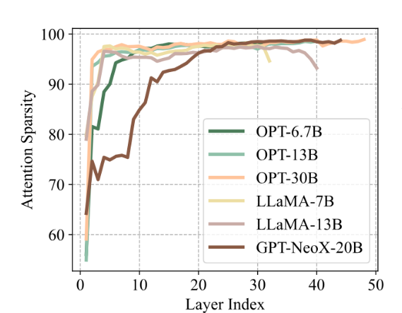
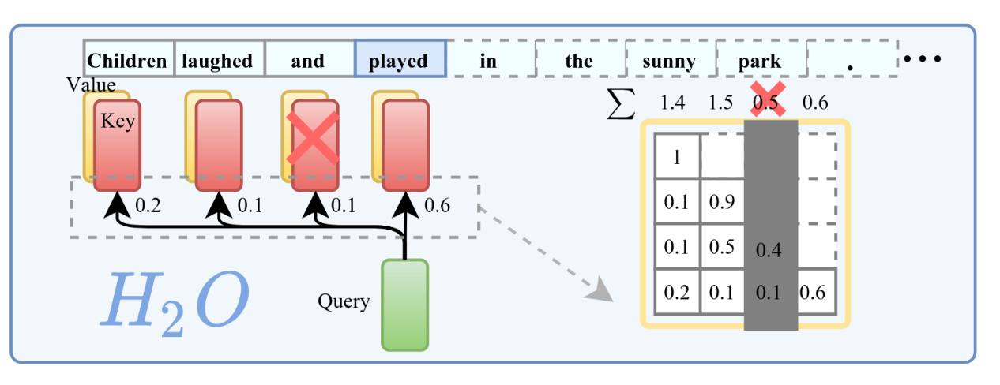

## Motivation

Due to limited GPU memory capacity, it is impossible to hold all KV cache in GPU HBM, necessitating a cache eviction algorithm which can maximize the cache hit rate. However, existing works either need large cache size, or entail heavy eviction cost. This paper aims to tackle this problem.

This paper finds that not all tokens are created equal: a small portion of tokens contribute most of the value of attention calculation. More specifically, most attention store matrices are sparse for most model even thought the model is trained densely. Further analysis shows 95% attention score matrices are sparse, where a token is deemed as sparse if it's attention score is smaller than 1% of the most highest attention score in the token sequence. 

Consider the picture below, each row represents a attention score vector for a sequence. For sequence "Children laughed and played", the attention score of "played" is 0.6 while "and" is only 0.1. In the real world, attention scores are far more skewed.

## Methods
The paper refers to the 5% vital tokens as *heavy hitter*. Experiments show that evicting heavy hitters will damage the model's normal functionalities. Hence, if the cache is full and we have to evict KVs, we should retain heavy hitters as much as possible.

The paper converts the eviction polity into a classic dynamic sub-modular problem: For a set $S_i$, how to maximize the value function $F(S_i)$, where $S_i$ denotes the set at step $i$. The "dynamic" means the value function $F(S_i)$ changes at every step. More specifically, in our cache eviction situation, the dynamic sub-modular problem means how to evict KVs to maximize the value of the retained cache.

The solution is simply. We should evict the most unimportant token whose has the smallest attention score at every iteration such that the accumulated attention score is maximized, where the accumulated attention score is the sum of all retained tokens' attention score. This eviction algorithm is sub-optimal as it only base on local statistics of each iteration and the optimal eviction strategy is infeasible due to the lack of future knowledge.

---
## References
- [Attentionstore Cost-effective attention reuse across multi-turn conversations in large language model serving](https://kongjun18.github.io/posts/attentionstore-cost-effective-attention-reuse-across-multi-turn-conversations-in-large-language-model-serving) leverages the sparsity to reduce IO in offloaded KV cache storage system.