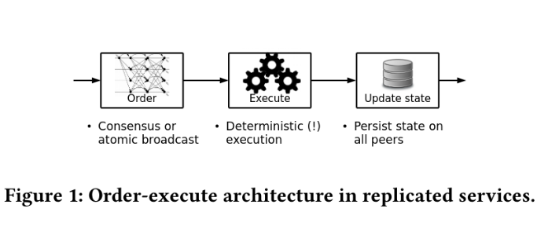
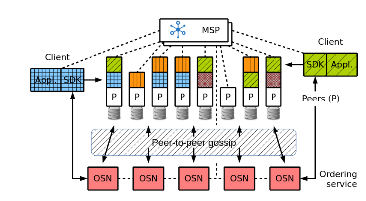
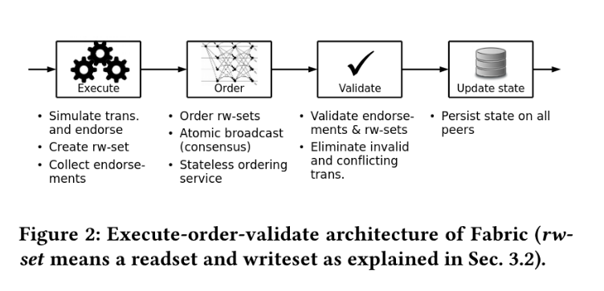
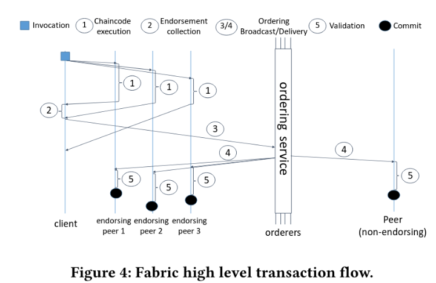

## Motivation
HyperLedger Fabric aims to implement a *permissioned* blockchain featuring:
- General Programming Language
- High Throughput 
- No Cryptocurrency
- Confidentiality

General programming language and high throughput is not supported due to existing public block chains' *order-execute* model.Essentially, order-state model is a form of finite state machine replication (i.e. [Raft](https://kongjun18.github.io/posts/in-search-of-an-understandable-consensus-algorithm)). In this model, all nodes start from the same initial state and apply mutation logs in a global total order, ultimately achieve consensus (the same state). This model requires *deterministic execution*, or else different nodes executes the s,ame transaction get different results and thus lead to inconsistent states. To avoid no-deterministic behaviors, existing blockchains require domain-specific languages.

Due to the openness nature of public blockchains, they have to employ economic deterrence mechanisms to mitigate potential denial-of-service attacks by requiring each transaction to pay a gas fee denominated in the network's native cryptocurrency. 

No cryptocurrency and confidentiality are easily to solve as the permissioned blockchain only allows authenticated users to participate and interact. Additional investigation is required for the first two goals. Analogous to database concurrency control, the order-execute model resembles lock-based concurrency, execution proceeds after ordering is determined. The corresponding solution is optimistic concurrency control (OCC) - execute-order-validate model.

## Architecture
In a nutshell, a distributed application comprises:
- A smart contract, called *chaincode*, which is a program written in general programming languages and execute in the execution phrase. System-administration tasks (i.e. validation) are implemented in *system chaincode*.
- A *endorsement* policy, which is used in validation phrase. A chaincode is executed by multiple endorser nodes and the endorsement policy define a set of peers that are necessary for endorsement (i.e. three out of five).

Nodes in the Fabric network take up one of three roles:
- Clients summit transaction protocols, collect returned endorsements and broadcasts transactions.
- Peer nodes execute proposals and validate transactions.
- Ordering Service Nodes (OSN) collectively form the ordering service which batch transactions in blocks and establish a global total order (blockchain).

In the Fabric network, peer are divided into multiple *organizations* and each organization forms a trust domain, where a peer trusts all other pears. Organizations may create channels with other organization and channels are confidential to outside organizations. In fact, each channel is a blockchain. The *membership service provider* (MSP) maintains the identities of all nodes in the Fabric network such that only authenticated nodes (i.e. clients, peers) such that only authenticated nodes can iterative with the Fabric network and channels.

Channels are logically isolated but physically co-located in peer nodes (i.e. a node runs 2 channels). Each organization has it's own OSNs and peer nodes to avoid trusting other organizations.

## Methods
### execute-order-validate
in *Bitcoin* architecture, miners executes transactions, batch transactions into blocks, and then use Proof of Work (POW) to establish the global order of blocks, where miners solve a computational hash puzzle to calculate a number which makes the the hash value of the current block equals to the preceding block. After ordering, the newly-created block is spread to all other nodes and execute. Note, Bitcoin only maintain eventual consistency, transactions are deemed committed once the the newly-created block is in the longest chain. 

The idea of execute-order-validate model adopts optimistic concurrency control in database systems. Basically, OCC executes transactions and produce a read-set and write-set, denoting the blockchain key/value pairs and corresponding versions to read and write respectively. Then, the database transaction manger uses the read-set and write-set to check conflicts (i.e. the read-set is modified by a commited transaction during execution). If conflicts exist, the transaction is invalid and rollback. The validation stage implies ordering.

Let's dive in the execute-order-validate model.
- The client transaction protocol a set of *endorser* nodes. Endorser nodes execute the transaction protocol and return endorsement to the client.
- The client waits until all endorsements are received.
- The client assemble a transaction and summit to the ordering service.
- The ordering service batches transaction in blocks and establish a total order on blocks. In other words, it appends newly-created blocks to the blockchain.
- The ordering service broadcasts the block to *all* peers.

Note, the protocol is executed on a set of endorser peers but broadcast to all peers. In this sense, the replication is a mix of passive replication (FSM, peers receive log and execute) and active replication (primary-backup, primary sends states and backups apply).

#### Execution Phrase
Each transaction protocol contains the chaincode ID, client ID and etc. The chaincode uses `GetState`/`PutState` to access the blockchain ledger and is not supposed to maintain local states. 

The chaincode is packed as a container and executed on a set of endorser nodes. All state mutations are based on the local *ledger* and scoped exclusively to chaincode. The local ledger is a versioned key-value store to support OCC. Each peer has it's own local ledger and each local ledger serves as a replica of the *logical* blockchain ledger.

The result of protocol execution is a write-set, and read-set, representing modified key-value pairs and version dependencies (keys and versions). The write-set and read-set is used for validation phrase.

#### Oder Phrase
The ordering service ensures the delivered blocks on one channel is totally ordered. In short words, it chains the blocks into a block chain.

The ordering service is pluggable, with support for multiple implementations. One of the implementation described in the paper is based on Kafka. The submitted transaction is sent to the Kafka topic, all OSNs subscribe and receive newly-submitted from the topic. Kafka ensure exact-once message delivery and hence OSNs receive the same transactions and cut them into the *same* blocks. For consensus-based implementation, the consensus protocol ensures ordering naturally.

Albeit each OSN broadcasts the newly-created blocks to all peer nodes, duplicate broadcast is not involved, due to OSNs only broadcast to peer nodes in their own organizations.

In some senses, the ordering service serves as a primary or write-ahead log of the blockchain ledger. As long as OSNs are alive, peer nodes can sync state mutations from the OSNs.

### Validation Phrase
The validation phrase consists of three sequential steps:
- Endorsement Policy: The *validation system chaincode* (VSCC) validates whether the configured endorsement requirement is met.
- Read-Write Conflict Check: It compares KV versions in the read-set to ensure no read key is modified during the reading by other transactions.
- Ledger Update: The newly-modified key-value pairs are appended to the local ledger.

It's worthy to note that, invalid transactions are also recorded on the blockchain for logging and audit, whereas other public block chains only record validated transactions. On other reason is the Hyperledger Fabric is more centralized and thus the cost of reading invalid records is low.

The ordering service ensures total order such that each peer ledger could be unsynchronized but no chance of contradicted key-values. Hence, there is no chance that a block has different validation results on peers.

### Trust Model
To tackle denial-of-service attacks, access management is employed in the ordering service and endorser nodes

At the employment level, each organization has it's own OSNs and peer nodes, avoid trusting others.

The Fabric leverage traditional CA systems to authenticate nodes. Each channel can be configured to trust multiple CAs, and each organization can hase it's own CA to avoid trusting other organizations' CA. In addition, organizations can issues certificates for each other to build a web of trust.

To temper the Fabric system, the cracker has to control *a* CA system (private key) and the *majority* of nodes. Once the private key is procured, the cracker can interact with the Fabric network impersonating an authenticated user. On top of it, if the majority of the cluster is controlled, the cracker is able to get the system to reach a new census and thus temper the ledger as he wills.

## Thoughts
From a tech prospective, Hyperledger Fabric trades some degree decentralization for better throughput. As a permissioned blockchain, it's philosophy and design completely diverge from public blockchains.

The permissioned blockchain serves as a *neutral third party platform* for organizations that do not trust each other completely. If there is already a trusted third parity platform (i.e. Amazon for consumers and producers), permission blockchains are useless.

## Questions and Answers

**What will happen if the malicious chaincode contains infinite loop?**
The endorser can monitor the container and kills it.

**Is the CA is centralized?**
Fabric adopts existing CA techniques, but there is no root CA. Instead, each organization has it's own CA. If a CA is tempter, it can be revoked to avoid further damage.

**What is gossip and what it is used for?

Gossip is the message between peer nodes. Gossip is used to synchronize states peer to peer, such as ledger and the cluster view.

---
## References
- Bitcoin white paper
- [Time, clocks, and the ordering of events in a distributed system](https://kongjun18.github.io/posts/time-clocks-and-the-ordering-of-events-in-a-distributed-system)