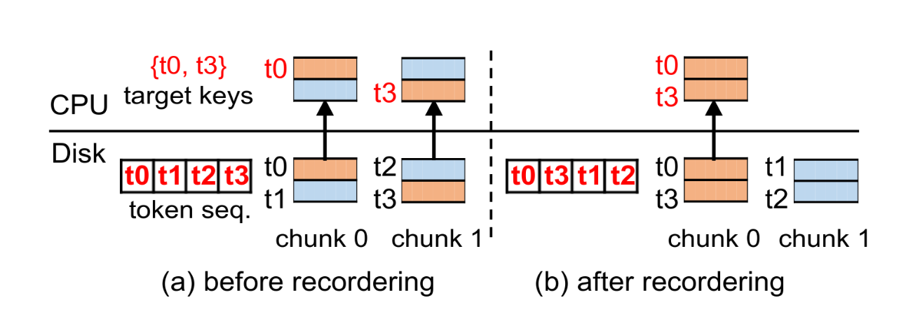
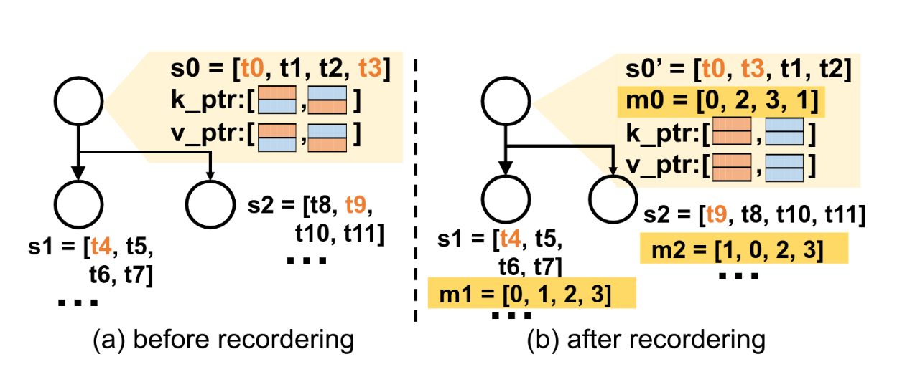

## Motivation
Existing works show that not all KVs are created equal: few important KVs that have higher attention scores contribute most to the Transformer inference results. [H2O Heavy-Hitter Oracle for Efficient Generative Inference of Large Language Models](https://kongjun18.github.io/posts/h2o-heavy-hitter-oracle-for-efficient-generative-inference-of-large-language-models) demonstrates that only feeding vital tokens to LLM can achieve almost the same model accuracy.

Now that the disk access is expensive and can not be hidden easily, we can only load important tokens to reduce IO overhead by decreasing the amount of data to be transferred This paper leverage this insight and  proposes a importance-informed multi-tier KV cache storage system. There are three major issues need to be solved :
- Original importance identification algorithm is cumbersome and IO-inefficient, which is ill-suitable for storage system on SSD. How to propose an IO-efficient identification algorithm?
- How to transform from importance-agnostic storage to importance-aware storage?
	- How to organize KV caches on SSD?
	- How to do importance-aware caching?

## Methods

### IO-efficient Important KVs Identification
The original important token identification algorithm loads all KVs of attention heads and calculates importance, entailing unacceptable IO overhead when applying to storage system. The magic to tackle this problem is sampling. The paper finds that important tokens across different attention heads in a transformer layer are highly similar. This insight cannot be proved mathematically but holds for each layer of every model, which can be explained intuitively by the fact that all attention heads are derived from the same large KV tensors.

This insight means the important tokens calculated based on few heads are highly likely to be important for other heads. Hence, we can only load a small portion of heads to identify important tokens. Further analysis shows that head selection is irrelevant and increase in head number makes no difference. Therefore, the paper selects the first 3 heads of a layer to identify important tokens, which significantly reduce IO count.

To handle the situation that the similarity doesn't hold, IMPRESS only employ the identification algorithm if a similarity threshold is reached, otherwise it fallback to feed all KVs to LLM. The similarity is defined as *Jaccard index* $J(A, B) = \frac{|A \cap B|}{|A \cup B|}$, where $A$ and $B$ denotes the important token set of head $A$ and $B$ respectively. The similarity threshold is set to be higher than random selection, as similarity lower than random selection means there is no similarity.

Let's calculate the similarity threshold. If we select $k$ tokens as important in $n$ tokens, the possibility of a token to be selected into both head $A$ and $B$ is $E(A \cap B) = n \times P(A \cap B) = n \times (k/n \times k/n) = k^2/n$. $E(A \cup B)= E(A) + E(B) - E(A \cap B)= k + k - k^2/n= 2k - k^2/n$. Hence, the random selected $j(A,B)= \frac{E(A \cap B)}{E(A \cup B)} = \frac{k/n}{2 - (k-n)}$. The paper set the threshold as $t = j^\alpha$, where $\alpha = 0.6$, which is chosen empirically based on experiment results.

### KV cache reordering: repack important tokens together
Existing LLM serving systems like [SGLang](https://kongjun18.github.io/posts/sglang-efficient-execution-of-structured-language-model-programs) use  *Radix Tree* to do prefix matching quickly, where prefixes are organized into radix tree nodes with each node representing a shared prefix. On the storage side, the KV caches are stored in chunks, where each chunk stores multiple tokens. A radix tree node may points to multiple chunks corresponding to the shared prefix.

Without importance-aware storage design, important tokens are mixed with unimportant tokens in chunks, causing to read amplification and extra IO count. To tackle this issue, this paper repacks important tokens into denser chunks in background periodically to improve locality. For instance, $t0, t1, t2, t3$ will be reordered as $t0, t3, t1, t2$, to pack important token $t0$ and $t1$ into a single chunk.

Due to the constraint of prefix sharing, recording only happens at the storage level and the logic sequence remains the same, otherwise it breaks the radix tree prefix matching functionally. For this reason, the paper uses a mapping list to record the logical token index of each token. For instance, $s0$ after reordering is $[t0,t3, t1, t2]$，the mapping list $[0, 2, 3, 1]$ means the original sequence is $[t0, t1, t2, t3]$. For the same reason, the ordering can only happens within each node of the readix tree.

### Importance-aware caching
Traditional caching policies like LRU and LFU only achieve sub-optimal important token cache hit rate due to their importance-agnostic nature. For example, chunk A with 1 important token that was accessed 3 times will be promoted in GPU HBM and chunk B with 2 important tokens that was access 2 times will resides in CPU RAM, even though chunk B's important tokens actually have more access.

To address this problem, this paper incorporate importance scores into caching policy, says, the chunk with more frequently-accessed important tokens are promoted first. Mathematically, the importance score is $N_{important \space tokens} \times Frequentcy$.

In terms of implementation, IMPRESS maintains two min-heaps where the top indicates the chunk with smallest score in CPU and GPU memory, respectively. IMPRESS loads KVs into GPU or CPU memory based on theirs scores and the KV with lowers score will be evicted. To reduce the eviction cost, IMPRESS maintain a full copy of all tokens in SSD, thereby not involving in slow write back.

## Evaluation
The benchmark shows the IMPRESS can achieve up to 2.8x performance improvement compared to state-of-art system (AttentionStore + H2O + LFU).

Note, all of the aforementioned techniques contribute to the performance improvement but the impacts vary across different models and datasets. For the OPT-30B model on the RTE dataset, the contributions of the three techniques to the performance improvement are 60%, 30%, and 10%, respectively. However, for the OPT-13B model on the COPA dataset, the contributions change to 36%, 8%, and 56%.

## Thoughts
Attention scores change at each iteration, so it is impossible to leverage this insight to build a persistent distributed KV cache storage system.

## Questions & Answers

Attention scores change at each iteration, why IMPRESS is able to store KV cache based on theirs importance?

IMPRESS is based on average importance instead of instant importance. Besides, IMPRESS is actually a single-node offloaded caching system rather than persistent storage.

---
## References
- [Attentionstore Cost-effective attention reuse across multi-turn conversations in large language model serving](https://kongjun18.github.io/posts/attentionstore-cost-effective-attention-reuse-across-multi-turn-conversations-in-large-language-model-serving)
- [SGLang Efficient Execution of Structured Language Model Programs](https://kongjun18.github.io/posts/sglang-efficient-execution-of-structured-language-model-programs)
- *Mooncake Trading more storage for less computation—a KVCache-centric architecture for serving LLM chatbot*
- [H2O Heavy-Hitter Oracle for Efficient Generative Inference of Large Language Models](https://kongjun18.github.io/posts/h2o-heavy-hitter-oracle-for-efficient-generative-inference-of-large-language-models)
