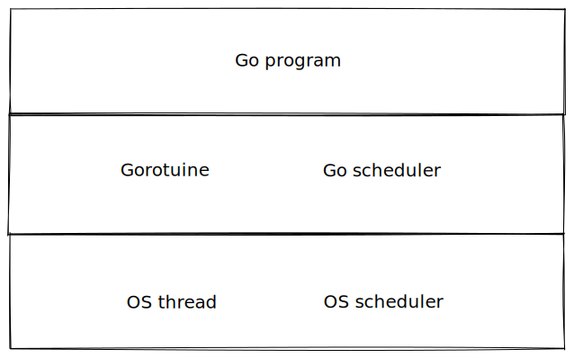
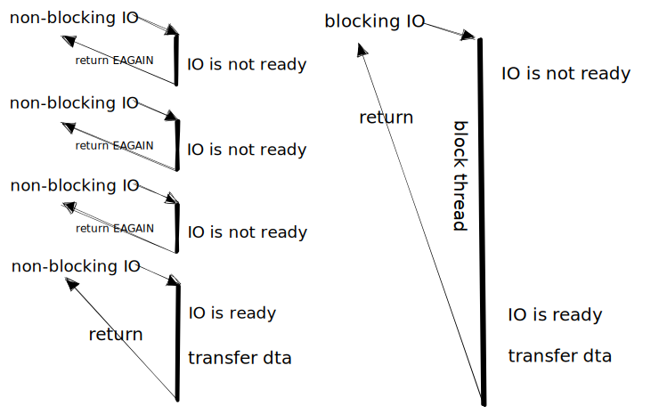
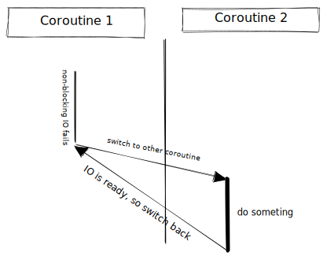
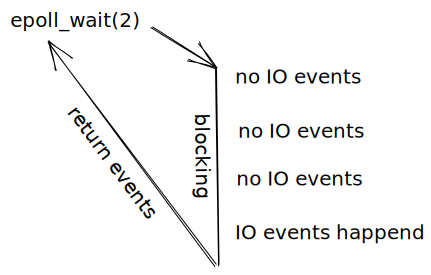
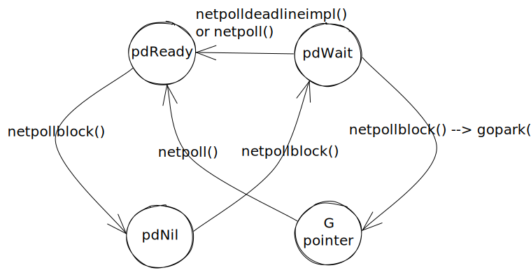

## netpoller 概述

考虑一个基于 goroutine-per-connection 模型的 TCP echo server：

```go
import (
    "fmt"
    "io"
    "log"
    "net"
)

func worker(conn net.Conn) {
    defer conn.Close()
    b := make([]byte, 512)
    for {
        size, err := conn.Read(b)
        if err == io.EOF {
            break
        }
        if err != nil {
            log.Fatal(err)
        }
        size, err = conn.Write(b[0:size])
        if err != nil {
            log.Fatal(err)
        }
    }
}

func main() {
    listner, err := net.Listen("tcp", "127.0.0.1:8080")
    if err != nil {
        log.Fatal(err)
    }
    for {
        conn, err := listner.Accept()
        if err != nil {
            log.Fatal(err)
        }
        go worker(conn)
    }
}
```

从用户侧看，系统该调用阻塞 goroutine，Go scheduler 调度其他 goroutine。问题在于，goroutine 复用在线程上，如果 IO 系统调用（如`read(2)`/`write(2)`）阻塞，直接阻塞 goroutine 所在线程，Go scheduler 将没有机会调度 goroutine！



为了实现 goroutine-per-connection 网络编程模型，必须提供“IO 系统调用阻塞 goroutine 而非 OS 线程”的抽象，这意味着必须“拦截” IO 系统调用对线程的阻塞。

Go runtime 通过非阻塞 IO 和 IO 多路复用机制实现了一个 IO 轮询器（netpoller），提供了“网络 IO 阻塞 goroutine”的抽象：

- 尽量将文件描述符设置为非阻塞的，关联当前 goroutine 到该文件描述符，注册其上的 IO 事件到轮询器中。
- IO 系统调用失败（返回`EAGAIN`）时，阻塞该 goroutine，切换到其他 goroutine。
- 在特定时机轮询 IO 事件，获取就绪的文件描述符，调度对应的 goroutine。

## 底层机制

### 非阻塞 IO

为了避免 IO 系统调用阻塞 OS 线程，必须使用非阻塞 IO。

非阻塞 IO 和阻塞 IO 的差别在于，非阻塞 IO 给了用户处理 IO 未就绪的机会：当文件描述符上不可进行 IO 操作时，非阻塞 IO 系统调用返回错误，而阻塞 IO 直接阻塞线程直到 IO 完成。



非阻塞 IO 不等于高性能，对于非阻塞 IO 和阻塞 IO，从IO 未就绪到 IO 就绪并传输数据的时间都是相同的。如果直接如图 2 轮询文件描述符，非阻塞 IO 需要调用更多次系统调用，性能反而更差。

非阻塞 IO 高性能的关键在于避免等待 IO 就绪。非阻塞 IO 系统调用返回错误后，用户知道 IO 未就绪，去执行别的操作，IO 就绪后再接着执行先前的逻辑。



这是经典的协程模型，协程 1 调用非阻塞 IO 失败，于是主动放弃控制权，切换到协程 2，协程 2 执行其他逻辑，发现协程 1 等待的 IO 就绪后，再切换回协程 1。

Go runtime 提供的抽象是“IO 阻塞 goroutine，切换到其他 goroutine”，因此用户代码不需要“主动换出”，Go scheduler 会替用户调度 goroutine。

### IO 多路复用

非阻塞 IO 高性能的关键在于避免等待 IO 就绪，因此操作系统内核提供了 IO 多路复用机制，通知用户 IO 已就绪，避免用户忙等待 IO。也就是说，轮询 IO 是否就绪的责任从用户转移到了操作系统。

Linux 平台上一般使用 epoll 进行 IO 多路复用。`epoll_create(2)`创建轮询器（一个包含所有相关信息的文件描述符），`epoll_ctl(2)`向轮询器注册/删除文件描述符上的 IO 事件，`epoll_wait(2)`阻塞直到发生事件并返回待处理事件。

注意，epoll 只能处理 socket 和 pipe，不能处理磁盘文件。



## 数据结构

### pollDesc

Go runtime 定义了`pollDesc`描述用于网络轮询的文件描述符，其中包括 OS 原生文件描述符、锁、读写者 goroutine、定时器信息以及描述符状态`atomicInfo`。

```go
// Network poller descriptor.
//
// No heap pointers.
type pollDesc struct {
    _    sys.NotInHeap
    link *pollDesc // in pollcache, protected by pollcache.lock
    fd   uintptr   // constant for pollDesc usage lifetime

    // atomicInfo holds bits from closing, rd, and wd,
    // which are only ever written while holding the lock,
    // summarized for use by netpollcheckerr,
    // which cannot acquire the lock.
    // After writing these fields under lock in a way that
    // might change the summary, code must call publishInfo
    // before releasing the lock.
    // Code that changes fields and then calls netpollunblock
    // (while still holding the lock) must call publishInfo
    // before calling netpollunblock, because publishInfo is what
    // stops netpollblock from blocking anew
    // (by changing the result of netpollcheckerr).
    // atomicInfo also holds the eventErr bit,
    // recording whether a poll event on the fd got an error;
    // atomicInfo is the only source of truth for that bit.
    atomicInfo atomic.Uint32 // atomic pollInfo

    // rg, wg are accessed atomically and hold g pointers.
    // (Using atomic.Uintptr here is similar to using guintptr elsewhere.)
    rg atomic.Uintptr // pdReady, pdWait, G waiting for read or pdNil
    wg atomic.Uintptr // pdReady, pdWait, G waiting for write or pdNil

    lock    mutex // protects the following fields
    closing bool
    user    uint32    // user settable cookie
    rseq    uintptr   // protects from stale read timers
    rt      timer     // read deadline timer (set if rt.f != nil)
    rd      int64     // read deadline (a nanotime in the future, -1 when expired)
    wseq    uintptr   // protects from stale write timers
    wt      timer     // write deadline timer
    wd      int64     // write deadline (a nanotime in the future, -1 when expired)
    self    *pollDesc // storage for indirect interface. See (*pollDesc).makeArg.
}
```

`link`是指向`pollDesc`的指针，所有`pollDesc`放到一个链表中管理。

`fd`是`pollDesc`使用的 OS 原生文件描述符，在`pollDesc`的整个生命周期保持不变。

`atomicInfo`维护`pollDesc`的轮询状态。

`rg`/`wg`是该文件描述符上阻塞的 goroutine。

`resq`以下的成员用于定时器处理 IO 超时。

后文会详细介绍`pollDesc`各字段。

### pollCache

`pollCache`是一个单向链表，用于管理`pollDesc`的分配和释放。因为多个 goroutine 可能并发地注册 poller，所以需要互斥锁保护并发访问。

```go
type pollCache struct {
    lock  mutex
    first *pollDesc
    // PollDesc objects must be type-stable,
    // because we can get ready notification from epoll/kqueue
    // after the descriptor is closed/reused.
    // Stale notifications are detected using seq variable,
    // seq is incremented when deadlines are changed or descriptor is reused.
}
```

`(*pollCache).alloc()`从`pollCache`中分配一个`pollDesc`:

1. 若`pollCache`为空，分配大小为`pollBlockSize`（4K）的非 GC 内存（`pollDesc`）。

2. 摘下链表头上的`pollDesc`，返回给用户。

   ```go
   func (c *pollCache) alloc() *pollDesc {
    lock(&c.lock)
    // 分配内存，创造 pollDesc
    if c.first == nil {
        const pdSize = unsafe.Sizeof(pollDesc{})
        n := pollBlockSize / pdSize
        if n == 0 {
            n = 1
        }
        // Must be in non-GC memory because can be referenced
        // only from epoll/kqueue internals.
        mem := persistentalloc(n*pdSize, 0, &memstats.other_sys)
        for i := uintptr(0); i < n; i++ {
            pd := (*pollDesc)(add(mem, i*pdSize))
            pd.link = c.first
            c.first = pd
        }
    }
    // 摘下表头的 pollDesc 并返回
    pd := c.first
    c.first = pd.link
    lockInit(&pd.lock, lockRankPollDesc) // Go runtime 内部的锁实现了层级，见 runtime/lockrank.go
    unlock(&c.lock)
    return pd
   }
   ```

```
`(*pollCache).free()`回收`pollDesc`，将其添加到表头。
```go
func (c *pollCache) free(pd *pollDesc) {
    lock(&c.lock)
    pd.link = c.first
    c.first = pd
    unlock(&c.lock)
}
```

注意，`(*pollCache).alloc()`分配的`pollDesc`的`rg`/`wg`均为`pdNil`，`(*pollCache).free()`没有修改字段`rg`/`wg`。

分配和回收有以下两个断言：

- `pollCache`中的`polLDesc`的`rg`/`wg`要么是`pdNil`，要么是`pdReady`。
- `(*pollCache).free()`回收的`polLDesc`的`rg`/`wg`要么是`pdNil`，要么是`pdReady`。

## netpoller 基础函数

由于不同平台上的 IO 多路复用接口不同，能力也各不相同（Linux 的 epoll 不支持 disk IO，但 FreeBSD 的 kqueue 支持），Go runtime 在 runtime/netpoll.go 中定义了以下平台无关的接口，通过`go:build`条件编译，调用到对应平台的实现。

```go
// Integrated network poller (platform-independent part).
// A particular implementation (epoll/kqueue/port/AIX/Windows)
// must define the following functions:
//
// func netpollinit()
//     Initialize the poller. Only called once.
//
// func netpollopen(fd uintptr, pd *pollDesc) int32
//     Arm edge-triggered notifications for fd. The pd argument is to pass
//     back to netpollready when fd is ready. Return an errno value.
//
// func netpollclose(fd uintptr) int32
//     Disable notifications for fd. Return an errno value.
//
// func netpoll(delta int64) gList
//     Poll the network. If delta < 0, block indefinitely. If delta == 0,
//     poll without blocking. If delta > 0, block for up to delta nanoseconds.
//     Return a list of goroutines built by calling netpollready.
//
// func netpollBreak()
//     Wake up the network poller, assumed to be blocked in netpoll.
//
// func netpollIsPollDescriptor(fd uintptr) bool
//     Reports whether fd is a file descriptor used by the poller.
```

netpoller 提供了种种接口声明在内部包 internal/poll/fd_poll_runtime.go 中，实现在 runtime/netpoll.go 中，以`poll_runtime_`为前缀。因此，Go 语言运行时没有给用户提供任何 netpoller 接口。

### 初始化轮询器

互斥锁`netpollInitLock`保护`netpollInited`，`netpollInited`指示是否已初始化轮询器。

```go
var (
    netpollInitLock mutex
    netpollInited   atomic.Uint32

    pollcache      pollCache
    netpollWaiters atomic.Uint32
)
```

`netpollGenericInit()`调用`netpollinit()`初始化 poller，`netpollGenericInit()`相当于`Once.Do()`。

```go
func netpollGenericInit() {
    if netpollInited.Load() == 0 {
        lockInit(&netpollInitLock, lockRankNetpollInit)
        lock(&netpollInitLock)
        if netpollInited.Load() == 0 {
            netpollinit()
            netpollInited.Store(1)
        }
        unlock(&netpollInitLock)
    }
}
```

Linux 上的`netpollinit()`做以下几件事：

1. 创建 edge-trigged 的 epoll 轮询器。
2. 创建一个 pipe 用于打断 netpoller。
3. 注册读端的读操作到 epoll 上，其`syscall.EpollEvent`的`data`字段是`netpollBreakRd`（pipe 的读端）。

该 pipe 用于和 netpoller 通信：netpoller 监听 pipe 的读端，调用`netpollBreak()`向该 pipe 写入数据，netpoller 监听到发生 pipe 上的读事件，从而打断 netpoller。

```go
// runtime/netpoll.go
func netpollinit() {
    var errno uintptr
    // 创建 epoll 轮询器
    epfd, errno = syscall.EpollCreate1(syscall.EPOLL_CLOEXEC)
    if errno != 0 {
        println("runtime: epollcreate failed with", errno)
        throw("runtime: netpollinit failed")
    }
    // 创建用于打断 poller 的 pipe
    r, w, errpipe := nonblockingPipe()
    if errpipe != 0 {
        println("runtime: pipe failed with", -errpipe)
        throw("runtime: pipe failed")
    }
    // 注册 pipe 上的读事件到 poller
    ev := syscall.EpollEvent{
        Events: syscall.EPOLLIN,
    }
    *(**uintptr)(unsafe.Pointer(&ev.Data)) = &netpollBreakRd
    errno = syscall.EpollCtl(epfd, syscall.EPOLL_CTL_ADD, r, &ev)
    if errno != 0 {
        println("runtime: epollctl failed with", errno)
        throw("runtime: epollctl failed")
    }
    netpollBreakRd = uintptr(r)
    netpollBreakWr = uintptr(w)
}
```

Go runtime 中只有一个 epoll 轮询器，定义为全局变量。

```go
// runtime/netpoll.go
var (
    epfd int32 = -1 // epoll descriptor
    // ...
)
```

### 注册文件描述符

`netpollopen()`封装了`epoll_ctl(2)`，注册文件描述符上的读写事件到 netpoller 上，其中`epoll_event`的`data`字段设置为 epoll fd。

```go
// runtime/netpoll.go
func netpollopen(fd uintptr, pd *pollDesc) uintptr {
    var ev syscall.EpollEvent
    ev.Events = syscall.EPOLLIN | syscall.EPOLLOUT | syscall.EPOLLRDHUP | syscall.EPOLLET
    *(**pollDesc)(unsafe.Pointer(&ev.Data)) = pd
    return syscall.EpollCtl(epfd, syscall.EPOLL_CTL_ADD, int32(fd), &ev)
}
```

### 检测文件描述符是否由 poller 管理

`epoll_event`的`data`字段可以用于判断该描述符是否由 poller 管理，在 Go 1.9 中只用于测试。

```go
// IsPollDescriptor reports whether fd is the descriptor being used by the poller.
// This is only used for testing.
func IsPollDescriptor(fd uintptr) bool {
    return runtime_isPollServerDescriptor(fd)
}
```

### 删除文件描述符

从 poller 删除该描述符同理，直接调用`epoll_ctl(2)`即可。

```go
// runtime/netpoll.go
func netpollclose(fd uintptr) uintptr {
    var ev syscall.EpollEvent
    return syscall.EpollCtl(epfd, syscall.EPOLL_CTL_DEL, int32(fd), &ev)
}
```

### 中断 netpoller

前面初始化轮询器时，把 pipe 的读端上的读事件注册到了 epoll 上，因此只要向该 pipe 写数据，就能触发 epoll，从而打断 netpoller。

```go
// netpollBreak interrupts an epollwait.
func netpollBreak() {
    // Failing to cas indicates there is an in-flight wakeup, so we're done here.
    if !netpollWakeSig.CompareAndSwap(0, 1) {
        return
    }

    for {
        var b byte
        n := write(netpollBreakWr, unsafe.Pointer(&b), 1)
        if n == 1 {
            break
        }
        if n == -_EINTR {
            continue
        }
        if n == -_EAGAIN {
            return
        }
        println("runtime: netpollBreak write failed with", -n)
        throw("runtime: netpollBreak write failed")
    }
}
```

在死循环中写 pipe 是因为 UNIX 上系统中断可被信号（signal）中断，中断的系统调用返回错误码`EINTR`，for 循环处理`write(2)`被中断的情况。

### 文件描述符状态

`pollDesc`结构体的`atomicInfo`字段维护文件描述符`fd`的**轮询状态**，包括 IO 超时，描述符关闭等。

```go
// runtime/netpoll.go
type pollDesc struct {
    // ...
    fd   uintptr   // constant for pollDesc usage lifetime

    // atomicInfo holds bits from closing, rd, and wd,
    // which are only ever written while holding the lock,
    // summarized for use by netpollcheckerr,
    // which cannot acquire the lock.
    // After writing these fields under lock in a way that
    // might change the summary, code must call publishInfo
    // before releasing the lock.
    // Code that changes fields and then calls netpollunblock
    // (while still holding the lock) must call publishInfo
    // before calling netpollunblock, because publishInfo is what
    // stops netpollblock from blocking anew
    // (by changing the result of netpollcheckerr).
    // atomicInfo also holds the eventErr bit,
    // recording whether a poll event on the fd got an error;
    // atomicInfo is the only source of truth for that bit.
    atomicInfo atomic.Uint32 // atomic pollInfo
    //...
}
```

`atomicInfo`维护的状态最终用于判断文件描述符是否出错。

```go
// runtime/netpoll.go
// Error codes returned by runtime_pollReset and runtime_pollWait.
// These must match the values in internal/poll/fd_poll_runtime.go.
const (
    pollNoError        = 0 // no error
    pollErrClosing     = 1 // descriptor is closed
    pollErrTimeout     = 2 // I/O timeout
    pollErrNotPollable = 3 // general error polling descriptor
)
```

`atomicInfo`被设置为私有变量，由`pushInfo()`更新，通过`netpollcheckerr()`判断是否出错。

会修改文件描述符状态的代码，必须在操作完成后调用`pushInfo()` 更新状态。

```go
// runtime/netpoll.go
// publishInfo updates pd.atomicInfo (returned by pd.info)
// using the other values in pd.
// It must be called while holding pd.lock,
// and it must be called after changing anything
// that might affect the info bits.
// In practice this means after changing closing
// or changing rd or wd from < 0 to >= 0.
func (pd *pollDesc) publishInfo() {
    var info uint32
    if pd.closing {
        info |= pollClosing
    }
    if pd.rd < 0 {
        info |= pollExpiredReadDeadline
    }
    if pd.wd < 0 {
        info |= pollExpiredWriteDeadline
    }

    // Set all of x except the pollEventErr bit.
    x := pd.atomicInfo.Load()
    for !pd.atomicInfo.CompareAndSwap(x, (x&pollEventErr)|info) {
        x = pd.atomicInfo.Load()
    }
}
```

`netpollcheckerr()`通过位运算从`atomicInfo`中提取状态并返回错误。前面提到，`atomicInfo`维护的是文件描述符的轮询状态，而非文件描述符上系统调用的状态。也就是说，`netpollcheckerr()`不判断其上的系统调用是否成功，即使该描述符上的系统调用出错，`netpollcheckerr()`也返回`true`。

具体的系统调用的错误处理，应当交给 Go 语言封装系统调用的函数，而非 netpoller。

```go
func netpollcheckerr(pd *pollDesc, mode int32) int {
    info := pd.info()
    if info.closing() {
        return pollErrClosing
    }
    if (mode == 'r' && info.expiredReadDeadline()) || (mode == 'w' && info.expiredWriteDeadline()) {
        return pollErrTimeout
    }
    // Report an event scanning error only on a read event.
    // An error on a write event will be captured in a subsequent
    // write call that is able to report a more specific error.
    if mode == 'r' && info.eventErr() {
        return pollErrNotPollable
    }
    return pollNoError
}
```

## goroutine 挂起与恢复

每个`pollDesc`都关联了一个读者 goroutine、一个写者 goroutine，当该文件描述符不读写时挂起响应的读写者。

`pollDesc`上读写者的挂起与恢复由一个有限状态机驱动，状态如下：

```go
// runtime/netpoller.go
// pollDesc contains 2 binary semaphores, rg and wg, to park reader and writer
// goroutines respectively. The semaphore can be in the following states:
//
//    pdReady - io readiness notification is pending;
//              a goroutine consumes the notification by changing the state to pdNil.
//    pdWait - a goroutine prepares to park on the semaphore, but not yet parked;
//             the goroutine commits to park by changing the state to G pointer,
//             or, alternatively, concurrent io notification changes the state to pdReady,
//             or, alternatively, concurrent timeout/close changes the state to pdNil.
//    G pointer - the goroutine is blocked on the semaphore;
//                io notification or timeout/close changes the state to pdReady or pdNil respectively
//                and unparks the goroutine.
//    pdNil - none of the above.
const (
    pdNil   uintptr = 0
    pdReady uintptr = 1
    pdWait  uintptr = 2
)
```

`pidNil`是`rg`/`wg`的初始状态，其值为 0，相当于`Nil`。`pollDesc`上的 goroutine 已经阻塞（park）时，设置为该 goroutine 的指针。

状态转换图如下。



### netpollblock

`netpollblock(pd *pollDesc, mode int32, waitio bool)`**试图阻塞**文件`pd`上的读写者，返回真值指示 IO 是否就绪。参数`mode`指示对文件的操作模式（读/写/读写），`waitio`判断是否由于等待 IO 而阻塞 goroutine。

`netpollblock()`接收的`pollDesc`上的 goroutine 一定处于`pdReady`（已`netpollunblock()`）或`pdNil`(文件初始状态)。

- `pdReady`状态：该状态由`netpollunblock()`函数设置，表示一次 IO 就绪。`netpollblock()`消耗一次 IO 就绪通告，将状态从`pdReady`转换到`pdNil`。

- `pdNil`状态：该状态是`pollDesc`上 goroutine 默认状态，转换为`pdWait`。

- `pdWait`状态：该状态表示 goroutine 将要阻塞但还未阻塞，`netpollblock()`调用`gopark()`阻塞该 goroutine。

  ```go
  // returns true if IO is ready, or false if timed out or closed
  // waitio - wait only for completed IO, ignore errors
  // Concurrent calls to netpollblock in the same mode are forbidden, as pollDesc
  // can hold only a single waiting goroutine for each mode.
  func netpollblock(pd *pollDesc, mode int32, waitio bool) bool {
    gpp := &pd.rg
    if mode == 'w' {
        gpp = &pd.wg
    }

    // set the gpp semaphore to pdWait
    for {
        // Consume notification if already ready.
        if gpp.CompareAndSwap(pdReady, pdNil) {
            return true
        }
        if gpp.CompareAndSwap(pdNil, pdWait) {
            break
        }

        // Double check that this isn't corrupt; otherwise we'd loop
        // forever.
        if v := gpp.Load(); v != pdReady && v != pdNil {
            throw("runtime: double wait")
        }
    }

    // need to recheck error states after setting gpp to pdWait
    // this is necessary because runtime_pollUnblock/runtime_pollSetDeadline/deadlineimpl
    // do the opposite: store to closing/rd/wd, publishInfo, load of rg/wg
    if waitio || netpollcheckerr(pd, mode) == pollNoError {
        gopark(netpollblockcommit, unsafe.Pointer(gpp), waitReasonIOWait, traceEvGoBlockNet, 5)
    }
    // be careful to not lose concurrent pdReady notification
    old := gpp.Swap(pdNil)
    if old > pdWait {
        throw("runtime: corrupted polldesc")
    }
    return old == pdReady
  }
  ```

`gopark()`是 Go scheduler 中负责阻塞 goroutine 的函数，原型如下：

```go
// Puts the current goroutine into a waiting state and calls unlockf on the
// system stack.
//
// If unlockf returns false, the goroutine is resumed.
//
// unlockf must not access this G's stack, as it may be moved between
// the call to gopark and the call to unlockf.
//
// Note that because unlockf is called after putting the G into a waiting
// state, the G may have already been readied by the time unlockf is called
// unless there is external synchronization preventing the G from being
// readied. If unlockf returns false, it must guarantee that the G cannot be
// externally readied.
//
// Reason explains why the goroutine has been parked. It is displayed in stack
// traces and heap dumps. Reasons should be unique and descriptive. Do not
// re-use reasons, add new ones.
func gopark(unlockf func(*g, unsafe.Pointer) bool, lock unsafe.Pointer, reason waitReason, traceEv byte, traceskip int) {
```

简单地说，这里的`gopark()`阻塞 goroutine `gpp`，调用回调函数`netpollblockcommit()`，并将该 goroutine 阻塞的原因设置为`waitReasonIOWait`。

`netpollblockcommit()`做两件事：
1. 将`pollDesc`中的`rg`或`wg`设置为指向该 goroutine 的指针。
2. 递增`netpollWaiters`原子变量。
```go
func netpollblockcommit(gp *g, gpp unsafe.Pointer) bool {
    r := atomic.Casuintptr((*uintptr)(gpp), pdWait, uintptr(unsafe.Pointer(gp)))
    if r {
        // Bump the count of goroutines waiting for the poller.
        // The scheduler uses this to decide whether to block
        // waiting for the poller if there is nothing else to do.
        netpollWaiters.Add(1)
    }
    return r
}
```

原子变量`netpollWaiters`用于避免不必要的 epoll 阻塞。没有 goroutine 等待 netpoller 唤醒时，不轮询 IO 事件。`findRunnable()`展示了这一优化。

```go
// runtime/proc.go
func findRunnable() (gp *g, inheritTime, tryWakeP bool) {
    // ...

    // Poll network.
    // This netpoll is only an optimization before we resort to stealing.
    // We can safely skip it if there are no waiters or a thread is blocked
    // in netpoll already. If there is any kind of logical race with that
    // blocked thread (e.g. it has already returned from netpoll, but does
    // not set lastpoll yet), this thread will do blocking netpoll below
    // anyway.
    if netpollinited() && netpollWaiters.Load() > 0 && sched.lastpoll.Load() != 0 {
        if list := netpoll(0); !list.empty() { // non-blocking
            gp := list.pop()
            injectglist(&list)
            casgstatus(gp, _Gwaiting, _Grunnable)
            if trace.enabled {
                traceGoUnpark(gp, 0)
            }
            return gp, false, false
        }
    }
    // ...
}
```

### netpollunblock

`netpollunblock(pd *pollDesc, mode int32, ioready bool)`是`netpollbock()`的逆操作，修改对应 goroutine 的状态，并返回可运行的 goroutine 的指针。

`netpollunblock()`可以接收全部四种 goroutine 状态的`pollDesc`。

- `pdNil`：该状态表示初始状态。若`ioready`为真，则切换到`pdReady`，返回`nil`；否则，不修改状态，直接返回`nil`。`ioready`为真，说明其上 IO 就绪，因此 netpoller 恢复其上的 goroutine；`ioready`为假，说明该`netpollunblock()`因 IO 超时或取消 IO 而被调用。
- `pdReady`：该状态表示 IO 就绪。goroutine 未阻塞，不需要恢复该 goroutine，因此直接返回`nil`。
- `pdWait`：该状态表示 goroutine 即将被阻塞，还未被阻塞。因此根据`ioready`切换到`pdNil`或`pdReady`状态并返回`nil`（ `pdNil`）。
- goroutine 指针：该 goroutine 阻塞后由`netpollblockcommit()`设置。根据`ioready`切换到`pdNil`或`pdReady`，返回该 goroutine 指针。

```go
func netpollunblock(pd *pollDesc, mode int32, ioready bool) *g {
    gpp := &pd.rg
    if mode == 'w' {
        gpp = &pd.wg
    }

    for {
        old := gpp.Load()
        if old == pdReady {
            return nil
        }
        if old == pdNil && !ioready {
            // Only set pdReady for ioready. runtime_pollWait
            // will check for timeout/cancel before waiting.
            return nil
        }
        var new uintptr
        if ioready {
            new = pdReady
        }
        if gpp.CompareAndSwap(old, new) {
            if old == pdWait {
                old = pdNil
            }
            // 注意，pdNil 的只为 0，相当于 Nil。
            return (*g)(unsafe.Pointer(old))
        }
    }
}
```

`netpollunblock()`只修改状态并返回 goroutine 指针，恢复 goroutine 的任务交给`netpollgoready()`。

`netpollgoready()`是`netpollblockcommit()`的逆操作，完成以下两件事：

1. 递减`netpollWaiters`

2. 恢复 goroutine

   ```go
   func netpollgoready(gp *g, traceskip int) {
    netpollWaiters.Add(-1)
    goready(gp, traceskip+1)
   }
   ```

## 轮询 IO 事件
所有文件描述符都注册到一个 epoll 轮询器上，因此`netpoll()`轮询整个系统中的 IO 事件：

1. 根据参数`delay`设置 epoll 超时时间；
2. 调用`epoll_wait()`轮询 IO 事件；
3. 处理 IO 事件：
    1. 通过`netpollBreakRd`打断`netpoll()`；
    2. epoll 错误，调用`(*pollDesc).setEventErr()`设置轮询错误；
    3. IO 就绪，调用`netpollgoready()`恢复该文件描述符上阻塞的 goroutine。
`netpoll()`中的`syscall.EpollEvent`数组长度为 128，因此一次最多监听到 128 个事件。
```go
// netpoll checks for ready network connections.
// Returns list of goroutines that become runnable.
// delay < 0: blocks indefinitely
// delay == 0: does not block, just polls
// delay > 0: block for up to that many nanoseconds
func netpoll(delay int64) gList {
    if epfd == -1 {
        return gList{}
    }
    var waitms int32
    if delay < 0 {
        waitms = -1
    } else if delay == 0 {
        waitms = 0
    } else if delay < 1e6 {
        waitms = 1
    } else if delay < 1e15 {
        waitms = int32(delay / 1e6)
    } else {
        // An arbitrary cap on how long to wait for a timer.
        // 1e9 ms == ~11.5 days.
        waitms = 1e9
    }
    var events [128]syscall.EpollEvent
retry:
    n, errno := syscall.EpollWait(epfd, events[:], int32(len(events)), waitms)
    if errno != 0 {
        if errno != _EINTR {
            println("runtime: epollwait on fd", epfd, "failed with", errno)
            throw("runtime: netpoll failed")
        }
        // If a timed sleep was interrupted, just return to
        // recalculate how long we should sleep now.
        if waitms > 0 {
            return gList{}
        }
        goto retry
    }
    var toRun gList
    for i := int32(0); i < n; i++ {
        ev := events[i]
        if ev.Events == 0 {
            continue
        }

        if *(**uintptr)(unsafe.Pointer(&ev.Data)) == &netpollBreakRd {
            if ev.Events != syscall.EPOLLIN {
                println("runtime: netpoll: break fd ready for", ev.Events)
                throw("runtime: netpoll: break fd ready for something unexpected")
            }
            if delay != 0 {
                // netpollBreak could be picked up by a
                // nonblocking poll. Only read the byte
                // if blocking.
                var tmp [16]byte
                read(int32(netpollBreakRd), noescape(unsafe.Pointer(&tmp[0])), int32(len(tmp)))
                netpollWakeSig.Store(0)
            }
            continue
        }

        var mode int32
        if ev.Events&(syscall.EPOLLIN|syscall.EPOLLRDHUP|syscall.EPOLLHUP|syscall.EPOLLERR) != 0 {
            mode += 'r'
        }
        if ev.Events&(syscall.EPOLLOUT|syscall.EPOLLHUP|syscall.EPOLLERR) != 0 {
            mode += 'w'
        }
        if mode != 0 {
            pd := *(**pollDesc)(unsafe.Pointer(&ev.Data))
            pd.setEventErr(ev.Events == syscall.EPOLLERR)
            netpollready(&toRun, pd, mode)
        }
    }
    return toRun
}
```

Go runtime 没有单独使用一个线程轮询 IO 事件，而是由特定操作触发 netpoller。触发网络轮询的事件包括：

- goroutine 调度
- 垃圾回收的某些阶段：Drain、MarkDone、MarkTermination、StartTheWorld。
- sysmon goroutine

调用关系如下：

```go
schedule()
    -> findRunnable()
        -> netpoll()

gcStart()
    -> startTheWorldWithSema()
        -> netpoll()
gcDrain()
    -> pollWork()
gcMarkDone()
    -> startTheWorldWithSema()
        -> netpoll()
gcMarkTermination()
    -> startTheWorldWithSema()
        -> netpoll()
startTheWorld()
    -> startTheWorldWithSema()
        -> netpoll()

sysmon()
    -> netpoll()
```

## “拦截”阻塞 IO

显然，goroutine 在非阻塞 IO 未就绪时被挂起，为了“拦截”阻塞，必须将 IO 系统调用都封装成非阻塞的。

### 封装文件描述符

Go runtime 在 internal/poll/fd_unix.go 定义了 UNIX 上的文件描述符。

```go
// FD is a file descriptor. The net and os packages use this type as a
// field of a larger type representing a network connection or OS file.
type FD struct {
    // Lock sysfd and serialize access to Read and Write methods.
    fdmu fdMutex

    // System file descriptor. Immutable until Close.
    Sysfd int

    // I/O poller.
    pd pollDesc

    // Writev cache.
    iovecs *[]syscall.Iovec

    // Semaphore signaled when file is closed.
    csema uint32

    // Non-zero if this file has been set to blocking mode.
    isBlocking uint32

    // Whether this is a streaming descriptor, as opposed to a
    // packet-based descriptor like a UDP socket. Immutable.
    IsStream bool

    // Whether a zero byte read indicates EOF. This is false for a
    // message based socket connection.
    ZeroReadIsEOF bool

    // Whether this is a file rather than a network socket.
    isFile bool
}
```

结构体`FD`包含系统原生文件描述符`Sysfd`和 I/O poller`pd`，`Sysfd`用于执行系统调用，`pd`用于轮询该文件。

Go 语言的文件在底层都是 internal/poll/fd_unix.go 中定义的`poll.FD`。
`os.File`定义于 os/types.go，其中内嵌了`*file`，`file`是特定 OS 上的文件类型，通过`go:build`条件编译调用到特定平台上的实现。

```go
// File represents an open file descriptor.
type File struct {
    *file // os specific
}
```

Linux 平台的`file`定义在 os/file_unix.go，其中包含`poll.FD`。

```go
// file is the real representation of *File.
// The extra level of indirection ensures that no clients of os
// can overwrite this data, which could cause the finalizer
// to close the wrong file descriptor.
type file struct {
    pfd         poll.FD
    name        string
    dirinfo     *dirInfo // nil unless directory being read
    nonblock    bool     // whether we set nonblocking mode
    stdoutOrErr bool     // whether this is stdout or stderr
    appendMode  bool     // whether file is opened for appending
}
```

再看`net`包的`socket()`，返回的文件描述符是`*netFD`。

```go
// socket returns a network file descriptor that is ready for
// asynchronous I/O using the network poller.
func socket(ctx context.Context, net string, family, sotype, proto int, ipv6only bool, laddr, raddr sockaddr, ctrlCtxFn func(context.Context, string, string, syscall.RawConn) error) (fd *netFD, err error) {
    // ...
}
```

`netFD`定义在 net/fd_posix.go：

```go
// Network file descriptor.
type netFD struct {
    pfd poll.FD

    // immutable until Close
    family      int
    sotype      int
    isConnected bool // handshake completed or use of association with peer
    net         string
    laddr       Addr
    raddr       Addr
}
```

其中同样包含`poll.FD`。

不同平台的 IO 多路复用能力不同，FreeBSD 的 kqueue 支持磁盘文件，Linux 的 epoll 不支持磁盘文件。

### 初始化文件描述符

创建文件描述符时设置为非阻塞 IO，并注册到 poller 上。

Go 语言的网络 IO 是非阻塞的，创建 socket 时设置。

```go
// net/sock_posix.go
func socket(ctx context.Context, net string, family, sotype, proto int, ipv6only bool, laddr, raddr sockaddr, ctrlCtxFn func(context.Context, string, string, syscall.RawConn) error) (fd *netFD, err error) {
    // sysSocket() 创建非阻塞 socket
    s, err := sysSocket(family, sotype, proto)
    if err != nil {
        return nil, err
    }
    // ...
    if laddr != nil && raddr == nil {
        switch sotype {
        case syscall.SOCK_STREAM, syscall.SOCK_SEQPACKET:
            if err := fd.listenStream(ctx, laddr, listenerBacklog(), ctrlCtxFn); err != nil {
                fd.Close()
                return nil, err
            }
            return fd, nil
        case syscall.SOCK_DGRAM:
            if err := fd.listenDatagram(ctx, laddr, ctrlCtxFn); err != nil {
                fd.Close()
                return nil, err
            }
            return fd, nil
        }
    }
    if err := fd.dial(ctx, laddr, raddr, ctrlCtxFn); err != nil {
        fd.Close()
        return nil, err
    }
    return fd, nil
}
```

`sysSocket()`创建非阻塞 socket。

```go
// net/sock_cloexec.go

// Wrapper around the socket system call that marks the returned file
// descriptor as nonblocking and close-on-exec.
func sysSocket(family, sotype, proto int) (int, error) {
    s, err := socketFunc(family, sotype|syscall.SOCK_NONBLOCK|syscall.SOCK_CLOEXEC, proto)
    if err != nil {
        return -1, os.NewSyscallError("socket", err)
    }
    return s, nil
}
```

后续`fd.listenStream(...)`、`fd.listenDatagram(...)`和`fd.Dial(...)`将该`netFD`注册到 netpoller。

`os.File`也同样试图创建非阻塞的文件描述符，但因为不同平台的 IO 多路复用能力不同，FreeBSD 的 kqueue 支持磁盘 IO，但 Linux epoll 只支持 socket 和 pipe，所以创建`os.File`时需要判断文件是否可轮询。在可轮询的平台上（FreeBSD），`os.File`也是非阻塞的，被注册到 netpoller 上；在不可轮询的平台上（Linux），`os.File`是阻塞的，会阻塞线程。

`(*os.File).Create()`创建描述符并初始化`poll.FD`的调用链如下：

```go
Create()
    -> OpenFile()
        -> openFileNonlog()
            -> newFile() 根据平台设置非阻塞/阻塞 IO，初始化 poll.FD（阻塞则为空值），（非阻塞）并注册到 netpoller。
```

### 封装系统调用

Go 文件描述符的本质是`poll.FD`，自然其上的各种读写操作最终也归结于`poll.FD`上的读写操作。

以网络 IO 为例，查看 socket 上`Write()`的实现。socket 实际上是一个`*netFD`，`(*netFD).Write()`的实现如下：

```go
// net/fd_unix.go
func (fd *netFD) Write(p []byte) (nn int, err error) {
    nn, err = fd.pfd.Write(p)
    runtime.KeepAlive(fd)
    return nn, wrapSyscallError(writeSyscallName, err)
}
```

查看`(*os.File).Write()`的实现，`(*os.File).Write()`包装了`(*os.File).write()`。

```go
// os/file.go
func (f *File) Write(b []byte) (n int, err error) {
    if err := f.checkValid("write"); err != nil {
        return 0, err
    }
    n, e := f.write(b)
    if n < 0 {
        n = 0
    }
    if n != len(b) {
        err = io.ErrShortWrite
    }

    epipecheck(f, e)

    if e != nil {
        err = f.wrapErr("write", e)
    }

    return n, err
}
```

`(*os.File).Write()`是平台无关的接口，`(*os.File).write()`是特定 OS 上的实现，Linux 的实现在 os/file_posix.go 中。

```go
// os/file_posix.go
func (f *File) write(b []byte) (n int, err error) {
    n, err = f.pfd.Write(b)
    runtime.KeepAlive(f)
    return n, err
}
```

可见，不论是磁盘文件还是网络 IO，最终都归结于`poll.FD`上的读写。
`(*poll.FD).Write()`定义如下：

```go
// internal/poll/fd_unix.go
func (fd *FD) Write(p []byte) (int, error) {
    if err := fd.writeLock(); err != nil {
        return 0, err
    }
    defer fd.writeUnlock()
    if err := fd.pd.prepareWrite(fd.isFile); err != nil {
        return 0, err
    }
    var nn int
    for {
        max := len(p)
        if fd.IsStream && max-nn > maxRW {
            max = nn + maxRW
        }
        n, err := ignoringEINTRIO(syscall.Write, fd.Sysfd, p[nn:max])
        if n > 0 {
            nn += n
        }
        if nn == len(p) {
            return nn, err
        }
        if err == syscall.EAGAIN && fd.pd.pollable() {
            if err = fd.pd.waitWrite(fd.isFile); err == nil {
                continue
            }
        }
        if err != nil {
            return nn, err
        }
        if n == 0 {
            return nn, io.ErrUnexpectedEOF
        }
    }
}
```

`(*poll.FD).Write()`做了两件事：

1. 调用`(*poll.FD).prepareWrite()`注册此描述符到 netpoller；
2. 在循环中调用`syscall.Write`，可轮询（非阻塞 IO）文件描述符未就绪则调用`(*poll.FD).waitWrite()`等待（阻塞 goroutine）。

对于可轮询的文件描述符，`(*poll.FD).prepareWrite()`调用，`runtime_pollReset()`重置`pollDesc`的读写者为`pdNil`。

```go
// internal/poll/fd_poll_runtime.go
func (pd *pollDesc) prepareWrite(isFile bool) error {
    return pd.prepare('w', isFile)
}

// ...

func (pd *pollDesc) prepare(mode int, isFile bool) error {
    if pd.runtimeCtx == 0 {
        return nil
    }
    res := runtime_pollReset(pd.runtimeCtx, mode)
    return convertErr(res, isFile)
}
```

internal/poll/fd_poll_runtime.go 中形如`runtime_XXXXXX()`的函数只有函数原型，没有函数体。

```go
// internal/poll/fd_poll_runtime.go
func runtime_pollServerInit()
func runtime_pollOpen(fd uintptr) (uintptr, int)
func runtime_pollClose(ctx uintptr)
func runtime_pollWait(ctx uintptr, mode int) int
func runtime_pollWaitCanceled(ctx uintptr, mode int) int
func runtime_pollReset(ctx uintptr, mode int) int
func runtime_pollSetDeadline(ctx uintptr, d int64, mode int)
func runtime_pollUnblock(ctx uintptr)
func runtime_isPollServerDescriptor(fd uintptr) bool
```

这是因为这些函数都实现在 runtime/netpoll.go 中，符号名为`poll_runtime_XXXXXX()`，通过`go:linkname`将其导出到 internal/poll/fd_poll_runtime.go 中，包含以下函数：

```go
func poll_runtime_isPollServerDescriptor(fd uintptr) bool
func poll_runtime_pollOpen(fd uintptr) (*pollDesc, int)
func poll_runtime_pollClose(pd *pollDesc)
func poll_runtime_pollReset(pd *pollDesc, mode int) int
func poll_runtime_pollWait(pd *pollDesc, mode int) int
func poll_runtime_pollSetDeadline(pd *pollDesc, d int64, mode int)
func poll_runtime_pollUnblock(pd *pollDesc)
func poll_runtime_pollServerInit()
```

`go:linkname <source> <target>`的作用是指示编译器在链接时使用符号名`<source>`替代`<target>`。

`(*pollFD).Write()`中的`fd.pd.waitWrite(fd.isFile)`实际上实在调用`poll_runtime_polLWait()`。

```go
// internal/poll/fd_poll_runtime.go
func (pd *pollDesc) waitWrite(isFile bool) error {
    return pd.wait('w', isFile)
}
// ...
func (pd *pollDesc) wait(mode int, isFile bool) error {
    if pd.runtimeCtx == 0 {
        return errors.New("waiting for unsupported file type")
    }
    res := runtime_pollWait(pd.runtimeCtx, mode)
    return convertErr(res, isFile)
}
```

`runtime_pollWait()`实际上是定义在 runtime/netpoll.go 中的`poll_runtime_pollWait()`。

`//go:linkname poll_runtime_pollWait internal/poll.runtime_pollWait`指示编译器使用`poll_runtime_polLWait`作为符号`internal/poll.runtime_pollWait`。

```go
// poll_runtime_pollWait, which is internal/poll.runtime_pollWait,
// waits for a descriptor to be ready for reading or writing,
// according to mode, which is 'r' or 'w'.
// This returns an error code; the codes are defined above.
//
//go:linkname poll_runtime_pollWait internal/poll.runtime_pollWait
func poll_runtime_pollWait(pd *pollDesc, mode int) int {
    errcode := netpollcheckerr(pd, int32(mode))
    if errcode != pollNoError {
        return errcode
    }
    // As for now only Solaris, illumos, and AIX use level-triggered IO.
    if GOOS == "solaris" || GOOS == "illumos" || GOOS == "aix" {
        netpollarm(pd, mode)
    }
    for !netpollblock(pd, int32(mode), false) {
        errcode = netpollcheckerr(pd, int32(mode))
        if errcode != pollNoError {
            return errcode
        }
        // Can happen if timeout has fired and unblocked us,
        // but before we had a chance to run, timeout has been reset.
        // Pretend it has not happened and retry.
    }
    return pollNoError
}
```

`for`循环是唤醒 goroutine 的关键。假设`netpollblock()`阻塞 goroutine，`netpoll()`唤醒该 goroutine，该 goroutine 退出`netpollblock()`返回`true`，跳出`for`循环。

除了`netpoll()`以 IO notificaiton 唤醒 goroutine，还可以通过关闭文件描述符（对应错误`pollErrClosing`）、IO 超时（对应错误`pollErrTimeout`）跳出循环并返回错误。

`pollErrClosing`错误对应文件描述符被关闭，撤销还未就绪的 IO，调用链如下：

```go
(*poll.FD).Close()
    -> (*poll.FD).evit()
        -> (*poll.FD).runtime_pollUnblock()
            -> (*pollDesc).pushInfo() 设置 pollClosing 错误
            -> (*pollDesc).netpollunblock() 修改 rg/wg 状态
            -> (*pollDesc).netpollgoready() 恢复该 goroutine
```

对应 goroutine 从`netpollblock()`退出后，`netpollcheckerr()`返回错误，从`for`循环跳出，向上传播错误。

`pollErrTimeout`同理，但有一个定时器，定时器超时调用回调函数，回调函数中执行类似`pollErrClosing`的操作。

## 实例

剖析了 netpoller 源代码，再回过头看 TCP echo server：

```go
import (
    "fmt"
    "io"
    "log"
    "net"
)

func worker(conn net.Conn) {
    defer conn.Close()
    b := make([]byte, 512)
    for {
        size, err := conn.Read(b)
        if err == io.EOF {
            break
        }
        if err != nil {
            log.Fatal(err)
        }
        size, err = conn.Write(b[0:size])
        if err != nil {
            log.Fatal(err)
        }
    }
}

func main() {
    listner, err := net.Listen("tcp", "127.0.0.1:8080")
    if err != nil {
        log.Fatal(err)
    }
    for {
        conn, err := listner.Accept()
        if err != nil {
            log.Fatal(err)
        }
        go worker(conn)
    }
}
```

`conn.Read()`读取 socket，在 Go runtime 层面发生了什么？

1. `conn.Read(b)`尝试读取 socket 上的数据，`(net.Conn).Read()`最底层是`(*internal/poll.FD).Read()`；

2. IO 就绪则系统调用`read(2)`阻塞线程，直到完成数据传输后返回；

3. IO 未就绪则系统调用`read(2)`返回`EAGAIN`，调用`(*internal/poll.FD).waitRead()`阻塞（`gopark()`该 goroutine；
   调用链为：

   ```go
   (*internal/poll.FD).Read()
    -> (*internal/poll.pollDesc).waitRead()
        -> (*internal/poll.pollDesc).wait()
            -> internal/poll.runtime_pollWait()
                -> runtime.netpollblock()
                    -> runtime.gopark()
   ```

4. Go runtime 在适当的时机（GC、调度 goroutine 以及 sysmon goroutine）轮询（`netpoll()`） IO 事件，发现该 socket 上发生读事件`EOLLIN`，设置该文件描述符的`rg`为`pdReady`，恢复（`netpollgoready()`）该 goroutine。

5. `work` goroutine 恢复执行，退出`runtime.netpollblock()`，退出`internal/poll.runtime_pollWait()`，返回底层系统调用`read(2)`的返回值，`conn.Read(b)`退出。
