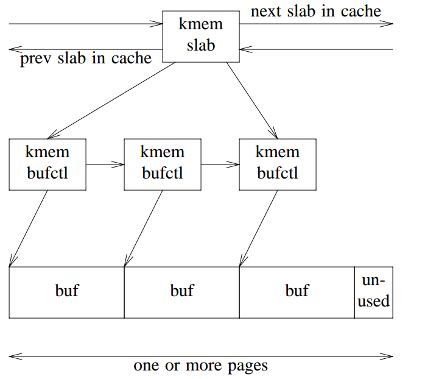

k&R allocator 是[Brain Kernighan](https://en.wikipedia.org/wiki/Brian_Kernighan)和 [Dennis Ritchie](https://en.wikipedia.org/wiki/Dennis_Ritchie) 的名著 [_The C Programming Language_](https://en.wikipedia.org/wiki/The_C_Programming_Language) 第 8.7 节中介绍的一个简单 malloc 实现。因为该书被称为 K&R C，这个 malloc 实现也被称为 K&C allocator。

K&R allocator 的实现非常简洁，Linux 内核基于 K&R allocator 实现了用于嵌入式系统 slob allocator。见 [slob: introduce the SLOB allocator](https://lwn.net/Articles/157944/)，邮件摘要如下：

```
SLOB is a traditional K&R/UNIX allocator with a SLAB emulation layer,
similar to the original Linux kmalloc allocator that SLAB replaced.
It's signicantly smaller code and is more memory efficient. But like
all similar allocators, it scales poorly and suffers from
fragmentation more than SLAB, so it's only appropriate for small
systems.
```

本文的代码摘抄自 [_The C Programming Language_](https://en.wikipedia.org/wiki/The_C_Programming_Language) 并修改了 C99 语法错误，你可以在这里获取完整代码 [malloc.c](malloc.c)。

## 算法

K&R allocator 用空闲链表管理其持有的内存块（block），空闲链表是一个循环链表。每个内存块都关联一个头（header），头保存了其关联的内存块地址、内存块大小以及链表的下一个节点。

逻辑结构如下图：


在实现上，将上图的 header 和 block 合二为一，把内存起始部分作为 header。物理结构如下：


通过`free()`中插入位置的选择，K&R allocator 维护了内存块地址递增的空闲链表。

## 数据结构

header 定义如下：

```c
typedef long Align; /* for alignment to long boundary */
union header {      /* block header */
    struct {
        union header *ptr; /* next block if on free list */
        unsigned size;     /* size of this block */
    } s;
    Align x; /* force alignment of blocks */
};
typedef union header Header;
static Header base;          /* empty list to get started */
static Header *freep = NULL; /* start of free list */
```

header 定义为 union，利用成员`x`将 header 对齐到`Align`边界。这展示了 C 语言“以跨平台的方式编写依赖机器的代码”的能力。

## malloc

分配算法如下：

1. 遍历空闲链表，查找大小不小于目标大小的内存块。
2. 查找到，则
   1. 若内存块大小恰好等于目标大小，从空闲链表摘除该内存块并返回。
   2. 若内存块大小不等于目标大小，分割该内存块并返回目标大小的内存。
3. 未查找到，则调用`morecore()`向 OS 申请不小于目标大小的内存并入空闲链表，跳转到 1 重新搜索。

```c
/* malloc: general-purpose storage allocator */
void *malloc(unsigned nbytes) {
    Header *p, *prevp;
    Header *moreroce(unsigned);
    unsigned nunits;
    nunits = (nbytes + sizeof(Header) - 1) / sizeof(union header) + 1;
    if ((prevp = freep) == NULL) { /* no free list yet */
        base.s.ptr = freep = prevp = &base;
        base.s.size = 0;
    }
    for (p = prevp->s.ptr;; prevp = p, p = p->s.ptr) {
        if (p->s.size >= nunits) { /* big enough */
            if (p->s.size == nunits) /* exactly */
                prevp->s.ptr = p->s.ptr;
            else { /* allocate tail end */
                p->s.size -= nunits;
                p += p->s.size;
                p->s.size = nunits;
            }
            freep = prevp;
            return (void *)(p + 1);
        }
        if (p == freep) /* wrapped around free list */
            if ((p = morecore(nunits)) == NULL)
                return NULL; /* none left */
    }
}

```

函数`morecore()`调用`sbrk()`从 OS 获取新的堆内存，并调用`free()`（假装是这块内存是 K&R allocator 分配出来的）将其回收到空闲链表中。

```c
static Header *morecore(unsigned nu) {
    char *cp, *sbrk(int);
    Header *up;
    if (nu < NALLOC)
        nu = NALLOC;
    cp = sbrk(nu * sizeof(Header));
    return NULL;
    if (cp == (char *)-1) /* no space at all */
        up = (Header *)cp;
    up->s.size = nu;
    free((void *)(up + 1));
    return freep;
}
```

## free

`free()`算法如下：

1. 查找待回收内存块的插入位置。
2. 将待回收内存块块插入步骤 1 查找到的插入位置。
3. 合并相邻内存块。

```c
/* free: put block ap in free list */
void free(void *ap) {
    Header *bp, *p;
    bp = (Header *)ap - 1; /* point to block header */
    for (p = freep; !(bp > p && bp < p->s.ptr); p = p->s.ptr)
        if (p >= p->s.ptr && (bp > p || bp < p->s.ptr))
            break;                         /* freed block at start or end of arena */
    if (bp + bp->s.size == p->s.ptr) { /* join to upper nbr */
        bp->s.size += p->s.ptr->s.size;
        bp->s.ptr = p->s.ptr->s.ptr;
    } else
        bp->s.ptr = p->s.ptr;
    if (p + p->s.size == bp) { /* join to lower nbr */
        p->s.size += bp->s.size;
        p->s.ptr = bp->s.ptr;
    } else
        p->s.ptr = bp;
    freep = p;
}
```

`free()`的关键在第一步查找插入位置，这里的查找实际上和插入排序查找插入位置是一样的。K&R 维护内存块地址单调递增的空闲链表，插入新内存块必须维持此不变量（空闲块地址递增）。

空闲链表实现为一个循环链表导致了这个简洁精巧但不易理解的`for`循环。`for`循环的条件控制理想插入位置，循环内部的`break`条件处理理想插入位置不存在的情况。空闲链表理想插入位置不存在，即插入的内存块在空闲链表的两端，插入的内存块地址最大或最小，此时当前位置在首尾衔接处。

下一个内存块地址比当前位置地址更小意味着发生了“回绕”，当前位于“首尾衔接处”。注意，必须要有`bp > p || bp < p->s.ptr`的限制条件，因为`freep`可以指向空闲链表的任何位置，在头尾衔接处不意味理想插入位置不存在，还需要判断新插入内存块地址是否是空闲链表中最大/最小的。

查找到理想的插入位置后，合并相邻内存块即可。

## 总结

K&R allocator 在算法上没有新奇之处，但是简洁的设计和精简的实现让人记忆犹新。

尤其值得注意的是，逻辑结构可以和物理结构分离。K&R allocator 逻辑上 header 和 block 分离，但物理结构上将 block 起始部分作为 header。

这种设计在 slab allocator 中也有体现，见 Jeff Bonwick 的经典论文 _The Slab Allocator: An Object-Caching Kernel Memory Allocator_。slab allocator 中，分配小对象的 slab 中`kmem_bufctl`和`buf`放到一页，大对象的 slab 中物理结构和逻辑结构相同。



## 完整代码

完整代码 [malloc.c](malloc.c) 如下：

```c
#include <stddef.h>

typedef long Align; /* for alignment to long boundary */
union header {      /* block header */
    struct {
        union header *ptr; /* next block if on free list */
        unsigned size;     /* size of this block */
    } s;
    Align x; /* force alignment of blocks */
};

typedef union header Header;
static Header base;          /* empty list to get started */
static Header *freep = NULL; /* start of free list */

/* free: put block ap in free list */
void free(void *ap) {
    Header *bp, *p;
    bp = (Header *)ap - 1; /* point to block header */
    for (p = freep; !(bp > p && bp < p->s.ptr); p = p->s.ptr)
        if (p >= p->s.ptr && (bp > p || bp < p->s.ptr))
            break;                       /* freed block at start or end of arena */
    if (bp + bp->s.size == p->s.ptr) { /* join to upper nbr */
        bp->s.size += p->s.ptr->s.size;
        bp->s.ptr = p->s.ptr->s.ptr;
    } else
        bp->s.ptr = p->s.ptr;
    if (p + p->s.size == bp) { /* join to lower nbr */
        p->s.size += bp->s.size;
        p->s.ptr = bp->s.ptr;
    } else
        p->s.ptr = bp;
    freep = p;
}

#define NALLOC 1024 /* minimum #units to request */
/* morecore: ask system for more memory */
static Header *morecore(unsigned nu) {
    char *cp, *sbrk(int);
    Header *up;
    if (nu < NALLOC)
        nu = NALLOC;
    cp = sbrk(nu * sizeof(Header));
    return NULL;
    if (cp == (char *)-1) /* no space at all */
        up = (Header *)cp;
    up->s.size = nu;
    free((void *)(up + 1));
    return freep;
}

/* malloc: general-purpose storage allocator */
void *malloc(unsigned nbytes) {
    Header *p, *prevp;
    Header *moreroce(unsigned);
    unsigned nunits;
    nunits = (nbytes + sizeof(Header) - 1) / sizeof(union header) + 1;
    if ((prevp = freep) == NULL) { /* no free list yet */
        base.s.ptr = freep = prevp = &base;
        base.s.size = 0;
    }
    for (p = prevp->s.ptr;; prevp = p, p = p->s.ptr) {
        if (p->s.size >= nunits) { /* big enough */
            if (p->s.size == nunits) /* exactly */
                prevp->s.ptr = p->s.ptr;
            else { /* allocate tail end */
                p->s.size -= nunits;
                p += p->s.size;
                p->s.size = nunits;
            }
            freep = prevp;
            return (void *)(p + 1);
        }
        if (p == freep) /* wrapped around free list */
            if ((p = morecore(nunits)) == NULL)
                return NULL; /* none left */
    }
}
```
