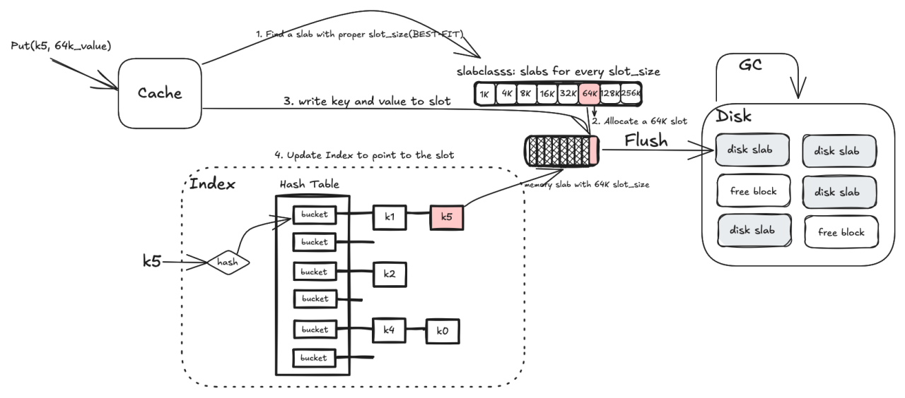

High performance in-memory key-value caches are indispensable components in large-scale web architecture. However, the limited memory capacity and high power consumption of memory motives researchers and developers to develop key-value cache on SSD, where SSD is considered as an extension of limited memory.

In this post, I will talk about the general ideas about KV cache on SSD based on [Twitter's fatcache](https://github.com/twitter/fatcache) and further discuss the issues with this traditional approach.

## Background

[Twitter's fatcache](https://github.com/twitter/fatcache) and many other modern memory allocators, such as [Google tcmalloc](https://github.com/google/tcmalloc/blob/master/docs/design.md) and [Linux slab allocator](https://github.com/torvalds/linux/blob/master/mm/slab_common.c) are based on the idea of slab allocator. You can get the comprehensive detail about slab allocator in paper titled *The slab allocator: An object-caching kernel memory allocator*. I am not willing to delve into too many trivial details here, but overall, slab allocator is a kind of segregated list list allocator. The term slab is actually a continuous memory area, which is the basic management unit of slab allocator. A slab is further divided into slots of the same size which are used to store objects and other metadata. Besides, a slab uses a freelist to keep track of the allocation status of slots, which is the key of allocation and deallocation. All slabs with the same slot(object) size are categorized together and further organized into a sorted array based on the slot size. By doing so, the allocator is able to use binary search to allocate objects from the best-fitted slab.

Not, let's analyse the memory fragmentation of slab allocator.

For external fragmentation, the external memory fragments are unused slots in slabs. Consider this scenario, where slabs with 4KiB slot size is exhausted, yet man slabs with 2KiB slot size still have a lot of free slots. In this case, the allocator fails to allocate 4KiB objects although there are enough memory in slabs with 2KiB slot size because slot(object) size is fixed. In fact, the slab allocator always allocates objects from one slab and switch to other slabs if the old slab is full, so there is only one partial slab for every object size. In practice, external fragmentation is not an issue.

For internal fragmentation, the internal fragmentation rate is 0 because the slot size is equal to object size. However, many slab allocators use 1 slot to store metadata or management structure for the slab, such as slot freelist, slab metadata ans etc. This this case, the internal fragmentation is 1/N, where N denotes the total number of slots within the slab.


## Design
The slab allocator mentioned above is a memory slab allocator which only manage memory slab, while the KV cache on SSD is a two-layer slab allocator. One layer is memory and another layer is disk. To bridge this gap, KV cache on SSD has to accumulate writes in memory slab and flush them into disk in batch when the memory slab is full to reduce SSD write count, which is similar to LevelDB flush strategy. Besides, when the disk space is exhausted, the KV cache must run garbage collection(GC) procedure to reclaims disk space, otherwise the flush procedure fails.

Another important aspect of KV cache is index design which should meet both high performance and high memory-usage efficiency. For performance, Twitter's fatcache use a index hash table to map key to the correspond slot where value is located. For efficiency, fatcache store SHA1 digests instead of original keys in the index hash table to index memory usage.

## Implementation

[Twitter's fatcache](https://github.com/twitter/fatcache) is a single-threaded [memcached](https://memcached.org/) server, using SSD as an extension of memory KV cache. fatcache accepts memcached requests through `epoll(2)` and responses in `req_process` within the same thread, meaning that fatcache can only process one request at a given time. Despite being single-threaded, fatcache still achieve incredible good performance and can indirectly achieve concurrency by deploying multiple instances.

### Index design
The first thing I will dive into is the index design, which is quite interesting. For a KV cache index, the key to reducing the index entry size lies in lowering the cost of storing keys, as key length is variable and may be very large. To solve this issue, fatcache stores SHA1 digests instead of the original keys into index entries because SHA1 digest length is fixed at 20 bytes. However, this method incurs the risk of hash collision. Consider this scenario, when two keys mapped to the same hash bucket  collides, fatcache is unable to distinguish between these two keys. If hash collision happens, the new key simply overwrites the old collided key. fatcache has to compare the key read from slab and the key user requests, and then returns the value if the key is matched; otherwise, fatcache returns not-found. Delete operation directly remove the corresponding index entry.

The index entry `struct itemx` can be further reduced:

1. Linked list pointer `tqe` can be reduced to 32 bytes or even shorter, as all data structures in fatcache is statically allocated by `mmap(2)` and arranged in a big array. The pointer actually means the index of `mmap(2)` array, so even 32 bytes pointer can index more than 4G objects.

2. Digest length can be further reduced if we choose other digest algorithm with shorter length, such as MD5 whose length is 16 bytes.

3. sid and offset can be merged to one field and accessed through bit operations.

```c
struct itemx {
    STAILQ_ENTRY(itemx) tqe;    /* link in index / free q */
    uint8_t             md[20]; /* sha1 message digest */
    uint32_t            sid;    /* owner slab id */
    uint32_t            offset; /* item offset from owner slab base */
    rel_time_t          expiry; /* expiry in secs */
    uint64_t            cas;    /* cas */
} __attribute__ ((__packed__));
```

### Put and Flush/GC

The process of PUT is depicted in the following figure.



The main logic of Put operation is situated at `req_process_set`.

```c
static void
req_process_set(struct context *ctx, struct conn *conn, struct msg *msg)
{
    uint8_t *key, nkey, cid;
    struct item *it;

    // Get key and key length
    key = msg->key_start;
    nkey = (uint8_t)(msg->key_end - msg->key_start);

    // item_slabcid searches the appropriate slab class using best-fit strategy.
    cid = item_slabcid(nkey, msg->vlen);
    if (cid == SLABCLASS_INVALID_ID) {
        rsp_send_error(ctx, conn, msg, MSG_RSP_CLIENT_ERROR, EINVAL);
        return;
    }

    // itemx_removex removes the key before updating the value,
    // as item_get will put an index entry to the index hash table.
    //
    // msg->hash maps key to the corresponding hash bucket.
    // msg->md is the SHA1 digest of key.
    itemx_removex(msg->hash, msg->md);

    // item_get returns a valid slot to store key-value pair.
    it = item_get(key, nkey, cid, msg->vlen, time_reltime(msg->expiry),
                  msg->flags, msg->md, msg->hash);
    if (it == NULL) {
        rsp_send_error(ctx, conn, msg, MSG_RSP_SERVER_ERROR, ENOMEM);
        return;
    }

    // Write key-value pair to the slot.
    mbuf_copy_to(&msg->mhdr, msg->value, item_data(it), msg->vlen);

    SC_STATS_INCR(cid, msg->type);
    rsp_send_status(ctx, conn, msg, MSG_RSP_STORED);
}
```

`item_get` is the heart of Put operation, which directly calls `slab_get_item` to allocate a valid slot to store key-value pair and handle slab flush an GC. I don't want to dive into the implementation details, such as flush and GC too many because they are too trivial, but I will explain the algorithm.

```c
struct item *
slab_get_item(uint8_t cid)
{
    rstatus_t status;
    struct slabclass *c;
    struct slabinfo *sinfo;
    struct slab *slab;

    ASSERT(cid >= SLABCLASS_MIN_ID && cid < nctable);
    c = &ctable[cid];

    // The index memory size is limited, so If index memory was exhausted,
    // fatcache to evict some disk slab to free index entries for puts.
    //
    // slab_evict use a quick clean strategy to evict(GC) full disk slab,
    // dropping full disk slab directly. In this process, slab_evict
    // need to remove all index entries pointing to the victim disk slab.
    if (itemx_empty()) {
        status = slab_evict();
        if (status != FC_OK) {
            return NULL;
        }
    }

    // Every struct slab_class has a partial_msinfoq(partial memory slab queue)
    // which manage a partial memory slab that is able to allocate slots. The
    // term *partial* means the memory slab has already allocated slots but it
    // is not full.
    //
    // fatcache tries to allocate slot from the partial memory slab.
    if (!TAILQ_EMPTY(&c->partial_msinfoq)) {
        // _slab_get_item allocates a slot from the partial memory slab.
        // Every slat maintains the next slot id `nalloc` that will be allocated, which
        // is essentially a kind of freelist. When allocating a slot, fatcache
        // returns the slot at `nalloc` and increments `nalloc`.
        //
        // fatcache doesn't reclaims individual slots;
        // instead, the entire slab is reclaimed by GC.
        return _slab_get_item(cid);
    }

    // free_msinfoq means free memory slab queue, which is a global queue
    // managing all free memory slab.
    //
    // fatcache tries to remove a free memory slab and add it to the
    // slab_class's partial_msinfoq, and then calls _slab_get_item to
    // allocate a slot.
    if (!TAILQ_EMPTY(&free_msinfoq)) {
        /* move memory slab from free to partial q */
        sinfo = TAILQ_FIRST(&free_msinfoq);
        ASSERT(nfree_msinfoq > 0);
        nfree_msinfoq--;
        c->nmslab++;
        TAILQ_REMOVE(&free_msinfoq, sinfo, tqe);

        /* init partial sinfo */
        TAILQ_INSERT_HEAD(&c->partial_msinfoq, sinfo, tqe);
        /* sid is already initialized by slab_init */
        /* addr is already initialized by slab_init */
        sinfo->nalloc = 0;
        sinfo->nfree = 0;
        sinfo->cid = cid;
        /* mem is already initialized by slab_init */
        ASSERT(sinfo->mem == 1);

        /* init slab of partial sinfo */
        slab = slab_from_maddr(sinfo->addr, false);
        slab->magic = SLAB_MAGIC;
        slab->cid = cid;
        /* unused[] is left uninitialized */
        slab->sid = sinfo->sid;
        /* data[] is initialized on-demand */

        return _slab_get_item(cid);
    }

    ASSERT(!TAILQ_EMPTY(&full_msinfoq));
    ASSERT(nfull_msinfoq > 0);

    // At this point, the free memory slabs are exhausted.
    // fatcache has to call slab_drain to flush one memory
    // slab into disk. slab_evict may be called with slab_drain
    // to reclaims disk slab if disk space is also used up.
    status = slab_drain();
    if (status != FC_OK) {
        return NULL;
    }

    // At this point, fatcache has released one memory slab,
    // so retries.
    return slab_get_item(cid);
}
```

It's worthy to note that fatcache see SSD as an extension of in-memory KV cache, so it choose to only flush and GC when the memory slabs are exhausted. If the slab memory is not used up, fatcache will not use the SSD.

## Evaluation

[Twitter's fatcache performance.md](https://github.com/twitter/fatcache/blob/master/notes/performance.md) has already gave a comprehensive benchmark guide, so I will not talk too much about benchmark setup. What I really want to talk about is how to understand the performance and cache hit rate of Fatcache. I have benchmarked Twitter's fatcache and my [KV cache implementation](https://github.com/kongjun18/kvcache/) based on the paper [Optimizing Flash-based Key-value Cache Systems](https://www.usenix.org/system/files/conference/hotstorage16/hotstorage16_shen.pdf) carefully and you can get the performance analysis at [my tech share PPT](https://github.com/kongjun18/kvcache/blob/main/docs/SHARE.pdf).

In fact, Twitter's fatcache achieves a very high performance for concurrent memcached requests even though it is a single-threaded memcached server. The write performance is better than read performance because writes will hit memory slab and be flushed later, which similar to LevelDB strategy. If write workload is too heavy, the memory buffer strategy will have no effect, as the memory slabs will be exhausted quickly and all writes are blocked waiting to SSD writes. Therefore, the bottleneck of both heavy write workload and normal read workload is SSD performance.

Twitter's fatcache doesn't support background flush and background GC, which will be a performance bottleneck if the write workload is moderate and leaves enough room for background flush/GC. However, I don't have proper machine to test this case.

Twitter's fatcache will achieve a incredibly low cache hit rate when SSD is used due to the quick clean GC strategy. The GC procedure will remove a disk slab from the head of `full_dsinfoq` which means *full disk slab queue* to drop, without taking any access or usage information into account. When the garbage rate is very low, the choice of garbage collection strategy doesn't matter much, therefore this strategy can achieve a cache hit rate comparable to other GC strategies. However, when the garbage rate is high, quick clean strategy achieves an incredibly low cache hit rate, as the victim disk slab happens to be the most recently flushed slab which is highly likely to be the most recently accessed slab.

## Improvement

The paper [Optimizing Flash-based Key-value Cache Systems](https://www.usenix.org/system/files/conference/hotstorage16/hotstorage16_shen.pdf) points out the key issue of traditional KV cache on SSD is functionality redundancies between application level cache and hardware level SSD. Three main issues are found:

1. Redundant mapping

    Application level slab mapping and hardware level page mapping are redundant. Usually, SSD flash translation layer(FTL) use a page-level mapping. As a result, for a 1TB SSD with a 4KB page size, a page-level mapping table could be as large as 1GB. Meanwhile, the application index hash table translates keys to slabs. We can combine these two redundant mapping to one application level index hash table.

2. Double GC

    Hardware level garbage collection is useless because the application level cache will run it's own GC procedure. Beside, the hardware level GC procedure can't not work well due to the lack of knowledges about application level workloads. For example, the hardware level GC can not to reclaims a block even though objects in this block are useless, as the SSD lacks knowledges about the validness of objects.

3. Wasted over-provisioning space(OPS)

    Modern high-end SSD usually reserves 20% disk space as over-provisioning space for bad cases(i.e., highly intensive write traffic). Unfortunately, the application level KV cache can recognize workloads and dynamically adjust OPS size to achieve maximum disk space utilization.

I have implemented all designs and algorithms of the paper [Optimizing Flash-based Key-value Cache Systems](https://www.usenix.org/system/files/conference/hotstorage16/hotstorage16_shen.pdf). You can access the code at [this repo](https://github.com/kongjun18/kvcache).
