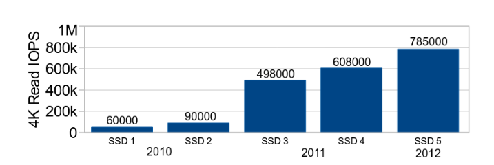

## 背景
目前 SSD 的 iops 已经能够达到百万 iops，但 Linux block layer 无法达到 iops。Linux block layer 成为了高速存储设备的性能瓶颈，为了绕开龟速的 block layer，许多开发者使用 bypass 技术在用户态进行 IO。

论文剖析了当前的 Linux block layer 设计，指出其性能瓶颈，并提出了面向多核系统和 SSD 的多队列设计。

## 瓶颈
Linux block layer 的性能瓶颈在于以下三点：
- 单一队列的锁竞争
    每个设备一个队列，这个队列由一把全局锁保护。所有进程的 IO 操作都竞争这个队列的锁，导致严重的竞争。
- 低效的硬件中断
    许多存储设备完成 IO 操作后，只向一个核心发送硬件中断，即使请求从另一个核心发出。为了将中断从一个核心转发到另一个核心，系统需要发出 IPI 中断，导致性能损耗。
- NUMA 远程内存访问
    单一队列设计无法适应 NUMA 架构，访问单一队列导致大量远程内存访问。

>[!NOTE]
>论文没有提及如何解决硬件中断。
## 设计
block layer 处理器请求的过程大体上可以分为两大类，一是和软件相关的部分（如 IO 调度），而是和硬件相关的部分（如向硬件发送请求）。旧的单一队列设计将这两部分合并到了一个单一队列中，新的多级队列设计解耦了这两大部分。

新的多级队列设计分为两种队列：
- software staging queue：复制 IO 调度、记账等软件部分，每个 CPU 或 NUMA node 都有自己的 queue，CPU 或 NUMA node 间不共享 queue。
- hardware dispatch queue：负责 IO 请求发送和完成等硬件部分，queue 的数量取决于存储设备支持的命令队列数。SSD 通常在硬件层面支持多个命令队列（能并发处理多个请求），HDD 通常只支持一个命令队列（受限于 HDD 的旋转结构，HDD 无法并发处理请求）。

software staging queue 和 hardware dispatch queue 间存在映射关系。理想的情况下，每个 CPU 或 NUMA node 都有自己的 hardware dispatch queue 和 software staging queue，NUMA node 或 CPU 间不存在任何竞争和远程内存访问。

## 总结
多队列设计成功突破了百万 iops，让 Linux 跟上了 SSD 的脚步。新的多队列设计并不仅仅是把单一队列改成了多队列，从面向单核 HDD 设计转向面向多核 SSD 设计，做了许多重构以面向现代 SSD 的特性。其中一大改变就是不再进行复杂的 IO 调度，转而使用 FIFO 策略，将 IO 调度交给 SSD FTL 完成。

---
## References
- [Linux block IO: introducing multi-queue SSD access on multi-core systems](zotero://open-pdf/library/items/MN7WU88B)
