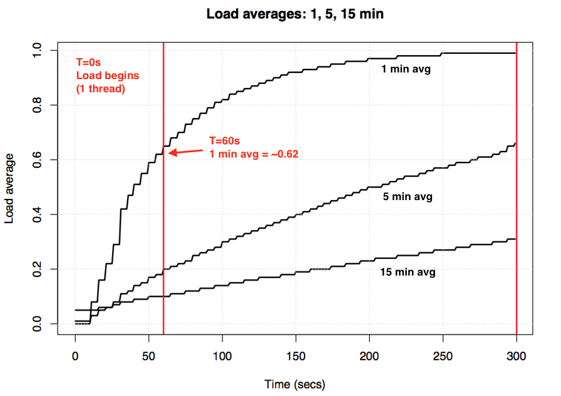

平均负载（*load averages*）是一个很关键的指标——我所在的公司基于平均负载和其他指标，花费数百万去自动伸缩云实例——但在 Linux 上存在许多和平均负载相关的谜题。Linux 平均负载不仅追踪运行态（*runnable*）任务，也追踪处于不可中断休眠状态（*uninterruptible sleep state*）的任务。为什么？从没有人给我解释过。在这篇文章中，我将解决这个谜团，并总结平均负载以供他人参考。

Linux 平均负载是“系统负载（*system load averages*）”，它通过系统中可运行的和不可中断睡眠的平均线程数量，来表征运行中的线程（任务）对系统资源的需求。平均负载衡量需求，这可能大于系统中正在处理的需求。大多数工具展示 1、5、15 分钟平均负载：

```shell
$ uptime
 16:48:24 up  4:11,  1 user,  load average: 25.25, 23.40, 23.46

top - 16:48:42 up  4:12,  1 user,  load average: 25.25, 23.14, 23.37

$ cat /proc/loadavg
25.72 23.19 23.35 42/3411 43603
```

一些解释：

- 平均值为 0.0，说明你的系统空闲。

- 一分钟平均负载大于五或十五分钟平均负载，说明负载增大。

- 一分钟平均负载小于五或十五分钟平均负载，说明负载减小。

- 平均负载大于你的 CPU 数，那么你的系统**可能**（不一定）存在性能问题。

这三个平均负载非常有用，你一眼就可以看出系统负载是在增大还是减小。在只需要单个平均负载值，比如云上的自动伸缩规则时，这些指标也非常有用。但是，如果没有别的辅助指标，很难更深入地理解他们代表了什么。如果只知道平均负载为 23-25 ，这没有任何意义。如果我们知道 CPU 数和运行的是 CPU 密集型任务，那么也许能看出些什么。

与其通过平均负载诊断性能问题，我更愿意使用其他指标。我将在后面的“更好的指标”一节讨论这些指标。

## 历史

最初的平均负载只表征对 CPU 的需求：平均负载是正在运行以及等待运行的进程数。1973 年 8 月的 [RFC 546](https://tools.ietf.org/html/rfc546) *TENEX Load Averages* 定义了平均负载：

> [1] The TENEX load average is a measure of CPU demand. The load
>  average is an average of the number of runnable processes over a given
>  time period. For example, an hourly load average of 10 would mean
>  that (for a single CPU system) at any time during that hour one could
>  expect to see 1 process running and 9 others ready to run (i.e., not
>  blocked for I/O) waiting for the CPU.
>
> ------------------------------------------------------------------------
>
> [1] TENEX 平均负载是衡量 CPU 需求量的指标。平均负载是一段时间内可运行进程
> 的平均数量。比如，一小时平均负载为 10 可能意味着（对于一个单 CPU 系统），
> 用户可以认为这一个小时内的任何时刻，都有 1 一个正在运行的进程和 9 个准备
> 就绪（比如，没有因 IO 阻塞）在等待 CPU 的进程。

[ietf.org](https://tools.ietf.org/html/rfc546) 上链接了一个于 1973 年手绘的平均负载折线图，这说明多年前人们就用平均负载监控系统。


今天可以在网上找到这个古老操作系统的源代码，这里是上世纪 70 年代早期的 [TENEX](https://github.com/PDP-10/tenex) 系统的 DEC 汇编代码节选：

```asm6502
NRJAVS==3               ;NUMBER OF LOAD AVERAGES WE MAINTAIN
GS RJAV,NRJAVS          ;EXPONENTIAL AVERAGES OF NUMBER OF ACTIVE PROCESSES
[...]
;UPDATE RUNNABLE JOB AVERAGES

DORJAV: MOVEI 2,^D5000
        MOVEM 2,RJATIM          ;SET TIME OF NEXT UPDATE
        MOVE 4,RJTSUM           ;CURRENT INTEGRAL OF NBPROC+NGPROC
        SUBM 4,RJAVS1           ;DIFFERENCE FROM LAST UPDATE
        EXCH 4,RJAVS1
        FSC 4,233               ;FLOAT IT
        FDVR 4,[5000.0]         ;AVERAGE OVER LAST 5000 MS
[...]
;TABLE OF EXP(-T/C) FOR T = 5 SEC.

EXPFF:  EXP 0.920043902 ;C = 1 MIN
        EXP 0.983471344 ;C = 5 MIN
        EXP 0.994459811 ;C = 15 MIN
```

这是今天的 [Linux](https://github.com/torvalds/linux/blob/master/include/linux/sched/loadavg.h) 源代码节选（include/linux/sched/loadavg.h）：

```c
#define EXP_1           1884            /* 1/exp(5sec/1min) as fixed-point */
#define EXP_5           2014            /* 1/exp(5sec/5min) */
#define EXP_15          2037            /* 1/exp(5sec/15min) */
```

Linux 也硬编码 1、5 和 15 分钟常量。

许多旧系统也有类似的平均负载指标 ，比如 [Multics](http://web.mit.edu/Saltzer/www/publications/instrumentation.html) 有指数调度队列平均值。

## 三个数字

这三个数字是 1、5、15 分钟平均负载。实际上，平均负载并不是平均值，也不是 1、5、15 分钟内的负载值。就像我们从源代码看到的那样，1、5、15 分钟只是公式中的常量，用来计算每 5 秒负载的指数阻尼移动和（*exponentially-damped moving sum*）。计算出的 1、5、15 分钟平均负载所反映的负载远超 1、5、15 分钟。

如果你有一个空闲的系统，然后运行一个单线程 CPU 密集型负载（一个死循环的单线程），60 秒后一分钟平均负载会是多少？如果它只是一个平均值，那它应该是 1.0。这里是一个实验，结果如下：



所谓的“一分钟平均负载”在一分钟后只到达 0.62。想了解更多公式和类似实验的话可以阅读 Dr. Neil Gunther 的文章 [How It Works](http://www.teamquest.com/import/pdfs/whitepaper/ldavg1.pdf) 以及 Linux 源代码 [loadavg.c](https://github.com/torvalds/linux/blob/master/kernel/sched/loadavg.c) 中的注释。

> **译者注**
>
> 指数阻尼移动和（*exponentially-damped moving sum*）是一种数学方法，经常用来处理和时间相关的数据。它用于估计变量的局部均值，使得变量的当前值与一段时间内的历史取值有关。从几何上看，它使得曲线更加平滑。
>
> 维基百科 [Exponential smoothing](https://en.wikipedia.org/wiki/Exponential_smoothing) 中的公式如下，$\alpha$ 称为平滑因子：
>
> $$
> s_0=x_0
> $$
> $$
> s_t=\alpha x_t+(1-\alpha)s_{t-1}, t>0
> $$
>
> 直观地看，就是让变量的当前值不仅取决于上一时刻的值，还受更久之前的值的影响。
>
> kernel/sched/loadavg.c 注释中描述了平均负载公式：
>
> ```c
> /*
>  * Global load-average calculations
>  *
>  * We take a distributed and async approach to calculating the global load-avg
>  * in order to minimize overhead.
>  *
>  * The global load average is an exponentially decaying average of nr_running +
>  * nr_uninterruptible.
>  *
>  * Once every LOAD_FREQ:
>  *
>  *   nr_active = 0;
>  *   for_each_possible_cpu(cpu)
>  *    nr_active += cpu_of(cpu)->nr_running + cpu_of(cpu)->nr_uninterruptible;
>  *
>  *   avenrun[n] = avenrun[0] * exp_n + nr_active * (1 - exp_n)
>  *
>  * ...
>  *
>  */
> ```
>
> 其中`avenrun`是平均负载值数组，元素是 1、5、15 分钟平均负载。公式中的 `avenrun[0]`指上次平均负载，`exp_n`是 1、5、15 分钟对应的魔数（文章前面有引用）。
>
> `LOAD_FREQ`定义在 include/linux/sched/loadacg.c：
>
> ```c
> #define LOAD_FREQ    (5*HZ+1)    /* 5 sec intervals */
> ```
>
> Linux 每 5 秒更新一次平均负载。
>
> 在此公式下，1、5、15 分钟平均负载是同一公式、不同常量计算出的三个值，而不是真的“前 X 分钟平均负载”，更不是真的平均值。

## Linux 不可中断任务

平均负载第一次出现在 Linux 时，它和其他操作系统中的平均负载一样反映对 CPU 的需求。后续 Linux 版本的平均负载不仅包括运行态的任务，还包括在不可中断（*uninterruptible*）状态（`TASK_UNINTERRUPTIBLE`或`nr_uninterruptible`）的任务。此状态通常由希望避免被信号中断的代码使用，包括阻塞于磁盘 IO 或某些锁的任务。你可能之前就见过它们，它们在`ps`和`top`命令中展示为 D 状态。ps(1) man page 称它为”不可中断睡眠（通常是由于 IO 操作）”。

添加了不可中断状态意味着 Linux 平均工作负载会因为磁盘（或 NFS）IO 增大，而不只是 CPU 需求。对于任何熟悉其他操作系统上的衡量“对 CPU 需求”的平均负载的人来说，为什么 Linux 平均负载包括这个状态是第一个令人迷惑的问题。

**为什么？** 为什么 Linux 要这样做？

有无数关于平均负载的文章，其中许多都指出了 Linux `nr_uninterruptible` 的陷阱。但我从未看到谁解释了为什么 Linux 平均负载要包括它，甚至连猜测的都没。我猜测这是为了让平均负载放映更加一般意义上的需求，而不只是 CPU 需求。

## 搜索古代 Linux 补丁

弄清楚为什么平均负载的含义在 Linux 中发生了变化很简单，阅读 Linux 相关文件的 Git 提交记录和变更描述即可。我检查了 [loadavg.c](https://github.com/torvalds/linux/commits/master/kernel/sched/loadavg.c) 的提交记录，但修改了平均负载含义的提交早于这个文件，loadavg.c 是从更古老的文件中的代码创建的。我还检查了别的文件，但是这条路更加艰难，这些代码分布在不同的文件中。为了走捷径，我在整个 Linux github 代码仓库上执行`git log -p`，在足足 4GB 文本中从后往前寻找这些代码第一次出现的地方。然而，这又是一条死胡同。Linux 代码库最早的记录也只能追溯到 2005 年，那一年 Linus 导入了 Linux 2.6.12-rc2 版本，但我要找的修改早于这一版本。

存在许多 Linux 历史版本的代码仓库（[这个](https://git.kernel.org/pub/scm/linux/kernel/git/tglx/history.git) 和 [这个](https://kernel.googlesource.com/pub/scm/linux/kernel/git/nico/archive/)），但是里面也没有我想找变更描述。为了最起码弄清楚这个变化是什么时候引入的，我搜索了 [kernel.org](https://www.kernel.org/pub/linux/kernel/Historic/v0.99/) 上的归档（*tarball*），发现在 Linux 0.99.15 修改了平均负载的含义，0.99.13 没有修改，但 0.99.14 版本丢失了。我又从别的地方发现了这一点，确认这个变化由 1993 年 11 月的 Linux 0.99 patchlevel 14 引入。我希望 Linus 写的 0.99.14 发版公告能解释这个变化，但是这也是死胡同。

> "Changes to the last official release (p13) are too numerous to mention (or even to remember)..." – Linus
>
> -------------------------------------------------------------------------------------------------------------
>
> “对上一个正式版本 (p13) 的更改太多了，无法提及（甚至无法记住）......” – Linus

他提到了主要变更，但是没有提及平均负载含义的变化。

根据这个日期，我搜索了[内核邮件列表归档](http://lkml.iu.edu/hypermail/linux/kernel/index.html) 想找到具体的 patch，然而可以找到的最早邮件来自 1995 年 6 月，当时一位系统管理员写道：

> "While working on a system to make these mailing archives scale more
> effecitvely I accidently destroyed the current set of archives (ah
> whoops)."
>
> ----------------------------------------------------------------------------------------
>
> 在扩容的过程中我不小心删除了一部分归档（哎呀）

我倒霉得就像被诅咒了一样。幸运的是，我找到了一些从服务器备份中恢复出来的更古老的 Linux 开发列表邮件归档，就是那种以文件摘要（digest，即文件的哈希值）为名的 tarball。我搜索了超过 6000 个 tarball，其中包含超过 98000 封邮件，里面有 30000 封邮件来自 1993 年。所有的邮件似乎都缺了点什么，看起来原始的补丁描述已经彻底丢失了，Linux 为什么这样做将永远是个谜题。

## 不可中断状态的起源

我最后很幸运地在 [oldlinux.org](http://oldlinux.org/Linux.old/mail-archive/) 找到一封 1993 年的压缩过的邮件中发现了这个变更（*change*），这封邮件如下：

```
From: Matthias Urlichs <urlichs@smurf.sub.org>
Subject: Load average broken ?
Date: Fri, 29 Oct 1993 11:37:23 +0200


The kernel only counts "runnable" processes when computing the load average.
I don't like that; the problem is that processes which are swapping or
waiting on "fast", i.e. noninterruptible, I/O, also consume resources.

It seems somewhat nonintuitive that the load average goes down when you
replace your fast swap disk with a slow swap disk...

Anyway, the following patch seems to make the load average much more
consistent WRT the subjective speed of the system. And, most important, the
load is still zero when nobody is doing anything. ;-)

--- kernel/sched.c.orig Fri Oct 29 10:31:11 1993
+++ kernel/sched.c  Fri Oct 29 10:32:51 1993
@@ -414,7 +414,9 @@
    unsigned long nr = 0;

    for(p = &LAST_TASK; p > &FIRST_TASK; --p)
-       if (*p && (*p)->state == TASK_RUNNING)
+       if (*p && ((*p)->state == TASK_RUNNING) ||
+                  (*p)->state == TASK_UNINTERRUPTIBLE) ||
+                  (*p)->state == TASK_SWAPPING))
            nr += FIXED_1;
    return nr;
 }
--
Matthias Urlichs        \ XLink-POP N|rnberg   | EMail: urlichs@smurf.sub.org
Schleiermacherstra_e 12  \  Unix+Linux+Mac     | Phone: ...please use email.
90491 N|rnberg (Germany)  \   Consulting+Networking+Programming+etc'ing      42
```

> **译者注**
>
> 邮件大意如下：
>
> 内核计算平均负载时只考虑“可运行”的进程，我不喜欢这样。问题在于当进程正在换出或在等待“快”IO时，比如不可中断 IO 仍然在消耗资源。
>
> 当你把很快的硬盘换成更慢的硬盘后，平均负载会下降，这看起来就不符合直觉。
>
> 无论如何，下面的补丁让平均负载和系统性能更加匹配。更重要的是，如果没有人做任何事，平均负载仍然是 0。

阅读 24 年前的这一变化背后的想法真是太神奇了。

这封邮件证明了平均负载的改变确实是为了反映对其它系统资源的需求，而不仅仅对 CPU。Linux 把它从“CPU 平均负载”改成了“系统平均负载”。

他（Matthias Urlichs）举的使用低速交换磁盘（*slow swap disk*）的例子很有道理：降低系统性能，系统上的需求（通过估计正在运行和排队的任务数）应该增加。然而，因为平均负载只追踪运行态的任务，不追踪被换出的任务，平均负载反而会降低。Matthias 认为这不符合直觉，所以他修了这个 bug。

## 今天的不可中断状态

但是，Linux 平均负载是否有时会高到超过磁盘 I/O 可以解释的程度？是的，尽管我猜测这是因为现在存在许多在 1993 年不存在的使用`TASK_UNINTERRUPTIBLE`的代码路径。Linux 0.99.14 只有 13 处代码直接设置`TASK_UNINTERRUPTIBLE`或`TASK_SWAPPING`（后续版本移除了“交换中”状态）。今天，Linux 4.12 中有接近 400 处代码设置`TASK_UNINTERRUPTIBLE`，比如一些锁原语（*lock primitives*）。其中有些代码路径可能被不应该包含在平均负载中。下一次我发现平均负载过高，我会查看是否是这种情况以及能否修复它。

我发邮件给 Matthias，问他 24 年后怎么看待平均负载含义的变化。他一个小时后回复了我（就像我 [Twitter](https://twitter.com/brendangregg/status/891716419892551680) 上提到的那样）：

> "The point of "load average" is to arrive at a number relating how busy
> the system is from a human point of view. TASK_UNINTERRUPTIBLE means
> (meant?) that the process is waiting for something like a disk read
> which contributes to system load. A heavily disk-bound system might be
> extremely sluggish but only have a TASK_RUNNING average of 0.1, which
> doesn't help anybody."
>
> ---------------------------------------------------------------------
>
> 平均负载的意义在于给出一个从用户侧看来可以表示系统有多繁忙的数值。TASK_UNINTERRUPTIBLE （也许）意味着进程正在等待磁盘读取之类的会增加系统负载的事件。一个磁盘 IO 密集型系统可能非常慢，但只考虑 TASK_RUNNING 的平均负载却只有 0.1，这对任何人都没帮助。

（得到他如此快速的回应，真的让我一天都很开心。感谢！）

Matthias 仍然认为这是有道理的，至少在当年`TASK_UNINTERRUPTIBLE`的语义下是有道理的。

但是今天的`TASK_UNINTERRUPTIBLE`匹配更多的东西（**译者注**：指有更多设置`TASK_UNINTERRUPTIBLE`的代码路径）。我们应该把平均负载修改为对 CPU 和磁盘的需求吗？Linux 调度器维护者 Peter Zijstra 给了我一个聪明的方案：将`task_struct->in_iowait`而非`TASK_UNINTERRUPTIBLE`包含在平均负载中，以便让它更匹配磁盘 IO。这种方案带来了其他问题。这真的是我们想要的吗？我们应该用线程的需求衡量对系统资源的需求，还是用对物理资源的需求来衡量？如果是前者，等待非中断的锁（*uninterruptible lock*）应该被算进平均负载中，线程需要这些资源，系统不是空闲状态。所以，Linux 平均负载可能已经按我们期待的那样工作。

为了更好地理解非中断代码路径，我想找一个办法测量他们。我们来看一个不同的例子，计算花在非中断代码路径上的时间，然后看看这一切是否讲得通。

## 测量非中断任务

下面的 [Off-CPU 火焰图](http://www.brendangregg.com/blog/2016-01-20/ebpf-offcpu-flame-graph.html) 展示了生产环境服务器上 60 秒内的`TASK_UNINTERRUPTIBLE`状态的函数调用栈（[SVG](images/out.offcputime_unint02.svg)）。它提供了许多非中断代码路径的例子：

<object data="images/out.offcputime_unint02.svg" type="image/svg+xml" alt="Kernel Uninterruptible Off-CPU Flame Graph (60 secs)" data-align="center"> </object>

如果你是刚接触 off-CPU 火焰图的新人，既可以尝试单击帧放大，查看完整的函数调用栈（显示为一个由帧构成的塔）。X 轴方向的大小正比与阻塞时间，排列次序（从左往右）没有实际意义。off-CPU 函数调用栈显示为蓝色（on-CPU 栈用暖色调），通过随机的饱和度区分不同的帧。

我使用我的 [bcc](https://github.com/iovisor/bcc)（这个工具需要 Linux 4.8+ 支持的 eBPF 特性）中的 offcputime 以及我的[火焰图](https://github.com/brendangregg/FlameGraph))软件：

```shell
# ./bcc/tools/offcputime.py -K --state 2 -f 60 > out.stacks
# awk '{ print $1, $2 / 1000 }' out.stacks | ./FlameGraph/flamegraph.pl --color=io --countname=ms > out.offcpu.svg
```

> **译者注**
>
> 以上命令需要下载对应工具，python 解释器及有关 pip 包，root 权限。

我用 awk 把输出中的微秒转换为毫秒。offcputime 脚本的`--state 2`匹配`TASK_UNINTERRUPTIBLE`（见 sched.h）。Facebook 的 Josef Bacik 首次用他编写的 [kernelscope](https://github.com/josefbacik/kernelscope) 做了这件事，他也使用了 bcc 和火焰图。在我举的例子中，只展示了内核栈，但 offcputime.py 也支持打印用户堆栈。

上面的火焰图表示内核 60s 内在不可中断睡眠中消耗了 926ms。这只让平均负载增加了 0.015。这是花在一些 cgroup 相关的代码路径中的时间，这个服务器没有做太多磁盘 IO 操作。

> **译者注**
>
> 平均负载增加 0.015 指，当平均负载到达稳态时，926ms/60s=0.015，为平均负载贡献了 0.015。后面的同理。

这里有一个更有意思的例子，这次观测耗时 10 秒（[SVG](out.offcputime_unint01.svg)）：


<object data="images/out.offcputime_unint01.svg" type="image/svg+xml" alt="Kernel Uninterruptible Off-CPU Flame Graph (10 secs)" data-align="center"> </object>

右边宽的调用栈表示`systemd-journal`在`proc_pid_cmdline_read()`（读取 /proc/PID/cmdline）中阻塞并为平均负载贡献了 0.07（732ms/10s）。左边有一个更宽的页错误（*page fault*）调用栈，结束于`rwsem_down_read_failed`，为平均负载贡献了 (2307ms+694ms)/1s = 0.23。我已经用火焰图搜索功能把这两个帧高亮为粉红色。

> **译者注**
>
> systemd-journal 和 page_fault 都调用了 rwsem_down_read_failed，因此火焰图中有两个 rwsem_down_read_failed 帧。计算对平均负载的贡献时，两个都算上了。

`rwsem_down_read_failed`的节选如下：

```c
   /* wait to be given the lock */
    while (true) {
        set_task_state(tsk, TASK_UNINTERRUPTIBLE);
        if (!waiter.task)
            break;
        schedule();
    }
```

这段获取锁的代码使用了`TASK_UNINTERRUPTIBLE`。Linux 为获取锁的函数提供了可中断与不可中断的两个版本，如`mutex_lock()`和`mutex_lock_interruptible()`，以及信号量的`down()`和`down_interruptible()`。可中断版本允许任务被信号中断，然后在获取到锁之前唤醒并处理它。在不可中断锁中睡眠的时间通常不长，不会对平均负载造成太大影响，但这里为平均负载增加了 0.30。如果不可中断睡眠让平均负载增大得太多了，那就值得分析是否可以减少锁争用，就像我研究`systemd-journal`和`proc_pid_cmdline_read()`那样！这可以提高系统性能并降低平均负载。

这些代码路径被包含在平均负载中有道理吗？是的，这是有道理的。这些线程正在做他们的工作，碰巧阻塞在锁上，他们并不空闲。他们在向系统请求资源，尽管是软件资源而非硬件资源。

## 分解 Linux 平均负载

可以把 Linux 平均负载值完全分解开吗？这里有一个例子：在一个空闲的 8 核系统上，我执行`tar`来归档（*archive*）许多未缓存的文件。这花了几分钟，大时间被阻塞在磁盘读取上。这里是从不同终端窗口收集到的统计数据：

```shell
terma$ pidstat -p `pgrep -x tar` 60
Linux 4.9.0-rc5-virtual (bgregg-xenial-bpf-i-0b7296777a2585be1)     08/01/2017  _x86_64_    (8 CPU)

10:15:51 PM   UID       PID    %usr %system  %guest    %CPU   CPU  Command
10:16:51 PM     0     18468    2.85   29.77    0.00   32.62     3  tar

termb$ iostat -x 60
[...]
avg-cpu:  %user   %nice %system %iowait  %steal   %idle
           0.54    0.00    4.03    8.24    0.09   87.10

Device:         rrqm/s   wrqm/s     r/s     w/s    rkB/s    wkB/s avgrq-sz avgqu-sz   await r_await w_await  svctm  %util
xvdap1            0.00     0.05   30.83    0.18   638.33     0.93    41.22     0.06    1.84    1.83    3.64   0.39   1.21
xvdb            958.18  1333.83 2045.30  499.38 60965.27 63721.67    98.00     3.97    1.56    0.31    6.67   0.24  60.47
xvdc            957.63  1333.78 2054.55  499.38 61018.87 63722.13    97.69     4.21    1.65    0.33    7.08   0.24  61.65
md0               0.00     0.00 4383.73 1991.63 121984.13 127443.80    78.25     0.00    0.00    0.00    0.00   0.00   0.00

termc$ uptime
 22:15:50 up 154 days, 23:20,  5 users,  load average: 1.25, 1.19, 1.05
[...]
termc$ uptime
 22:17:14 up 154 days, 23:21,  5 users,  load average: 1.19, 1.17, 1.06
```

我也收集了不可中断状态的 off-CPU 火焰图（[SVG](images/out.offcputime_unint08.svg)）。

<object data="images/out.offcputime_unint08.svg" type="image/svg+xml" alt="Kernel Uninterruptible Off-CPU Flame Graph (60 secs)" data-align="center"> </object>

最后的一分钟平均负载为 1.19。让我分解它：

- 0.33 来自 tar 消耗的 CPU 时间（pidstat)

- **推测** 0.67 来自 tar 的不可中断磁盘读取（off-CPU 火焰图计算得到 0.69，我怀疑这是因为开始收集得稍微有点晚，跨越了不同的时间范围）

- 0.04 来自其他 CPU 消费者（iostat user + system 减去从 pidstat 看到的 tar CPU 时间）

- 0.11 来自内核 workers 不可中断磁盘 IO 和刷新磁盘。

> **译者注**
>
> 分别解释上面的计算过程：
>
> - 从 pidstat 看到 tar 运行在 CPU 3 上，有 32.62% 的时间是 CPU 时间，即 tar CPU 时间让平均负载增加了 0.33。
>
> - 从火焰图看是 0.69，0.67 是作者的推测。火焰图中 tar 帧用时 41164ms，占取样时间范围（60s) 的 0.686，约等于 0.69。即 tar 不可中断状态让平均负载增加了 0.69。
>
> - iostat 显示的 CPU 时间比例是整个系统（8核）的，pidstat 显示的是一个核的。因此 pidstat 显示的 32.62% 对应整个系统的 4.0775%，iostat user+system 为 4.57%，总 CPU 时间减去 tar CPU 时间得到 4.077%，约等于 0.04。
>
> - kworker 是一种专用于中断处理的内核线程。火焰图中两个帧占取样时间比例为 (3684ms+3102ms)/60s = 0.11。

上面加起来总共只有 1.15，仍然缺了 0.04。其中一些可能是舍入或测量误差，但大部分是因为平均工作负载是指数阻尼移动和，而这里使用的其他平均值（pidstat、iostat）是普通的平均值。1.19 之前的平均负载是 1.25，这说明有什么东西在拖累平均负载的增长。到底是多少呢？从上面的图片可以看到，在 60s 时，一分钟平均负载值有 62% 来自于该时刻，其余来自历史值。所以 0.62 x 1.15 + 0.38 x 1.25 = 1.18。这和 uptime 报告的平均负载非常接近。

> **译者注**
>
> 这一段很难理解。
>
> 1.19 之前的平均负载为 1.25，平均负载下降说明系统负载变小了，因此作者说”有什么东西拖累了平均负载的增长“。
>
> 后面的计算似乎有问题，作者应该是想套用平均负载公式，其中 1.15 是当前的值，1.25 是历史值。但是作者似乎取了错误的平滑因子。
>
> 尽管如此，作者的意图很清晰：
>
> - 平均工作负载是计算得到的
>
> - 其他工具报告的指标未必和平均工作负载匹配

这个系统中只有一个线程（tar）和很少的其它线程（内核 worker 线程）在工作，1 分钟平均负载为 1.19，这是讲的通的。如果只测量”CPU 平均负载“，系统的平均负载为 0.37（从 mpstat 的报告中推测），这只对 CPU 资源是正确的，这掩盖了有多个线程要工作的事实。

> **译者注**
>
> 这里指只考虑 CPU，忽略了还有别的暂时阻塞的工作线程。

我希望这个例子成功展示了平均负载真的意味着一些事情（CPU+不可中断状态），并且让你弄明白它。

## 理解 Linux 平均负载

一开始我接触的操作系统就把平均负载规定为 CPU 平均负载，所以 Linux 版本的平均负载总是让我感到困惑。也许平均负载真正的问题在于，”平均负载“这个词和“IO”一样模糊，到底是哪种 IO？磁盘 IO？文件系统 IO？还是网络 IO？同样的，平均负载是哪种负载？CPU 平均负载？系统平均负载？澄清到底什么是平均负载才能真正理解它：

- 在 Linux 中，平均负载是“**系统平均负载**”，衡量整个系统中正在工作或等待工作（CPU、磁盘、不可中断锁）的进程数。这种平均负载的优点是：考虑到了对各种资源的需求。

- 在其他操作系统中，平均负载只是“**CPU 平均负载**”，衡量正在 CPU 上运行的或可运行的线程数。这种平均负载的优点是：只考虑 CPU，更容易理解。

注意，还有另外一种可能的类型：“**物理资源平均负载**”，只考虑 CPU 和磁盘这样的物理资源。

也许有一天我们会给 Linux 添加额外的平均负载，让用户选择使用何种类型的平均负载：一个单独的”CPU 平均负载“、”磁盘平均负载“、”网络平均负载“等等。或者，我们直接使用别的指标。

## 什么是”好”的或“坏”的平均负载？


一些人发现某些阈值适用于他们的系统和工作负载：当他们的平均负载超过 X 时，应用延迟很高并且客户开始抱怨。但是这里并没有一种普世的规则。

许多人说，用 CPU 平均负载除以你的 CPU 数，如果这个比值超过 1.0，你的系统就在满负荷运转，这会导致性能问题。但这种说法非常模糊。平均负载是一个长期平均值（至少一分钟），这会隐藏很多问题。一个比值为 1.5 的系统可能运行良好，但另一个比值一分钟内飙升到 1.5 的系统应该性能不佳。

我曾经管理过一个双 CPU 的邮件服务器，这个服务器 CPU 负载长期在 11 到 16 之间（比值在 5.5 到 8）。邮件服务器的延迟是可接受的，没人会抱怨这个。这是一个极端的例子，大多数系统的平均负载/CPU 比值为 2 时就有性能问题了。

因为 Linux 系统平均负载包含了不同的资源，语义更加模糊，所以你不能简单地用它除以 CPU 数。比较平均负载的相对大小更加有用：如果你知道系统在平均负载为 20 时运行良好，此时系统平均负载为 40，那你就该去研究别的指标弄清楚到底发生了什么。


## 更好的指标

当 Linux 平均负载增大时，你只知道任务对系统资源的需求增大了，但不知道究竟是哪些需求。可以用别的指标弄清楚这一切，比如对于 CPU：

- 每个 CPU 利用率：`mpstat -P ALL `

- 每个进程 CPU 利用率：`top`、`pidstat 1`等

- 每个线程运行队列（调度器）延迟：例如 /proc/PID/schedstats、delaystats 和`perf sched`。

- CPU 运行队列延迟：比如 /proc/schedstat、`perf sched`和我的 [runqlat](http://www.brendangregg.com/blog/2016-10-08/linux-bcc-runqlat.html) [bcc](https://github.com/iovisor/bcc)。

- CPU 运行队列长度：比如使用`vmstat 1`中名为 r 的那一列，或者我的 unqlen bcc 工具。

前两个是利用率指标，后面三个是饱和度指标。利用率指标可以用来标示工作负载类别，饱和度指标对定位性能问题非常有用。最好的 CPU 饱和度指标是运行队列（或调度器）延迟，即一个可运行的任务/线程等待被调度的时间。这些指标允许你估计性能问题的严重程度，比如一个线程花在调度器延迟上的时间占比。运行队列长度可以表明是否有问题，但是很难用来估计问题有多严重。

schedstats 是 Linux 4.6 的一个可调整参数，默认关闭。延迟记账（*delay account*）暴露了相同的调度器延迟指标，[cpustat](https://github.com/uber-common/cpustat) 就使用了它。我建议把它添加到 [htop](https://github.com/hishamhm/htop/issues/665) 中以方便用户。简单地说，从文档未记录的 /proc/sched_debug 中获取等待时间（调度器延迟）指标：

```shell
$ awk 'NF > 7 { if ($1 == "task") { if (h == 0) { print; h=1 } } else { print } }' /proc/sched_debug
            task   PID         tree-key  switches  prio     wait-time             sum-exec        sum-sleep
         systemd     1      5028.684564    306666   120        43.133899     48840.448980   2106893.162610 0 0 /init.scope
     ksoftirqd/0     3 99071232057.573051   1109494   120         5.682347     21846.967164   2096704.183312 0 0 /
    kworker/0:0H     5 99062732253.878471         9   100         0.014976         0.037737         0.000000 0 0 /
     migration/0     9         0.000000   1995690     0         0.000000     25020.580993         0.000000 0 0 /
   lru-add-drain    10        28.548203         2   100         0.000000         0.002620         0.000000 0 0 /
      watchdog/0    11         0.000000   3368570     0         0.000000     23989.957382         0.000000 0 0 /
         cpuhp/0    12      1216.569504         6   120         0.000000         0.010958         0.000000 0 0 /
          xenbus    58  72026342.961752       343   120         0.000000         1.471102         0.000000 0 0 /
      khungtaskd    59 99071124375.968195    111514   120         0.048912      5708.875023   2054143.190593 0 0 /
[...]
         dockerd 16014    247832.821522   2020884   120        95.016057    131987.990617   2298828.078531 0 0 /system.slice/docker.service
         dockerd 16015    106611.777737   2961407   120         0.000000    160704.014444         0.000000 0 0 /system.slice/docker.service
         dockerd 16024       101.600644        16   120         0.000000         0.915798         0.000000 0 0 /system.slice/
[...]

```

> **译者注**
>
> /proc/sched_debug 在我的系统上不存在。
>
> ```shell
> $ uname -a
> Linux Saturday 5.19.0-1-amd64 #1 SMP PREEMPT_DYNAMIC Debian 5.19.6-1 (2022-09-01) x86_64 GNU/Linux
> ```

除了 CPU 指标，你也可以查看磁盘利用率和饱和度指标。我在 [USE method](http://www.brendangregg.com/usemethod.html) 中专注于此，还专门弄了个 [Linux 清单](http://www.brendangregg.com/USEmethod/use-linux.html)。

有许多更清晰的指标，但不意味着平均负载就完全没用了。它与其他指标一起成功地用于云计算微服务的扩展策略。这有助于微服务响应不同类型的负载增大，比如 CPU或者磁盘 IO。错误的扩容（费钱）总比不扩容（失去客户）强，所以拓展策略应该考虑更多的征兆。如果扩容得太多了，我们会在第二天调试。

我使用平均负载的一大原因是它可以展示历史信息。如果我在登录一个性能很差的云上实例，看到 1 分钟平均负载远低于 15 分钟平均负载。这是一个大线索，告诉我性能问题早已发生。我只扫一眼平均负载，就去观察其他指标。


## 总结

1993 年，一个 Linux 工程师发现了平均负载的不合常理之处，用 3 行补丁永远地把它从“CPU 平均负载”改成了“系统平均负载”。他让平均负载包括了不可中断状态的任务，所以平均工作负载不仅反映对 CPU 的需求，还反映对磁盘资源的需求。系统平均负载计算正在工作、等待工作的线程数，用三个以 1、5、15 分钟为常量的公式计算出阻尼移动和。可以通过比较三个平均负载值来判断系统负载是增大还是减小。

Linux 内核中不可中断状态的使用场景越来越多，今天包括了不可中断锁原语。如果平均负载是对运行或等待中的线程（不只是等待硬件资源的线程）数的估量，那么平均负载仍然和我们期待的一样运作。

在这篇文章中，我挖出了1993 年的包含完整解释的 Linux 平均负载补丁（真实太难找了）。我还在现代 Linux 系统上用 bcc/eBPF 监测了处于不可中断状态的函数调用栈，并绘制了 off-CPU 火焰图。火焰图提供了许多有关不可中断睡眠的例子，每次要弄明白不正常的高负载都可以使用火焰图。我还介绍了许多其他的可以用来理解系统负载的指标。

我想用 Linux 调度器维护者 Peter Zijlstra 在源代码 [kernel/sched/loadavg.c](https://github.com/torvalds/linux/blob/master/kernel/sched/loadavg.c) 中的一段注释结束全文：

> This file contains the magic bits required to compute the global loadavg
> figure. **Its a silly number but people think its important.** We go through
> great pains to make it work on big machines and tickless kernels.

## 参考资料

- Saltzer, J., and J. Gintell. “[The Instrumentation of Multics](http://web.mit.edu/Saltzer/www/publications/instrumentation.html),” CACM, August 1970 (explains exponentials).
- Multics [system_performance_graph](http://web.mit.edu/multics-history/source/Multics/doc/privileged/system_performance_graph.info) command reference (mentions the 1 minute average).
- [TENEX](https://github.com/PDP-10/tenex) source code (load average code is in SCHED.MAC).
- [RFC 546](https://tools.ietf.org/html/rfc546) "TENEX Load Averages for July 1973" (explains measuring CPU demand).
- Bobrow, D., et al. “TENEX: A Paged Time Sharing System for the
  PDP-10,” Communications of the ACM, March 1972 (explains the load
  average triplet).
- Gunther, N. "UNIX Load Average Part 1: How It Works" [PDF](http://www.teamquest.com/import/pdfs/whitepaper/ldavg1.pdf) (explains the exponential calculations).
- Linus's email about [Linux 0.99 patchlevel 14](http://www.linuxmisc.com/30-linux-announce/4543def681c7f27b.htm).
- The load average change email is on [oldlinux.org](http://oldlinux.org/Linux.old/mail-archive/) (in alan-old-funet-lists/kernel.1993.gz, and not in the linux directories, which I searched first).
- The Linux kernel/sched.c source before and after the load average change: [0.99.13](http://kernelhistory.sourcentral.org/linux-0.99.13/?f=/linux-0.99.13/S/449.html%23L332), [0.99.14](http://kernelhistory.sourcentral.org/linux-0.99.14/?f=/linux-0.99.14/S/323.html%23L412).
- Tarballs for Linux 0.99 releases are on [kernel.org](https://www.kernel.org/pub/linux/kernel/Historic/v0.99/).
- The current Linux load average code: [loadavg.c](https://github.com/torvalds/linux/blob/master/kernel/sched/loadavg.c), [loadavg.h](https://github.com/torvalds/linux/blob/master/include/linux/sched/loadavg.h)
- The [bcc](https://github.com/iovisor/bcc) analysis tools includes my [offcputime](http://www.brendangregg.com/blog/2016-01-20/ebpf-offcpu-flame-graph.html), used for tracing TASK_UNINTERRUPTIBLE.
- [Flame Graphs](http://www.brendangregg.com/flamegraphs.html) were used for visualizing uninterruptible paths.

感谢 Deirdre Straughan 的编辑。
