路由器中和路由（决定数据包从源主机到目的主机的路径）相关的功能成为控制面板。

传统上，每个路由器都有自己的控制面板，即每个路由器都独立实现了路由算法。


现在，*软件定义网络*迅速发展，使用远程控制器连接路由器，实现逻辑上集中式的控制，路由器给控制器提供必要链路信息，控制器计算路由表并安装到路由器中。

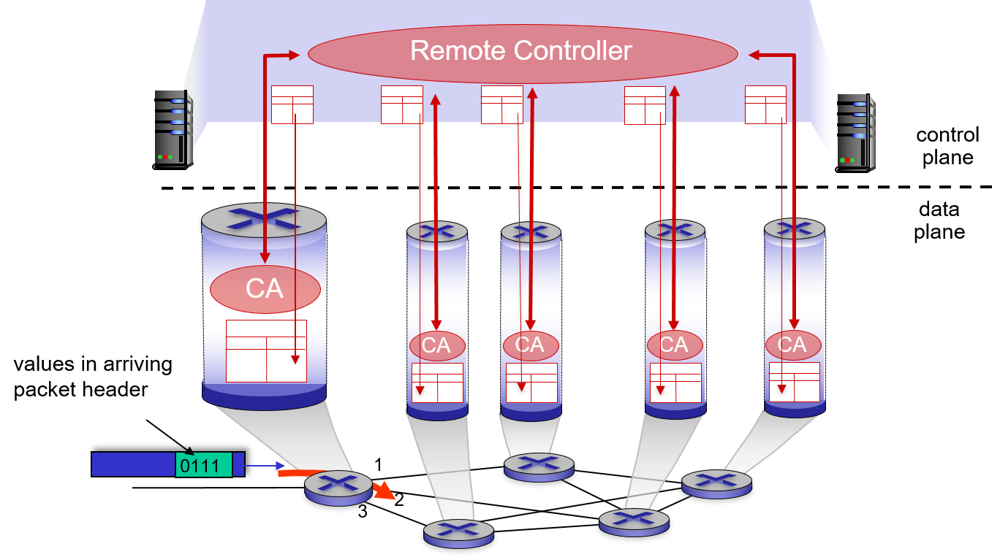

## 路由算法

路由算法决定数据报从主机发送到目的主机的路径，路由算法探查出的路径应当尽可能好，如路径短时延小、拥塞少等。路径的好坏程度由路径的*成本*表示，比如可以将时延表示为成本，成本低代表时延小。实际上，链路成本并不反映真实的成本，不是路由算法根据链路成本路由，而是网路管理员设置链路状态，诱导路由算法计算出期待的路由路径。

根据不同的指标将路由算法划分为以下三类：

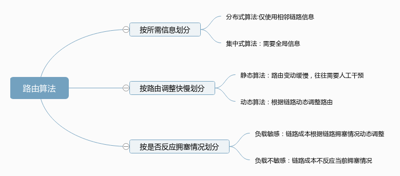

这里介绍集中式的*链路状态路由算法（Link State Algorithm）*和分布式的*距离矢量路由算法（Vector Distance Algorithm）*。

### 链路状态算法（Link State Algorithm）

*链路状态*说明 LS 算法需要链路的状态信息，这里的状态信息指链路的成本。LS 算法根据网络中各链路状态，使用 Dijstra 算法计算主机间成本最小的路径。LS 算法是集中式的，需要知道整个网络拓扑中的链路信息，传统网络中通过路由器*链路状态广播*实现，软件定义网络中通过逻辑集中式的控制器管理状态。

LS 算法从源节点出发，计算到其他所有主机的最低成本路径，最终得到该节点的路由表。通过 K 轮迭代，得到到 K 个目的节点的路径，这种遍历方式有些类似于图的广度优先遍历。


> What is the shortest way to travel from [Rotterdam](https://en.wikipedia.org/wiki/Rotterdam) to [Groningen](https://en.wikipedia.org/wiki/Groningen), in general: from given city to given city. [It is the algorithm for the shortest path](https://en.wikipedia.org/wiki/Shortest_path_problem), which I designed in about twenty minutes. One morning I was shopping in [Amsterdam](https://en.wikipedia.org/wiki/Amsterdam) with my young fiancée, and tired, we sat down on the café terrace to  drink a cup of coffee and I was just thinking about whether I could do  this, and I then designed the algorithm for the shortest path. As I  said, it was a twenty-minute invention. In fact, it was published in  '59, three years later. The publication is still readable, it is, in  fact, quite nice. One of the reasons that it is so nice was that I  designed it without pencil and paper. I learned later that one of the  advantages of designing without pencil and paper is that you are almost  forced to avoid all avoidable complexities. Eventually, that algorithm  became to my great amazement, one of the cornerstones of my fame.
>
> — Edsger Dijkstra, in an interview with Philip L. Frana, Communications of the ACM, 2001

将路由域视作路由器的集合 $N$，再划分为查找到最低成本路径的节点集(已访问节点集) $N'$和未查找到最低成本路径的节点集（未访问节点集） $N-N'$，不断扩大 $N'$ ，直到 $N'=N$ 时找到所有节点的最低成本路径。$D(v)$ 表示源节点到目的节点 $v$ 的最低成本路径，$C(x,y)$ 表示直接相连的节点 $x$ 到 $y$ 的链路成本，$p(v)$ 表示路径中 $v$ 的前继节点。

算法分为初始化和迭代两个阶段，初始化段将源节点 $u$ 加入到 $N'$ 中，并设置到其他节点 $v$ 的 $D(v)$，不相邻的 $D(v)$ 设置为 $\infty$。伪代码如下：

```
1  Initialization:
     /* compute least cost path from u to all other nodes */
2    N' = {u}
3    for all nodes v
       /* u initially knows direct-path-cost only to  direct neighbors */
4      if v adjacent to u
5          then D(v) = C(u,v) /* but may not be minimum cost! */
6      else D(v) = ∞
```

迭代阶段从 $N'$ 出发查找不在 $N'$ 中但可以确定最短路径的节点 $w$（即  $N'$ 的相邻节点），并将它加入到 $N'$ 中，然后更新所有和 $N'$ 节点相邻节点 $v$ 的 $D(v)$，重复以上过程直到 $N=N'$。伪代码如下：

```
Loop
    find w not in N' such that D(w) is a minimum
    add w to N'
    update D(v) for all v adjacent to w and not in N' :
     D(v) = min ( D(v),  D(w) + C(w,v)  )
    /* new least-path-cost to v is either old least-cost-path
       to v or known least-cost-path to w plus direct-cost from w to v */
until N' = N
```

Dijkstra 算法的一个例子如下：

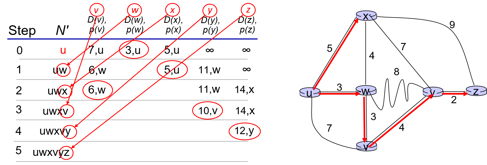

另一个例子——基于欧几里得距离的 Dijkstra 算法：


Dijkstra 算法存在*路由震荡*的问题，当链路成本依赖于链路流量会出现路由路径反复震荡的现象。考虑以下情形，路由器 b、c、d 向 a 路由数据报，路由器流量分别为 1、e(e<1) 和 1，链路成本有方向并和路由器流量有关。


路由器会立刻迅速发现存在成本更低的路径，然后通过该路径路由，流量涌入该路径后，路径成本增加，原路径成本降低，转而从原路径路由，在两个路由路径间不断震荡。

对于有 $N$ 个节点的网络，Dijkstra 算法需要迭代 $N$ 轮，每次要迭代不在 $N'$ 中的节点，所以算法复杂度为 $O(n^2)$，更高效的实现（使用堆，参考维基百科）算法复杂度可以优化为 $O(nlogn)$。每个路由器都要向其他 $N - 1$ 个路由器广播链路状态，一种高效的消息传播算法可以以 $O(n)$ 的复杂度向目的节点传播消息，所以消息传播的复杂度为 $O(N*N)=O(N^2)$。

### 距离矢量算法（Distance Vector Algorithm）

距离矢量算法基于 *Bellman-Fold* 方程：

$$
D_x(y)=min_v\{C(x,v)+D_v(y)\}
$$

LS 路由算法中，节点掌握整个网络的链路信息，独立进行计算。DV 路由算法通过 Bellman-Fold 方程将到目的节点最低成本路径的计算委托给了相邻节点，相邻节点再委托给它的相邻节点，依次扩散下去。这样，路由器只需要存储其相邻节点的距离矢量（到其他节点的最小路径成本）即可。

算法（每个节点）如下：

1. 链路状态发生变化时或定时向相邻节点发送本节点距离矢量；
2. 接收到相邻节点距离矢量后重新计算本节点距离矢量；
3. 如果本节点距离矢量发生改变，发送给相邻节点。

DV 路由算法有以下特征：

- 迭代：节点距离矢量的变化通过多次迭代传播影响其他节点。

- 异步：节点间再不同时刻分享距离矢量

- 分布式：节点仅需要相邻节点的距离矢量

- 自停止：不需要停止状态判断，距离矢量不变就相当于算法结束。

有以下网络拓扑，节点距离矢量的影响每单位向外扩散一跳。节点 c 的距离矢量在 t = 0 时刻改变，t = 1 时刻传播到 b；b 重新计算距离矢量，向相邻节点传播，t = 1 时刻传播到 e；e 重新计算距离矢量，向相邻节点传播，t = 3 时刻传播到 h，h 再重新计算距离矢量并向相邻节点传播……节点距离矢量改变迭代式地传播到其他节点，就好像一颗石子扔进水里，水波向外传播一样。

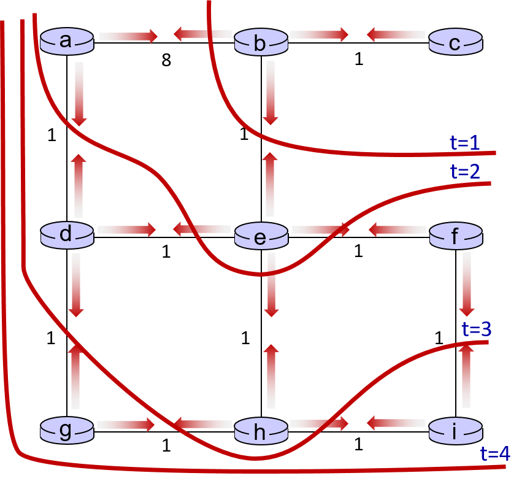

假设某时刻网络中距离矢量如下，a、c、e 向 b 传播距离矢量，


b 重新计算距离矢量，并向相邻节点扩散，重复此过程。


各节点异步地扩散自己地距离矢量，一旦链路状态发生变化但距离矢量扩散不及时，路由器就会使用旧路由矢量进行路由，导致*路由回环（routing loop）*。

有三个路由器，Z 通过 Y 路由数据报到 X，成本为 5。XY 链路成本从 4 增大到 60，Z 无法获知 XY 链路成本的变化，仍使用 Z-Y-X 的路径，Y 侦测到 XY 链路成本的变化，重新计算距离矢量，发现 $D_Z(X)$ 只有 5，选择将包转发给 Z。Z 接收到数据报后再传给 Y，Y 重新计算得到 $D_Y(X)=D_Y(X)+D_Z(X)=1+5=6$，将数据报传给 Z。Z 接收到数据报后再传给 Y，Y 重新计算得到 $D_Y(X)=D_Y(X)+D_Z(X0)=1+6=7$……

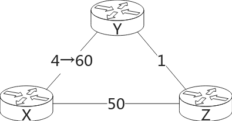

如果 $C(X,Y)$ 增加到无穷大，数据报就会一直在 Y、Z 间回环！路由回环体现了分布式算法的复杂性，这种情况再网络中很常见并且没有完美的办法解决。

### LS 和 DV 的比较

链路状态路由协议和距离矢量路由协议是两类主要的路由协议，主要特征的对比如下。

|         | LS                     | DV                        |
|:-------:|:----------------------:|:-------------------------:|
| 消息传递复杂度 | 所有节点间，复杂度为 $O(N^2)$。   | 邻居节点间交换，所需时间不确定。          |
| 收敛速度    | 复杂度为$O(N^2)$，可能存在路由震荡。 | 时间不确定，可能存在路由回环。           |
| 鲁棒性     | 每个路由器独立计算路由表，错误不容易传播。  | 每个路由器都依赖其他路由器的路由表，错误容易传播。 |

## 自治系统内通信

今天的互联网中至少有上千万路由器，链路信息通信、计算、存储的成本会大得无法接受。如此大的规模，LS 路由算法甚至都无法完成链路状态传播，DV 路由算法根本无法收敛。另外，路由器的网络往往由 ISP 管理，ISP 希望自主地管理路由器网络，并向外隐藏内部的组织方式。为了适应这种情况，将大的路由器网络划分为一个个小的路由器网络，小的路由器网络通常被同一组织管理，运行相同的路由算法，在小的路由器网络中再划分子网，这种小的路由器网络就叫做*自治系统（Autonomous System）*，也叫自治域，简称 *AS*。类似于域名，每个自治域都在管理机构注册并有唯一的编号（ASN）。

按照路由协议运行的位置，可以划分为自治系统内路由协议（如 OSPF）和自治系统间路由协议（BGP）。路由时同时使用域内协议和域间协议，域内路由协议负责在自治域内路由数据报，决定域内路由表条目；域间路由协议负责在自治域间路由数据报，决定域间路由表条目。


### OSPF：一种链路状态路由协议

*OSPF (Open Shortest Path First)* 协议是典型的 LS 路由协议，使用 Dijkstra 算法，以当前节点为树根计算最低成本路径树。它运行在 IP 协议上，引入了“区域”概念，将 AS 划分为一个骨干区域和多个非骨干区域，所有非骨干区域都和骨干区域相连。链路信息仅在区域中广播，这种设计降低了泛洪的成本。区域的设计允许 ISP 将一个 AS 划分为多层结构，提高网络管理灵活性。

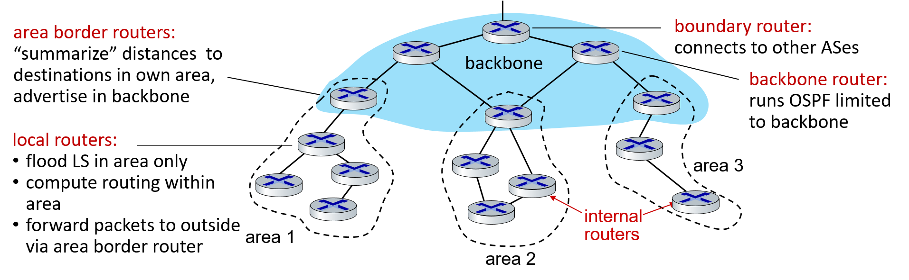

OSPF 协议的消息都通过简单加密算法或 MD5 进行了加密，未成功验证的路由器无法参与到链路信息交换中，提高了网络的安全性。此外，OSPF 还支持多路径路由，当有多条成本相同的路径时，OSPF 可以使用多条路径，避免流量涌入一条路径阻塞网络。

## 自治系统间通信: BGP

路由器利用 IP 地址在路由表中进行最长后缀匹配以确定转发端口，对于域间通信，路由器要将数据报转发到子网或子网的集合。这时，路由器就不能再使用 IP 地址进行定位主机，而要使用网络前缀定位网络，比如根据网络 202.202.22.0/22 决定数据报要转发到哪个端口。

为了实现域间通信，所有自治系统间都运行相同的域间路由协议——*BGP(Border Gateway Protocal)*。将路由器划分为两类，AS 边缘可以与其他 AS 通信的路由器通常称作*网关（gateway）*，仅在域内通信的路由器叫做*内部路由器*。BGP 必须让路由器获得相邻 AS 的可访问性信息和转发到目的自治域的最佳路径。

为了获取可访问信息，就必须在不同自治域间建立通信；为了让路由器获取转发到目的自治域的最佳路径，就必须在自治域内建立通信。显然，域间可访问性信息通过相邻子自治域网关间通信获得，最佳路径通过网关和内部路由器建立通信计算得到。所以，BGP 连接分为内部连接（iBPG）和外部连接（eBPG）。


BGP 协议使用 TCP 连接，所以 iBGP 连接是逻辑连接，而不是物理上直接相连。

受政治经济因素影响，域间路由的路径选择比较复杂，比如有两个自治域 A、B，分别由不同的运营商运营，并且 A 自治域的运营商不允许 B 运营商向 A 转发数据报，自治域 B 就只能另觅他径转发。自治域内的路由器一般由单一组织管理，所以域内路由协议可以专注于性能，而域间的 BPG 必须专注于路由策略。BGP 协议使用消息实现基于策略的路由，通过不同的消息，自治域可以拒绝其他自治域的转发，可以不向特定自治域宣告自己的存在，实现灵活的域间路由路径选择。

- OPEN: 和远程 BPG 伙伴节点建立 TCP 连接并验证发送节点。

- UPDATE: 更新路径信息。

- KEEPALIVE: 接收到 OPEN 消息后返回 KEEPLIVE，也可以用于维持活跃连接。

- NOTIFICATION: 关闭连接或报告错误。

BGP 最终重要的属性是以下两种：

- AS-PATH： ASN 列表，表示到某子网所在自治域的路径。
- NEXT-HOP：下一跳自治域（AS-PATH 起始自治域）的网关 IP 地址。

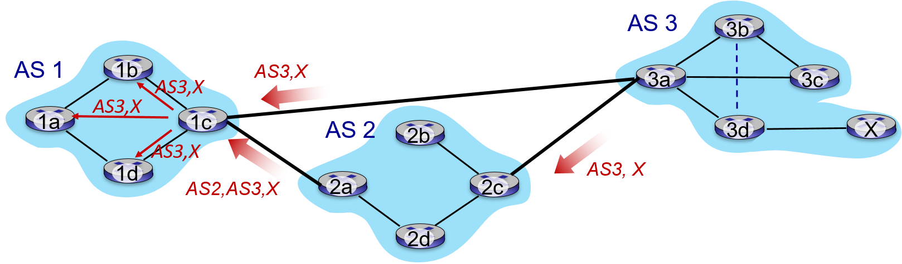

AS1 获得 AS3 自治域中子网 X 的域间路由路径过程如下 ：

- AS3 向相邻自治域 AS2 网关 2c 发送 AS-PATH，内容为 AS3 自治域编号和子网 X。
- AS2 网关 2c 接收到 AS3 的 AS-PATH 后，通过 iBGP 传播给 AS 内所有路由器。
- AS2 网关 2a 往 AS-PATH 中添加 AS2 自治域编号，发送给 AS1 网关 1c
- AS1 网关 1c 接收到 AS-PATH 后，发送到 AS 内其他路由器。

对于 AS3 发送的 AS-PATH，NEXT-HOP 是 3a 的 IP 地址；对于 AS2 发送的 AS-PATH，NEXT-HOP 是 2a 的 IP 地址。自治域 AS1 内部路由器 1a 向 AS3 子网 X 转发数据报时，先通过域内路由协议将数据报转发给网关 1c，1c 再选择选择 AS3 或 AS2 转发给 AS3。再这种情况下，虽然从 AS1 到 AS3 由两条路径，但两条路径都是转发给网关 1c，对于 1a 实际上只有一种选择。

假如内部路由器向外转发数据报有多个网关可以选择，那么内部路由器使用基于*热土豆（hot potato）*策略的算法选择网关。热土豆策略将数据报比喻成热土豆，路由器要尽快将热土豆传给其他路由器以避免烫手，直接将数据报转发给到自己成本最小的网关，不考虑该网关传递给其他自治域的成本如何。

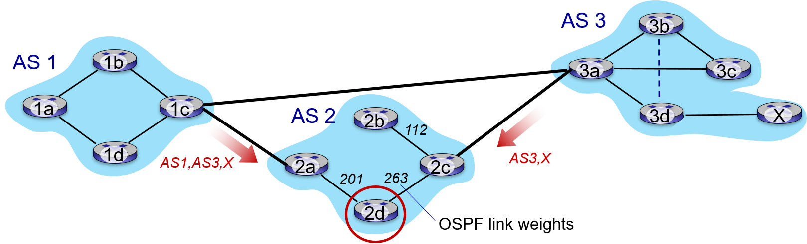

以上网络中，2d 要向 AS3 中的子网 X 转发数据报，发现有 2a 和 2c 两个网关可以转发，直接转发给网关 2a，不考虑 2a 传递给 AS3 的成本。热土豆算法中路由器极其短视，仅考虑自己到网关的成本，导致路由路径很可能很差。BGP 使用更加精致的路由算法确定最佳路径：

- 网关有 local-preference 属性，优先选择属性高的网关。
- 对于优先级相同的网关，选择 AS 跳数最少的网关。
- 网关 AS 跳数都相同，使用热土豆策略。
- 如果有多个网关成本相同，就使用别的标准进行选择，比如使用 BGP ID。

## IP 任播

BGP 协议允许从有多条到目的 IP 地址的路径，也就是说同一个 IP 地址可以出现多次。如果给不同位置的主机相同的 IP 地址，路由器就会接收到多条到此 IP 地址的路径，路由器没法发现这是多个具有相同 IP 的主机，以为这是到同一主机的不同路径。这样就实现了多个主机一个地址。这种网络地址和网络节点之间存在一对多的关系就叫做*任播*（*any cast*），一个地址对应一群接收节点，但在任何给定时间，只有其中之一可以接收到发送端来的信息。

BGP 路由器可能会选择不同的路径，IP 任播中 TCP 连接中的包可能会被转发到其他服务器实例（具有相同 IP 地址但 BGP 路径不同的主机），所以 IP 任播的应用场景优先。一个使用 IP 任播的实例是 DNS 服务器，全球有 13 个根服务器 IP 地址，但却有数百个根服务器主机分布在全球不同区域。

关于 IP 任播的资料比较匮乏，维基百科有简短的[介绍](https://en.wikipedia.org/wiki/Anycast)。

## ICMP

*ICMP(internet control message protocol)* 用于通常用于返回的错误信息或是分析路由，比如路由器接收到目的地址无法访问的数据包时返回 ICMP 消息。

ICMP 虽然是网络层协议的一部分，但它使用 IP 协议发送控制消息（视作 ICMP 报文而不是一般的 IP 报文）。所以从这个角度看，可以将 ICMP 视作网络层和传输层中间的协议。

```
 +-+-+-+-+-+-+-+-+-+-+-+-+-+-+-+-+-+-+-+-+-+-+-+-+-+-+-+-+-+-+-+-+-+-+-+-+-+-+-+
 |Bits |         160-167       |        168-175        |        176-191        |
 +-+-+-+-+-+-+-+-+-+-+-+-+-+-+-+-+-+-+-+-+-+-+-+-+-+-+-+-+-+-+-+-+-+-+-+-+-+-+-+
 | 160 |      Source Port      |   Destination Port    |       Checksum        |
 +-+-+-+-+-+-+-+-+-+-+-+-+-+-+-+-+-+-+-+-+-+-+-+-+-+-+-+-+-+-+-+-+-+-+-+-+-+-+-+
 | 192 |                            Rest of Header                             |
 +-+-+-+-+-+-+-+-+-+-+-+-+-+-+-+-+-+-+-+-+-+-+-+-+-+-+-+-+-+-+-+-+-+-+-+-+-+-+-+
```

- **Type**： ICMP的类型,标识生成的错误报文；
- **Code**： 进一步划分ICMP的类型,该字段用来查找产生错误的原因.；例如，ICMP的目标不可达类型可以把这个位设为1至15等来表示不同的意思。
- **Checksum**： Internet校验和（[RFC 1071](https://tools.ietf.org/html/rfc1071)），用于进行错误检查，该校验和是从ICMP头和以该字段替换为0的数据计算得出的。
- **Rest of Header**： 报头的其余部分，四字节字段，内容根据ICMP类型和代码而有所不同。比如超时报文这部分是超时时路由器 IP 地址，而源站抑制报文（已废弃）使用此字段。

ICMP 类型如下（来自[维基百科](https://zh.wikipedia.org/wiki/%E4%BA%92%E8%81%94%E7%BD%91%E6%8E%A7%E5%88%B6%E6%B6%88%E6%81%AF%E5%8D%8F%E8%AE%AE)）：

| 类型                                                   | 代码  | 状态                                                         | 描述                                                                                                                                                                                             | 查询  | 差错  |
| ---------------------------------------------------- | --- | ---------------------------------------------------------- | ---------------------------------------------------------------------------------------------------------------------------------------------------------------------------------------------- | --- | --- |
| 0 - [Echo Reply](https://zh.wikipedia.org/wiki/Ping) | 0   |                                                            | echo响应 (被程序[ping](https://zh.wikipedia.org/wiki/Ping)使用）                                                                                                                                       | ●   |     |
| 1 and 2                                              |     | 未分配                                                        | 保留                                                                                                                                                                                             |     | ●   |
| 3 - 目的不可达                                            | 0   |                                                            | 目标网络不可达                                                                                                                                                                                        |     | ●   |
| 1                                                    |     | 目标主机不可达                                                    |                                                                                                                                                                                                | ●   |     |
| 2                                                    |     | 目标协议不可达                                                    |                                                                                                                                                                                                | ●   |     |
| 3                                                    |     | 目标端口不可达                                                    |                                                                                                                                                                                                | ●   |     |
| 4                                                    |     | 要求分段并设置[DF flag](https://zh.wikipedia.org/wiki/IPv4报文结构)标志 |                                                                                                                                                                                                | ●   |     |
| 5                                                    |     | 源路由失败                                                      |                                                                                                                                                                                                | ●   |     |
| 6                                                    |     | 未知的目标网络                                                    |                                                                                                                                                                                                | ●   |     |
| 7                                                    |     | 未知的目标主机                                                    |                                                                                                                                                                                                | ●   |     |
| 8                                                    |     | 源主机隔离（作废不用）                                                |                                                                                                                                                                                                | ●   |     |
| 9                                                    |     | 禁止访问的网络                                                    |                                                                                                                                                                                                | ●   |     |
| 10                                                   |     | 禁止访问的主机                                                    |                                                                                                                                                                                                | ●   |     |
| 11                                                   |     | 对特定的TOS 网络不可达                                              |                                                                                                                                                                                                | ●   |     |
| 12                                                   |     | 对特定的TOS 主机不可达                                              |                                                                                                                                                                                                | ●   |     |
| 13                                                   |     | 由于过滤 网络流量被禁止                                               |                                                                                                                                                                                                | ●   |     |
| 14                                                   |     | 主机越权                                                       |                                                                                                                                                                                                | ●   |     |
| 15                                                   |     | 优先权终止生效                                                    |                                                                                                                                                                                                | ●   |     |
| 4 - 源端关闭                                             | 0   | 弃用                                                         | 源端关闭（拥塞控制）                                                                                                                                                                                     |     | ●   |
| 5 - 重定向                                              | 0   |                                                            | 重定向网络                                                                                                                                                                                          |     | ●   |
| 1                                                    |     | 重定向主机                                                      |                                                                                                                                                                                                | ●   |     |
| 2                                                    |     | 基于TOS 的网络重定向                                               |                                                                                                                                                                                                | ●   |     |
| 3                                                    |     | 基于TOS 的主机重定向                                               |                                                                                                                                                                                                | ●   |     |
| 6                                                    |     | 弃用                                                         | 备用主机地址                                                                                                                                                                                         |     |     |
| 7                                                    |     | 未分配                                                        | 保留                                                                                                                                                                                             |     |     |
| 8 - [请求回显](https://zh.wikipedia.org/wiki/Ping)       | 0   |                                                            | Echo请求                                                                                                                                                                                         | ●   |     |
| 9 - 路由器通告                                            | 0   |                                                            | 路由通告                                                                                                                                                                                           | ●   |     |
| 10 - 路由器请求                                           | 0   |                                                            | 路由器的发现/选择/请求                                                                                                                                                                                   | ●   |     |
| 11 - ICMP 超时                                         | 0   |                                                            | TTL 超时                                                                                                                                                                                         |     | ●   |
| 1                                                    |     | 分片重组超时                                                     |                                                                                                                                                                                                | ●   |     |
| 12 - 参数问题：错误IP头部                                     | 0   |                                                            | IP 报首部参数错误                                                                                                                                                                                     |     | ●   |
| 1                                                    |     | 丢失必要选项                                                     |                                                                                                                                                                                                | ●   |     |
| 2                                                    |     | 不支持的长度                                                     |                                                                                                                                                                                                |     |     |
| 13 - 时间戳请求                                           | 0   |                                                            | 时间戳请求                                                                                                                                                                                          | ●   |     |
| 14 - 时间戳应答                                           | 0   |                                                            | 时间戳应答                                                                                                                                                                                          | ●   |     |
| 15 - 信息请求                                            | 0   | 弃用                                                         | 信息请求                                                                                                                                                                                           | ●   |     |
| 16 - 信息应答                                            | 0   | 弃用                                                         | 信息应答                                                                                                                                                                                           | ●   |     |
| 17 - 地址掩码请求                                          | 0   | 弃用                                                         | 地址掩码请求                                                                                                                                                                                         | ●   |     |
| 18 - 地址掩码应答                                          | 0   | 弃用                                                         | 地址掩码应答                                                                                                                                                                                         | ●   |     |
| 19                                                   |     | 保留                                                         | 因安全原因保留                                                                                                                                                                                        |     |     |
| 20 至 29                                              |     | 保留                                                         | *Reserved* for robustness experiment                                                                                                                                                           |     |     |
| 30 - Traceroute                                      | 0   | 弃用                                                         | 信息请求                                                                                                                                                                                           |     |     |
| 31                                                   |     | 弃用                                                         | 数据报转换出错                                                                                                                                                                                        |     |     |
| 32                                                   |     | 弃用                                                         | 手机网络重定向                                                                                                                                                                                        |     |     |
| 33                                                   |     | 弃用                                                         | [Where-Are-You](https://zh.wikipedia.org/w/index.php?title=Where-Are-You&action=edit&redlink=1)（originally meant for [IPv6](https://zh.wikipedia.org/wiki/IPv6)）                               |     |     |
| 34                                                   |     | 弃用                                                         | [Here-I-Am](https://zh.wikipedia.org/w/index.php?title=Where-Are-You&action=edit&redlink=1)（originally meant for IPv6）                                                                         |     |     |
| 35                                                   |     | 弃用                                                         | Mobile Registration Request                                                                                                                                                                    |     |     |
| 36                                                   |     | 弃用                                                         | Mobile Registration Reply                                                                                                                                                                      |     |     |
| 37                                                   |     | 弃用                                                         | Domain Name Request                                                                                                                                                                            |     |     |
| 38                                                   |     | 弃用                                                         | Domain Name Reply                                                                                                                                                                              |     |     |
| 39                                                   |     | 弃用                                                         | SKIP Algorithm Discovery Protocol, [Simple Key-Management for Internet Protocol](https://zh.wikipedia.org/w/index.php?title=Simple_Key-Management_for_Internet_Protocol&action=edit&redlink=1) |     |     |
| 40                                                   |     |                                                            | [Photuris](https://zh.wikipedia.org/w/index.php?title=Photuris_(protocol)&action=edit&redlink=1), Security failures                                                                            |     |     |
| 41                                                   |     | 实验性的                                                       | ICMP for experimental mobility protocols such as [Seamoby](https://zh.wikipedia.org/w/index.php?title=Seamoby&action=edit&redlink=1) [RFC4065]                                                 |     |     |
| 42 到 255                                             |     | 保留                                                         | 保留                                                                                                                                                                                             |     |     |
| 235                                                  |     | 实验性的                                                       | RFC3692（ [RFC 4727](https://tools.ietf.org/html/rfc4727)）                                                                                                                                      |     |     |
| 254                                                  |     | 实验性的                                                       | RFC3692（ [RFC 4727](https://tools.ietf.org/html/rfc4727)）                                                                                                                                      |     |     |
| 255                                                  |     | 保留                                                         | 保留                                                                                                                                                                                             |     |     |

这里介绍两个类 ICMP 报文：源站抑制报文、ECHO request/reply 报文。

*源站抑制报文*旨在请求发送方降低发往路由器或主机的报文发送速率。如果一个或一群主机高速地向路由器发送数据，路由器接收速率可能会远远大于转发速率，这会导致路由器缓冲区耗尽。因为 IP 协议没有 NAK 机制，发送方不清楚路由器是否能够正常接收数据，所以引入源站抑制报文充当  NAK。当路由器接受速率远远大于发送速率（缓冲区最终会耗尽）时，路由器向发送方返回源站抑制 ICMP 报文，发送方接收后降低发送速率或等待一段时间，给路由器时间清空缓冲区。有研究表明源站抑制时无效的措施，这个机制已经弃用。报文格式如下：

```
 +-+-+-+-+-+-+-+-+-+-+-+-+-+-+-+-+-+-+-+-+-+-+-+-+-+-+-+-+-+-+-+-+-+-+-+-+
 |        Type = 5       |        Code = 0       |       Checksum        |
 +-+-+-+-+-+-+-+-+-+-+-+-+-+-+-+-+-+-+-+-+-+-+-+-+-+-+-+-+-+-+-+-+-+-+-+-+
 |                                 Unused                                |
 +-+-+-+-+-+-+-+-+-+-+-+-+-+-+-+-+-+-+-+-+-+-+-+-+-+-+-+-+-+-+-+-+-+-+-+-+
 |             IP datagram header and first 8 bytes of payload           |
 +-+-+-+-+-+-+-+-+-+-+-+-+-+-+-+-+-+-+-+-+-+-+-+-+-+-+-+-+-+-+-+-+-+-+-+-+
```

ECHO request/reply 是一类非常常见的 ICMP 报文，ping 通过它判断主机是否可访问。ping 向目的主机发送 ECHO request 报文，目的主机接收后返回 ECHO reply 报文，源主机接收后确认目的主机可访问。

IPv4 中的 ICMP 称为 ICMPv4，即上面介绍的版本。IPv6 也有 ICMP，称为 ICMPv6，包含 ICMPv4 原有的功能，还承担了 IPv4 某些协议所实现的功能或I Pv6 所需的新功能。比如 IPv6 不允许报文分片，数据报过大返回 ICMP（Type 为 2）报文。

## 软件定义网络

传统网络中，每个路由器都有自己的控制面板，分布式地计算路由表，这种分布式算法难以提供对路由路径灵活的控制。


比如以下网络中，网络管理员系统主机到服务器的包有红蓝两条路径，一条从 W 路由器转发给 Z，另一条路径从 W 绕一圈再转发给 Z。传统的基于目的 IP 地址的转发策略不能够实现这种功能。

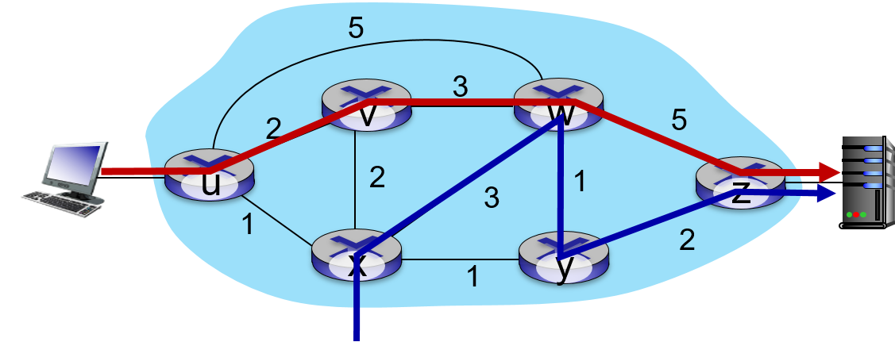

*软件定义网络*（*Software Defined Network*，简称 SDN）中远程控制器通过服务器集群实现逻辑上集中式的控制面板，使用*匹配-动作（match add plus）*广义路由转发策略，根据数据包的多个头部（如 IP 头，TCP 头，MAC 地址）进行转发，实现对网络的编程。网络管理员可以通过远程控制器给 W 路由器安装广义转发路由表，让 W 根据不同的源 IP 地址按不同的路径转发。


传统网络架构中，路由器是一体式的，往往在专有操作系统上运行专有的协议实现，还为多种不同的网络功能运行不同的中间件（如 NAT 等)。并且，不同的厂商的路由器提供的接口、命令还都不一样，给网络配置带来很大挑战。SDN 打破了封闭的架构，分离控制面板和数据面板，数据面板位于路由器，网络面板位于逻辑集中式的控制器，在网络控制器提供接口上开发网络控制应用，替代传统的庞杂的网络功能实现。

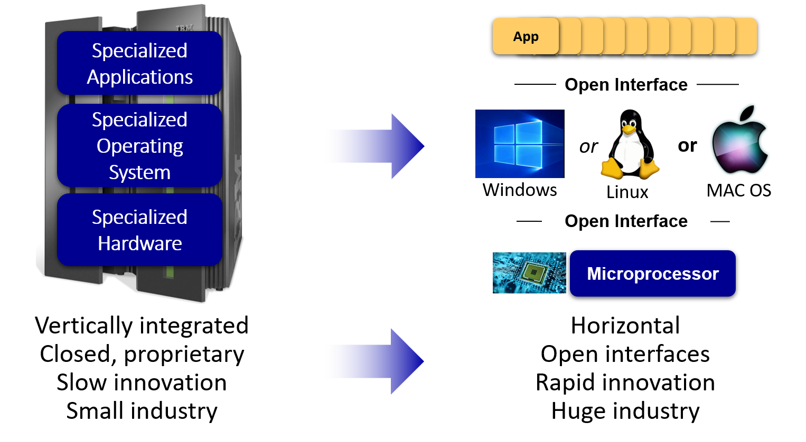

SDN 使用分层架构，从底层到高层依次为：

- 网络设备：通常实现了 OpenFlow 协议，使用基于流量（*Flow-Based*）的转发策略，为逻辑集中式的控制器提供设备、链路信息，并受其控制，是 SDN 的最基础设施。

- 通信层：负责 SDN 控制器和被控制的网络设备间通信，网络设备要向控制器发送链路状态等信息，控制器可能向网络设备发送删除路由条目等命令。

- 状态管理层：从通信层记录网络状态信息（如主机路由表，链路状态），并提供给上层网络控制应用。

- 网络控制应用：基于状态管理层的状态信息实现网路功能，如负载均衡、路由等。

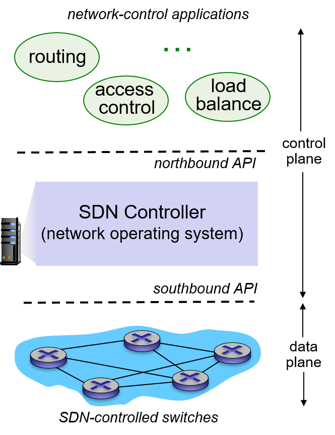

物理网络设备和远程控制器间的接口称为*南桥接口*，通常通过 OpenFlow 等协议通信，远程控制器和完了过控制应用间的接口成为*北桥接口*。物理网络设备是 SDN 的最基础设施，为控制器提供状态信息；控制器是实现 SDN 的基石，承上启下，维护网络设备上传的网络状态，并给网络控制应用提供 API；网络控制应用是网络的大脑，负责实现具体的网络功能。


网络设备和控制器通常都实现了 OpenFlow 协议（基于 TCP），通过消息交换数据、下达命令。从两个上行、下行两个方向考察 OpenFlow 消息。

从网络设备到控制器：

- Flow-Removed：删除流表条目时发送，如条目超时。
- Port-status：报告端口状态。
- Packet-in：发送未在流表中匹配到条目的包给控制器。这种包都是非正常的，交给控制器进行分析。

从控制器到网络设备：

- Feature：查询网络设备支持的特性。
- Configuration：查询网络设备的配置参数。
- Modify-State：修改状态，如增删流表（*flow table*）条目、设置端口属性。
- Send-Paket：向网络设备特定端口发送数据包。

以下实例展示 SDN 运行的过程。网络中 S1 和 S2 之间的链路出现错误，SDN 应对步骤如下：

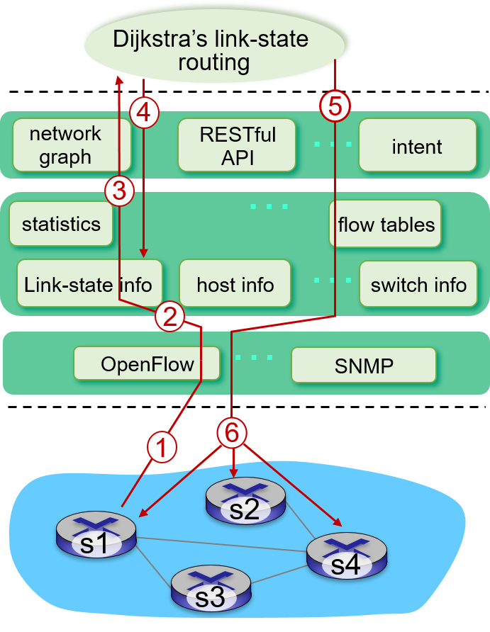

1. S1 侦测到链路错误使用 OpenFlow 协议向控制器报告事件。
2. SDN 控制器接收到消息后更新链路状态。
3. 控制器执行 Dijkstra 路由控制应用。
4. 路由控制应用访问控制器中维护的链路状态信息。
5. 路由控制应用和控制器中的流表计算模块交互，计算得到新的流表。
6. 控制器使用 OpenFlow 协议将新的流表安装到路由器中。

SDN 让网络可编程，给传统网络带来了一场革命。比如对于传统的网络拥塞算法，只能够利用丢包率、延迟来判断拥塞情况，无法对路由器进行细粒度的控制，现在利用 SDN 直接根据路由器拥塞程度控制发送方发送速率成为可能。SDN 已经在数据中心广泛应用，未来还可能在 5G 中发挥重要作用，SDN 的发展将深刻影响网络架构和功能。
