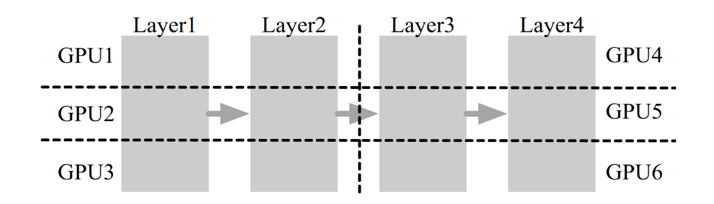
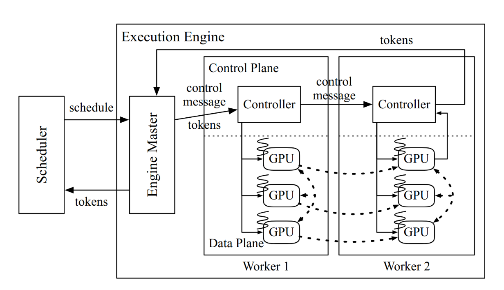
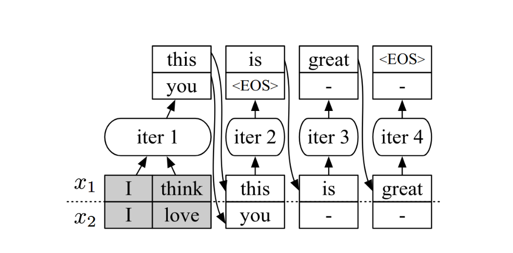
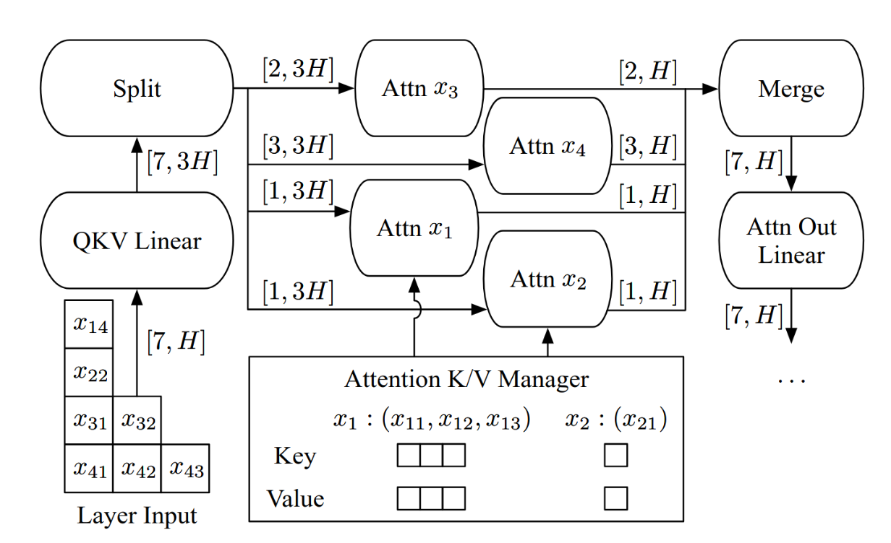
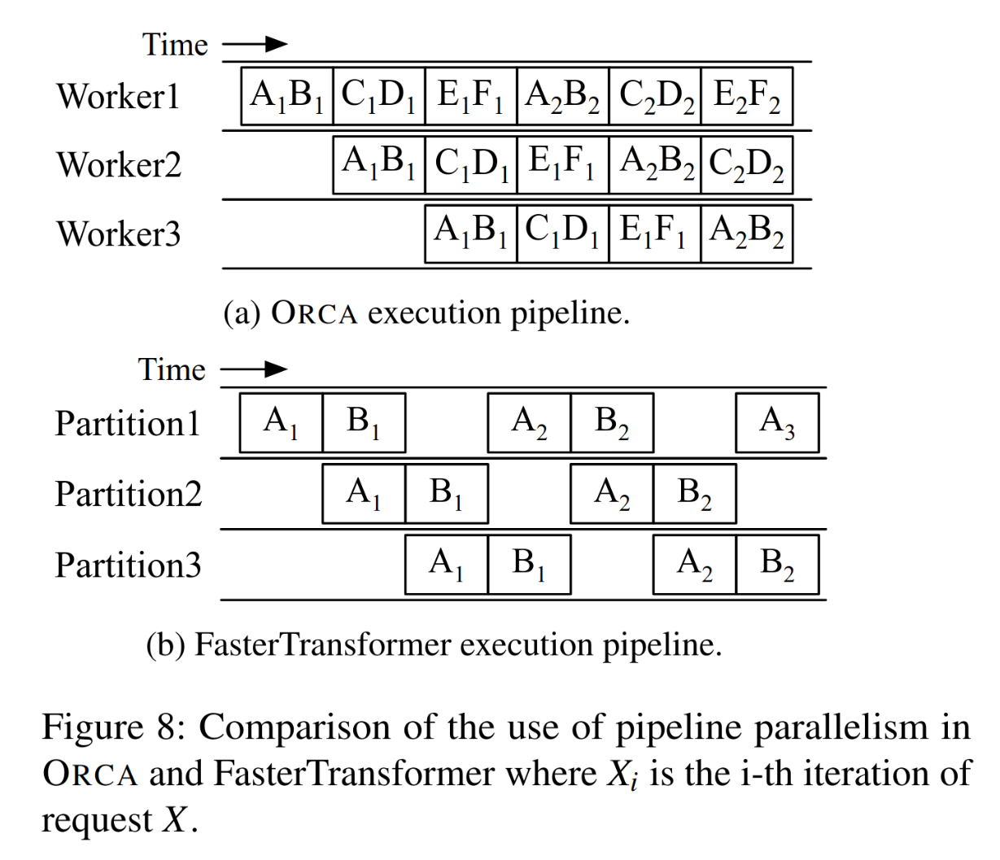

## Core Ideas
1. More fine-grained scheduling: shifting from **coarse-grained request-level scheduling** to **fine-grained iteration-level scheduling**.
2. Selective batching: maximize batching of "batchable" matrix operations, leaving "nonbatchable" attention operations alone.
3. Control message transfer optimizations
	1. Separated control message channel and data message channel.
	2. Control message pre-sending which is an equivalent of preloading.

## Intra-Layer and Inter-Layer Parallelism
Orca leverages both intra-layer parallelism, as known as *tensor parallelism* and inter-layer parallelism, commonly known as pipeline parallelism. In this architecture, layers are partitioned into different pipeline stage, and each layer in a specific stage is further split into multiple GPUs. This parallelism scheme is depicted as follows.

## Architecture
Orca's distributed architecture is wide adopted in modern LLM serving systems including *vLLM*. There are two valuable insights:
1. Control plane should be separated from data plane, where each uses i'ts own data communication channel.
2. Control massage pre-sending can hide IO delay, which is an equivalent of pre-loading technique. In particular, worker 1 sends control messages to worker 2 during the work 1's execution period.

## Methods

### Iteration-Level Scheduling
Existing LLM serving systems use a **request-level scheduling scheme** which cannot tackle early-finished-and-joining-late requests efficiently, causing low pipeline efficiency and batching capacity. For instance, prior systems batch requests with different sequence length and schedule a new batch after all requests in the batch finished. Requests in a certain batch have different sequence length and thereby have different completion time, but can only return at the point all requests in the batch finished. This request-level scheduling scheme causes two main restrictions:
1. Early-finished requests cannot returns at its completion time, jeopardizing latency.
2. Late-joining request cannot be scheduled because the batch is not finished, harming throughput.

In this figure, request x2 has finished its execution at iteration 2, but cannot return until iteration 4. Orca discards the simple request-level scheduling and embraces iteration-level scheduling. The method is quite simple,. Orca executes requests iteration by iteration, returns finished requests and schedules new arrived requests. By doing so, Early-finished requests can return immediately and late-joining requests can be scheduled after waiting one round of iteration.

### Selective Batching
Transformer intermediate matrix's shape is $[S， H]$，where $S$ denotes sequence length and $H$ represents hidden state dimension. Thus, batching matrix's shape is $[B, S, H]$, where $B$ denotes batch size. batching requires batched matrices have the same shape, which can not be satisfied
in most scenarios, where requests have different sequence length. 

Selective batching tries it's best to batch "batchable" operations (non-attention operations) and leaves "non-batchable" operations (attention operations) alone. This method is an counterpart of *tensor parallelism*. 

In short, any non-attention operations like layer normalization do not require context information, which can be "concatenate" to a bit matrix and "split" after calculation to get correct outcomes. For instance, a linear operation matrix with shape $[S_1, H]$ can be concatenate with another with shape $[S_2, H]$ into a big matrix with shape $[S_1+S_2,H]$, and split  to original shape after batched calculation.

Attention operations with different shapes cannot be batched due to attention calculation needs context information. Hence, selective batching leaves attention operations with different shapes alone. Actually, modern LLM serving systems like *vLLM* are able to fuse attention operations with different shapes, but this is out of the scope of this paper.

To summarize, orca concatenates linear operation matrices with different shapes into a big matrix in calculation, and then splits it to original shapes to do attention operations, finally merges(concatenates) them to do MLP linear operations.

## Discussion: Iteration-Level Scheduling Reduces Pipeline Bubbles

Iteration-level scheduling dramatically reduce pipeline bubbles observed in FastTransformer. In short, FastTransformer adopts a request-level scheduling and divides a batch into smaller microbatches to mitigate the request-level scheduling restrictions. However, the tradeoff between batch size and pipeline bubbles comes in. Big batch sizes causes more pipeline bubbles while small batch size lowers the benefits of batching. 

The pipeline bubble is caused by that dependencies of requests in a specific microbatch and cannot injects another batch before the finish of the current running batch, due to the request-level scheduling. More specifically, A2 in figure (b) has to be executed after the finish of A
1, and other batches cannot be injected before the finish of batch A1B1, causing the pipelien bubble(above B1 of partion 2). In the case of orca, it injects batch C1D1 before the finish of batch A1B1, eliminating a pipeline bubble.

## Limitations
1. Native continuous memory management results in severe memory wastage, which is addressed by vLLM's paged attention.
2. Lack of cache-aware scheduling, which is deployed in most later modern LLM serving system.
