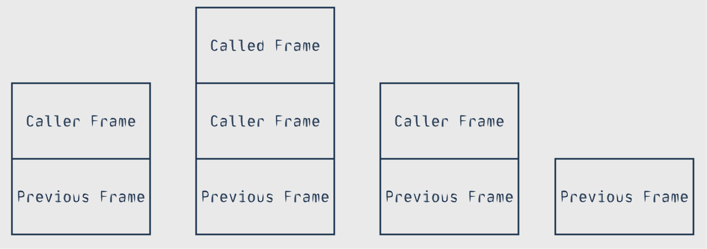

> Lua is a powerful, efficient, lightweight, embeddable scripting language. It supports procedural programming, object-oriented programming, functional programming, data-driven programming, and data description.
>
> Lua combines simple procedural syntax with powerful data description constructs based on associative arrays and extensible semantics. Lua is dynamically typed, runs by interpreting bytecode with a register-based virtual machine, and has automatic memory management with incremental garbage collection, making it ideal for configuration, scripting, and rapid prototyping.

## 类型

Lua 使用动态类型，未初始化的全局变量值默认为 *nil*（通过元表实现）。


### nil

*nil* 是一个类型，同时也是一个值，即 *nil* 类型的值就是 *nil*，表示*空*或*无*（空类型）。

全局变量未初始化时（空），值就是 *nil*。当把变量赋值为 *nil* 时，表示该变量无用，Lua 的垃圾回收器将回收该变量的内存。


### boolean

比较运算符的结果不是真值，而是运算对象，运算运算对象在被转换为真值。Lua 中经常使用布尔类型和逻辑运算符当作控制流。

Lua 中 *boolean* 有两个值：*false* 和 *true*。意外的是，**Lua 仅将 *nil* 和 *false* 视作*假***，其他均为*真*，也就是说空字符串和 0 都是真。


### number

Lua 中的数字都是**双精度浮点数**（*double float point*），使用双精度浮点数表示整数不会出现误差，因此可以放心地将 *number* 当成整型使用。

数字常量的写法与 C 语言相同，如`3`、`0.3`、`3.54E-3`等。


### string

Lua 中的字符串是**不可变**（*immutable*）的。字符串是一个字节序列，可以在其中存储数据（类似与 C 语言），字符是单字节的。因此可以将字符串视作字节缓冲区（类似 C 语言）。

Lua 中的字符串字面量既可以使用`"`包围，也可以使用 `'`包围，两者是完全等效的。字符串支持 C 风格的转义字符。

Lua 支持*长字符串*（*long string*），长字符串使用匹配的`[[`和`]]`包裹起来，其中所有的转义字符和回车会被保留，如果第一个字符是回车，会清除掉这个换回车。长字符串不是一种新类型，只是一种在特定场合（大量文本）书写更方便的形式。不建议在长字符串中存储数据，如果需要存储在字符串中，建议使用括号包围的字符串写法。

```lua
- 以下两种写法的输出是相同的
print("on one line\non next line")
-------------------------------------
print([[
on one line
on next line]])
```

长字符串往往用来存储代码格式的字符串：

```lua
page = [[
	<html>
	<head>
	<title>An HTML Page</title>
	</head>
	<body>
	<a href="http://www.lua.org">Lua</a>
	</body>
	</html>
	]]
write(page)
```

字符串连接操作符为`..`，与 VimL 相同。

字符串可以和数字可以相互转换。当数字操作用于字符串时，字符串转换为数字;当字符串操作作用于数字时，数字转换为字符串。

字符串和数字的相互转换不发生在条件比较式中，如果比较数字和字符串会报错。试想，如果在比较中字符串和数字可以相互转换，数字有数字比较的规则，字符串有字符串比较的规则，这就会发生歧义。

字符串连接的符号是`..`，恰好和小数点`.`符号冲突，所以如果要将两个数字自动转换为字符串并连接在一起需要在两个数字之间加空格。

```lua
> 10..24
stdin:1: malformed number near '10..24'
> 10 .. 24
1024

```

字符串和数字之间的转换未必是一个好的设计，尽量不要依赖隐式的转换，必要时可以使用`tostring()`和`tonumber()`函数代替隐式转换。


### table

*Table* 是词典（关联数组），是 Lua 中唯一的数据结构，包、模块、对象等都使用 *table* 表示。

表使用 *{}* 括起来，使用`sometable.key`或`sometable[key]`来访问键对应的值。

```lua
> monday = "sunday"
> sunday = "monday"
> t = {sunday = "monday", [sunday] = monday}  -- [sunday] = xx 类似 C 中的指定初始化
> print(t.sunday, t[sunday], t[t.sunday])
monday	sunday	sunday

```

*table* 中的`sometable.key`中的`key`被视作字符串，相当于`sometable["key"]`;`sometable[key]`中的`key`是键，可以是任意类型的变量、字符串、数字等。

*table* 是引用语意的，变量仅仅是指向表的一个引用，下面的例子展示了这一点

```lua
> a = {}
> a.a = a
> a
table: 0x558ed4ebacc0
> a.a
table: 0x558ed4ebacc0
> a.a.a.a
table: 0x558ed4ebacc0
> a.a = 3
> a.a
3
> a
table: 0x558ed4ebacc0
```

为初始化的键对应的值为 *nil*，将某个键的值设置为 *nil* 意味着清楚该键值对。

*table* 的构造式中也可以不写 *key*，相当于 *key* 从 *1* 开始并递增，这样的表实际上是一个线性表

```lua
array = {"a", "b", "c"}
-- 相当于：
-- array = {[1]="a", [2]="b", [3]="c"}
```

Lua 使用`#`运算符（*length operator*）来获取表（线性表）的长度。`#`运算符实际上是从线性表的下标 *1* 开始向后扫描（Lua 线性表下标从 *1* 开始），直到遇见 *nil* （类似与 C 中的`strlen()`函数）。因此，**`#`运算符实际上只能用在没有 *nil* 空洞的线性表上**，如字符串。如果想获取线性表非 *nil* 元素的下标，使用函数`table.maxn()`。


### function

Lua 中的函数都是闭包，是一等公民。


### userdata

Lua 可以方便的和 C 语言集成，*userdata* 类型用来表示 C 语言创建的类型，如标准 IO 库使用 *uerdata* 表示文件（这是个 C 语言类型）。Lua 仅为 *userdata* 类型定义了相等性测试和赋值操作。


### thread

*thread* 用于协程。


## 表达式

主要包含算术表达式、逻辑表达式、表构造表达式和字符串连接表达式等。


### 算术表达式

Lua 支持常见的数学运算操作符： 二元操作 `+` （加法）， `-` （减法），`*` （乘法）， `/` （除法）， `%` （取模），以及 `^` （幂）； 和一元操作 `-` （取负）。幂操作可以对任何幂值都正常工作。比如， `x^(-0.5)` 将计算出 `x` 平方根的倒数。

取摸运算被定义为：`a % b == a - math.floor(a / b) \` b`

对于实数，可以使用取余运算得到`精确到`运算，`x-x%N` 得到 `x` 精确到 `N` 位的结果，如 `x-x%1` 即 `x` 的整数部分，`x-x%0.01` 即 `x` 精确到小数点后两位。

```lua
local pi = math.pi
print(pi - pi%0.01)
-- ==== result ====
-- 3.14
```


### 逻辑表达式

Lua 支持 `and`（逻辑与）、`or`（逻辑或）、`not`（逻辑非），并且 `and` 和 `or` 支持`短路求值`。

`and` 和 `or` 会返回得到结果时的运算对象，如`false and true`，表达式计算到`false`就知道该表达式结果为`false`，结束计算并返回`false`。这个特性被广泛利用，一定程度上减少了分支语句的使用。

如若 `x` 未设置则将其设为默认值 `v`：`x =  x or v`

如 C 语言中条件表达式 `a?b:c`：`a and b or c`

```lua
-- C: max = (x > y) ? x : y
-- Lua:
max = (x > y) and x or y
```


### 表构造式

上面介绍 *table* 时有介绍。


### 字符串连接

上面介绍字符串时有介绍。


## 作用域和控制流

Lua 中的变量默认是**全局变量**，如果要将变量定义为局部的，使用`local`。

`do ... end`可以手动创建作用域，如：

```lua
i = 100
do
    local i = 0
    print(i)
end
-- ==== result ====
-- 0
```


**分支/循环语句**

*if then else*: **if** *condition* **then** *do_something* **end**

```lua
if i < 0 then
	print(i)
end
```


*while do*:  **if** *conddition* **do** *do_something* **end**

```lua
while i < 100 do
    print(i)
end
```


*repeat until*: **repeat** *do_something* **until** *condition* **end**

```lua
repeat
    line = io.read()
until line ~= ""
```


*numeric for*: **for** *start, end, step* **do** *do_something* **end**

```lua
for i = 1, 100, 2 do
    print(i)
end
```

其中 *step* 默认为 *1*，循环变量在进入循环时初始化（类似与 C 中的  *for*），在 *numeric for* 中不应该修改循环变量。


*generic for*: 通过迭代器便利所有值

Lua 标准库提供了迭代器函数`ipairs()`遍历线性表（返回下标和值），`pairs()`遍历词典（返回键值对）：

```lua
-- revDays 词典记录 days 中各星期的下标
days = {"Sunday", "Monday", "Tuesday", "Wednesday",
"Thursday", "Friday", "Saturday"}
revDays = {}
for k,v in pairs(days) do
	revDays[v] = k
end
```


**返回/中断语句**

*break*：结束循环

*return*：从函数返回

注意，*return* 必须是作用域中的最后一条语句，如果要在作用域中间返回，请单独创建一个作用域将 *break* “包起来”。

```lua
-- 错误
-- [[
do
    return
    i = nil
end
-- ]]

if i == 1 then
    do return end -- 为了调试
    i = 100
end
```


## 函数与闭包

函数就是闭包，闭包就是函数，函数是 Lua 中的一等公民。


### 函数定义

Lua 中函数类型是一个基本类型，创建函数就创建函数类型的对象，语法如下：

```lua
function (arg1, arg2, ... )
  -- body
end
```

创建函数后，可以将其赋给变量。自然，变量可以是全局的（全局函数），也可以是局部的（局部函数）

```lua
local f = function() print "Hello World" end
f()
-- ==== result ====
-- Hello World
```

创建函数并将其赋给变量是如此常见，Lua 为其提供了语法糖。

```lua
function name(arg1, arg2, ...)
  -- body
end
-- 相当于
-- [[
  name = function(arg1, arg2, ...)
	     -- body
         end
-- ]]
```

上面的语法糖创建函数并赋给全局变量，自然也有局部变量版本。

```lua
local function name(arg1, arg2, ...)
  -- body
end
-- 约等于
-- [[
  local name = function(arg1, arg2, ...)
	     -- body
         end
-- ]]
```

注意，对于局部变量版本的函数定义语法糖不完全等于`local name = function(...) body end`，这是因为它无法处理递归函数的定义。

考虑以下代码：

```lua
local function factorial(n)
  if (n == 1) then
    return 1
  end
  return n * factorial(n - 1)
end

print(factorial(4))
-- ==== result ====
-- 24
```

这个代码片段可以正常编译并运行，考虑似乎等效（实际不等效）的代码片段：

```lua
local factorial = function(n)
  if (n == 1) then
    return 1
  end
  return n * factorial(n - 1)
end

print(factorial(4))
-- ===== result =====
-- lua: local-function.lua:5: global 'factorial' is not -- --- callable (a nil value)
-- stack traceback:
--        local-function.lua:5: in local 'factorial'
--        local-function.lua:8: in main chunk
--        [C]: in ?

```

可以发现这个代码片段可以通过编译，但在运行时提示“局部函数`factorial()`中全局`factorial`是不可调用的”。这是因为，`function()`创建了函数对象，但此时还没有将其赋给（创建）局部变量`factorial`，而函数中却引用（调用）了未定义的变量（函数），从而导致运行时错误。由于局部变量`factorial`未定义，Lua 认为函数中引用的是全局`factorial`，因此错误消息中说"局部函数`factorial()`中全局`factorial`是不可调用的"。

解决的办法很简单，在创建函数前创建局部变量`factorial`即可，运行时 Lua 先创建函数（这时函数内`factorial`是悬垂引用），然后函数赋给变量`factorial`（这时函数内`factorial`指向正确的函数），调用时成功调用。

```lua
local factorial
factorial = function(n)
  if (n == 1) then
    return 1
  end
  return n * factorial(n - 1)
end

print(factorial(4))
-- ==== result ====
-- 24
```

全局变量总是可以访问的（值为 *nil*），因此全局递归函数的定义不会出现局部递归函数的问题。

实际上，上面局部递归函数的定义出现的问题可以看成 C/C++ 中*没有前置声明*的问题，只需要提前定义局部变量（相当于前置声明）即可。


### 函数调用

如果函数只有一个参数，且是字符串字面量或者表构造器，可以省略`()`。如果实参数量少于形参，函数仍然可以被调用，无对应实参的参数为 *nil*;如果实参数量大于形参，多余的实参被丢弃。


### 默认参数

Lua 在语法层面上没有直接支持默认参数，通常利用*未传递的参数是 nil*这一特性来实现默认参数。在函数体中，对参数是否为 *nil* 进行检测，如果是 *nil* 就说明调用者未传递参数，函数自己初始化参数。模式为`var=var or default_value`。

```lua
function foo(a, b)
    b=b or 100
end
```


### 变长参数

Lua 提供了良好的对*变长参数*（*variable-length argument*)的支持，语法形式与 C 语言相同，函数参数`...`表示变长参数。显然，变长参数必须是函数最后的参数。

可以在函数体中直接使用`...`，表示变长参数整体。Lua 还提供了选择函数`select(selector, ...)`来获取变长参数中特定位置的参数：

- `selector`为`"#"`：返回变长参数总数
- `selector`为`n`：返回变长参数第`n`个参数

相比 C/C++，Lua 的变长参数机制明显更加方便。C 语言中获取参数，需要指定参数类型，并且只能从头到尾获取；C++ 语言中的*变长模板参数*没有类似`select()`的函数获取参数。


### 具名形参

*命名形参*(*named parameter*)指通过指定参数名字而不是位置来传递参数，这实际上不是 Lua 的语法，而是 Lua 编程的技巧。

函数如果仅有一个参数，并且参数时字符串字面量或者表时，可以忽略`()`，因此可以加那个参数通过表传递，表的键就相当于参数名。

以这种形式传递参数非常适合那些参数数量众多，次序不容易记忆的函数，比如 GUI 库中的大部分函数。

```lua
function Window(option)
    -- unpack arguments
    local x = option.w
    local width = option.width
    -- ...
    -- create object window
end

w = Window{ x=0, y=0, width=300, height=200,
            title="Lua", background="blue", border=true}
```


### 多重返回值

Lua 允许函数返回任意类型和任意数量的返回值。当返回值有多个时，Lua 将根据不同的场景对返回值进行”截断“。当函数调用作为表达式列表中的最后（或唯一）的表达式时，返回多个结果;否则仅返回第一个结果。

```lua
function foo2()
  return 1, 2
end
-- foo2() 返回值被截断，仅保留第一个返回值
x, y = foo2(), 20    -- x: 1, y: 20
```

使用 *()* 将函数调用括起来可以强制“截断”返回值。

```lua
function foo2()
  return 1, 2
end
-- foo2() 返回值被截断，仅保留第一个返回值
x, y = (foo2()) -- x: 1, y: nil
```


### 泛型调用

多重返回值的语法让 Lua 拥有了*动态地以任何实参来调用任何函数*的能力。泛型调用通过函数`unpack(list)`实现，`unpack()`接受一个参数数组，并利用多重返回值将所有参数返回，即`unpack()`将参数列表转化为多个参数。

```lua
local args = getargs()
f(unpack(args))
```

上例展示了动态生成参数调用函数，这种能力与 C/C++ 的可变参数或可变模板参数不同，C/C++ 是在编译时确定参数，函数的参数是确定的，而这里时运行时动态生成的。

`unpack()`的实现也很有意思，*Programming in Lua* 给出的 Lua 实现如下：

```lua
function unpack(t, i)
 i = 1 or 1
   if t[i] then
     return t[i], unpack(t, i + 1)
   end
end
```


### 尾调用消除

维基百科对于尾调用的定义如下：

>  **尾调用**是指**一个函数里的最后一个动作是返回一个的调用结果的情形**，即最后一步新调用的返回值直接被当前函数的返回结果。此时，该尾部调用位置被称为**尾位置**。尾调用中有一种重要而特殊的情形叫做**尾递归**。经过适当处理，尾递归形式的函数的运行效率可以被极大地优化。尾调用原则上都可以通过简化函数的结构而获得性能优化（称为“尾调用消除”），但是优化尾调用是否方便可行取决于运行环境对此类优化的支持程度如何。

函数调用是堆栈布局变化如下：



当 *caller* 中最后一个动作是返回 *called* 调用的结果时，即以下代码片段：

```lua
function caller()
  -- do something
  return called()
end
```

*called* 返回（*called frame* 清除）后，*caller* 也立即返回(*caller frame* 清除）。也就是说，在尾调用的情况下，调用 *called* 后，*caller frame* 就没有什么用了，可以通过特殊的手段复用 *caller frame*，从而避免*called frame*的创建，这就是尾调用优化。

必须要确保*函数最后的操作是返回一个调用结果*，即 `return called()`，只有要任何额外的操作都不算尾调用。一个容易混淆的例子是：

```lua
function caller()
  return (called()) -- 强制 called 仅返回第一个返回值（丢弃其他返回值）
end
```

这个例子中，`caller()`最后一个操作是返回调用结果并丢弃多余的返回值，因此不算尾调用。

显然尾调用优化可以节约内存，但这种优化有多大作用呢？算法分析中说“递归算法形式上的简洁往往会掩饰它性能上的低效”，以上面的`factorial()`为例，显然它的空间复杂度是 Θ(n)。

```lua
function factorial(n)
  if (n == 1) then
    return 1
  end
  return n * factorial(n - 1)
end变成
```

该函数最后的操作不是*返回一个调用结果*，它需要获取`factorial(n-1)`的结果并与`n`相乘，因此不是尾递归函数。将它改写为尾递归形式：

```lua
function tail_factorial(n, result)
  if (n == 1) then
    return result -- 返回 result 而不是 1
  end
  return tail_factorial(n - 1, n * result)
end

function factorial(n)
  return tail_factorial(n, 1)
end
```

从这里也可以看到非尾递归函数改写为尾递归函数的方法：在目标函数外再编写一个工具函数，供目标函数尾递归调用，中间变量改写为工具函数的参数。

Lua 支持尾调用消除，因此合理利用尾调用消除就不需要担心堆栈溢出，可以方便地使用*状态机*编程，也可以编写空间复杂度极小的递归函数。


### 闭包

> When a function is written enclosed in another function, it has full access to
> local variables from the enclosing function; this feature is called lexical scoping.

函数是闭包意味着：当函数被定义与另一个函数中时，它可以访问它所在作用于定义的局部变量。Lua 中的函数就是*闭包*（*closure*）。

```lua
function factory()
    local i = "100"
    return function()
        print(i)
    end
end

local lambda = factory()
lambda()
--> 100
```

如果`i`和闭包不定义于函数，则闭包无法捕获`i`。

```lua
local i = "100"
function lambda()
    print(i)
end

lambda()
-->
```

闭包可以*访问*其所在函数定义域中的变量，注意是访问而不是拷贝，Lua 中的闭包就相当于 C++ 中的*按引用捕获*，由于 Lua 是有*垃圾回收*的语言，当没有变量指向同一内存时该内存才会回收，因此不会出现悬垂引用。


## 迭代器与泛型 for

迭代器是一种让用户遍历容器中所有元素的结构，每次调用迭代器都返回容器中下一个元素。为了返回下一个元素，迭代器要在连续调用中维护某种状态，在 Lua 中迭代器被实现为函数（闭包）。以下代码创建一个遍历数组的迭代器：

```lua
t = {10, 20, 30}
iter = values(t) -- creates the iterator
while true do
  local element = iter() -- calls the iterator
  if element == nil then break end
  print(element)
end
```

迭代器 `iter()` 每次调用都返回数组中下一个元素，当不存在未遍历元素时返回 `nil`。用户代码创建循环调用迭代器，这个工作可以由泛型 for（`for ... in`）语法自动完成，等效代码为：

```lua
t = {10, 20, 30}
for element in values(t) do
  print(element)
end
```

*for ... in* 结构先计算 *in* 中的表达式，得到迭代器，反复调用迭代器。泛型 for 和迭代器的功能远不止此，其执行过程如下：

1. 先计算 *in* 中的表达式，得到迭代器、循环不变量（状态）和控制变量初始值。
2. 将循环不变量和控制变量初始值传递给迭代器。
3. 以迭代器返回的第一个值作为新的控制变量，反复调用迭代器，直到迭代器返回值为 *nil*。

伪代码如下：

```lua
## for var_1, ..., var_n in <explist> do <block> end
do
  local _f, _s, _var = <explist>
  while true do
  local var_1, ... , var_n = _f(_s, _var)
  _var = var_1
  if _var == nil then break end
  <block>
  end
end
```

可以看到迭代器有些类似与状态机，给它一个不变量（状态）和控制变量初始值就可以自己运行。一种常见的迭代器是无状态迭代器，即迭代器自身不保存状态，状态直接通过参数传给迭代器。Lua 标准库中的 `ipairs()` 就是典型的无状态迭代器：

```lua
local function iter (a, i)
  i = i + 1
  local v = a[i]
  if v then
  return i, v
  end
end

function ipairs (a)
  return iter, a, 0
end
```

泛型 for 先计算 in 中的表达式不意味一定要使用工厂函数返回迭代器，再自动反复调用迭代器，可以直接将迭代器、不变量（状态）和控制变量初始值放进 *in* 中。

```lua
function pairs (t)
  return next, t, nil
end
## 相当于 for k, v in pairs(t)
for k, v in next, t do
  <loop body>
end
```

还可以在迭代器中使用保存复杂状态以实现更复杂的功能，比如：

```lua
local iterator = ...
function allwords ()
  local state = {line = io.read(), pos = 1}
  return iterator, state
end
```


## 错误处理

Lua 是一种拓展语言，通常嵌入到其他应用或调用其他语言模块，一般不需要进行复杂的错误处理，发生错误时往往结束当前程序块并返回应用程序。

Lua 使用*错误*（*error*）机制来进行错误处理，当遇到未预期的条件（如表和字符串相加）时引发错误，也可以程序显式地引发错误。

`error(message, level)` 是 Lua 错误处理地基础，它接收错误信息和调用层次，终止程序。注意，错误消息 `message` 可以是任意类型的值，一般是字符串。

```lua
print "enter a number:"
n = io.read("*number")
if not n then // 未接受到合法数字就终止程序
  error("invalid input")
end
```

Lua 提供了更方便的 `assert(predicate, message)` 函数来*断言*某个条件成立。

`error()`和`assert()`都是直接终止 Lua 程序，无法在 Lua 程序中对错误进行处理。`pcall(function, args...)`（*protected call*）提供了在 Lua 程序中处理错误的机制，`pcall()`中调用函数将截获函数引发的错误，成功返回时`pcall()`返回 *true*，引发错误时`pcall()`返回 *false* 和返回错误消息。`error()`/`pcall()`有些类似于 C++ 中的 *throw*/*catch* 机制。

```lua
local status, error = pcall(
  function ()
    error({code = 100}) -- error() 参数可以是任意类型
  end
)
```

`pcall()`提供了截获处理错误的机制，但无法在出错时追溯错误，`pcall()`的兄弟`xpcall()`让追溯错误成为现实。`xpcall(function, handler, args...)`比`pcall()`多个一个参数`handler`，当引发错误时，Lua 将在*堆栈展开*（*stack unwind*）前调用函数`hander`。一般将`handler`设置为 *debug* 库中的函数`debug.debug`或`debug.traceback`，也可以编写自己的`handler`。

```lua
local status, err, ret = xpcall(square, debug.traceback, 10)
```

Lua 的错误处理机制比较简单，简单总结：

- 不该出现的情况使用`assert()`（契约式编程）

- 不愿处理的情况使用`error()`

- 希望对错误进行处理使用`error()`和`pcall()`

​

## 编译执行

Lua 是解释性语言，但这并不意味着 Lua 代码可以直接运行。Lua 代码总是被编译成中间码，然后再执行它。Lua 是解释性语言只意味着 Lua 编译器是 Lua 运行时的一部分，它可以快速、动态地编译执行代码。

Lua 提供了一下函数在运行时编译代码：

- `loadfile()`：编译某个文件，返回一个函数

- `dofile()`：编译某个文件并运行它

- `loadstring()`：编译某个字符串，返回一个函数

- `package.loadlib(path, function)`加载 C 函数

通常不直接调用`package.loadlib()`和`loadfile()`，而是让`require()`导入模块时自动调用。load()`是最基础的函数，`loadstring()`和`loadfile()`是它的包装。

```
          ┌────────────────┐
          │                │
          │     load()     │
          │                │
          └────────────────┘
             ▲          ▲
             │          │
             │          │
             │          │
             │          │
             │          │
┌────────────┴───┐ ┌────┴───────────┐
│                │ │                │
│  loadstring()  │ │   loadfile()   │
│                │ │                │
└────────────────┘ └────────────────┘
```

编译代码和执行代码是两码事，编译代码仅仅是将代码转换为可执行的形式，不会产生任何副作用，执行才会产生结果。考虑以下代码：

```lua
f = loadstring("i = i + 1") -- 编译代码，没有影响
f() -- 执行代码，i 递增
```

编译代码的函数都在全局环境中，如面的`i = i + 1`执行后将修改全局`i`。

```lua
-- loadstring.lua
local i = 0
f = loadstring("i = i + 1") -- 编译代码，没有影响
f() -- 执行代码，全局 i 不存在，报错
-- Output --
luajit: [string "i = i + 1"]:1: attempt to perform arithmetic on global 'i' (a nil value)
stack traceback:
        [string "i = i + 1"]:1: in function 'f'
        loadstring.lua:3: in main chunk
        [C]: at 0x555c5a202320
```

`loadstring(str)`生成的函数是`function(...) str end `，提供的字符串（代码）实际上就是函数体，所以提供的字符串（代码）必须是 chunk 才行，可以在函数体中使用可变参数`...`。

```lua
local f = loadstring("x = ...; print(x);")
local n = io.read("*number")
f(n)
```


## 元表和元方法

*元表*和*元方法*是 Lua 语言最重要的特性之一，构成了后续*环境*、*模块*、*面向对象编程*的基础。

元表就是一个表，它和表关联，其中含有一些特定的字段（函数），这些函数就是元方法。在某些情况下，表会自动调用元方法。因此，元表和元方法决定了表的某些行为。在 Lua 中，只有 *table* 和 *userdata* 可以直接设置元表，其他类型必须通过 C 代码设置元表(避免用户轻易地修改数字、字符串等内置变量的行为)。新建的表，总是没有设置元表的。

元表中的元方法有一下四类：

- 算术：`__add`、`__sub`、`__div`、`__unm`、`__mod`、`__pow`
- 逻辑：`__eq`、`__lt`、`__le` 等
- 表：`__index`、`__newindex`、`__concat`
- 标准库使用：`__tostring` 等

比如，Lua 中表没有加法操作，但是我们可以通过为表设置元表元方法 `__add` 给表提供加法操作。

```lua
-- __add.lua
t1 = {1}
t2 = {2}
t3 = t1 + t2
-- Output --
luajit: __add.lua:3: attempt to perform arithmetic on global 't1' (a table value)
stack traceback:
        __add.lua:3: in main chunk
        [C]: at 0x5623385e9320
```

运行后报错，这是因为表不支持加法操作，并且我们没有为它提供加法对应的元方法 `__add`。

```lua
mt = {}
function mt.__add(t1, t2)
  local t = {}
  for _, v in ipairs(t1) do
    table.insert(t, v)
  end
  for _, v in ipairs(t2) do
    table.insert(t, v)
  end
  return t
end

function mt.__tostring(t)
  return "{ " .. table.concat(t, ", ") .. " }"
end

t1 = {1}
t2 = {2}
setmetatable(t1, mt)
t3 = t1 + t2
setmetatable(t3, mt)
print(t3)

-- Output --
{ 1, 2 }
```

在这段代码中`t1`拥有元方法 `__add`，在执行加法时调用`mt.__add(t1, t2)`得到`t3`，`t3`拥有元方法 `__tostring`，`print(t3)`调用`mt.__tostring(t3)`得到字符串并打印。

注意，在上述加法中，只有`t1`有元表，`t2`没有元表，但却调用了元方法`mt.__add(t1, t2)`，这是因为元方法的调用时，左边值有对应元方法则调用左边的值的元方法，否则就尝试调用右边的元方法，如果都没有就报错。

算术运算和判等操作（`==`）支持混合类型，并且判等操作永不报错，比较操作不支持混合类型。这很好理解，算术运算很可能涉及不同类型，比如将一个数字与数组相加（将数字添加到该数组中），所以算术运算需要支持混合类型;判等操作总是能够成功进行，所以永不报错，并且判等操作对不同类型的值总是能产生有意义的结果（类型不同自然两值不同）;内置的比较操作仅支持同类型，为了保持一致性，比较的元方法不支持混合类型。

`__index` 和 `__newindex` 是两个最重要的元方法，这两个元方法可以重定向对表的访问，这两个元方法简直是 Lua 元表的精髓。`__index` 和 `__newindex` 可以是函数，当读/写不存在的键时，调用该函数 `__index(table, key)`/`__newindex(table, key ,value)`;也可以是表，当读/写不存在的键时，读/写 `__index`/`\_\_newindex` 对应的键。当然，即使设置了这两个元方法，也可以调用 `rawget()`/`rawset()` 避开，在这两个元方法中只能使用这两个函数读取/设置键（否则递归）。

当 `__index` 不存在时，读取到的值是 `nil`。

`__index` 和 `__newindex` 是 Lua 面向对象编程和许多常用模式的基础，具体的用法参考后面的内容。


## 环境

所有的全局变量都被存储在表中，全局变量的名字就是对应它的键，这个表就是*环境*。访问变量相当于通过键（变量名）在环境（表）中访问对应的值。Lua 允许函数有自己的环境，因此同样的全局变量在不同的函数中可以“同名异意”。全局的环境名为 `_G`。

访问变量相当于访问环境中的键，因此 Lua 具有一定的元编程能力。考虑以下代码块：

```lua
var = io.read()
print(_G[var])
```

程序根据用户的输入打印全局变量的值。

有了环境的概念，全局变量默认为 *nil* 的事实就很容易解释了：全局环境 `_G` 没有 `__index` 元方法，因此键（变量）的值为 *nil*。全局变量默认为 *nil*，意味着程序员无法区分“变量未定义“和“变量定义但值为 *nil* ”。为全局环境设置 `__index` 和 `__newindex` 可以修改全局变量的默认值。

将 `_G` 的 `__index` 和 `__newindex` 设置为打印错误信息的函数，就可以拦截对未定义的（或已定义为 *nil*）的全局变量的读写。在`__newindex` 中记录变量是否被定义，就可以区分“变量未定义“和“变量定义但值为 *nil* ”。

这种对全局变量的限制提高了 Lua 程序的安全性，Lua 提供了 *strict.lua* 来完成类似上述的全局变量限制。直接修改 `_G` 的行为将影响到整个程序，这可能导致一些问题，比如集成了宽松使用全局变量的外部代码，程序将无法运行。Lua 通过允许函数有自己独立的环境缓解了这个问题。函数继承创建它的函数/主程序块的环境，因此默认情况下所有函数都使用同一个全局环境，可以正常访问全局变量。

通过 `setfenv(stack/function, environment)` 来设置函数环境，比如`setfenv(1, _G)`设置当前函数的环境、`setfenv(2, _G)`设置函数调用者的环境、`setfenv(f, _G)`设置函数`f`的环境。一种常用的手法是让函数环境“只读地继承全局环境，这样，函数可以覆盖全局变量但不会修改全局环境中的值，全局环境中的变量总是安全的：

```lua
function f()
  a = 1 -- 全局环境
  local newgt = {__index = _G} -- 若变量不存在于函数环境中，从全局环境中访问。
  setfenv(1, newgt) -- 设置函数环境
  a = 100 -- 全局变量 a 是函数环境中的变量
  print(a) -- 100
  print(_G.a) -- _G 不存在于函数环境中，从全局环境中找到它自身，从而访问到全局环境中的变量
end
```


## 模块和包

模块可以具有层次结构，一系列相关的模块就是一个包。

### 模块的查找和加载

`require(mod)`过程：

1. `package.loaded` 表中查找 `mod`，若存在则返回 `package.loaded[mod]`
2. 查找`加载器` `package.preload[mod]`，如果不存在，使用 `package.loadfile()`（对 Lua） 或 `package.loadlib()`（对 C）
3. 查找模块对应的文件
4. 运行（加载）该文件，并将返回值保存在 `package.loaded[mod]` 并返回

Lua 代码如下：

```lua
function require (name)
  if not package.loaded[name] then -- module not loaded yet?
  end
  package.loaded[name] = true      -- mark module as loaded
  local res = loader(name)         -- initialize module
  if res ~= nil then
    package.loaded[name] = res
  end
  return package.loaded[name]
end
```

Lua 的运行环境是 ANSI C，ANSI C 中没有路径的概念，因此 Lua 也没有路径的概念，Lua 使用*模式*来表示“路径”。模板由多个路径组成，路径之间由 *;* 分割，其中模块名使用 *?* 代替，运行时模块名会替换 *?* 。

如路径为 ?;?.lua;c:\windows\?;/usr/local/lua/?/?.lua ，导入模块 *sql*，Lua 将依次尝试以下文件：

- sql
- sql.lua
- c:\windows\sql
- /usr/local/lua/sql/sql.lua

模块的搜索路径：*package.path*，*package.cpath*。这 *package.path* 由 *LUA_PATH*、内置路径（Lua编译时写入）决定; *package.cpath* 由 *LUA_CPATH* 、内置路径（Lua编译时写入）决定。

```lua
> print(package.cpath)
/usr/lib64/lua/5.3/?.so;/usr/lib64/lua/5.3/loadall.so;./?.so
> print(package.path)
/usr/share/lua/5.3/?.lua;/usr/share/lua/5.3/?/init.lua;/usr/lib64/lua/5.3/?.lua;/usr/lib64/lua/5.3/?/init.lua;./?.lua;./?/init.lua
```

如果查找不到对应的 Lua 模块，Lua 将尝试查找 C 库。良好的 C 库应当导出一个名为 *luaopen_mod* 的函数，`require` 后将自动执行该函数。有时可能需要同一个 C 库的不同版本，但是却无法更改库的二进制文件，两个库有相同的 *luaopen_mod()*，这会导致 `require` 使用 *luaopen_mod()* 打开库时发生冲突。`require` 为了解决这个问题，在加载名为 *xxx-mod* 的 C 模块时，`require` 会查找到文件 *xxx-mod* 和其中的 *luaopen_mod*。

### 子模块和包

Lua 使用文件树组织子模块，子模块名为 *mod1.mod2[.mod3...]*，`require` 加载时，将其中的 *.* 替换为 */*（或 Windows 中的 *\*），并在 *package.path* 中查找相应的文件。比如 path 为 ./?.lua;/usr/local/lua/?.lua;/usr/local/lua/?/init.lua，那么 `require` 将试图查找以下文件：

- ./a/b.lua
- /usr/local/lua/a/b.lua
- /usr/local/lua/a/b/init.lua

C 语言中 *.* 不可以作为标示符，`require` 在加载启动函数 *luaopen_xxx()* 时，会将 *.* 转换为 *_*，如查找 C 模块 *mod.a* 将得到 *luaopen_a()*。C 模块可以像 Lua 一样存放在不同的目录中，将 C 模块命名为 mod/-a，`require` 将查找文件 mod/-a 找到函数 *luaopen_a()*。也可以将多个 C 模块放在一个 C 函数库中，比如 mod.a.b，`require` 将查找 mod/a/b，如果既查找不到 Lua 模块，又查找不到 C 模块，`require` 将重新查找文件 mod，并在其中加载 *lua_mod_a_b()*。

### 定义模块

模块只是一个表，其中包含该模块暴露出的全部函数和变量。以下代码定义了一个模块：

```lua
local M = {}
complex = M -- module name
M.i = {r=0, i=1}
function M.new (r, i) return {r=r, i=i} end
function M.add (c1, c2)
  return M.new(c1.r + c2.r, c1.i + c2.i)
end
return complex
```

上面的代码片段有这几个问题：

- 无法获取模块名
- 需要手动写 *return*
- 访问模块内的函数、变量也要通过表访问

在模块开头设置模块名和 *package.loaded* 就可以解决前两个问题。

```lua
local modname = ...
local M = {}
_G[modname] = M
package.loaded[modname] = M
<as before>
```

第三个问题没有那么好解决。一种解决方案是先定义局部函数，最后将它们存入表并返回。这种方案的问题在于，假如函数定以前忘记加 *local*，函数就会暴露到全局作用域。使用环境可以解决这个问题。

```lua
local modname = ...
local M = {}
_G[modname] = M
package.loaded[modname] = M
setfenv(1, M)
```

代码片段创建了一个和其他一切模块和全局变量隔离的环境，在这个模块中的任何操作都不影响其他模块。但这也导致无法在模块中访问任何模块外的函数，创建继承自全局作用域的只读环境以实现访问全局函数。

```lua
local modname = ...
local M = {}
_G[modname] = M
package.loaded[modname] = M
setmetatable(M, {__index=_G}) ## 仅添加这一句
setfenv(1, M)
```

这样又产生了一个问题，用户可以从此模块访问全局作用域的一切函数，相当于将所有全局函数都导入到了模块中。因此，更好的办法应当是在 `setfenv()` 之前将其他作用域的符号作为局部符号导入。

```lua
local modname = ...
local M = {}
_G[modname] = M
package.loaded[modname] = M
## 引入模块 mod 和内置函数 math.sin
local mod = require'mod'
local sin = math.sin
setfenv(1, M)
```

Lua 提供了 *module(<mod>[, <package.seeall>])* 函数自动完成上述过程，*module()* 相当于以下代码：

```lua
local _NAME = ...
local _M = {}
_G[modname] = _M
package.loaded[modname] = _M
<setup for external access>
setfenv(1, _M)
```

可以在模块中通过 `_NAME` 获取模块名，通 `_PACKAGE` 获取包名，模块返回的表是 `_M`。参数 `package.seeall` 相当于在 `setfenv()` 前添加 `setmetatable(_M, {__index=_G})` 使全局符号暴露到模块中。

## 面向对象编程

Lua 中没有原生的类，通过`__index`实现*基于原型*的面向对象编程。

### *self* 和类

表几乎是 Lua 中唯一的数据结构，所有的结构归根到底还是表。对象和表非常相似，对象有成员、表也有成员，对象是创建出来的、表也是创建出来的。很直观地想到用表实现对象和类。

```lua
Account = {balance = 0}
function Account.withdraw (v)
  Account.balance = Account.balance - v
end
```

以上代码虽然是操作表，但在形式上已经和对象非常相似了。将`Account`看作一个对象，`Account.withdraw()`就是方法，可以向一般的面向对象编程语言一样调用：

```lua
Account.withdraw(100);
```

这种方法在方法里直接访问对象的名字，这意味着方法和对象名（引用）紧密地绑定在了一起，无法通过别的对象名（引用）访问。考虑以下代码：

```lua
local a = Account;
Account = nil;
a.withdraw(100); -- 访问值 为 nil的 变量 Account
```

虽然有引用指向`Account`对象，但`withdraw()`再也无法访问`Account`，相当于摧毁掉了`withdraw()`函数。通过增加`self`变量，指向用用该方法的对象，保持动态的对象和方法之间的联系。上面的`Account.withdraw()`方法修改为:

```lua
function Account.withdraw(self, v)
  self.balance = self.balance - v
end
```

这样不论对象引用名是什么，函数都可以正常运行。

```lua
local a = Account;
Account = nil;
a.withdraw(100); -- widthdraw() 中通过 self 访问对象
```

Lua 提供`:`运算符自动完成添加`self`的工作，上面的`Account.withdraw(self, v)`可以写成`Account:withdraw(v)`。`self`是 Lua 面向对象的关键，实际上也是其他面向对象语言实现的关键之处，比如 C++ 方法会在所有参数前隐式地添加`this`指针。 类是创建对象的模具，直接以表（类）作为创建表（对象）的模具，通过`self`变量让同一个类创建出不同的对象。


### 继承

给`Account`添加`new()`方法，返回一个对象，并将让该对象在`Account`表中访问不存在的键值对。代码如下：

```lua
Account = {blance = 0}
function Account:new(o)
  o = o or {}
  setmetatable(o, self)
  self.__index = self
  return o
end

function Account:withdraw(v)
  if v > self.blance then
    error "insufficient funds"
  end
  self.blance = self.blance - v
end

function Account:diposit(v)
  self.blance = self.blance + v
end
```

创建的对象元表是`Account`，`Account`的`__index`是它自身。当对象访问不存在的键时，在`Account.__index`表（`Account`）中查找，这意味着新创建的对象只读地继承了`Account`。`Account:new()`有双重语义：

- 从类`Account`中创建对象
- 创建只读继承`Account`的新类

修改新创建的对象（表）的方法，就相当于从父类创建了一个子类。以下代码从父类`Account`创建子类`SpecialAccount`：

```lua
SpecialAccount = Account.new（）
function SpecialAccount:get_limit()
  return self.limit or 0
end
function SpecialAccount:wwithdraw(v)
  if v - self.blance >= self.get_limit() then
    error "insufficient funds"
  end
  self.blance = self.blance - v
end
```

可以看到，类和对象不存在界限。实际上 Lua 并没有类和对象的概念，说是对象、类只不过是我们以面向对象的方式使用表罢了。


### 访问控制

Lua 的设计目标是用于编写中小型程序，不在语言层面提供访问控制，如果不希望某个成员被访问，那就不要访问它。但 Lua 的另一个设计目标是灵活性，虽然 Lua 没有访问控制机制，但提供了模拟访问控制的机制。实现访问控制的关键在于将状态和操作（接口）分离，表示状态的表仅存保存在闭包（接口）中，实现仅能通过接口访问状态。

按照状态和接口分离的思路，改写`Account`：

```lua
function newAccount(initial_blance)
  local self = {blance = initial_blance}
  local withdraw = function(v)
    							 	 self.blance = self.blance - v
                   end
  local deposit = function(v)
                    self.blance = self.blance + v
                  end
  local blance = function()
                   return self.lbance
                 end
  return {
    withdraw = withdraw,
    deposit = deposit,
    blance = blance
  }
```

当工厂函数`newAccount()`返回对象后，代表状态的`self`就仅能通过接口访问，确保无法被意外访问。


## 弱表

Lua 使用*垃圾回收*自动管理内存，每隔一段时间（垃圾回收周期），自动地回收未被引用的对象。Lua 的垃圾回收器很智能，能在存在环状依赖的情况下正常回收内存。但垃圾回收器毕竟不是人，假如某个对象已经不再使用，但仍存在对它的引用，垃圾回收器将认为程序仍使用该对象，不会回收它。这种情况在程序设计中经常出现，比如通过一张表记录所有活跃的文件，如果不手动将表中的引用置为`nil`，即使没有其他引用，垃圾回收器也不会回收它。问题的根源在于，对于记录表，它只是记录而不拥有所有权，或者说是*弱引用*，垃圾回时不应该考虑它的引用，但垃圾回收器却认为它拥有所有权，或者说是*强引用*。

弱表机制可以将键或值标识为弱引用，回收时垃圾回收器不考虑对象的弱引用，直接将无其他引用的键值对回收。弱引用通过元表的`__mode`键表示，可以分为三种：

- `{__mode='k'}`：键是弱引用
- `{__mode='v'}`：值是弱引用
- `{__mode='kv'}`：键值都是弱引用

只有标识为弱引用的对象（函数、表）和字符串会被回收，数字不会被回收。

```lua
a = {}
b = {__mode = "k"}
setmetatable(a, b) -- now ’a’ has weak keys
key = {} -- creates first key
a[key] = 1
key = {} -- creates second key
a[key] = 2
a[3] = 3
collectgarbage() -- forces a garbage collection cycle
for k, v in pairs(a) do
  print(v)
end
--> 2 3
```

第一个`{}`的引用`key`引用修改为`{}`，仅在表`a`中有一个弱引用，垃圾分配时被回收。第二个`{}`有一个强引用`key`和一个表`a`的弱引用，不回收；键`3`是数字，即使键标记为弱引用也不回收。


## 设计模式

*programming in Lua* 给出了许多 Lua 常用的编程技术，这里重点介绍几个常用技术。


### 缓存

 Lua 的弱表机制配合垃圾回收可以方便的地实现缓存机制，将缓存对象存放在表中，并设置为弱引用，垃圾回收时会自动释放未被引用地缓存对象。这里有一个服务器，接受客户端发送地代码并编译，客户端发送的代码往往是相同的（程序的局部性原理），如果每次都编译将拖慢系统性能，通过缓存编译后的代码（函数）提高性能。

```lua
local results = {}
setmetatable(results, {__mode = 'v'})
function mem_loadstring (s)
  local res = results[s]
  if res == nil then -- result not available?
  res = assert(loadstring(s)) -- compute new result
  results[s] = res -- save for later reuse
end
return res
```


### 默认值

表没有默认值语法，如果要给表的键值对默认值就只能通过`__index`实现，有两种思路：

1. 每个表的默认值保持在全局表`defaults`中，键是表，值是表的默认值。表访问未定义的键时，在`defaults`表中查找默认值并返回。
2. 直接将返回默认值的函数作为表的`__index`，利用弱表机制缓存返回默认值的函数，减少函数的创建次数。

思路 (1) 代码如下：

```lua
local defaults = {}
setmetatable(defaults, {__mode = "k"})
local mt = {__index = function (t) return defaults[t] end}
function setDefault (t, d)
  defaults[t] = d
  setmetatable(t, mt)
end
```

思路 (2) 代码如下：

```lua
local metas = {}
setmetatable(metas, {__mode = "v"})
function setDefault (t, d)
local mt = metas[d]
  if mt == nil then
    mt = {__index = function () return d end}
    metas[d] = mt -- memoize
  end
  setmetatable(t, mt)
end
```


### 代理

`__index`和`__newindex`两个元方法相当于代理，通过代理访问原表，前面的继承就是使用的这种模式。按照同样的思路还可以实现跟踪表的访问，为每个跟踪的表创建代理，将原表保持在代理的`__index`/`__newindex`中，通过代理间接访问原表。代码如下：

```lua
local index = {} -- create private index
local mt = { -- create metatable
	__index = function (t, k)
		print("*access to element " .. tostring(k))
		return t[index][k] -- access the original table
	end,
	__newindex = function (t, k, v)
		print("*update of element " .. tostring(k) ..
			" to " .. tostring(v))
		t[index][k] = v -- update original table
	end
}

function track (t)
	local proxy = {}
	proxy[index] = t -- same key, different proxy
	setmetatable(proxy, mt)
	return proxy
end

-- access table --
local t = track({})
print(t[1])
--> *access to element 1
--> nil
```

## TODO

- [ ] 协程
- [ ] 标准库
