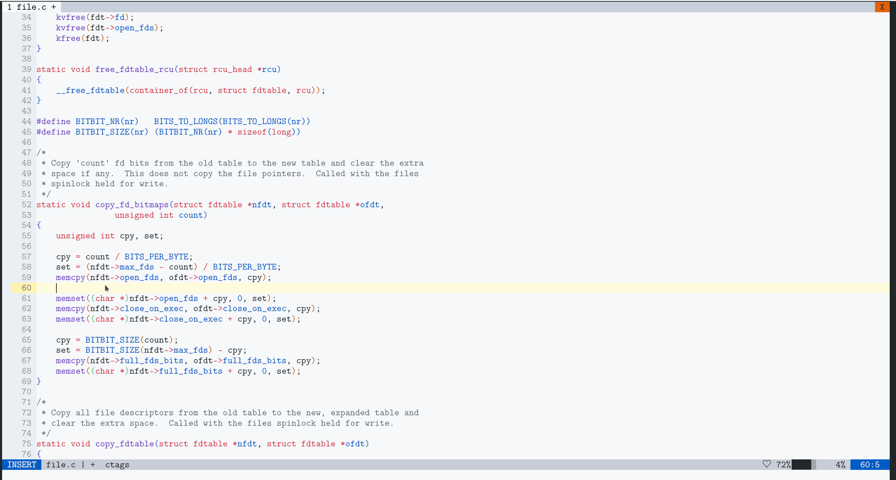
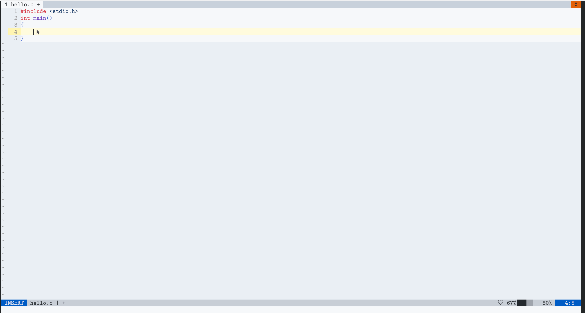
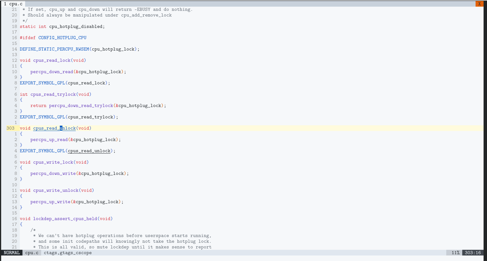
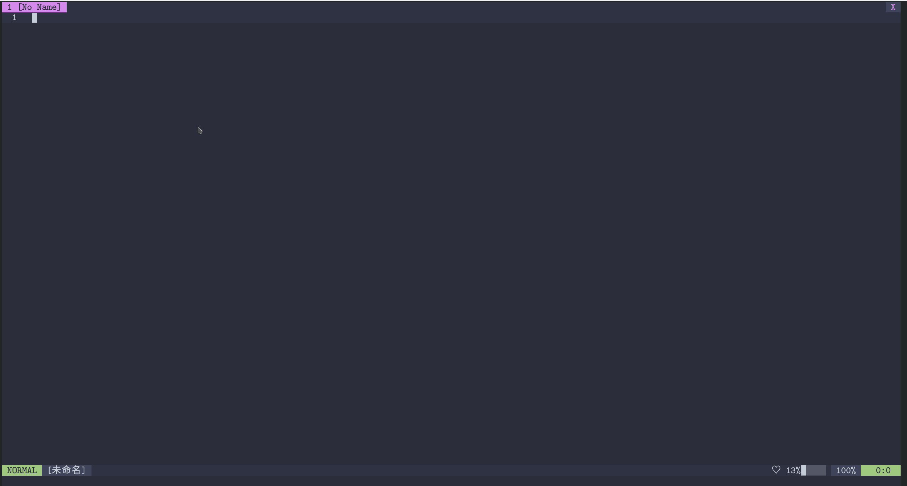
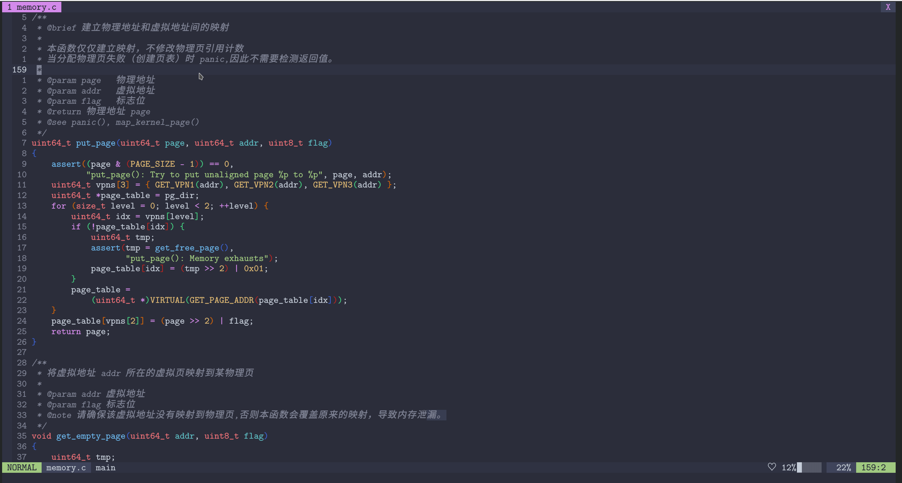

刚接触 Vim 的同学往往因为无法搭建开发环境而“从入门到放弃”，本文旨在帮助这些同学搭建开发环境，聚焦于最核心的开发需求，忽略换配色调字体之类的细枝末节。如果需要开箱即用的 vim 配置（发行版），可以使用 [Spacevim](https://github.com/SpaceVim/SpaceVim)。

本文使用 neovim-nightly，但也适用于 Vim 8.2+，不需要读者有任何 VimL 基础，以 C/C++  为例，但应该适用于任何语言。

## 插件管理

在 Vim 中，插件只是一些脚本，存放在特定的目录中，运行时将它们所在的目录加入到 runtimepath 中。Vim 8 内置了插件管理功能，但不支持高级的插件管理功能。Vimmers 实现了多个插件管理器，可以自动下载、更新、安装插件，还可以延迟加载、按需加载，提高启动速度。

上古时期流行手动或使用 [Vundle](https://github.com/VundleVim/Vundle.vim) 管理插件，以上两种方式已经落伍了，这里介绍目前比较流行的三个插件管理器：

- [vim-plug](https://github.com/junegunn/vim-plug)：简单易用高效，是目前最流行的插件管理器
- [dein.vim](https://github.com/Shougo/dein.vim)：功能强大，但使用复杂
- [vim-pathogen](https://github.com/tpope/vim-pathogen)：另一款流行的插件管理器，没有用过不做评价

以上三款插件管理器风格各不相同，都有大量用户，功能相当完善，根据自己的喜好选取即可。推荐新手选择 vim-plug，对启动时间特别敏感的同学可以考虑 dein.vim，我的配置在安装 70 余个插件的情况下，启动仅需 60 余秒。

使用 vim-plug 安装插件只需要在 .vimrc 中写入以下代码：

```vim
call plug#begin('~/.vim/plugged') " 括号里面是插件目录
                                  " 只能在 plug#begin() 和 plug#end() 之间写安装插件的命令
Plug 'junegunn/vim-easy-align'    " 用户名/插件名，默认从 github 下载安装
Plug 'https://github.com/junegunn/vim-github-dashboard.git' " 从特定 URL 下载安装
call plug#end()
```

使用 dein.vim 安装插件：

```vim
set runtimepath+=~/.vim/plugged/repos/github.com/Shougo/dein.vim " 将 dein.vim 添加到 runtimepath
                                                                 " 注意这是 Ex 命令，路径不要加引号
if dein#load_state('~/.vim/plugged')        " 参数是插件目录
    call dein#begin(general#plugin_dir)
    call dein#add('~/.vim/plugged/repos/github.com/Shougo/dein.vim')  " 安装 dein.vim
    call dein#add('junegunn/vim-easy-align') " 用户名/插件名，默认从 github 下载安装
    call dein#end()
    call dein#save_state()
endif

if dein#check_install() " 自动安装未安装的插件
    call dein#install()
endif
```

在安装插件的代码后加上这两行设置:

```vim
filetype plugin indent on
syntax on
```

这样可以确保特定于文件类型的插件正常工作。

## 代码补全

最简单的代码补全方式是利用 [ctags](https://github.com/universal-ctags/ctags) 生成 tag 文件，补全插件解析 tag 文件进行补全，这种方式有以下两个好处：

- 最小依赖
- 高效可靠，适用于任何规模的项目

基于 tag 的补全不够智能，后来又诞生了 life-changer 级别的补全插件 [YouCompleteMe](https://github.com/ycm-core/YouCompleteMe)，可以提供 IDE 级别的代码补全。但YouCompleteMe 不是开箱即用的，需要下载依赖并编译，并且耦合度比较大，只支持特定语言（主要是 C++）。

目前体验补全体验最好的方式是基于 *LSP*（*Language Server protocal*）的方案。LSP 是一套通信协议，遵从 LSP 规范的客户端（各种编辑器/IDE）可以通过众多 LSP 服务端按协议标准进行通信，由客户端完成用户界面相关的事情，由服务端提编程语言相关的：补全，定义引用查找，诊断，帮助文档，重构等服务。架构图如下：


有了 LSP，不同的 IDE/编辑器只需要实现 LSP 客户端，专心改进用户体验，所有补全的工作都交给 LSP 服务器。使用基于 LSP 的方案，用户可以在多种语言间无缝切换，让 Vim 支持所有语言（只要有 LSP 实现），用户只需要做以下两件事：

- 选择 LSP 客户端
- 选择 LSP 服务器端

目前 LSP 客户端有以下几种选择：

- [vim-lsp](https://github.com/prabirshrestha/vim-lsp)
- [LanguageClient-neovim](https://github.com/autozimu/LanguageClient-neovim)
- neovim-night 内置的 LSP 客户端，使用 Lua 语言配置，参考 [nvim-lspconfig](https://github.com/neovim/nvim-lspconfig)
- [coc.nvim](https://github.com/neoclide/coc.nvim)
- YouCompleteMe 也提供了对 LSP 的支持

coc.nvim 使用 Typescript 开发，是目前最流行、最强大的 LSP 客户端，已经发展成了一个 Vim 插件平台，存在大量基于 coc.nvim 开发的插件（coc 拓展），推荐大家使用 coc.nvim。

coc.nvim 依赖于 node.js，但 node.js 似乎已经不再支持 32 位机，因此最新的 coc.nvim 很可能无法在 32 位机上运行，请考虑其他几种方案。

```vim
" <Tab>选择补全候选
inoremap <silent><expr> <TAB>
            \ pumvisible() ? "\<C-n>" :
            \ <SID>check_back_space() ? "\<TAB>" :
            \ coc#refresh()
inoremap <expr><S-TAB> pumvisible() ? "\<C-p>" : "\<C-h>"

function! s:check_back_space() abort
    let col = col('.') - 1
    return !col || getline('.')[col - 1]  =~# '\s'
endfunction
" gn 跳转到下一个错误，gN 跳转到上一个错误
nmap <silent> gN <Plug>(coc-diagnostic-prev)
nmap <silent> gn <Plug>(coc-diagnostic-next)

" gd 跳转到定义，gs 跳转到引用，gt 跳转到类型定义，gK 显示文档
nmap <silent> gd <Plug>(coc-definition)
nmap <silent> gs <Plug>(coc-references)
nmap <silent> gt <Plug>(coc-type-definition)
nnoremap <silent> gK :call <SID>show_documentation()<CR>
function! s:show_documentation()
    if (index(['vim','help'], &filetype) >= 0)
        execute 'h '.expand('<cword>')
    elseif (coc#rpc#ready())
        call CocActionAsync('doHover')
    else
        execute '!' . &keywordprg . " " . expand('<cword>')
    endif
endfunction

" <Leaderf>rv 改名，<Leaderf>rf 重构
nmap <leader>rv <Plug>(coc-rename)
nmap <Leader>rf <Plug>(coc-refactor)

" <C-f> 和 <C-b> 滚动悬浮窗口
nnoremap <silent><nowait><expr> <C-f> coc#float#has_scroll() ? coc#float#scroll(1) : "\<C-f>"
nnoremap <silent><nowait><expr> <C-b> coc#float#has_scroll() ? coc#float#scroll(0) : "\<C-b>"
inoremap <silent><nowait><expr> <C-f> coc#float#has_scroll() ? "\<c-r>=coc#float#scroll(1)\<cr>" : "\<Right>"
inoremap <silent><nowait><expr> <C-b> coc#float#has_scroll() ? "\<c-r>=coc#float#scroll(0)\<cr>" : "\<Left>"
vnoremap <silent><nowait><expr> <C-f> coc#float#has_scroll() ? coc#float#scroll(1) : "\<C-f>"
vnoremap <silent><nowait><expr> <C-b> coc#float#has_scroll() ? coc#float#scroll(0) : "\<C-b>"
autocmd User CocJumpPlaceholder call CocActionAsync('showSignatureHelp')
```

coc.nvim 有自己的配置文件，叫做 coc-settings.json，一般存放在 .vim（neovim 的话在 ~/.config/nvim）。一般我们会在 coc-settings.json 中微调 coc.nvim 和配置 LSP。

目前功能最强的 C++ LSP 服务器是 [ccls](https://github.com/MaskRay/ccls)，在 coc-settings.json 中配置 ccls：

```json
{
    "languageserver": {
        "ccls": {
            "command": "ccls",
            "filetypes": ["c", "cc", "cpp", "c++"],
            "rootPatterns": [".ccls", "compile_commands.json", ".git/", ".root"],
            "initializationOptions": {
                "cache": {
                    "directory": ".cache/ccls"
                },
                "highlight": {"lsRanges": true }
            }
        }
    }
}
```

以上配置仅在编辑 C/C++ 文件使用命令`ccls`启动 LSP 服务器，将项目根目录设置为包含`rootpatterns`中任意文件的目录，索引文件存放在项目根目录的隐藏目录 .cache/ccls 中。`highlight`字段指示 ccls 生成高亮信息，基于 LSP 的语法高亮插件会利用 LSP 服务器提供的信息进行精确的语法高亮。

为了让 C++ LSP 服务器知道以程序以何种方法编译，必须要在项目根目录生成 [编译数据库](https://www.bing.com/search?q=compile_commands.json&qs=n&form=QBRE&sp=-1&pq=%E7%BC%96%E8%AF%91%E6%95%B0%E6%8D%AE%E5%BA%93+c%2B%2B&sc=0-9&sk=&cvid=5064D653FECD4E23B21AC879A2777990)（compile_commands.json）。CMake 内置了对编译数据库的支持，只需要在执行 CMake 时加上`-DCMAKE_EXPORT_COMPILE_COMMANDS=1`即可;如果使用 Makefile，可以利用 [Bear](https://github.com/rizsotto/Bear) 生成编译数据库，通过`bear make`来执行 Makefile。Bear 需要执行 Makefile 才能生成编译数据库，如果项目无法正常构建，将不能生成编译数据库，没法使用 LSP 的功能。

有些 vimmer 还基于 coc.nvim 开发了一些插件，可以在[这里](https://github.com/neoclide/coc.nvim/wiki/Using-coc-extensions)查看完整的拓展列表。这里给两点建议：

- 尽量不要用 Vim 开发环境开发环境插件管理器安装 coc.nvim 拓展

coc 基于 coc.nvim，使用 Typescript 编写，有些 coc 拓展仅支持使用 coc.nvim 安装。建议在 .vimrc 中定义列表`let g:coc_global_extensions`，把自己想安装的 coc 拓展写进入，coc.nvim 会在第一次打开文件时安装。

```vim
let g:coc_global_extensions` = ['coc-vimlsp', 'coc-rust-analyzer']
```

- 优先使用 coc 拓展配置 LSP

[coc-rust-analyzer](https://github.com/fannheyward/coc-rust-analyzer) 之类的 LSP coc 拓展通常利用 coc.nvim 实现了更多 LSP 功能，请优先使用这些拓展，只在没有对应语言的 LSP coc 拓展时手动配置 LSP。

使用 ccls ，即使是在 Linux 这种规模的代码仓库中也可以流畅地补全代码。



## 错误检查

目前错误检查有两种方案：

- 定时调用外部程序实现实时错误检测
- LSP

如果使用 coc.nvim，不需要额外配置，开箱即用。coc.nvim 使用 LSP 进行错误检查，不够灵活，无法使用 linter 实时检测代码。

基于外部程序的方案非常灵活，比如，可以在基础的错误检测之外同时使用 clang-tidy 等工具进行检测。目前这种方案最好的插件是 [ale](https://github.com/dense-analysis/ale)，并且 ale 可以与 coc.nvim 共存，用 ale 做实时错误检查，coc.nvim 做补全。如果没有特殊需求，直接使用 coc.nvim 即可。



## 符号索引

LSP 已经提供了符号索引的功能，可以方便地跳转到定义/引用。通常 LSP 的功能已经够用，但 LSP 存在以下缺点：

- 仅支持单一语言，在多语言项目中无法无法工作

比如可能存在汇编和 C 混合的项目，汇编定义了一个变量在 C 中读写，LSP 无法理解汇编，找不到变量定义的地方。

- LSP 的符号索引功能有限

LSP 一般不支持跳转到变量赋值的地方，不支持查找包含该头文件的源文件等。

我们可以使用静态代码索引工具，克服 LSP 的以上缺点。目前静态代码索引最好的方案是 ctags 和 [global(gtags)](https://www.gnu.org/software/global/)混合使用，具体的方法参考韦应笑的深度文章[Vim 8 中 C/C++ 符号索引：GTags 篇](https://zhuanlan.zhihu.com/p/36279445)，不再赘述。。

**Tips**:

- 建议同时使用 LSP 和静态索引工具，LSP 支持的功能用 LSP，不支持的功能或没有 LSP 时用静态索引工具，由于实现这个功能需要用 VimL 编程，这里不介绍，有兴趣的话可以参考我的配置

- ccls 实现了更多的功能，如查看类继承体系，查看调用链，查找类的全部实例等。参考配置如下，部分功能用的比较少，就不创建快捷键了，直接使用命令。

```vim
" This comands are defined for ccls(only supports C/C++)
command! -nargs=0 Derived :call CocLocations('ccls','$ccls/inheritance',{'derived':v:true})
command! -nargs=0 Base :call CocLocations('ccls','$ccls/inheritance')
command! -nargs=0 VarAll :call CocLocations('ccls','$ccls/vars')
command! -nargs=0 VarLocal :call CocLocations('ccls','$ccls/vars', {'kind': 1})
command! -nargs=0 VarArg :call CocLocations('ccls','$ccls/vars', {'kind': 4})
command! -nargs=0 MemberFunction :call CocLocations('ccls','$ccls/member', {'kind': 3})
command! -nargs=0 MemberType :call CocLocations('ccls','$ccls/member', {'kind': 2})
command! -nargs=0 MemberVar :call CocLocations('ccls','$ccls/member', {'kind': 4})
nmap <silent> gc :call CocLocations('ccls','$ccls/call')<CR>
nmap <silent> gC :call CocLocations('ccls','$ccls/call', {'callee': v:true})<CR>
```



## 任务系统

在古老的 Vim 工作流中，项目的构建一直是个老大难的问题，要么手动完成，要么自己写简单的脚本完成，VSCode 引入任务系统解决了这个问题，韦易笑大佬的 [asyncrun.vim](https://github.com/skywind3000/asyncrun.vim) 和 [asynctasks.vim](https://github.com/skywind3000/asynctasks.vim) 又将 VSCode 的任务系统引入到了 Vim 中，彻底改变了 Vim 的工作流。这充分体现了 Vim 的优势，Vim 用户非常乐于吸收别的编辑器的优点，让 Vim 变得更好。

asyncrun.vim 让用户可以异步运行 shell 命令，asynctasks 让用户可以将常用的命令写入到配置文件中（~/.vim/tasks.ini 或项目根目录中的 tasks.ini），一次编写多次使用。详细的使用方法请参考插件的中文文档。基本配置如下：

```vim
" 将终端放到 tab 中
let g:asynctasks_term_pos = 'tab'
" 设置 quickfix 大小
let g:asyncrun_open = 10
" 设置项目根目录标志
" 实际上，许多插件都使用这种方法定位根目录，因此可以定一个变量 g:rootmarks，
" 将所有插件的根目录标志都设置为 g:rootmarks
let g:asyncrun_rootmarks = ['.compile_commands.json', '.ccls', '.git']
```

以构建 CMake 项目为例，我需要以不同的模式（Debug/Release）执行 CMake，编译项目，可能还会删除二进制目录，利用这两个 life-changer 级别的插件，可以实现一键配置、编译、运行、清理目录。

```ini
[project-build]
command = cmake --build _builds -- VERBOSE=1
cwd=$(VIM_ROOT)
notify=echo
save=2

[project-run]
command/linux=_builds/$(VIM_PRONAME)
command/win32=_builds\$(VIM_PRONAME).exe
cwd=$(VIM_ROOT)
output=terminal

[project-clean]
command/linux=rm -rf _builds
command/win32=rd/s/q _builds
notify=echo
cwd=$(VIM_ROOT)

[project-configure]
command/linux=cmake -DCMAKE_EXPORT_COMPILE_COMMANDS=1 -DCMAKE_BUILD_TYPE=Debug -S. -B_builds && ln -sf _builds/compile_commands.json .
command/win32=cmake -DCMAKE_EXPORT_COMPILE_COMMANDS=1 -DCMAKE_BUILD_TYPE=Debug -G "MinGW Makefiles" -S. -B_builds && copy _builds\compile_commands.json .
cwd=$(VIM_ROOT)
notify=echo
save=2
```

我的 tasks.ini 中写好常用的任务命令，您可以直接将我的[tasks.ini](https://github.com/kongjun18/nvim-config/blob/master/tasks.ini)直接复制到自己的配置中。

在 .vimrc 中映射几个快捷键：

```vim
" 编辑全局 tasks.ini，随时优化工作流
command! TaskEdit exec 'vsp ' .. general#vimfiles .. '/tasks.ini'

" 由于 <Tab> 的码值和 <C-I> 相同，映射这些快捷键后 <C-I> 会变慢
nnoremap  <Tab>5 :AsyncTask file-build<cr>
nnoremap  <Tab>6 :AsyncTask file-run<cr>
nnoremap  <Tab>7 :AsyncTask project-configure<CR>
nnoremap  <Tab>8 :AsyncTask project-build<CR>
nnoremap  <Tab>9 :AsyncTask project-run<CR>
nnoremap  <Tab>0 :AsyncTask project-clean<CR>
```


再回头看前面提到的错误检测，我们可以将执行 linter 的命令写成一个任务，在代码没有语法错误后调用。

```vim
[clang-tidy]
command=find . -type d -name '.cache' -prune -o -type d -name '_builds' -prune -o -name '*.cpp' -print | xargs clang-tidy -checks=level2 -p default/compile_commands.json
cwd=(VIM_ROOT)
notify=echo
```

可能您还想统计本项目的代码量，也可以通过 asynctask.vim 完成：

```vim
[cloc]
command=cloc --exclude-dir=_builds,.* .
cwd=(VIM_ROOT)
notify=echo
```

只有想象力丰富，asyncrun.vim 几乎没有完不成的工作！

您可能会有这样的疑问，假如我定义了 100 个任务，平时只用其中的少数几个任务，岂不是要经常打开 tasks.ini 查询？这样的困扰根本不存在，Vim 的另一个强大之处就是插件可以配合工作，我们会在后面介绍解决这个问题的办法。

## 语法高亮

基于正则表达式的语法高亮在 C++ 这种语法非常复杂的语言上表现的很差，2021 年可以彻底抛弃掉这种老掉牙的高亮方案了。请使用 [nvim-treesitter](https://github.com/nvim-treesitter/nvim-treesitter)，它是目前最好的高亮方案（只支持 neovim-nightly），如果用 Vim 的话请使用 [vim-lsp-cxx-highlight](https://github.com/jackguo380/vim-lsp-cxx-highlight)。

vim-lsp-cxx-highlight 基于 LSP 实现精确的高亮，但存在性能问题，打开文件时有点晃眼，前面 coc-settings.json 中已经配置好了 vim-lsp-cxx-highlight。

nvim-treesitter，基于语义高亮代码，性能强，容错好。


配置代码如下：

```vim
lua <<EOF
require'nvim-treesitter.configs'.setup {
  ensure_installed = {'c', 'cpp', 'toml', 'json', 'lua', 'python', 'bash', 'rust'},
  highlight = {
    enable = true,
  }
}
-- integrate with rainbow
require "nvim-treesitter.highlight"
local hlmap = vim.treesitter.highlighter.hl_map
hlmap.error = nil
hlmap["punctuation.delimiter"] = "Delimiter"
hlmap["punctuation.bracket"] = nil
EOF
```

**Tip**：您可以在 vimrc 中进行判断，在 Vim 中使用 vim-lsp-cxx-highlight，在 neovim-nightly 中使用 nvim-treesitter，可以参考我配置中的 init.vim 和 autoload/tools.vim。

## 文件操作

许多 Vim 外的编辑器用户喜欢使用文件树定位项目文件，但 Vimmer 更喜欢使用模糊查找插件定位文件。尽管如此，文件树也并非一无用处，在浏览自己不熟悉的项目时，文件树插件可以帮助我们了解项目结构。Vim 自带文件树插件，也有许多 vimmer 编写的插件，这里介绍最经典的 [NERDtree](https://github.com/preservim/nerdtree)。

NERDtree 虽然是最经典的文件树插件，但在许多介绍 Vim 的文章中被骂的狗血临头。许多人批评 NERDtree 性能差，在 Linux 这种规模的项目中会直接卡死，但应付中小型项目绰绰有余。

[Leaderf](https://github.com/Yggdroot/LeaderF) 是国人开发的一款模糊查找插件，性能最强，并且支持许多插件。配置如下：

```vim
let g:Lf_PreviewResult = {
            \ 'File': 0,
            \ 'Buffer': 0,
            \ 'Mru': 0,
            \ 'Tag': 1,
            \ 'BufTag': 1,
            \ 'Function': 1,
            \ 'Line': 0,
            \ 'Colorscheme': 0,
            \ 'Rg': 1,
            \ 'Gtags': 1
            \}
let g:Lf_PreviewInPopup = 1                       " 在 popup 窗口中预览结果
let g:Lf_PreviewCode = 1                          " 预览代码
let g:Lf_RootMarkers = ['.root', 'compile_command.json', '.git'] "你的根目录标志
let g:Lf_WorkingDirectoryMode = 'A'              " 设置 LeaderF 工作目录为项目根目录，如果不在项目中，则为当前目录。
let g:Lf_ShortcutF = "<Leader>f"
let g:Lf_ShortcutB = "<Leader>bl"
nnoremap <silent><Leader>p :LeaderfFunctionAll<CR> " 搜索函数
nnoremap <silent><Leader>l :LeaderfBufTagAll<CR>   " 搜索缓冲区中的 tag
nnoremap <silent><Leader>d :LeaderfTag<CR>         " 搜索项目中的 tag
nnoremap <silent><leader>h :LeaderfHelp<CR>        " 搜索 vim help
nnoremap <Leader>rg :Leaderf rg<Space>             " 调用 ripgrep 查找字符串
```

现在，只要按下 \<Leader>f ，即使是 Linux 这种级别的项目，也能在一瞬间切换到目标文件。



既然 LeaderF 的模糊搜索功能如此强大，能不能让 LeaderF 搜索我们定义的 asynctask.vim 任务？答案当然是可以的！

```vim
function! s:lf_task_source(...)
    let rows = asynctasks#source(&columns * 48 / 100)
    let source = []
    for row in rows
        let name = row[0]
        let source += [name . '  ' . row[1] . '  : ' . row[2]]
    endfor
    return source
endfunction

function! s:lf_task_accept(line, arg)
    let pos = stridx(a:line, '<')
    if pos < 0
        return
    endif
    let name = strpart(a:line, 0, pos)
    let name = substitute(name, '^\s*\(.\{-}\)\s*$', '\1', '')
    if name != ''
        exec "AsyncTask " . name
    endif
endfunction

function! s:lf_task_digest(line, mode)
    let pos = stridx(a:line, '<')
    if pos < 0
        return [a:line, 0]
    endif
    let name = strpart(a:line, 0, pos)
    return [name, 0]
endfunction

function! s:lf_win_init(...)
    setlocal nonumber
    setlocal nowrap
endfunction

let g:Lf_Extensions = get(g:, 'Lf_Extensions', {})
let g:Lf_Extensions.task = {
            \ 'source': string(function('s:lf_task_source'))[10:-3],
            \ 'accept': string(function('s:lf_task_accept'))[10:-3],
            \ 'get_digest': string(function('s:lf_task_digest'))[10:-3],
            \ 'highlights_def': {
            \     'Lf_hl_funcScope': '^\S\+',
            \     'Lf_hl_funcDirname': '^\S\+\s*\zs<.*>\ze\s*:',
            \ },
            \ }
nnoremap <silent><leader>T :Leaderf task<CR> "<leader>T 模糊搜索任务
```

**Tips**：使用 [nerdfont](https://github.com/ryanoasis/nerd-fonts) 和 [vim-devicons](https://github.com/ryanoasis/vim-devicons) 可以在 LeaderF、NERDtree 等插件中显示漂亮的文件图标。

## 调试

调试一直是 Vim 的弱点，最近 *DAP*（*Debug Adapter Protocol*）的提出带来了一些改变。YouCompleteMe 的主要开发者 puremourning 创建了 [vimspector](https://github.com/puremourning/vimspector)，这是目前最强的 Vim 调试插件，仍处于开发阶段，您如果有兴趣的话可以参考我的博客 [Vim 最强调试插件：vimspector](https://www.kongjun18.me/posts/vimspector-the-best-debug-plugin-for-vim)。

## Git

Tpope 的 [vim-fugitive](https://github.com/tpope/vim-fugitive) 让 Git 工作流在 Vim 中顺畅无比，使用 [vim-gitgutter](https://github.com/airblade/vim-gitgutter) 在侧边栏展示 Git 状态。

```vim
command! -bang -nargs=* -complete=file Make AsyncRun -program=make @ <args> " 异步 git push
" git-gutter
let g:gitgutter_map_keys = 0
nmap ghp <Plug>(GitGutterPreviewHunk) " 预览修改（diff）
nmap ghs <Plug>(GitGutterStageHunk)   " 暂存修改
nmap ghu <Plug>(GitGutterUndoHunk)    " 丢弃修改
nmap [c <Plug>(GitGutterPrevHunk)     " 上一处修改
nmap ]c <Plug>(GitGutterNextHunk)     " 下一处修改
```

**Tip**：vim-fugitve 还可以用来处理 git conflict，这里不介绍。

## 格式化

注释请使用 [vim-format](https://github.com/Chiel92/vim-autoformat)，它易于拓展，可以支持所有文件类型。vim-format 会根据文件类型执行对应的格式化命令，C/C++ 默认使用 clang-format，所以您只需要将 .clang-format 放到项目根目录即可。

定义一个快捷键快速格式化代码。

```vim
nnoremap <Leader>bf :Autoformat<CR>
```

**Tip**：您还可以利用*自动命令*在写入文件时自动格式化，利用*替换命令*在写入文件时自动清除行尾空白。

## 注释

目前最流行的注释/反注释是 [nerdcommenter](https://github.com/preservim/nerdcommenter) 和 [vim-commentary](https://github.com/tpope/vim-commentary)。nerdcommenter 相比于 vim-commentary 功能更强，拓展性更好，因此推荐使用 nerdcommenter。

```vim
" Add spaces after comment delimiters by default
let g:NERDSpaceDelims = 1

" Align line-wise comment delimiters both sides
let g:NERDDefaultAlign = 'both'

" Allow commenting and inverting empty lines (useful when commenting a region)
let g:NERDCommentEmptyLines = 1

" Enable trimming of trailing whitespace when uncommenting
let g:NERDTrimTrailingWhitespace = 1

" Enable NERDCommenterToggle to check all selected lines is commented or not
let g:NERDToggleCheckAllLines = 1

" Usefull when comment argument
let g:NERDAllowAnyVisualDelims = 0
let g:NERDAltDelims_asm = 1
```

nerdcommenter 默认的快捷键请参考文档。请不要再蜗牛一样地用`:help`命令查看文档，用`<Leader>h`模糊搜索！

**Tip**：您会发现注释/反注释后光标仍停留在原来的位置，如果您希望光标停留在可视区域结尾，可以添加上以下代码：

```vim
let g:NERDCreateDefaultMappings = 0

" It is impossible to determine execute mode in hooks. Thus, I wrap raw NERDComment()
" to pass mode infomation to hooks and create mappings manually.
"
" NERDCommenterAltDelims is not wrapped and it would execute hooks. So I
" delete variable g:NERDCommenter_mode in NERDCommenter_after() to disable
" hooks executed by NERDCommenterAltDelims
function! s:NERDCommenter_wrapper(mode, type) range
    let g:NERDCommenter_mode = a:mode
    execute a:firstline .. ','  .. a:lastline 'call NERDComment(' .. string(a:mode) .. ',' .. string(a:type) .. ')'
endfunction

" modes: a list of mode(n - normal, x - visual)
function! s:create_commenter_mapping(modes, map, type)
    for l:mode in split(a:modes, '\zs')
        execute l:mode .. 'noremap <silent> <Leader>' .. a:map .. ' :call <SID>NERDCommenter_wrapper(' .. string(l:mode) .. ', ' .. string(a:type) .. ')<CR>'
    endfor
endfunction

function! CreateCommenterMappings()
    " All mappings are equal to standard NERDCommenter mappings.
    call s:create_commenter_mapping('nx', 'cc', 'Comment')
    call s:create_commenter_mapping('nx', 'cu', 'Uncomment')
    call s:create_commenter_mapping('n', 'cA', 'Append')
    call s:create_commenter_mapping('nx', 'c<space>', 'Toggle')
    call s:create_commenter_mapping('nx', 'cm', 'Minimal')
    call s:create_commenter_mapping('nx', 'cn', 'Nested')
    call s:create_commenter_mapping('n', 'c$',  'ToEOL')
    call s:create_commenter_mapping('nx', 'ci', 'Invert')
    call s:create_commenter_mapping('nx', 'cs', 'Sexy')
    call s:create_commenter_mapping('nx', 'cy', 'Yank')
    call s:create_commenter_mapping('n', 'cA',  'Append')
    call s:create_commenter_mapping('nx', 'cl', 'AlignLeft')
    call s:create_commenter_mapping('nx', 'cb', 'AlignBoth')
    call s:create_commenter_mapping('nx', 'cu', 'Uncomment')
    call s:create_commenter_mapping('n', 'ca',  'AltDelims')
    nmap <leader>ca <plug>NERDCommenterAltDelims
endfunction

" NERDCommenter hooks
function! NERDCommenter_before()
    let g:nerdcommmenter_visual_flag = v:false
    if get(g:, 'NERDCommenter_mode', '') =~# '[vsx]'    " executed in visual mode
        let l:marklist = getmarklist('%')
        for l:mark in l:marklist
            if l:mark['mark'] =~ "'>"
                let g:nerdcommmenter_cursor = l:mark.pos
                let g:nerdcommmenter_visual_flag = v:true
                break
            endif
        endfor
    endif
endfunction

function! NERDCommenter_after()
    if g:nerdcommmenter_visual_flag
        call setpos('.', g:nerdcommmenter_cursor)
    endif
    let g:nerdcommmenter_visual_flag = v:false
    unlet! g:NERDCommenter_mode
endfunction
```



## 结语

本文介绍了用 Vim 搭建开发环境的思路，但 Vim 的魅力不在于“千篇一律”，而在于“各不相同”，每个 Vimmer 都有自己的 Vim，根据自己的习惯不断改进工作流。总之，希望本文可以帮助大家走进 Vim 的世界。
