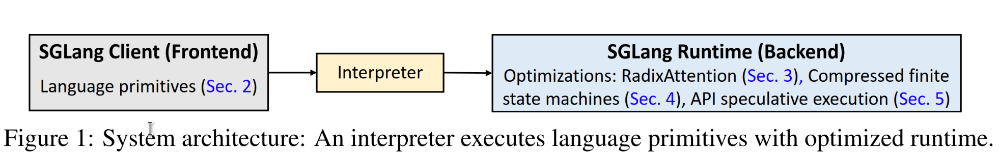
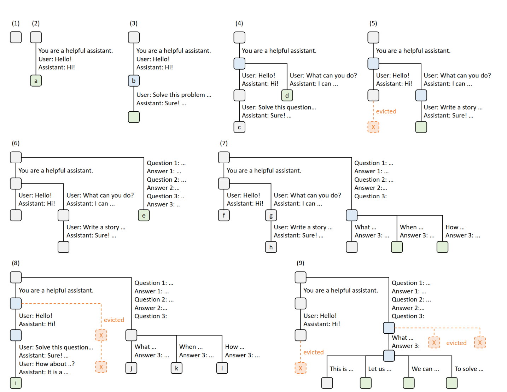
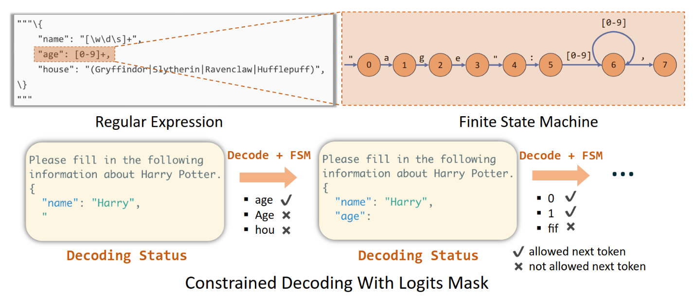
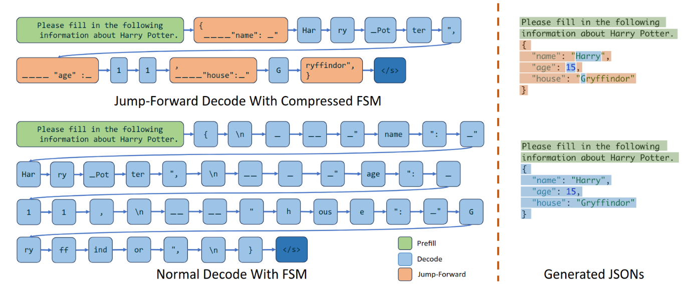

SGLang 的目标是提供一套完整、高效的 Language Model（LM） program 框架，包括前端的编程语言和后端的运行时，而非单独聚焦于 LLM 推理，前后端协同设计给 SGLang 更多的优化空间。

## Fronted

LM program 即通过编程和语言模型交互的程序，由于语言模型 non-deterministic 的本质，LM program 需要做大量的工作，例如复杂的字符串处理，才能和 LM 交互。

典型的 LM program 的逻辑是，向 LM 发送多个问题（multiple calls），等待答案，最后汇总答案，其中涉及复杂的字符串处理。

SGLang 基于 Python 实现了一个 Domain Specific Language（DSL），通过提供 LM program 常用的编程原语（programming primitives），入`extend`、`gen`、`join`/`fork`等，来简化 LM program 的编程。

## Runtime

### RadixAttention
*vLLM 论文* 中的 PagedAttention 分页机制，虽然提供了 KV cache 共享能力，但论文的工作主要是实现请求内的 KV cache 共享，没有深度探索请求间的 KV cache 共享。

>[!NOTE]
>1. vLLM 论文中的请求间 KV cache 共享只是共享 systemd prompt。
>2. vLLM 后续引入了和 RadixAttention **逻辑上**相同的 RadixAttention，特殊之处在于 prefix tree 实现为 block 的 hash，参考 *2025-06-05-overview-of-vLLM-advances-since-its-release#vLLM's advancement Automatic Prefix Sharing*。

LM program 的编程范式高度依赖多轮对话，因此 SGLang 必须支持高效的多轮对话和请求间 KV Cache 共享。LM program 会`fork`发送多个请求给 LM，`join`等待答案。另外，由于 LLM 是无状态的，只是接收输入返回输出，推理框架需要将对话历史拼接上当前轮次的 prompt，作为输入发送给 LM，这个过程（prefill）中也存在大量可复用的 KV cache。

SGLang 不会在请求完成后删除 KV cache，而是将所有 KV cache 组织在一颗 Radix Tree 中，其中 key 是对话的 prompt 和回答。SGLang 主要利用 tensor parallelism，每个 GPU 实例有自己的 radix tree，彼此不需要同步。数据并行下，SGLang 用类似于 [Cepth](https://kongjun18.github.io/posts/ceph-reliable-scalable-and-high-performance-distributed-storage) 的架构，一个中心化的 router 维护 meta-tree，每个 GPU 实例存储 sub-tree，router 会找到 prompt 对应的 prefix 的 sub-tree，并访问 sub-tree 中的 KV cache。

### Cache-Aware Scheduling
SGLang 会优先调度 RadixTree 中 prefix 最长的请求，这种请求能访问最多的缓存的 KV，因此计算成本最低。在无新请求到达时，Longest-Prefix First 即 DFS 的次序，这是理论最优解；当有新请求到达时，DFS 会错过新到达的请求，但仍能实现 sub-optimal 的性能。

相比之下，vLLM 使用 first-come-first-serve（FCFS）策略，无法保证 prefix 最长的请求优先。

### Compressed Finite State Machine
LM program 需要 LM 生成特定格式的回答，例如 json 格式或 choise（例如只允许回答 yes 或者 no），这种特性叫作 constrained decoding 或 structural generation。LM program 会给 LM 发送指定的正则表达式，LM 只允许生成符合正则表达式的输出。

SGLang 或其他 structural generation 实现，例如 [xgrammer](https://github.com/mlc-ai/xgrammar) 会侵入到 transformer 的 decode 阶段，在 decode 时根据正则表达式的 FSM 进行状态迁移，遮盖（mask out）掉所有不符合用户指定的正则表达式的 token，从而确保生成的 token 符合要求。

SGLang 的优化在于尽可能压缩 FSM 状态。FSM 状态迁移中存在两状态间必定发生迁移的情况，这种情况对应 FSM 中两状态间只有一条边的情况。例如，正则表达式要求生成的格式为`student: <student-name>`，只要 decode 进行到了`student`的第一个 token `d`，后续必然迁移到 `t`，直到输出完整的`student: `，没有必要一步步进行自回归 decode。

SGLang 会识别这种状态迁移，直接将多个状态压缩为一个状态，生成状态对应的 token。对于上面`student: <student-name>`的例子，没应用状态压缩前，即使明知道输出只能是`student: `，也要每次生成一个 token，遮盖掉不符合该步 FSM 迁移的输出。应用状态迁移后，decode 输出到`s`时，一步输出`student: `，跳过不必要的 decode。

>[!WARNNING]
正则表达式是字符串层面的，decode 输出是 token 层面的，字符串和 toekn 的语义 gap 会导致有时生成的 token 符合正则表达式，却不符合语义。例如要求`A[+-]`格式的成绩，LM 并没有真的意识到自己只有规定的成绩格式可选，可能生成`Above Average`，符合正则表达式但显然不符合语义。

### Speculative Execution

Speculative Execution 可以在某些情况下减少 API 调用的次数，从而降低 token fee。例如用户通过 multi call 询问 name 和 job，`s += context + "name:" + gen("name", stop="\n") + "job:" + gen("job", stop="\n")`。SGLang 可以通过 prompt engineer，跳过 stop 标记，往前多“看”一些 token，检查下面的 toekn 是否符合用户指定的模式。如果符合则可以直接提取使用，这里就是`name`和`job`，从而减少一次`job`对应的 API 调用。

这种优化不入侵模型推理的过程，可以适用于只提供 API 的黑盒 LM，例如 ChatGPT。

## Optimizations

### Traditional Compiler Technologies
大量传统的编译器优化技术可以应用于 SGLang 前端，例如传统编译器的指令重排等。LM program 也可以进行 prompt 重排，通过调整 prompt 次序，实现更长的共享 prefix。

### Frontend-Runtime Co-Design

1. Client-Side Parallelism: 前端提供 fork/join 编程原语。
2. Fronted Hint：客户端把完整的 prompt 发送给后端，`fork`时将对应的 prefix 提前发出去，方便 runtime 进行 prefix matching。

---
## References