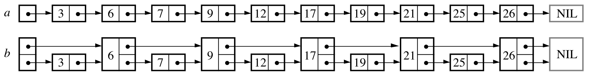
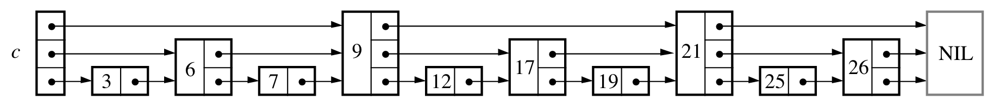
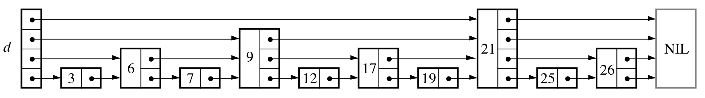
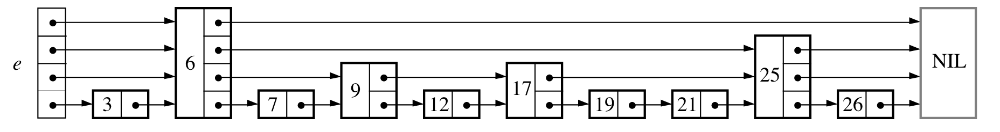
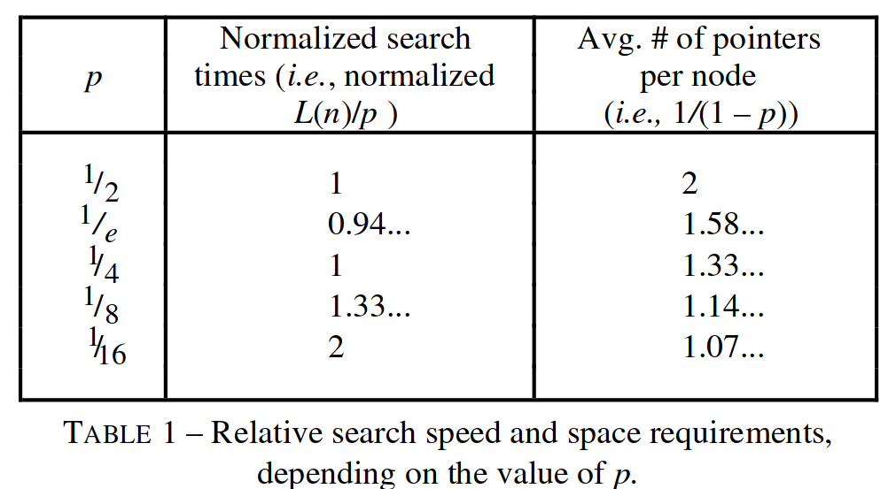

有序链表无法在$O(logN)$时间复杂度内搜索的根源在于：链表不支持随机访问。既然不支持随机访问，可以通过增大步长降低搜索次数。

每个隔 2 个节点，该节点同时指向它 2 个位置后的节点。这样，搜索只需要$N/2+1$步。

继续增大步长，在 b 的基础上，每隔 3 个节点，该节点同时指向它后面 3 个位置后的节点。这样，搜索只需要$N/3+2$步。

不断增大步长，每隔 i 个节点，该节点同时指向它后面 i 个位置后的节点。最终，搜索只需要$O(logN)$步。

这种设计虽然实现了$O(logN)$复制度的搜索，但插入删除却十分低效。为了维护“每隔 i 个节点，该节点同时指向它后面 i 个位置后的节点”的不变量，插入删除节点后都要修改所有后继的指针。这种情况下，相当于通过增大步长，用链表实现了有序数组（$O(logN)$的搜索，$O(N)$的插入删除）。

将具有 k 个 forward pointer 的节点称为 level k 节点，可以发现 level 为 1 的节点占链表的 50%，level 为 2 的节点占 25%，level 为 3 的节点占 12.5%。skip list 巧妙地将不变量改为“节点的第 k 层指向下一个具有至少 k 层的节点”，并且保持同样的概率分配。这种设计成功克服了无法高效增删的问题，增删节点只需要修改指针即可。最终的图示如下。

虽然在某些工作负载下，skiplist 的性能比较差，但这个概率非常低。从概率的角度看，skiplist 可以获得和先前的设计相同的$O(logN)$复杂度。skiplist 的结构只与输入和层数增长概率（随机数生成器）有关。

## skiplist 性能参数
- 层数增长概率 p
	具有 k-1 层的节点是否拥有第 k 层的概率记作 p，论文认为最佳的概率是 1/4。
	
- 最大层数
	论文认为，节点个数为 N 的 skiplist 的最佳起始搜索层数 L(N) 是该层节点数量恰好等于 1/p 的层数，即$L(n)=log_{1/p}N$。为了简单，skiplist 从顶层开始搜索，因此性能最好的最大层数就是 L(n)。

## 实现要点
- 确保节点层数的增长概率。
- skiplist 是多层链表，插入和删除时记录目标节点每一层的前缀。
## References
- [Skip lists: a probabilistic alternative to balanced trees](zotero://open-pdf/library/items/C9SJYHUJ)
- https://leetcode.cn/problems/design-skiplist/
