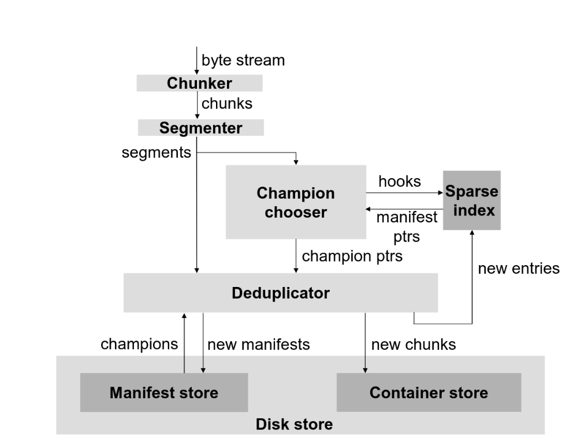
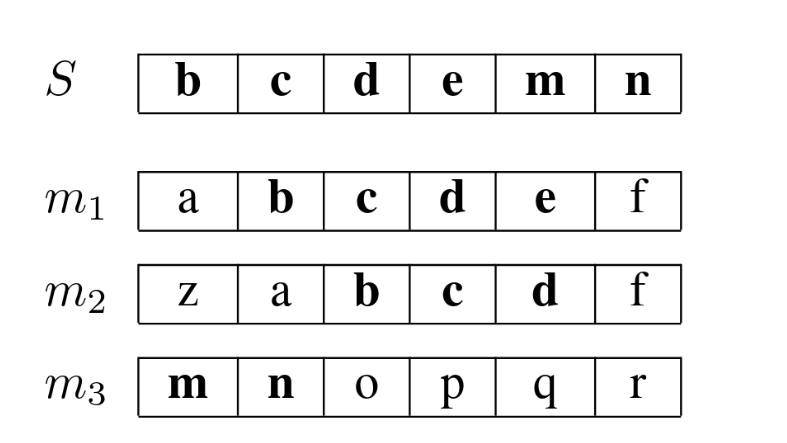

## Motivation

If the data deduplication system stores each deduplicated chunk in it's index, the index size will soon exceeds the memory capacity due to the super large dataset size. Consider, for example, a store that contains 10 TB of unique data and uses 4 KB chunks. Then there are 2.7 × 109 unique chunks. Assuming that every hash entry in the index consumes 40 bytes, we need 100 GB of storage for the full index.

To overcome memory capacity limitation, the index has to be offloaded into disk. However, offloading the index into disk, we need one disk IO per chunk lookup. If an IO takes 4ms, the offloaded index can only achieve 250 lookup per second.

Increase in chunk size can reduce chunk number so that the index size is reduced. However, this solution is not feasible because increased chunk size will cause a severe deduplication rate drop.
## Core Ideas and Methods

Actually, chunk locality holds in backup workload: the tendency for chunks in backup data streams to reoccur together. That can be explained inductively as only a small portion of dataset is modified between two backup. Leveraging the chunk locality, we can propose a partial index design which only store a portion of chunks called hooks in index and load a bunch of chunks when a hook is hit, which reduces index size so the the index is small enough to fit in memory. This design is highly dependent on locality, if locality doesn't hold, we will load a bunch of irrelevant chunks, compromising data deduplication rate.

we can cut the data stream into segments with each segment contains multiple contiguous chunks where the chunk id list is named as segment *recipe*. Because of the chunk locality, if we find multiple chunks of segment A are in segment B as well, the two segment can be deem at least similar and we can deduplicate A against B.

 The magic is sampling. More specifically, we can sample 1/N chunks as hooks, and store the hooks and corresponding segments in index, which reduce the index entry number to 1/N of all chunks. In index, we only hold the mapping from hook id to a list of segments they appear in. Keep in mind that the index only stores the pointers of segments while the real segment manifests containing storage locations of chunks are stored in a separate persistent manifest store.

When a new segment comes in, we sample the hooks of the segment, and search in the index to find similar segments the hooks appear in. Then, the champion selection algorithm is executedL: it
loads candidate segments from the manifest store, and then select a champion with most hook hits. The champion is the most similar segment, which is guaranteed by locality. Eventually, we deduplicate the incoming segment against the champion. Consider the incoming segment S with hooks `[b, c, d, e, m, n]`, three segments are found and the segment m1 is selected as the champion as it has more hook hits.

It's worthy to note that only champion selection involves disk IO according to the retained candidate number, reducing IO count from one IO per chunk to few IO every segment. Besides, the sample rate can be adjusted dynamically with the index size growth to make sure the index fits in memory.

## Limitation

The prerequisites of sparse index design are locality and some kind of inaccuracy tolerance. Without locality, the sparse index stores a bunch of useless garbage. Without tolerance for
inaccuracy, we have to ensure 100% locality or maintain a full index for accuracy.

---
## References
