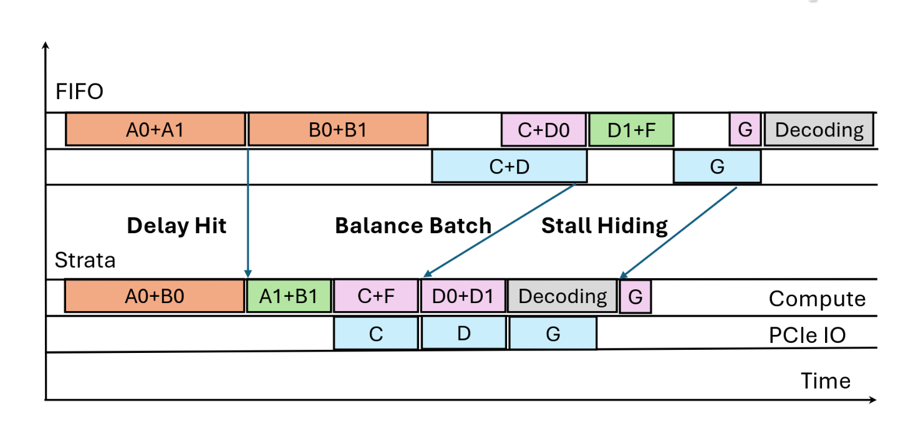

Existing works assume the GPU-CPU bandwidth is not a bottleneck. However, this paper finds the GPU-CPU bandwidth is extremely under-utilized due to the data fragmentation introduced by *PagedAttention* and the existing scheduler doesn't treat GPU-CPU bandwidth as the first class resource, leading to severe data loading latency and thereby stalling the CPU. 

Experiments show 70% time spends in KV cache loading from the lower storage hierarchy, demonstrating GPU-CPU bandwidth is under-utilized. Even with an I/O mechanism achieving 75% of theoretical PCIe bandwidth, stalls still account for up to 24% of prefill execution time, calling for more sophisticated scheduling strategies.

The solution is as follows:
- Improve IO throughput
	- GPU-assisted IO increases concurrency: Thousands of GPU threads load data concurrently. See *GPU-Initiated On-Demand High-Throughput Storage Access in the BaM System Architecture*.
	- Page-first Layout increases unit data size: Manage the token's pages of layers into a contiguous layout in the low-hierarchical storage, such as GPU memory and SSD.
- IO-aware scheduling that treats GPU-CPU bandwidth as the first class resources.
	- Identify and solve the [delayed hit problem](https://dl.acm.org/doi/pdf/10.1145/3387514.3405883): Avoid scheduling multiple requests which encounter the same cache miss into a batch.
	- Balanced batch: Mix compute-bound requests with IO-bound requests (e.g., requests require loading data from the CPU memory) to maximize IO overlapping.
	- Hide loading stall with bubble filling: If an IO-bound request's latency cannot be hidden, schedule a compute-intensive requests to fill the pipeline bubble.

## Delayed Hit
Suppose A0 and A1 sharing the prefix are scheduled together in a batch and suffer from cache misses, the serving system may recompute A0 and A1 redundantly. The solution is to detect delayed hits and re-arrange requests sharing the same context to different batches. 

More specifically, built atop SGLang, Strata proposes a new radix tree structure named *HiRadixtree*, where each node represents a prefix. Even if the cache required by the request is missed, HiRadixtree constructs a transit node denoting the cache that is being computed, such that Strata can rearrange requests.

## Evaluation
- The existing designs cannot fully utilize the theoretical GPU-CPU bandwidth.
- With the aforementioned techniques, H200 machine can achieve high GPU-CPU bandwidth than [GH200 Grace Hopper](https://www.nvidia.com/en-us/data-center/grace-hopper-superchip/) with higher theoretical bandwidth.
- Most performance improvement is from GPU-assisted IO and solved delayed hit problem.

## Insights
- Long context is the future direction and recompute is not feasible in long context situations due to limited GPU HBM capacity, necessitating multi-tier KV cache offloading.
- KV cache loading from SSD should be interrupted if the loading doesn't finish before the request is scheduled.
- IO overlaying makes sense because computing and loading presents different IO patterns, one is HBM bandwidth bound and the other one is GPU-CPU bandwidth bound.

## Thoughts
- This paper only solves the GPU-CPU bottleneck and doesn't solve the SSD bottleneck.
- To some senses, this work centers the multi-tier KV cache storage around the CPU memory. 

