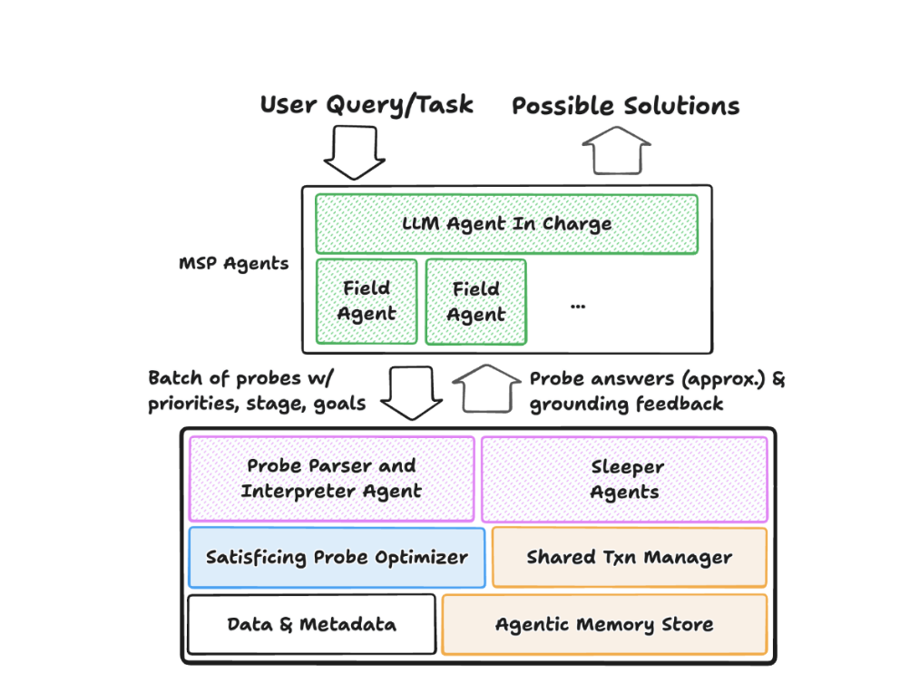

## Motivation
As modern LLMs become both cheap and efficient, in the future, AI agents will act on users' behalf, querying, analysizing, processing data. In other words, the digital world will be AI-native, and present-day database systems should also follow the trend.

This paper analyses query patterns of AI agents, and propose an architecture to shed a light to AI-native database architecture.
## Observations.
This paper finds that the pattern of AI agents generally consists of two sequential stages: *matadata exploration* and *solution formulation*. In the first expiration state, AI agents construct coarse-grained queries called *probes* to find out patterns of data *speculatively*; and then AI agents formulate a solution. Analysis shows that exploration is required and improve the success rate of tasks tremendously.

The solution formulation stage is akin to normal workload, while the exploration represents unique *argentic speculation* patterns, including:
- Heterogeneous accuracy in its information needs. Requests from agents vary vastly from coarse-grained exploration of matadata, to partial or even complete attempts.
- High concurrency. Agents are used to launch a high volume of requests simultaneously.
- Substantial Redundancy. The amount of distinct sub-plans only account for less then 10-20% of total sub-plans.

## Architecture
The basic idea is to expose more information to AI agents, and integrate agents internally to make itself smart.

In the architecture, the internal interpreter agent is designed for understanding natural language (NL) requests. Sleeper agents synthesize current database states and give feedback to AI agents. Probe Optimizer optimized execution plans based on agent probes. 

Agentic Memory Store serves as a cache system for agent requests, and Shared Txn Manager implemented branch isolation of transactions.

## Methods

### From Agents to Data Systems
The key point is to make data systems smart enough to understand what AI agents are doing:
- Extend Interfaces from SQL to SQL+NL: Agents can send SQL queries with natural language hints and background information (e.g. the goals of current probe), the AI-native data system is able to understand the semantics with the help of internal interpreter agent.
- More Flexible Probe Semantics: Agent probes semantics go beyond the conventional SQL semantics, calling for AI-native query semantics. For instance, when agents want to figure out "how many products are affected by tariff", they may find tables whose name is semantically similar to "products", but present-day data systems don't provide this query operator.

## From Data Systems to Agents
The basic idea is to give feedback and advice to agents.
- Auxiliary Information and Advice: Internal sleeper agents should guess agents' intention and return auxiliary information about the query, such as why the query returns nothing (e.g. the table name is not named in acronyms).
- Cost Estimates and Cost-Based Feedback: Attach cost estimates to responses such that agents can adjust their strategies.

### Probe Optimizations 
The goal is to process queries based on contexts instead of blindly.
- Support Probes Natively: Ai-native data systems always keeps in mind that not all queries are conventional queries and process queries based on the probe stages (e.g. exploration or solution formulation).
- Decides *What* Queries to Execute and What Degree of *Approximation*: Some probes are unnecessary and others (e.g. coarse-grained probes) do not need complete accuracy.

## Indexing, Storage and Transactions
- Adaptive Indexing and Storage: Present-day data systems assume queries are homogeneous (i.e. with same approximation and accuracy), but fugue data systems should take heterogeneous probes into account, proposing indexing supports different approximation level and adaptive storage layout for different kinds of queries (e.g. data with the same query approximation may be packed together).
- Agentic Memory Store: It caches agents probes and answers to avoid redundancy. In addition, AI-native data systems may store general information (e.g. patterns) needed for agents in advance.
- Branch Isolation and MVCC on Steroids: Agents typically explores multiple "what-if" hypothesis. For instance, explore A and explore B is "if flight A is available, add it" and "if flight B is available, add it". Transactions are not congenially fully isolated but "fork-speculate-merge" like Git branches. In addition, massive branch creating and rollbacks requires MVCC on steroids.

## Thoughts
The future world MUST be an AI-native world both digitally and physically. In this sense, all present-day systems have to transform into AI-native systems, data systems are no exception.

---
## References
- PAPER *Supporting Our AI Overlords: Redesigning Data Systems to be Agent-first*