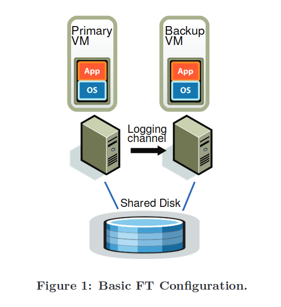

## 背景

hypervisor 控制整个 VM 的执行环境，因此可能高效地实现可容错的虚拟机系统。论文在 WMware vShpere 4.0 上实现了一个可用于生产环境的可容错虚拟机，称为 VMware FT。

## 设计

论文聚焦于如何实现一个可用与生产环境的容错虚拟机，更多聚焦于实现容错的策略（协议），底层使用的机制依赖于 VMware 的其他技术。虚拟机复制使用 VMware VMotion，这个技术原本用于迁移 VMware 虚拟机，VMware FT 稍作修改，用于复制虚拟机和重启虚拟机。使用 VMware 的 deterministic replay 技术记录主虚拟机的执行并确保副本的执行于主虚拟机相同。

VMware FT 使用状态转移（state transfer）策略实现容错。FT 在主虚拟机执行时，将主虚拟机的状态拷贝到副本，以实现主副本状态一致。

VMware FT 的架构如图所示。主副本共同访问一个共享磁盘，主虚拟机的状态通过 logging channel 发送到副本，副本接收后重做。所有输入都通过 FT 传输给主虚拟机，并且只有主虚拟机的输出能够发送给外部世界。

## 同步
实现容错的一大难点是如何确保主副本状态一致，这也是论文主要解决的问题。 虚拟机中发生的所有操作和事件可以分成一下两类：
1. deterministic：对于通常的输入和操作，总是产生同样的结果。例如加减指令 add/sub。
2. non-deterministic：某些操作对于同样的输入会产生不同的结果。例如读取 CPU 性能计数器、时钟中断等。

为了实现同步，必须将所有的 non-deterministic 事件转换为 deterministic 事件，否则即使主副本执行同样的操作会产生不同的结果，导致主副本和状态偏离。VMware deterministic replay 技术实现了高效地记录 VM 的输入和所有可能的 non-deterministic 事件，并写入日志文件中交给副本重做。Hypervisor 拦截 Guest 的 non-deterministic 操作或事件，处理如下：
1. non-deterministic 事件（中断）：FT 记录中断类型和在和指令流中发生中断的位置。
2. non-deterministic 操作（读取性能计数器、启动时间等）：FT 将其结果修改为主虚拟机的结果。

然而，VMware deterministic replay 技术并不能完全确保主副本同步，VMware FT 还需要处理网络和磁盘上的 non-determinism：
1. 磁盘
	1. 并发磁盘 IO：序列化磁盘 IO
	2. 磁盘 DMA read 和内存读之间的 race：使用 bounce buffer 消除 race。
2. 网络
	1. hypervisor 在 VM 运行时更新 VM 的 receive buffer：禁止 hypervisor 并发更新。

## 容错

为了实现容错，不得不思考对于用户而言，什么才是容错。从用户视角看，容错就是“如果备份VM在主VM发生故障后接管（go live，指副本成为主虚拟机），则副本必须与主虚拟机发送给外部世界的所有输出完全一致的方式继续执行。”这就是论文中所谓的 output requirement，满足这个要求才能实现容错。

如果主虚拟机在执行输出操作后发生故障，且 log 在 logging channel 中丢失，副本将无法重做到主虚拟机执行输出操作后的状态。因此，主虚拟机需要在输出操作上 chackpoint，等到确保副本接收到输出指令及其之前的所有 log 才能执行输出指令。

实际上，FT 使用延迟输出避免主虚拟机停顿等待副本接收 log。主虚拟机正常执行，但 FT 拦截主虚拟机的输出，直到接收到副本的 ACK 才将输出发送到外部世界。因为硬件上 IO 操作是非阻塞的，所以延迟输出不会停顿 CPU 的执行。CPU 发送 IO 请求，然后等待 IO 完成（接收 IO 完成中断）。延迟输出发送到外部世界，对于 VM 来说就相当于推迟了 IO 完成中断，VM 仍然可以正常执行。

由于 FT 没有使用两阶段提交，FT 不可能知道主虚拟机在执行 IO 操作后发生故障，副本接管时，IO 操作是否被成功发送给外部世界。这对虚拟机而言并不是大问题，因为：
1. 网络输出：网络协议栈可以处理重复的网络包，FT 重新发送网络包即可。
2. 磁盘输出：VMware FT 消除了所有磁盘 IO 的竞争，并且磁盘 IO 是幂等的，FT 重新发送磁盘 IO 即可。

VMware FT 利用 VMware VMotion 技术实现了故障自动恢复。VMware VMotion 原本用于迁移虚拟机，它可以只停顿虚拟机不到 1s 的情况下将运行中的虚拟机迁移到其他机器上。VMware FT 修改了 VMware VMotion，不删除原虚拟机将虚拟机克隆到远程机器上，并创建主副本间的 logging channel。当主虚拟机发生故障，副本接管成为新的主虚拟机后，VMware FT 利用 VMware VMmotion 创建新的副本。

## FAQ

 - [x] 主虚拟机宕机后副本如何接管？

	 1. 副本成为虚拟机，接收输入并发送输出到外部世界。

	 2. 利用 VMware VMotion 创建新的副本。
	 还要做一些和设备相关的操作，比如修改 MAC 地址和 IP 等。

- [x] 如何检测故障？

	- log channel 超时或心跳失败。

	- 定期探测虚拟机

- [x] 如何避免脑裂？

	primary 和 copy 需要在共享存储上执行原子 test-and-set，这相当于加了锁。

- [x] shared disk 发生故障怎么办？

	导致主副本均无法接管。因此 shared disk 必须是容错的存储系统。

- [x] Bounce buffer 如何避免 DMA read 和内存写的竞争？

	并发 DMA read 和内存写导致数据竞争，导致此操作 non-deterministic，copy 重做后结果可能与 primay 相同。解决方案：

	1. 写保护 DMA 访问的内存。写这块内存使发生缺页，hypervisor 拦截并停止 VM 运行，等到 DMA read 完成后再恢复 VM 执行。

	2. bounce buffer。hypervisor 将 DMA 读写的内存地址修改为私有的（VM 不会访问）缓存区（bounce buffer），等到 DMA read 完成，hypervisor 将 bounce buffer 的数据拷贝到 DMA read 原本的内存地址中。bounce buffer 使得 hypervisor 可以确定 DMA read 和内存写的次序，发送给 copy 重做，从而确保 primary 和 copy 的内存状态相同。

- [x] 主虚拟机是否需要等待副本返回接收到指令的 ACK？

	不需要。原文 *All input that the primary VM receives is sent to the backup VM via a network connection known as the logging channel.* Logging channel 传输的是 primary 接收的输入和事件（时钟中断等），指令存储于内存中，副本直接读取并执行即可。

- [x] 为什么不允许副本自己从硬盘读取数据？

	为了避免发生故障时副本读出错误的数据，禁止副本从影片读数据可以减少 non-determinism。

## References
- [The design of a practical system for fault-tolerant virtual machines.pdf](zotero://open-pdf/library/items/9BW6KNH2)
- [MIT 6.824 2022 Lecture 4: Primary/Backup Replication](http://nil.csail.mit.edu/6.824/2022/notes/l-vm-ft.txt)
- [MIT 6.824 2022 Primary/Backup Replication FAQ](http://nil.csail.mit.edu/6.824/2022/papers/tour-faq.txt)
