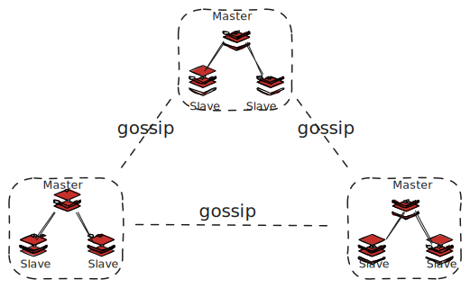

## 设计
Redis Cluster 被设计来覆盖单机版本的用例，是将单机 Redis 实例带入分布式系统的方案，而不是将 Redis 变成类似 MongoDB 的分布式数据库。

性能是 Redis Cluster 的第一目标，在实现高性能和线性拓展的前提下实现弱但是合理的数据安全性和可用性。

## 架构



>[!NOTE]
>图中的 gossip 虚线表示：
>1. 每个节点都彼此通过 gossip 相联。
>2. 领导者选举时，每个 group 的候选人都从其他 group 的 master 获取投票。

每个节点都有一个全局唯一且不变的 Node ID，Node ID 是节点的唯一标示，节点的 IP 地址和端口可以动态调整并通过 Redis Cluster Bus 传播到整个集群。

Redis Cluster 使用完全分布式的架构，不存在专门的协调者节点、路由层、元数据服务器等组件。每组 Master 通过类似 Raft 领导者选举的方法得到，选举时候选者节点从其他组的 Master 节点获取投票。

Redis Cluster 的数据集按 key 划分成多个 slot，slot 只能被一个节点或一组 Master/Slave 服务。因此集群中每个 Redis 实例保存的数据集是不同的，并且集群的正常工作要求至少每个组都有一个节点正常工作。

>[!NOTE]
>Redis 的 master/slave 是 *Redis 复制* 的特性，和领导者选举解耦。

## 集群配置与拓扑
Redis Cluster 通过分布式的算法存储和传播集群配置，类似于网络层路由算法，每个节点向其他节点发送自己眼中的集群配置，最终达到统一的视图。

节点的加入
1. `MEET`消息：节点向集群内的节点发送`MEET`消息（`CLUSTER MEET <IP-address> <port>`命令），接受到`MEET`消息的节点接受发送节点为集群内的节点，并向集群广播此节点的信息。
2. 受信任节点的广播：节点向收到集群其他节点广播的新加入集群的节点信息后，将接收新节点为集群成员。

节点的删除：
1. `CLUSTER FORGET <node-id>`从集群配置中删除节点。
2. 60s 内禁止相同 nodeID 的节点加入集群。

进行配置变更时，还需要进行 slot 的迁移。增删节点和 reshard 使用相同的 slot 迁移机制。

## 分区

Redis Cluster 自动对数据库进行 hash 分区，将 key 划分为 16384 个 slot，key 按哈希函数映射到 slot，每个 slot 由一组 master/slave 节点服务。

slot 哈希函数如下：
```c
HASH_SLOT = CRC16(key) mod 16384
```

固定数量的 slot 避免了集群节点增删时 key 被映射到错误的 slot，可迁移的 slot 确保分区的灵活性。

分区信息保存在每个节点的配置中，并通过 gossip 协议扩散到整个集群。

## slot 迁移

slot 到节点的映射是动态的，允许将 slot 从一个节点迁移到另一个节点。

`CLUSTER SETSLOT slot MIGRATING node`和`CLUSTER SETSLOT slot IMPORTING node`设置 slot 的迁移状态，其中`MIGRATING`标记该节点上的 slot 正在迁移到其他节点，`IMPORTING`标记该节点正在导入 slot。例如，将 A 节点上的 slot1 状态为正在迁移到节点 B，使用以下命令：
```shell
CLUSTER SETSLOT slot1 MIGRATING A
CLUSTER SETSLOT slot1 IMPORTING B
```

设置 slot 迁移状态是为了在 slot 迁移期间正常服务请求，客户端访问`MIGRATING`状态的 slot 时，会先尝试`MIGRATING`节点，再尝试`IMPORTING`节点。[客户端交互](#客户端交互)详细介绍这个过程。

reshard、节点增删时使用同样的机制进行 slot 迁移：
1. `CLUSTER GETKEYSINSLOT slot count`获取`slot`的 key
2. `CLUSTER SETSLOT slot MIGRATING/IMPORTING node`设置`MIGRATING`和`IMPORTING`节点。
3. `MIGRATE target_host target_port "" target_database id timeout KEYS key1 key2 ...`将 slot 的每个 key 迁移过去，并在迁移完成后从旧节点删除这些 key。

>[!NOTE]
>这里的每个命令都是相互解耦的


## 心跳
集群中的所有 Redis 节点都通过 Redis Cluster Bus 相连，通过 PING/PONG 消息进行心跳，PING/PONG 消息统称心跳消息。为了减少消息的数量，节点随机选择一些节点发送心跳，但保证向`NODE_TIMEOUT/2`时间内没有发送或响应心跳的节点发送心跳包。为了避免 TCP 连接错误导致的心跳失败，在`NODE_TIMEOUT`快超时时，节点会尝试新建 TCP 连接进行心跳。

Redis Cluster 所有节点均彼此相连的设计意味着集群中存在大量心跳包。以 100 个节点，`NODE_TIMEOUT`为 60s 的集群为例，一个节点每 30s 要发送 99 个心跳包，平均下来一个节点每秒要发送 3.3 个心跳包，集群平均每秒发送 330 个心跳包。许多分布式系统的心跳间隔设置为 5s（对应`NODE_TIMEOUT`为 10），这种情况下集群平均一秒要发送 1980 个心跳包。通常，Redis Cluster 的`NODE_TIMEOUT`不会设置得很小，在 60s 的情况下，心跳包的数量是可以接受的。

心跳包负载的数据包括节点配置信息（nodeID、端口和IP 地址等）、集群配置（该节点视角中的其他节点以及服务的 slot等）、逻辑时钟（`configEpoch`和`currentEpoch`）、节点状态（`PFAIL`等节点视角中的其他节点的状态）等。

## 客户端交互
Redis Cluster 没有专门的路由层，客户端向任意节点发送请求，节点最终将客户端重定向到目标 master 节点。客户端应该缓存 slot 到节点的路由信息，并且一定支持重定向。

节点接收到请求时，对用户请求的 key 进行哈希得到 slot。如果该节点不包含这个 key，向客户端返回`MOVED`重定向错误（语义为该 slot 被永久移动）。`MOVED`错误中包含该 slot 的节点信息，将客户端重定向到存储该 slot 的节点。因为节点的集群配置可能落后，重定向可能链式进行多次，最终重定向客户端到正确的节点。

slot 迁移过程中，`MIGRATING`节点只接受关于现有的 key 的请求，不存在的 key（如新建 key）会被重定向到`IMPORTING`节点。流程如下：
1. 客户端发送请求到任意节点，最终重定向到`MIGRATING`节点或`IMPORTING`节点。
1.  `MIGRATING`节点如果包含此 key，直接服务；否则返回`ASK`错误（语义为正在迁移，包含`IMPORTING`节点信息）。
2. `IMPORTING`节点服务请求。

slot 迁移过程中可以进行多键操作，但仅限于同一 slot 且在同一节点的 key，否则返回`TRYAGAIN`错误。

客户端请求只由 master 服务，slave 负责故障转移。但在`READONLY`模式下，slave 也可以服务客户端请求，但仅限于 master 未服务过的 slot。实际上，客户端访问 master 还是 slave 很大程度上取决于客户端的实现，某些实现不仅能访问 slave，甚至支持多种 master/slave 负载均衡策略。
## slot 配置传播
slot 配置通过心跳传播，机制如下：
1. 心跳包：心跳包中包含该节点服务的 slot 信息，接收心跳包的节点根据心跳包的中的 slot 配置更新自己的配置。
2. UPDATE 消息：节点接收到配置过时的心跳包时，向其发送 UPDATE 消息（包含新的 slot 配置）更新该节点的 slot 配置。
配置的新旧通过`configEpoch`判断，细节见[逻辑时钟](#逻辑时钟)。节点用以下两个规则更新自己的 slot 配置：
1. 如果 slot 没有被配置，使用接受到的配置。
2. 如果接收到的配置更新（`configEpoch`）更大，使用接收的到配置。

## 故障检测
心跳包还用于故障检测，节点向某个节点发送的 PING 消息等待时间超过`NODE_TIMEOUT`时，节点将此无法到达的节点标记为`PFAIL`。

节点从集群的多数派 master 收集关于`PFAIL`节点的状态信息，如果多数派 master 在`NODE_TIMEOUT*FAIL_REPORT_VALIDITY_MULTI`（默认是`2*NODE_TIMEOUT`）内发出`PFAIL`或`FAIL`信号，节点将此`PFAIL`节点标记为为`FAIL`，并广播到整个集群（节点收到`FAIL`消息后将此节点标记为`FAIL`）。

`PFAIL`是节点的本地视角，而`PFAIL`是集群视角。虽然`PFAIL`要求多数派 master 同一，但没有严格限制在同一时刻（`currentEpoch`）同意，因此实际上这个协议是不严格的。作为对比，[领导者选举](#领导者选举)拒绝`configEpoch`更小的投票，最终多数派 master 在同一`configEpoch`选举出 Leader。

`FAIL`只在可访问且满足以下条件时清除：
1. 节点不是 master。
2. 节点是 master，但没有任何 slot。这种节点是新加入集群等待配置，还未真正参与集群的节点。
3. 节点是 master，但很长一段时间（`NODE_TIMEOUT`的 N 倍）没有检测到副本升级。
>[!NOTE]
>清除`FAIL`的这些规则主要是为了避免脑裂。

故障检测在集群级别进行，而 Redis 实例的领导者选举在 master/slave 级别进行。`FAIL`标志可以用来判断领导者选举是否安全，避免 slave 在无法访问 master，但实际上 master 在集群中可访问的情况下进行不必要的领导者选举。
## 逻辑时钟
Redis Cluster 中有两个逻辑时钟，可以用来检测过时信息，例如过时的 master 和 slot 配置。`currentEpoch`是 Redis 节点的版本，`configEpoch`是 slot 配置的版本。

`currentEpoch`和`configEpoch`类似于 Raft 中的 term。Redis 节点接收到`currentEpoch`更大的节点发送的消息后，会将自己的`currentEpoch`修改为接收到的`currentEpoch`，最终整个集群会达到相同的`currentEpoch`，`configEpoch`同理。

`currentEpoch`只在[领导者选举](#领导者选举)时递增，新选举出的领导者会获得一个新的、递增且全局唯一的`configEpoch`。`currentEpoch`更小的消息被认为是过时的消息，`configEpoch`更小的 slot 配置被认为是过时的配置，因此`currentEpoch`和`configEpoch`解决了消息和 slot 配置的冲突。

>[!NOTE]
>Redis Cluster Specification 没有详细介绍如何在领导者选举中生成新的递增且全局唯一的`configEpoch`。这一保证以能够访问多数派 master 为前提，因此可以猜测是共识机制的副产品。

`configEpoch`会在某些情况下出现冲突，包括：
1. slot 迁移：节点迁移第一个 slot 时，在本地升级`configEpoch`。
2. `CLUSTRE FAILOVER TAKEOVER`：管理员手动将某个节点提升为 master 时，节点在本地升级`configEpoch`。
如果两个操作同时发生，可能会出现`configEpoch`冲突，这会导致 slot 配置无法收敛（两个`configEpoch`相同，哪个是最新的？）。当`configEpoch`相同时，`nodeID`更小的 master 节点获胜，规则如下：
`nodeID`更小邪恶 master 节点收到了其他 master 节点报告的相同`configEpoch`时，递增自身`currentEpoch`，使自己称为独裁者，向集群扩散自己的`configEpoch`。因为`currentEpoch`更小的消息被认为是过期消息，其他节点接收到该 master 节点的消息后，更新`configEpoch`为自身的`configEpoch`。

## 领导者选举

Redis Cluster 的领导者选举和 *In Search of an Understandable Consensus Algorithm* 中介绍的 Raft 算法几乎一样。这种一致性可能来源自 Raft Leader 在集群中是绝对权威，而 Redis Cluster 中的 master 在一组 master/slave 中也是绝对权威。

当 slave 认为 master 处于`FAIL`状态时，slave 开始进行进行领导者选举：
1. 递增自己的`currentEpoch`，相当于 Raft 中的任期。
2. 向其他所有 master 发送投票请求（`FAILOVER_AUTH_REQUEST`包）。
3. slave 等待`2*NODE_TIMEOUT`，如果接收到多数派 master 的投票则选举成功，否则选举失败。
4. 如果 slave 选举失败，等待两个`NODE_TIMEOUT`，重新进行领导者选举。
选举的时机：slave 认为 master FAIL

和 Raft 类似，slave 会拒绝`currentEpoch`更小的投票。

master 节点采用和 Raft 类似的投票策略：
1. 只对给定 epoch 投票一次。
2. 记录上次投票的 epoch 的到`lastVoteEpoch`并持久化。
3. 拒绝向`currentEpoch`更小的 slave 投票。

为了避免活锁，Redis Cluster 也引入了和 Raft 类似的随机延迟。在领导者候选者的选择上，Raft 要求候选者必须具有完整的已提交日志，Redis Cluster 虽然没有 Raft 的 commit 规则确保数据不丢失，但也通过副本等级让有最新数据的 slave 更优先被选举。副本等级通过随机延迟实现，Redis Cluster Spec 的算法如下：
```
DELAY = 500 milliseconds + random delay between 0 and 500 milliseconds + REPLICA_RANK * 1000 milliseconds.
```
数据越新的 slave 的`REPLICA_RANK`越小，因此选举的延迟更小，更容易选举为 master。

完成领导者选举后，新 master 开始向集群进行 [slot 配置传播](#slot 配置传播)，旧 master 会变成最后一个窃取它的 slot 的节点（新 master）的 slave。[slot 配置传播](#slot 配置传播) 时`configEpoch`更大的 slot 配置获得胜利，因此发生脑裂时 Redis Cluster 的策略是 last fail-over win，即最后进行故障转移的节点获胜。
## 性能和拓展性
Redis Cluster 分片确保一个 slot 由一个 Redis 节点（及其 slave 服务），并且除了路由过程的重定向，整个过程不涉及其他节点。因此对于每个 slot，性能都与单机 Redis 实例性能相同，集群总体性能相当于 N 倍单机性能。

## 写安全性
写入安全性主要是指发生分区后丢失数据的多少。发生分区后，集群会被划分成两个区域，其中包含多数派个 master 的分区称为多数派分区，另一包含少数派个 master 的分区称为少数派分区。

节点会在`NODE_TIMEOUT`无法访问到多数派 master 时拒绝服务写请求，这为写安全性兜底。考虑以下几种分区情况：
1. 客户端由少数派分区服务：`NODE_TIMEOUT`后多数派分区会重新选举领导者，而少数派分区会拒绝写请求。当分区恢复后，多数派分区的领导者会成为集群真正的领导者（少数派分区无法进行故障转移，多数派分区进行领导者选举后`configEpoch`更大，多数派分区获胜），少数派分区的写丢失。但由于少数派分区在`NODE_TIMEOUT`后拒绝写请求，丢失写的窗口不会超过`NODE_TIMEOUT`。
2. 客户端由多数派分区服务：多数派分区可以在此分区内选举领导者，且分区恢复后多数派分区选举的领导者是集群领导者，因此不会发生写丢失。
3. 服务器客户端的 master 节点发生分区，其他节点一切正常：如果分区在`NODE_TIMEOUT`内接收，分区中不会发生领导者选举，因此不发生写丢失；如果分区超过`NODE_TIMEOUT`，该 master 节点的写会丢失，但由于`NODE_TIMEOUT`时间后拒绝服务写请求，因此丢失窗口不会超过`NODE_TIMEOUT`。
4. 集群分区成多个少数派节点：因为没有哪个分区能完成领导者选举，`NODE_TIMEOUT`后所有分区都拒绝服务写请求。

由于节点会在`NODE_TIMEOUT`访问不到多数派 master 时拒绝写请求，集群可能拒绝写请求，但写丢失的窗口一定不会超过`NODE_TIMEOUT`。
## 高可用

Redis Cluster 可用性要求集群中必须存在多数派个 master，且无法访问的 master 至少有 1 个可访问的Redis Cluster slave。“多数派个 master”确保集群正常进行领导者选举，“无法访问的 master 至少有一个可访问的 replcia”确保集群可以服务客户端请求。

这种可用性要求意味着集群容错性并不是很高，实际上 Redis Cluster 不适用于会发生大量故障的场景，毕竟 Redis Cluster 的[设计](#设计)目标是“弱但合理的数据安全性和可用性”。

Redis Cluster 用副本迁移提高集群可用性，副本迁移算法确保点每个 master 都应该有至少一个非`FAIL`的副本。
1. 每个副本都检测集群中的 master 是否具有至少一个好的 replica。好的 replica 是不处于`FAIL`的 replica。
2. master/replica 中副本数最多，且节点 ID 最小的非`FAIL`副本主动迁移为没有 replica 的 master 的副本。

副本迁移不使用任何共识协议，Redis Cluster 的副本布局不是持久化的集群配置的一部分。

这种算法存在竞争，多个副本可能都认为自己是副本数最多且节点 ID 最小的非`FAIL`节点，同时迁移为某个 master 的副本。因为多添加副本是无害的，因此这种竞争不会导致错误。这种竞争可能导致 master 因为副本迁移走而变成孤家寡人，等到集群稳定后会进行副本迁移。

