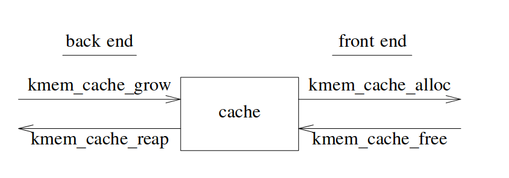

## 原理

许多情况下，对象的构造和析构成本原大于内存的分配和回收。因此，既要优化内存分配，也要降低对象的构造/析构成本。

通过缓存对象维持对象的基本结构，在多次“使用”间复用此基本结构。对象在第一次分配时构造(初始化基本结构），回收时不析构（不毁坏此基本结构），下次分配直接返回缓存的对象。slab allocator 缓存的对象生命周期从“构造-使用-析构-构造-使用-析构……”变为“构造-使用-使用-使用-析构”。

注意，slab allocator 维持的是对象的基本结构，而不是像 C++ 对象那样的复杂的构造/析构。

引入 slab allocator 后，对象生命周期如下：

```c
struct foo {
  kmutex_t foo_lock;
  kcondvar_t foo_cv;
  struct bar *foo_barlist;
  int foo_refcnt;
};

foo = kmem_alloc(sizeof(struct foo), KM_SLEEP);
// 初始化
mutex_init(&foo->foo_lock, ...);
cv_init(&foo->foo_cv, ...);
foo->foo_refcnt = 0;
foo->foo_barlist = NULL;

// 使用 foo
use foo;

// 析构
ASSERT(foo->foo_barlist == NULL);
ASSERT(foo->foo_refcnt == 0);
cv_destroy(&foo->foo_cv);
mutex_destroy(&foo->foo_lock);
kmem_free(foo);
```

## 接口设计

两大理念：

- 用户负责提供对象的完整描述
- 内存分配器负责管理内存

用户只要像内存分配器描述“我要多少内存，如何构造/析构”，内存分配器按要求返回内存，用户不应该考虑内存分配器如何管理内存等内部细节。

接口如下：

```c
// 创建 cache，返回 cache 的句柄
struct kmem_cache *kmem_cache_create(char *name, size_t size, int align,
                                     void (*constructor)(void *, size_t),
                                     void (*destructor)(void *, size_t));
// 分配对象
void *kmem_cache_alloc(struct kmem_cache *cp, int flags);
// 回收对象
void kmem_cache_free(struct kmem_cache *cp, void *buf);
// 销毁 cache
void kmem_cache_destroy(struct kmem_cache *cp);
```

## 实现

### Cache

- 客户端/服务器分离：对象的分配和回收作为公共接口（客户端），内存的分配和回收作为私有接口（服务器）

  - 自动响应系统内存压力
    用户像客户端请求内存，客户端像服务器（内存提供者）请求内存。服务器需要内存（比如换页时），像客户端（slab allocator）请求内存。
  - 解耦客户端和服务器，同一客户端（slab allocator）可用于不同服务器（page supplier）

- 客户端驱动的分离存储：传统的分离存储在编译期硬编码多个 freelist，而 slab allocator chunk 大小是为用户动态提供的 object 大小，不需要 prior。

- cache 间无共享状态
  接口反映了这一点，所有接口第一个参数都是 cache 指针。

  

### Slab

论文把 slab 作为管理内存的基本单位，slab 包含一块**逻辑上连续的**内存块，内存块划分为等大小的多个 chunk（或称为 buffer），其中存储对象和空闲链表指针。slab 元数据存储该 slab 的对象计数。

这种设计有以下好处：

- 回收 slab 方便，对象技术为 0 时直接回收该 slab。
- 分配/释放对象方便，只需要修改空闲链表。
- 外碎片少，slab 中的对象都是等大小的，不同 slab 的对象大小可能不同，相当于分离链表。
- 内碎片少，将 slab 内存均等的划分成 N 块，内碎片率不会超过 1/N。N 不能太大，N 太大则回收该 slab 的概率变小（所有对象都释放才回收），导致外碎片（slab 就只有一个对象，但无法回收再利用）。

#### 布局

一个 cache 有多个 slab，slab 中通过 kmem_bufctl 管理 buffer。slab 逻辑结构如下：

```
    --------
    | kmem |
    | slab |
    --------
       |
       |
       V
    --------        --------        --------
    | kmem | -----> | kmem | -----> | kmem |
    |bufctl|        |bufctl|        |bufctl|
    --------        --------        --------
     |               |               |
     |               |               |
     V               V               V
    --------------------------------------------------------
    |               |               |               |      |
    |      buf      |      buf      |      buf      |unused|
    |               |               |               |      |
    --------------------------------------------------------

    |<---------------- one or more pages ----------------->|
```

slab 的物理结构不用和逻辑结构相同。对于小对象（大小小于页大小的 1/8），slab 包含一页内存，页末尾用于 slab 元数据，剩余部分按对象大小划分为 N 等分的 buffer，buffer 开头存放对象，末尾存放指向下一个对象的指针。

```
    ------------------------   --------------------------------------
    |         |         |         |         |         | un-  | kmem |
    |   buf   |   buf   |   ...   |   buf   |   buf   | used | slab |
    |         |         |         |         |         |      | data |
    ------------------------   --------------------------------------

    |<------------------------- one page -------------------------->|
```

通常对象的尾部更少被访问，因此将对象指针放在 buffer 末尾。

对于大对象，一页内存是不够用的，物理结构只能按照逻辑结构来。

#### 空闲链表

slab allocator 中实际上有两大类空闲链表，即 slab 空闲链表和 slab 内部的对象空闲链表。cache 分配对象要先搜索非空 slab，再搜索 slab 内部的空闲链表。论文要求 slab 链表保持有序性，即 slab 链表的部分是已满的 slab、一部分是未满的 slab、一部分是完全空闲的 slab。实际的实现（如 Linux）直接使用多个 slab 链表（空、已满、非空）。

#### 回收 slab

论文做了“延迟回收”的优化，即`kmem_cache_free()`被调用且对象计数为 0 后，不直接回收 slab，而是放入到空闲 slab 队列末尾，一段时间未再回收。

延迟回收是为了避免回收 slab 后立刻又分配对象导致的性能抖动，但论文的实验表明系统性能受 slab 工作集（working set）大小的影响很小，也就是说这种优化实际上多此一举 😅。

## 性能

内存分配器的性能主要从 buffer 的地址和分配器搜索路径考虑。buffer 的地址决定了内存访问时的 cache 和总线性能，分配器搜索路径决定了分配回收的效率。

论文指出 2^N 分配器（即分配的内存大小总是 2 的 N 次方，且对齐到 2^N 边界的分配器）的性能很差。低性能的根源在于，2^N 分配器没有考虑到通常的内存访问工作负载和硬件特性。

通常对对象的访问都集中某个“小区域”，尤其是对象起始位置，论文举了一例子，分配对象对齐到 512 字节边界的 300 字节大小的 inode，且主要访问 inode 起始部分。对于大小为 512 字节的 cache ，只有开头的数据（边界上）被反复访问，因此 cache 实际使用率只有 9%。 访问另一个对象时，该对象也对齐到 512 字节且反复访问边界上的数据，发生 conflict miss。

2^N 分配器还会导致总线不平衡，因为大量内存访问集中在缓冲区起始部分，所有内存访问总是通过同一总线，导致性能问题。

slab allocator 通过 slab coloring（slab 染色）解决解决这两个问题。染色即分配给 slab 一个 buffer 起始偏移，不同的 slab 有不同的颜色（buffer 起始偏移不同）。染色试图让不同 slab 的对象放置到不同的 cache line 中，避免 conflict miss；也试图让内存访问分布到不同的总线。

## Questions & Answers

- [x] `kmem_cache_create()`中对象的构造函数、析构函数参数只有对象大小，这种接口足以支持对象的构造和析构？

  slab allocator 的构造函数只是在多次使用间保持**基本结构**，因此这里的构造函数和 C++ 中的构造函数不是一回事，更多指`mutex_init()`之类的函数。

- [x] 为什么 4.1 节中说 Fully-associative caches would not suffer this problem？

  this problem 指相联度 cache miss，全相联 cache 没有相联度 cache miss。

- [x] slab coloring 为什么能实现良好的 cache utilization 和 bus balance？

  通过移动起始位置，降低不同 slab 的 object 放到相同 cache line 中的概率。


---

## References

- *The Slab Allocator An Object-Caching Kernel Memory Allocator.pdf*
