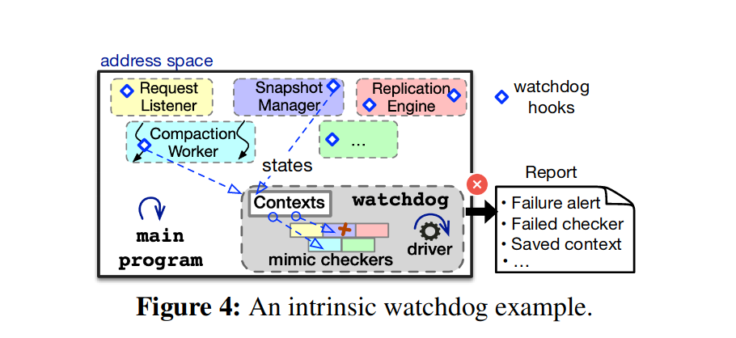
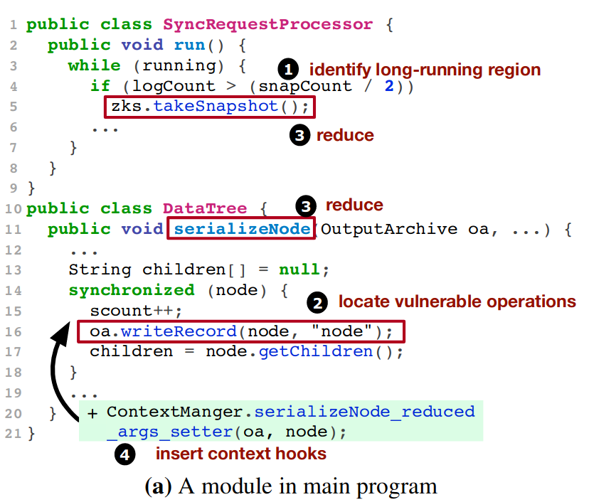
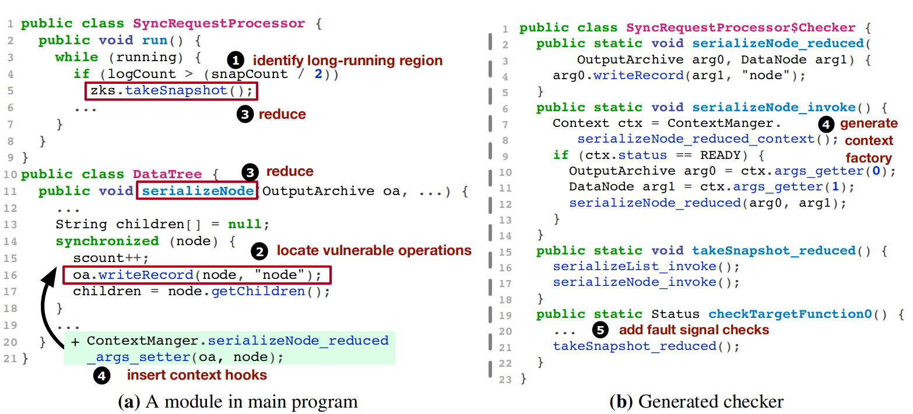

## 背景

partial failure 是区别于 fail-stop 模型 full failure 的另一种故障模式，简而言之，partial failure 指系统部分地故障，但不是完全故障而无法服务。论文给 partial failure 下了以下定义：

对于一个服务器进程 P，其中包含许多组件，提供一系列服务 R。如果进程 P 中发生了故障（fault），但这个故障没有让 P crash，但却破坏了 $R_f \notin R$ 安全性（safety）保证、活性（liveness）或性能问题，这样的故障就是 partial failure。

分布式系统经常遭受 partial failure，但却没有完善的 partial failure 检测方案。这篇论文分析了 100 个典型的 partial failure 案例，归纳了 partial failure 的模式，并开发了检测工具 OmegaGen 对抗 partial failure。

OmegaGen 类似软件版的 watchdog co-processor。watchdog co-processor 会在 CPU 执行的同时执行相同的指令，被广泛运用在嵌入式系统中（据我所知，理想汽车就用了这种技术）。watchdog co-processor 执行和 CPU 相同的指令，比较后就可以判断 CPU 是否正常工作。OmegaGen 通过静态分析自动生成 watchdog checker（软件版的 watchdog co-processor），在程序运行时执行相同的指令（实际上有所不同，后面会接扫），用这种方式检测程序是否发生了 partial failure。

## 目标
- 分析 partial failure 的模式
- 开发一个测试框架
    - 高效的检测
    - 定位出错位置
## 模式
论文分析了 100 个开源软件 partial failure 的实例，系统地观察到了许多模式。这些发现高度贴合现实，有的我甚至在生产环境遭遇过。

论文详细介绍了关于 partial failure 的 8 个发现，我总结如下：
- partial failure 的症状：48% 让某个服务或某种功能卡死，13% 让程序陷入未定义的故障状态，15% 的故障是静默的（包括数据损坏等）。
- partial failure 的原因：代码层面的原因非常多样，有逻辑错误、死锁等。论文发现有 48% 的原因跟错误处理有关。
- partial failure 的触发：触发的条件往往很难预料，71% 跟生成环境的特定条件、输入或故障有关。
- partial failure 的修复：修复很棘手，复现 bug、排查原因所花费的时间通常以周计。
这些观察和我的工作体验完全一致，我所遭遇的 partial failure 基本都是由于生产环境的某种特殊条件导致的卡死或不定时的性能问题，而且复现极其困难。

## 设计
partial failure 往往涉及特定代码块的执行和程序状态的破坏，为了高效地检测 partial failure，应该深入到代码的执行层面。一种思路就在程序（论文把被测试的程序称为“主程序”）执行的同时运行 watchdog 执行相同的指令，通过检测 watchdog 执行结果判断是否发生 partial failure。尽管这种思路很美好，但至少面临两个难题：
1. 如何同时执行相同的指令？
2. 如何进行隔离主程序和 watchdog？如果不做隔离，watchdog 的执行会破坏主程序的正常执行。

对于第一个问题，OmegaGen 通过将代码中关键的操作作归约（reduce）为更简单但逻辑相同的版本，归约后的版本会封装为一个 checker，进程在运行时执行这个 checker，论文称为 mimic-style checker。

对于第二个问题，OmegaGen通过 context 隔离内存，通过 IO direction 隔离 IO。
### 测试流程

OmegaGen 先对程序进行静态分析，生成 mimic-style checker，并在适当的位置插入 hook，让主试程序在执行时激活 checker。程序会将自己的参数写入 context，checker 从 context 获取参数。checker 运行在主进程的地址空间中，其逻辑和主程序可以视作相同的，接收的参数也相同，因此 checker 的执行结果也应当和主程序相同。

watchdog checker 主要检测安全性和活性：
- 安全性（safeness）：捕获抛出的异常，如 OOM、空指针等。
- 活性（liveness）：检测执行超时和性能突然变慢。
有些检测到的错误是短暂的（transient，指很快就会恢复）或者是系统可以容忍的，直接汇报错误会产生假阳性。为了减少假阳性，OmegaGen 会在检测到错误后运行 validator 判断检测到的错误是否可靠。虽然 OmegaGen 可以在检测到错误时自动选择 validator 执行，但 validator 需要用户手动编写（其中涉及特定领域的知识）。

对于正确性（correctness），OmegaGen 没有办法自动检测，只能依赖用户提供的`wd_assert`断言。`wd_assert`相当于用户为 OmegaGen 提供的 API specification。

### 归约算法
OmegaGen watchdog 监测的是系统中长期运行的方法，这些方法在代码中的模式通常是`while(true)`或者`while(flag)`，OmegaGen 通过静态分析识别这些模式。

#### 识别方法
然而，具有这些模式的方法不一定真的是长期运行的方法。某些方法虽然具有这种模式，但并非真的是长期运行的方法，例如某个循环只在特定条件下触发，或者循环很快就退出。因此，OmegaGen 为每个可能的长期运行的方法生成 checker，但在循环开始和退出的位置插入 predicate hook。predicate hook 在进入循环时设置标志位，在退出循环时重置标志位。运行时，checker 只要检查标志位就能判断这个方法是否真的是长期运行的方法，从而跳过不必要的 checker 执行。

#### 识别操作
识别到长期运行的方法后，OmegaGen 要识别其中容易出错的关键操作。显然，平凡的操作（例如递增等）和正确性不受特定环境影响的操作（例如排序）不是关键操作，应该被忽略。前面的观察可以发现，大多数 partial failure 的发生取决于生产环境的特定环境和输入，并且症状大多数是卡死。因此，关键操作应当是那些会受特定环境影响，而且容易导致卡死的操作，包括：
- 和外界的交互，包括依赖外部输入的参数的操作、磁盘和网络 IO 等。
- 可能导致卡死的操作，包括复杂的循环、同步操作、事件轮询、资源获取和释放。
OmegaGen 主要通过标准库识别关键操作，例如在下图中`oa.writeRecord`中有大量 IO 操作，因此被识别为关键操作。

关键操作的识别有良好的容错性，普通操作被识别关键操作只会浪费一些系统资源。关键操作被错误忽略通常也不影响测试结果。如果关键操作造成的错误通常会沿着调用链扩散，卡死会导致上层调用者卡死，抛出的异常通常也会传递到上层调用这。因此，即使忽略了某些关键操作，只要在其调用链上有别的操作被识别为关键操作，也有机会检测到故障。

#### 归约程序
成功识别到关键操作后，OmegaGen 会从长期运行的方法入手，自顶向下地递归地进行归约（reduce），逻辑如下：
1. 对于指令：如果该指令被标记为关键操作则保留，否则丢弃。
2. 对于函数调用：递归地进行归约，如果该函数中有函数调用或指令被标记为关键操作则保留，否则丢弃。
最终会得到一个保留了原始调用链的简化版的函数，例如原始调用链是`f->g->h`，归约后的版本会是`f'->g'->h'`。保留了原始调用链有利于定位出错位置。

归约后的方法能够视作原始方法的替代品进行测试的根本原因是其中的关键操作，执行归约后的程序本质上是在执行其中的关键操作。某些关键操作，例如`oa.writeRecord`可能在多处被调用。保留过多的冗余的调用，不仅对提高测试效率没有帮助，还会浪费系统资源；保留过少的调用，会错过许多暴露 partial failure 的机会。因此，OmegaGen 采取折中的方案，一个关键操作（函数）可以重复出现在一个归约化方法中，但不可以重复出现在多个归约化方法中。

归约化方法会被封装为 watchdog，watchdog 除了调用归约化方法，还会在执行完成后调用 validator 判断暴露的错误是否真的是 partial failure。

OmegaGen 会在原始方法前插入 context hook，这个 hook 保存主程序调用方法时的参数到 context 中，watchdog 从 context 获取参数用于执行。

### 隔离
watchdog 和主程序运行在同一个地址空间，因此必须对 watchdog 和主程序进程隔离，避免 watchdog 的运行破坏主程序的状态。主要是内存状态和 IO 操作两大方面。

#### 内存状态
OmegaGen 会分析 watchdog checker 引用的所有主程序变量（状态），并将这些变量统一记录在一个 context 中，context manager 提供了 setter 和 getter 接口。主程序在 context hook 中调用 setter 更新并复制 context，watchdog checker 调用 getter 从复制后的 context 获取主程序当时的状态并作为自己的参数。

通过复制实现了主程序和 watchdog checker 在内存状态层面的隔离，但复制存在性能问题。OmegaGen 做了一个优化，使用 copy-on-get 策略减少复制：
1. 通过静态分析，查找到那些只读（immutable）对象。这些对象在 context 中只保留引用，不进行复制。
2. watchdog checker 调用 getter 时再复制状态。

copy-on-get 策略虽然减少了复制，却带来了一致性问题。论文贴心地在附录详细说明了一致性问题。考虑这种场景：
1. 主程序在 context hook 中调用 setter 更新了 context；
2. 主程序继续执行，在某处更新了对应的对象；
3. watchdog checker 调用 getter 从 context 获取对象。

此时 watchdog checker 获取到的是主程序修改后的状态，而不是 context hook 更新的状态，导致 watchdog checker 使用错误的参数。

为了解决这种不一致性，OmegaGen 给 context 添加了以下三个字段，并在 setter 中更新这些字段。
- `weak_ref`：指向对象的指针，对象被 GC 后该指针为`null`。
- `hash`：setter 设置的该对象的哈希值，这个值可以用来判断对象是否在 setter 调用后被修改。
- `version`：context hook 更新 context 时递增，这个值可以用来判断一个 context 中的多个值是否由同一个 context hook 更新。

watchdog checker 从 context 获取参数后，按这个逻辑检验状态是否时 context hook 更新时的状态：
1. `weak_ref`为`null`，说明对象被 GC；
2. 计算对象当前的哈希值并和`hash`比较，不相等说明在 context hook 更新 context 后又被主函数更新了；
3. 获取多个对象时，这些对象的`version`必须相同，否则说明这些对象是不同轮次的 context hook 更新的。

第三点比较难懂，考虑这个场景：
1. Task T 调用 context hook 更新 context，`version`为 1；
2. watchdog checker 从 context 获取对象，发现`weak_ref`和`hash`均合法；
3. Task T 再次被执行，调用  context hook 更新 context，`version`为 2；
4. watchdog checker 从  context 获取另一个对象，发现`weak_ref`和`hash`均合法。
虽然`weak_ref`和`hash`都合法，但 watchdog checker 获取到的状态却是 Task T 两次运行混杂的状态。因此，多个对象`version`相同可以确保这些状态是在同一次调用中被设置的。
#### IO 操作
对于读操作，大部分情况下读操作都是非幂等的。例如，程序调用`read(2)`读取文件时，内核会维护一个文件偏移量，主程序读取后，watchdog checker 再读取就会报错`EOF`。为了解决这个问题，OmegaGen 将所有需要读取的关键操作包装了一层，主程序读取完将结果缓存到 context 中，watchdog 在主程序读取完成后从 context 获取结果。这种方式不容易隐藏错误，如果主程序由于读操作而卡死，会进一步导致 watchdog 超时，如果主程序读取到错误的结果，这个错误也会扩散到 watchdog。

对于写操作，总的思路是 IO direction，但比读操作更加棘手。
- 普通文件 IO：将 watchdog 的 IO 重定向到原始文件的相同目录下的另一个文件。由于两个文件在同一个目录中，文件系统相关的故障大概率会同时影响两个文件。
- 带负载均衡的 IO：对于 S3 这种分布式存储系统，存储服务的网关层通常会做负载均衡，将请求转发到不同的存储节点。因此，服务主程序的存储节点和服务 watchdog 的存储节点可能会不同，这可能导致 watchdog 无法发现和特定节点有关的 partial failure。从 S3 用户的视角看，尽管 S3 这样的存储服务有负载均衡，但是这对于用户应当是不可见的，如果出现了某个节点正常但某个节点异常的情况，这是存储服务的问题，而不是主程序的问题。
- socket IO。论文说，如果提前知道 socket IO 的对象也是 OmegaGen 管理的，可以用类似文件 IO direction 的方式处理。论文没有详细说明，我推测论文的意思是将 socket IO 重定向到 OmegaGen mock 出的一个端口。论文默认将 watchdog socket IO 操作重写为 ping 操作。这样做相当于 watchdog 只是执行了业务逻辑，但是并没有真的进行 socket IO，我怀疑这样的处理不能确保 watchdog 结果和主程序相同。

## 评估
我比较以下几点：
- 假阳性。如果误报率极高，开发者要么只能放弃测试，要么忍受误报带来的 CI 失败了流程卡死。论文测试表明在极高负载下，误报率大约为 1%，并且都是由于临时性的问题。这个误报率完全可以接受。
- 故障注入测试。OmegaGen 发现了 13（总共 16 个）故障。作者后续还发表了另一篇论文 *Efficient Exposure of Partial Failure Bugs in Distributed Systems with Inferred Abstract States* 用静态分析技术知道故障注入。
- 定位错误位置：55% 的用例直接确定了错误位置，35% 的用例给出了有用的信息。这个准确性对开发者已经很有用了。

## 思考
OmegaGen 主要是针对活性和安全性，对正确性无能为力。正确性需要正确的理解代码，即使是高级水平的开发者也很难明确且完整地指出某个 API 或者函数怎样才是正确的。OmegaGen 只是通过静态分析理清程序的结构，但还谈不上”理解代码“。最近，Go 语言的 tech leader [Russ Cox](https://swtch.com/~rsc/) 卸任并启动了 [Oscar](https://go.googlesource.com/oscar/+/refs/heads/master/README.md) 项目，这个项目用 LLM 自动化开源项目维护，它通过 LLM 理解用户提出的 MR/PR、Issue，可以指出相关代码、文档的位置。不知道将来有没有希望用 LLM 理解代码，并自动给出正确的（暂时不考虑完整性）正确性规定，用来指导测试程序的正确性。

## Q&A
- [x] checker 运行的时机？
    Evaluation 中说，每秒运行一次。如果是定时运行，而不是每次主程序调用都触发 watchdog checker，这样不会有正确性问题吗？
    
    watchdog checker 针对的是关键操作，没有完整地执行业务逻辑。定期执行关键操作应该没问题。

## References
