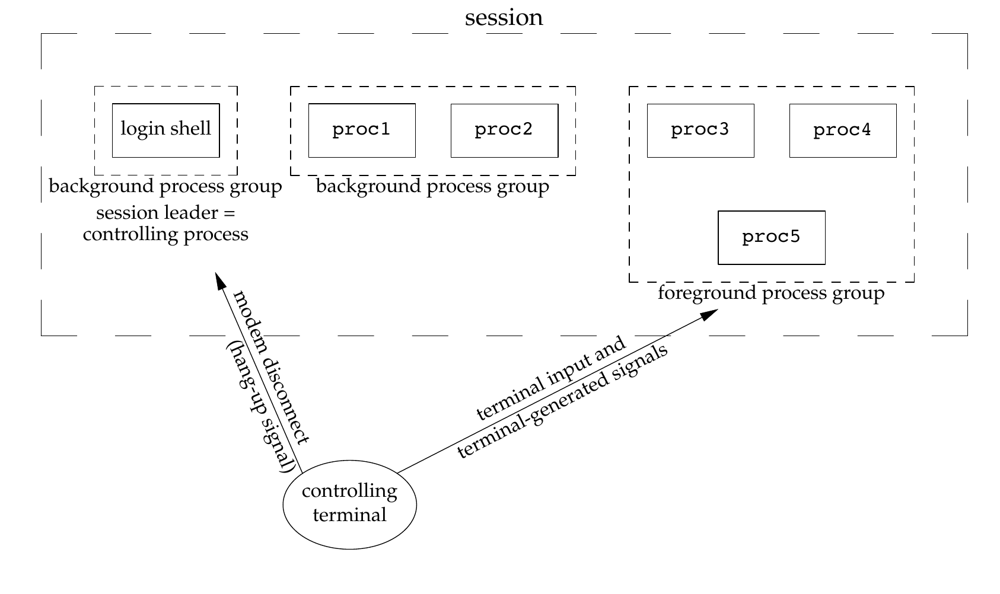

UNIX是分时系统，同时运行着多个进程，进程之间相互联系，形成了进程组、会话等进程关系，这些进程关系会影响某些函数/系统调用和信号的行为。

## 进程的起源

所有的进程都有一共同的起源，加电开机启动操作系统并登录（获取*login shell*）就是用户进程的起始[^1]。这里介绍传统的UNIX登录机制。

UNIX登录的过程一般分为两种：

- 终端登录（*terminal login*）
- 网络登录（*network login*）

终端登录就是在本地计算机中启动操作系统并取得 login shell，比如没有安装桌面环境（KDE、GNOME等）的 GNU/Linux 系统，启动后就是命令行，要求输入用户名和密码，验证通过后就会取得 login shell。实际上终端并不特指没有图形界面的黑框框，最早期的终端实际上是一种专门的计算机外设，类似与今天的显示器和键盘。

网络登录就是通过网络登录远程计算机取得 login shell，比如腾讯云、阿里云的 Linux 服务器，登录后就是命令行黑框框，就好像是在本地登录的一样。

## BSD 终端登录

1. 启动 init 进程，init 进程可能会读取终端相关的配置文件，如 /etc/ttys 等。

2. 为每个终端 fork 出一个子进程，并使用`exec()`函数执行`getty()`例程。

3. `getty()`例程打开终端设备（标准输出、标准输入、标准错误）、读取用户名、初始化环境变量，并使用`exec()`系列函数执行login 例程。

4. login 例程接收密码，如果验证成功就修改工作目录到家目录、修改终端所有权、设置用户信息（UID、GID等）、初始化环境变量（SHELL、PATH等）后执行 login shell。

5. 如果验证失败，终止进程，init 进程再次执行步骤2。

通过以上步骤，用户就取得了 login shell，并且 login shell 是 init 进程的子进程（exec 系列函数只执行程序不改变进程ID)。login shell 也会读取它的配置文件来初始化自身。

BSD 的终端登录方式在 UNIX 世界有巨大的影响，被许多 UNIX 实现采用，比如 Linux 早期版本（Linux 0.12）就是用类似 BSD 的登录方式。现在终端登录复杂了很多，许多系统装有 X window，登录后是图形界面而不是字符界面。GNU/Linux 发行版在终端登录上也存在很大的分歧，有些发行版仍使用 init 进程，另一些发行版（比如 Red Hat）使用 systemd 代替传统的 init。

## 网络登录

网络登录与终端登录在**物理上**主要的区别在于终端登录时用户使用本地的主机，而网络登录时用户使用远程的主机，通过互联网相连。为了让软件不需修改就能在网络登录的情况下运行，UNIX 系统发明了*伪终端*（*pseudo terminal*）来消除本地终端登录和远程网络登录的差异。伪终端是一种软件，不和物理设备关联，伪终端由一对*主伪终端*（*master pseudo terminal*）和*副伪终端*（*slave pseudo terminal*）组成。一般远程主机使用主伪终端，本地计算机使用副伪终端，主伪终端的输出即为副伪终端的输入，反之亦然。伪终端有些类似与管道，但是提供了更复杂的功能，让远程终端之间可以互连，所有和终端相关的系统调用都可以在伪终端上使用。

网络登录与终端登录**在过程上**的区别主要在于远程主机不断监听网络登录的端口，如果接收到用户请求，则为用户启动 login shell。使用 telnet 登录的过程如下：

1. init 进程 fork 并执行 sh，让后 sh 执行 /etc/rc 下的各种脚本，其中一个脚本执行 inetd 后台进程。

2. 当有用户请求连接时，inetd 进程 fork 并 exec 出 telnetd 进程

3. telnetd 进程打开伪终端并启动 login shell

## 进程与进程组

进程组是多个相关的进程的集合，通过进程组ID（PGID）来标识。fork 出来的子进程会继承父进程的 PGID，并且保证子进程的 PID 不等于任何 PIGD，因此子进程成为了父进程所在进程组的一员。

每个进程组都可以有一个*进程组首领*（*process group leader*)，这个首领是 PID 与 PGID 相同的进程。因为进程组组长是 PID 和 PGID 相同的进程，并且任意时刻不存在相同的 PID 或 PGID，所以任意时刻一个进程组只能有一个进程组组长。

进程和进程组的概念可以类比现实生活中的家庭，家庭（进程组）中的成员（进程）都具有血缘关系（fork），一般会有一个家长（进程组首领）。

UNIX 没有为进程组 ID 提供专门的数据类型，PGID 的数据类型与 PID 相同，使用`pid_t`。获取、修改进程、进程组 ID 的系统调用主要有以下几个：

- `getpid()`: 获得当前进程 PID
- `getppid()`: 获得当前进程的父进程的 PID
- `getgpid()`: 获得某进程所在进程组
- `setpgid()`: 来加入已有进程组或创建新进程组

除了`getpgid()`和`setpgid()`，UNIX 系统还提供了`getpgrp()`和`setpgrp()`系列函数，`XXXpgrp`系列函数除了`getpgrp(void)`是 POSIX.1 规定的，其他都是特定 UNIX 实现中的函数。`XXXpgid`系列函数接口比较清晰，并且是标准规定的，因此建议只使用`getpgid()`和`setpgid()`。

创建新进程组的情况一般是某进程让自己成为进程组首领，因为`fork()`保证子进程的 PID 不等于任何已存在的 PGID，所以这种情况下可以放心调用`setpgid(0, 0)`。

 使用`setpgid`()时需要注意权限问题：

- 只能将进程加入到本会话的进程组中。

- 只能修改调用进程及其子进程的 PGID。

- 只能用于未执行 exec 系列函数的进程。

- 不可以修改会话首领的 PGID。

只要违反了以上规定，`setpgid()`就会出错并设置 errno。

## 会话与控制终端

进程组是多个进程的集合，会话是多个进程组的集合。会话可以看成一个终端用户与系统进行交互、执行任务的过程。

比如在 bash 中执行以下命令

```bash
proc1 | proc2 &
proc3 | proc4 | proc5
```

当执行完第一行的命令后，bash 创建了两个进程，这两个进程在同一个进程组中;执行完第二行命令后，shell创建了3个进程，处于另一个进程组中。这两个进程组及 shell 本身处于同一个会话中。这个各会话可以用下图[^3]表示：



一个会话由多个进程组组成，其中创建该会话的进程被称为*会话首领*（*session leader*），也叫做 *controlling process*。会话也有自己的 ID，称为*会话 ID*（*SID*）。会话 ID 被定义为会话首领所在的进程组 ID。实际上，会话首领也一定是进程组首领，因此 SID、会话首领 PID、会话首领 PGID 是一致的。会话首领创建了会话，并唯一地标识了一个会话，拥有特殊的地位。

会话中的进程组分为*前台进程组*（*foreground process group*）和*后台进程组*（*background process group*），前台进程组是正在使用终端的进程组，终端被它们“独占”[^2]，后台进程组不能使用终端。即：

- 终端发送的所有信号都只发送给前台进程组
- 只有前台进程能够读写控制终端，后台进程如果读（写）则接受到 SIGTTIN（SIGTTOU）信号

在以下情况下，内核会向会话中的进程发送 SIGHUP 信号：

- 网络断开时，会话首领接收到 SIGHUP 信号
- 会话拥有控制终端，但控制终端的 CLOCAL 标志未置位，内核向会话首领发送 SIGHUP 信号
- 当会话首领终止，所有前台进程组都会接收到 SIGHUP 信号

一个会话最多拥有一个*控制终端*（*controlling terminal*），控制终端一般是终端设备（本地登录）或伪终端（网络登录）。会话中所有的进程（组）共用这个终端，并且任意时刻控制终端被前台进程组独占。

会话的概念和控制终端紧密相连，没有控制终端就没有了前台进程组和后台进程组的区别。显而易见，控制终端应当由会话首领打开。通常，起源于 BSD 的 UNIX 系统通过`ioctl()`打开控制终端，起源于 System V 的系统使用不带`O_NOCTTY`参数的`open()`调用打开控制终端。

有了以上概念，上面提到的信号相关的行为也就不难理解了。因为控制终端被前台进程组使用，因此所有终端产生的信息（字符、信号）都不会被发送到后台进程组；因为会话首领是会话的创建者和标识符，因此各种异常情况（比如网络断开）都向会话首领发送信号；会话首领打开了控制终端，当会话首领终止后，控制终端不应该再被使用，所以要向前台进程组发送 SIGHUP 以终止其对控制终端的使用。

会话在一定程度上划定了进程（组）活动的范围，这就是`setpgid()`无法修改别的会话中的进程的 PGID，也无法将调用进程移动到别的会话中的进程组的原因。进程只可以创建会话，但无法将自己移动到别的会话中。`setsid()`调用用于创建会话。

- 成为新会话的会话首领

- 创建新进程组并担任组长

- 断开与控制终端的连接

为了避免调用进程是进程组首领，创建新会话后，进程组组长在新会话中，进程组组员在旧会话中的尴尬局面，`setsid()`调用不允许调用进程是进程组组长。为了避免新会话和旧会话共用一个控制终端，`setsid()`创建新会话后会切断与旧控制终端的联系，新会话没有控制终端，需要手动打开。

前台进程组、会话 ID 是控制终端的属性，可以使用`tcgetprg()`获得前台进程组 ID（*TPGID*）、`tcsetprg()`设置终端的前台进程组、`tcgetsid()`获取控制终端的当前会话 ID。

## 作业控制

*作业*（*job*）是为完成某个任务而创建的进程的集合，通常是 shell 中的一行命令，比如`ps -ax | grep inetd`就是一个任务，其中包含两个进程。作业的概念和进程组并不冲突，一个作业中的进程可能处于不同的进程组（比如进程调用`setpgid()`创建了新进程组）。

*作业控制*（*job controlling*）指控制作业作为后台进程运行还是作为前台进程运行的能力。主要有三个层面

- shell：是否支持创建、管理前（后）台进程组的功能
- 终端驱动：是否支持前台进程组和后台进程组的概念
- 作业控制信号：是否有 SIGCHLD、SIGTTOU、SIGCONT 等信号

目前几乎所有广泛使用的 shell（如 bash、zsh、fish 等）都支持作业控制，一些比较老的 shell（如 sh）不支持作业控制。内核是否提供了对作业控制的支持会对 shell 层面的作业控制实现产生重要的影响，假如终端驱动不支持前（后）台进程组的概念，所有的进程都可以读写控制终端，那么 shell 可能会将后台进程组的标准 IO 重定向到 /dev/null 以模拟“后台进程组不能读写控制终端”。

上面提到，`fork()`出来的子进程会继承父进程的 PGID，而我们在 shell 运行命令创建进程后，命令对应的进程是 shell 的子进程，但却出于不同的进程组中。这就是因为 shell 在 exec 可执行文件前，使用`setpgid()`创建了新进程组并让子进程作为组长。这种情况存在*竞争条件*（*racing condition*），假如只通过父进程设置子进程 PGID。若父进程先运行，则子进程 PGID 被成功设置;若子进程先运行，并在执行了`exec()`系列函数后切换到父进程，`setpgid()`无法修改调用了`exec()`的进程的 PGID，所以子进程使用父进程的 PGID。为了避免竞争，通常父子进程都要设置子进程 PGID。

## 孤儿进程和孤儿进程组

孤儿进程是指父进程在其运行过程中终止的进程。孤儿进程会被 init 进程收养，init 进程会回收孤儿进程遗留的资源，确保孤儿进程不会僵尸进程。因为孤儿进程的这个特性，有时会故意让一个进程变成孤儿进程，避免僵尸进程的产生。

没有父亲的进程是孤儿进程，相似地，若在当前会话中该进程组外，没有进程是进程组中的进程的父亲，则该进程组是孤儿进程组。即满足以下任意条件：

- 进程组中所有进程的父亲都在该进程组中。
- 进程组中所有进程的父亲都在另一个会话中。

孤儿进程组相比与一般的进程组，特殊之处在于当孤儿进程组中存在停止状态的进程时，内核会向孤儿进程组中所有进程先发送`SIGHUP`信号（默认行为是终止进程）再发送`SIGCONT`信号。如果不了解孤儿进程组，程序很可能会出现很怪异的现象

孤儿进程组还会影响 SIGTTOU 和 SIGTTIN 信号。当孤儿进程组中的后台进程试图通过读取终端输入或试图向终端写入数据时，不会产生这两个信号。

## 总结

进程之间存在联系。任何进程（除进程 0 外）都有父进程，并且可以通过`fork()`创建子进程，子进程会继承父进程的进程组 ID。

进程之间通过血缘（父子进程）、移民（通过`setpgid()`加入进程组）形成了进程组。

使用同一控制终端进行交互的进程组又形成了会话，会话中的进程组分为前台进程组和后台进程组，前台进程组“独占”控制终端，后台进程组默认情况下只能眼睁睁地看着前台进程组使用终端。

多个进程（组）为同一个任务被创建出来，通常是 shell 中的一行命令，这就是作业。一个终端上运行着多个进程组、作业，必须对这些进程组、作业进行管理，这就引入了作业管理。巧妇难为无米之炊，shell 层面的作业控制往往还需要内核层面的支持。

僵尸进程、孤儿进程和孤儿进程组是进程关系中的特例。当父进程活着，子进程死亡，但父进程没有为子进程收尸时，子进程就变成了了僵尸进程，占用系统资源降低系统性能；当父进程先子进程而去，子进程都会被善良的 init 进程收养；当在会话中该进程组外，没有进程是该进程组中进程的父亲时，这个进程组就是孤儿进程组，系统会尝试终止它们的运行（发送 SIGHUP 信号），再恢复它们的运行（发送 SIGCOUT 信号）。

整篇文章的内容可以用以下图示[^4]总结：


**注**：以上两个图示均来自《UNIX 环境高级编程（英文版）》第三版。

[^1]: 系统启动后，内核会创建一个进程 0，这个进程是真正的进程之祖，由内核专门的代码创建，其他所有进程要么是它 fork 出来的，要么是它的子孙 fork 出来的。这个进程 0 一般代表操作系统内核本身，不参加进程调度，在系统没有任何进程活动时占据 CPU。
后台进程组不能使用控制终端是默认情况下的行为，可以修改控制终端的属性调整。
Figure 9.7, *Advanced Programming in the UNIX® Environment,Second Edition*
Figure 9.9, *Advanced Programming in the UNIX® Environment,Second Edition*
