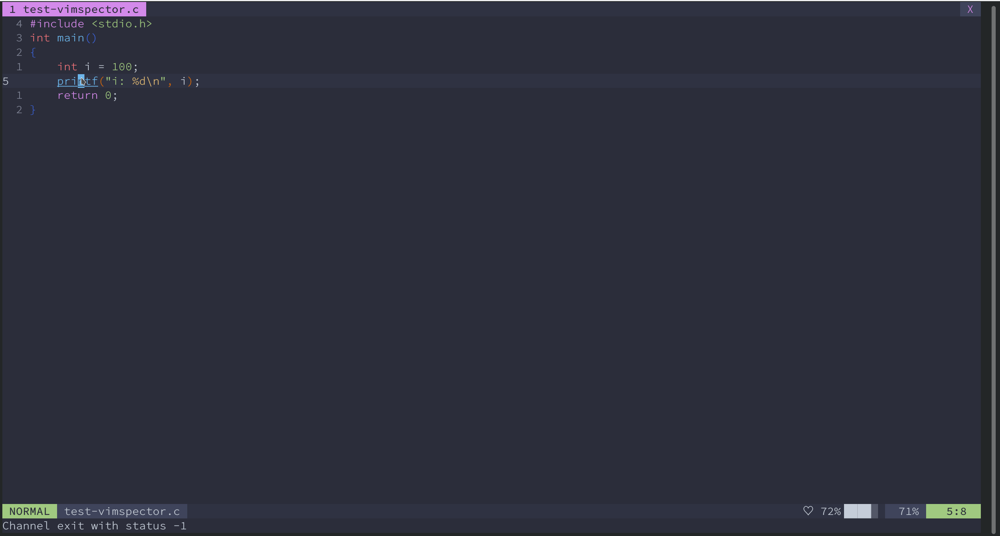
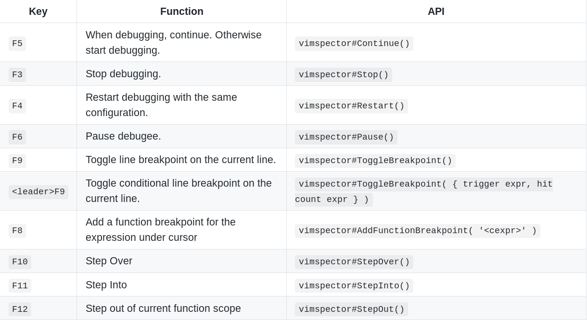

[vimspector](https://github.com/puremourning/vimspector#supported-languages)是一个基于 *DAP(debug adapter protocol)* 的Vim多语言调试插件，理论上能够支持所有支持语言（只要有对应的 DAP）。这个插件仍在实验阶段，可能会有各种bug，但是对C/C++、Python 等流行的语言已经进行了充分的测试。

这篇文章以调试 C/C++ 程序为例，介绍 vimspector 的配置与使用。


## 依赖

- 带 Python3.6+ 支持的 Vim 8.2 或更高版本
- 带 Python3.6+ 支持的 Neovim-0.4.3 或更高版本（最好是 Nightly 版本）

由于 vimspector 的作者主要在 GNU/Linux 上使用 Vim 开发，因此 Vimspector 作者 puremourning 明确表示在 vimspector 的充分测试并稳定后才会提供对 Neovim 的完整支持（见 issue [coc.nvim: Debug Adapter Protocol Support #322](https://github.com/neoclide/coc.nvim/issues/322))，因此目前对于 Neovim 和 Windows 的支持都处于实验阶段。我个人建议在 Vim 中使用本插件。


## 安装

### vimspector

使用`vim-plug`安装：

```
Plug 'puremourning/vimspector'
```

使用 dein.vim 安装：

```
call dein#add('puremourning/vimspector'）
```

### 调试适配器

最新版的 vimspector 可以在 Vim 中通过命令`:VimspectorInstall`安装调试适配器，按`Tab`键可以补全。

也可以使用安装脚本安装，进入`vimspector`的安装目录，执行：

```bash
./install_gadget.py <language-name>
```

`install_gadget.py`会自动下载`<language-name>`所需的调试适配器并进行相应配置,`--help`可以查看`vimspector`所支持的全部语言。

以在Linux环境上打开C/C++支持为例：

```
./install_gadget.py --enable-c
```

`vimspector`会自动下载微软开发的调试适配器`cpptools-linux.vsix`到`your-vimspector-path/gadgets/linux/download/vscode-cpptools/0.27.0/`中。如果是在mac上，`linux`会被改成`mac`。

如果下载速度过慢，可以自己下载好放置在上面提到的目录中，然后再执行以上命令。


## 配置

Vimspector 使用 json 作为配置文件的格式，每个配置都是一个 json 对象。

Vimpector 有两类配置：

- **调试适配器的配置**
  - 如何启动或连接到调试适配器
  - 如何 attach 到某进程
  - 如何设置远程调试
- **调试会话的配置**
  - 使用哪个调试适配器
  - launch 或 attach 到进程
  - 是否预先设置断点，在何处设置断点

这两类配置可以对应多个配置文件，vimspector 会将多个配置文件中的信息合并成一个配置。

### 调试适配器配置

调试适配器的这个配置在打开 vimspector 对某语言的支持时就已经自动设置好了，存放在 your-path-to-vimspector/gadgets/linux/.gadgets.json 中。

比如在我的设备上，.gadgets.json 内容如下：

```json
{
  "adapters": {
    "vscode-cpptools": {
      "attach": {
        "pidProperty": "processId",
        "pidSelect": "ask"
      },
      "command": [
        "${gadgetDir}/vscode-cpptools/debugAdapters/OpenDebugAD7"
      ],
      "name": "cppdbg"
    }
  }
}

```

其中变量`${gadgetDir}`代表着存放 .gadgets.json 的目录。除此之外，vimspector 还定义了其他预定义变量，并提供了自定义和用户输入变量内容的功能，以便我们编写比较通用的配置文件。

调试适配器的配置还可以存在于其他配置文件中，vimspector 读取一系列配置文件，生成`adapters`对象。

调试适配器的配置可以存在于以下文件中：

1. our-path-to-vimspector/gadgets/\<os>/.gadgets.json：这个文件由 install_gadget.py 自动生成，用户不应该修改它。

2. your-path-to-vimspector/gadgets/\<os>/.gadgets.d/*.json ：这些文件是用户自定义的。

3. 在 Vim 工作目录向父目录递归搜索到的第一个 .gadgets.json。

4. .vimspector.json 中定义的`adapters`。

编号代表配置文件的优先级，编号越大优先级越高，高优先级的配置文件将覆盖低优先级的配置文件中的的`adapters`。

在我的机器上没有 your-path-to-vimspector/gadgets/\<os>/.gadgets.d目录，可能是需要自己创建。

不进行远程调试的情况下不太需要修改默认的调试适配器配置。我一般没有进行远程调试的需求，没有实际使用过 vimspector 的远程调试功能（虽然这个功能是 vimspector 重点支持的），因此不介绍调试适配器的配置。

### 调试会话配置

项目的调试会话的文件位于以下两个位置：

1. \<your-path-to-vimspector>/configurations/\<os>/\<filetype>/*.json
2. 项目根目录中的 .vimspector.json

每当打开一个新的调试会话时，vimspector 都会在当前目录向父目录递归搜索，如果查找到了 .vimspector.json，则使用其中的配置，并将其所在的目录设定为项目根目录;如果未查找到，则使用 vimspector 安装目录中的配置文件，将打开的文件的目录设置为项目根目录。

修改了.vimspector.json 后不需要重启 Vim 就可以使用最新配置。

### 配置选项

vimspector.json 中只能包含一个对象，其中包含以下子对象：

- `adapters`：调试适配器配置，如果不是进行远程调试，一般不需要设置
- `configurations`：调试程序时的配置

`configurations`主要包含以下以下字段：

- `adapter`:使用的调试配置器名称，该名称必须出现在`adapters`块或其他调试适配器配置中。
- `variables`：用户定义的变量
- `configuration`：配置名，如`configuration1`
- `remote-request`,`remote-cmdLine`：远程调试使用

其中`adapter`和`configuration`是必须的。

`configuration`需要包含的字段和使用的 DAP 有关，我使用[vscode-cpptools](https://github.com/microsoft/vscode-cpptools)。`configuration`必须包含以下字段：

- `request`：调试的类型，`lauch`或`attach`
- `type`：`cppdgb`(GDB/LLDB)或`cppvsdbg`(Visutal Studio Windows debugger)

除了以上的选项，还可以设置程序路径、参数、环境变量、调试器路径等，更详细的信息可以查看 vscode-cpptools 文档[launch-json-reference](https://code.visualstudio.com/docs/cpp/launch-json-reference)。

上面的选项构成了 vimspector 配置文件的主体框架，完整的选项参考[vimspector.schema.json](https://puremourning.github.io/vimspector/schema/vimspector.schema.json)。

## 变量

Vimspector 提供了比较灵活的变量定义功能，可以方便的自定义配置。

### 预定义变量


### 自定义变量

自定义变量要在起作用的配置中定义，并置于`variables`块中，如下面的`GDBServerVersion`和`SomeOtherVariable`。

```javascript
{
  "configurations": {
    "some-configuration": {
      "variables": {
        "GDBServerVersion": {
          "shell": [ "/path/to/my/scripts/get-gdbserver-version" ],
          "env": {
            "SOME_ENV_VAR": "Value used when running above command"
          }
        },
        "SomeOtherVariable": "some value"
      }
    }
  }
}
```

可以通过 shell 设置变量的值，代码块中的`GDBServerVersion`的值就是 shell 脚本`/path/to/my/scripts/get-gdbserver-version`的输出。

经我实验，自定义变量似乎不能够依赖自定义变量，也不可以在`shell`中使用预定义变量，可能之后的版本会实现这些功能。

也可以从用于输入中获取变量的值。只要 vimspector 发现了未定义的变量，就会在运行时提示用户输入变量值。Vimspector 支持 splat 运算符（不清楚中文叫什么），语法为`*${Variable}`，可以将一个变量拓展开。

以上两个特性结合在一起可以实现很灵活的配置，最典型的运例子是程序参数的传递。Vimspector 调试的程序的参数以数组的形式传递，在配置文件中将`args`设置为一个在运行时用户输入的变量，就可以模拟命令行的效果。

``` javascript
  "args": [ "*${CommandLineArgs}" ]
```

在运行时 vimspector 会要求用户输入值，如果用户输入`1`、`2`、`3`,`args`就会被拓展成`["1", "2", "3"]`。

### 默认值

可以为变量提供默认值，`${variableName:default value}`。在`${}`中引用变量时，`}`要通过`\`转义，即将`}`写为`\\}`。

```json
  {
    "configuration": {
      "program": "${script:${file\\}}"
    }
  }
```

`program`默认设置为变量`file`的值。

### 类型转换

vimspector 介绍的的用户输入都字符串，有时会出现类型和用户期望的不同的情况。比如，用户为布尔类型的变量`StopOnEntry`输入`true`，vimspector 接收到字符串`"true"`，并将它赋给变量，这样出现了类型不一致的情况。

```json
  {
    "configuration": {
      "stopAtEntry": "${StopOnEntry}"
    }
  }
```

在字段后添加`#json`可以将接收到的字符串转换成 json 里的类型。如果变量以`#json`结尾，需要在字段尾部添加`#s`以告知 Vimspector 这个变量以`#json`结尾，而不是进行类型转换。

```json
 {
    "configuration": {
      "stopAtEntry#json": "${StopOnEntry}"
    }
  }
```

这样，用户输入`true`，vimspector 接收到字符串`"true"`，然后再将它解析为布尔类型的`true`。

## 多配置共存

可以在 .vimspector.vim 中写多个配置，在启动 vimspector 时再选择使用的配置。这样的话，可以将所有自己需要的配置写入到一个文件，在创建项目时复制到项目中。

和配置选择有关的字段有两个：

`autoselect`: 布尔类型。在只有一个配置可用时，是否自动选择它。

`default`: 布尔类型。当启动时用户没有选择配置时，使用本配置。

## 断点

可以在配置中提前打好断点，比如在程序入口点暂停（通常是`main()`），在抛出异常时暂停等，暂时不支持在配置中，打函数、代码行断点

`stopAtEntry`: 布尔类型。是否在程序入口点暂停。

`cpp_throw`: 在抛出异常时暂停

`cpp_catch`: 在捕获异常时暂停

```json
{
    "example":{
        "stopAtEntry": true,
        "MIMode": "gdb",            // 使用 GDB
        "breakpointers": {
        "exception": {
             "cpp_throw": "Y",
             "cpp_catch": "N"
         }
        }
    }
}
```

目前 Vimspector 对断点的支持还比较有限，仅支持打断点，不能够方便的编辑、禁用、使能断点，将来这些功能会实现在断点窗口中，参考[[Feature Request]: Breakpoints window #10](https://github.com/puremourning/vimspector/issues/10)。

## 示例

Vimspector 的配置其实很简单，但是纸上谈兵有些难以理解。这里将给出几个可以实际使用的配置，如调试 Vim、调试 qemu 模拟器中的 OS 内核。

### 调试 Vim

vimspector 文档中给出的调试vim的配置：

```javascript
{
  "configurations": {
    "Vim - run a test": {                           // 配置名
      "adapter": "vscode-cpptools",                 // 使用的调试适配器
      "configuration": {                            // 具体的配置
        "type":    "cppdbg",                        // 调试器类型：cppdbg(GDB/LLDB) 或 cppvsdbg(VISUAL STUDIO)
        "request": "launch",                        // 调试类型：launch（启动程序） 或 attach（连接进程）
        "program": "${workspaceRoot}/src/vim",      // 带有调试信息的可执行文件目录
        "args": [                                   // 程序的参数，一个 json 数组
          "-f",
          "-u", "unix.vim",
          "-U", "NONE",
          "--noplugin",
          "--not-a-term",
          "-S", "runtest.vim",
          "${Test}.vim"                             // 未定义的变量，用户输入
        ],
        "cwd": "${workspaceRoot}/src/testdir",      // 当前工作目录
        "environment": [                            // 环境变量
          { "name": "VIMRUNTIME", "value": "${workspaceRoot}/runtime" }
        ],
        "externalConsole": true,                    // 是否使用外部终端
        "stopAtEntry": true,                        // 是否在程序入口点暂停
        "MIMode": "lldb",                           // 使用 LLDB 作为调试器
        "logging": {                                // 调试适配器的输出
          "engineLogging": false                    // 是否打印调试适配器产生的信息，默认不打印
        }
      }
    }
  }
}

```

### 调试 qemu-riscv64 中的 OS 内核

用以下命令启动 qemu 模拟器，让它监听`localhost:1234`等待 GDB 连接：

```shell
 qemu-system-riscv64 \
       -machine virt \
       -s -S         \
       -nographic    \
       -bios default \
       -device loader,file=kernel.img,addr=0x80200000
```

因此，我们要配置 vimspector 让 RISCV 架构的 GDB 连接到`localhost:1234`。

```json
{
    "configurations": {
        "qemu-riscv64-oslab": {
            "adapter": "vscode-cpptools",
            "variables": {
                "kernelBin": "kernel.bin,                                // 带有调试信息的内核可执行文件
                "riscvGDB": "/usr/local/bin/riscv64-unknown-elf-gdb"     // GDB 路径
            },
            "configuration": {
                "type":    "cppdbg",
                "request": "launch",
                "program": "${kernelBin}",
                "cwd": "${workspaceRoot}",
                "environment": [],
                "externalConsole": true,
                "stopAtEntry": true,
                "MIMode": "gdb",                                         // 使用 GDB
                "miDebuggerPath": "${riscvGDB}",                         // GDB 路径为 ${riscvGDB}
                "setupCommands": [                                       // 设置 GDB 初始化命令，相当于 gdbinit
                    {
                        "description": "Enable pretty-printing for gdb", // 描述，不会被 GDB 使用
                        "text": "set architecture riscv",                // 命令
                        "ignoreFailures": false                          // 是否忽略错误
                    },
                    {
                        "description": "Connect gdbserver within qemu",
                        "text": "target remote localhost:1234",
                        "ignoreFailures": false
                    }
                ]
            }
        }
    }
}
```

上面的配置依赖 vscode-cpptools，不支持其他的调试适配器。

### 我自己的配置

我将我可能使用的配置写入到一个文件，这样不需要重复编写，在启动 vimspector 选择即可。

```json
{
    "configurations": {
                                                                   // 上面介绍过了，不再赘述
        "qemu-riscv64-oslab": {
           // ...
        },
        "launch-current-file": {
            "adapter": "vscode-cpptools",
            "configuration": {
                "default": true,
                "type":    "cppdbg",
                "request": "launch",
                "program": "${fileDirname}/${fileBasenameNoExtension}",
                "args": ["*${ProgramArgs}"],                      // 用户输入
                "cwd": "${workspaceRoot}",
                "environment": [],
                "externalConsole": true,
                "stopAtEntry": true,
                "MIMode": "gdb",
                "breakpointers": {
                    "exception": {
                        "cpp_throw": "Y",                          // 抛出异常时暂停
                        "cpp_catch": "N"                           // 捕获时不暂停
                    }
                }
            }
        },
        "launch-current-project": {
            "adapter": "vscode-cpptools",
            "configuration": {
                "variables": {
                    "ProgramName": {
                        "shell": ["basename ", "${workspaceRoot}"] // 无法正确执行，需要用户输入
                    },
                    "ProgramPath": "${workspaceRoot}/_builds/${ProgramName}"
                },
                "type":    "cppdbg",
                "request": "launch",
                "program": "${workspaceRoot}/_builds/${ProgramName}",
                "args": ["*${ProgramArgs}"],
                "cwd": "${workspaceRoot}",
                "environment": [],
                "externalConsole": true,
                "stopAtEntry": true,
                "MIMode": "gdb",
                "breakpointers": {
                    "exception": {
                        "cpp_throw": "Y",
                        "cpp_catch": "N"
                    }
                }
            }
        },
        "attach-current-file": {
            "adapter": "vscode-cpptools",
            "configuration": {
                "type": "cppdbg",
                "request": "attach",
                "program": "${fileDirname}/${fileBasenameNoExtension}",
                "MIMode": "gdb",
                "breakpointers": {
                    "exception": {
                        "cpp_throw": "Y",
                        "cpp_catch": "N"
                    }
                }
            }
        },
        "attach-current-project": {
            "adapter": "vscode-cpptools",
            "configuration": {
                "variables": {
                    "ProgramName": {
                        "shell": ["basename", "${workspaceRoot}"]
                    },
                    "ProgramPath": "${workspaceRoot}/_builds/${ProgramName}"
                },
                "type": "cppdbg",
                "request": "attach",
                "program": "${ProgramPath}",
                "MIMode": "gdb",
                "breakpointers": {
                    "exception": {
                        "cpp_throw": "Y",
                        "cpp_catch": "N"
                    }
                }
            }
        }
    }
}

```



## 使用技巧

### 快捷键

Vimspector 预设了vscode mode 和 human mode 两套键盘映射（快捷键）。

但是对C/C++、Python 等流行的语言已经进行了充分的测试。开启vscode mode：

```
let g:vimspector_enable_mappings = 'VISUAL_STUDIO'
```

开启 human mode：

```
let g:vimspector_enable_mappings = 'HUMAN'
```



这两个套快捷键都要用到 F11 和 F12，往往会和终端快捷键冲突，比如 F11 是最大化终端，F12 是弹出 guake 之类的下拉框终端，建议终端用户重新定义快捷键。参考快捷键：

```vim
nnoremap <silent> <F1> :call vimspector#Stop()<CR>
nnoremap <silent> <F2> :call vimspector#Restart()<CR>
nnoremap <silent> <F3> :call vimspector#Continue()<CR>
nnoremap <silent> <F4> :call vimspector#Pause()<CR>
nnoremap <silent> <F5> :call vimspector#RunToCursor()<CR>
nnoremap <silent> <F6> :call vimspector#ToggleBreakpoint()<CR>
nnoremap <silent> <Leader><F6> :call vimspector#ListBreakpoints()<CR>
nnoremap <silent> <F7> :call <SID>toogle_conditional_breakpoint()<CR>
nnoremap <silent> <F8> :call vimspector#StepOver()<CR>
nnoremap <silent> <F9> :call vimspector#StepInto()<CR>
nnoremap <silent> <F10> :call vimspector#StepOut()<CR>

function! s:toogle_conditional_breakpoint()
    let l:condition = trim(input("Condition: "))
    if empty(l:condition)
        return
    endif
    let l:count = trim(input("Count: "))
    if empty(l:count)
        let l:count = 1
    else
        let l:count = str2nr(l:count)
    endif
    call vimspector#ToggleBreakpoint({'condition': l:condition, 'hitCondition': l:count})
endfunction

```

### 修改 UI

Vimspector 的 UI 是针对宽屏设计的，对于笔记本屏幕可能不太友好，最主要的问题是 console 窗口挤占了源代码窗口的空间，可以在启动时关闭 console 窗口，需要时再使用`:VimspectorShowOutput Console`显示。

```vim
augroup MyVimspectorUICustomistaion
  autocmd User VimspectorUICreated call <SID>vimspector_custom_ui()
augroup END

" Custom Vimspector UI
" close console window to maximise source code window
function s:vimspector_custom_ui()
    if !getwinvar(g:vimspector_session_windows.output, '&hidden')
        let l:winid = win_getid()
        let l:cursor = getcurpos()
        call win_gotoid(g:vimspector_session_windows.output)
        :quit
        call win_gotoid(l:winid)
        call setpos('.', l:cursor)
    endif
endfunction

```

调整 UI 的具体细节可以参考文档。

### Ballon-Eval

当鼠标悬浮在变量上时，Vimspector 会自动打印变量的类型与值，这个功能 依赖于 ballon-eval（help），仅支持 GVim，但 Vim 最好也开启 ballon-eval 支持。如果不使用 GVim，可以使用以下映射手动查看变量的值。

```vim
nmap <Leader>di <Plug>VimspectorBalloonEval
xmap <Leader>di <Plug>VimspectorBalloonEval
```

### 修改变量打印的格式

在 watch 窗口中输入变量名时在后面加上`,format`可以修改打印格式，目前使用 vscode-cpptools 似乎只能使用`,x`（十六进制）和`,o`（八进制）。

## 题外话：GDB 前端推荐

参考[韦易笑](https://www.zhihu.com/people/skywind3000)的文章[终端调试哪家强](https://zhuanlan.zhihu.com/p/32843449)，尝试了几种 C/C++ 调试方案，得到以下结论：

裸 GDB ==> cgdb ==> Vimspector/VSCode ==> gdbgui

其中 Vimspector 和 VSCode 均使用 vscode-cpptools，个人认为在能力上没有太大区别。[gdbgui](https://github.com/cs01/gdbgui)是一个基于浏览器的 GDB 前端，能力应该是上述几种方案中最强的。gdbgui 有以下几个突出特性：
- 不需要配置
gdbgui 不需要配置，只需要像直接使用 gdb 一样输入命令即可，如`gdbgui -g 'gdb program -x gdbinit'`。
- 兼顾 GUI 和命令行
在 gdbgui 中可以直接在 gdb 命令行中输入命令，并且 GUI 会响应 gdb 命令。比如在命令行中打了断点，GUI 会立刻显示出来。
- 图形化显示数据结构
GDB 可以图形化显示链表和树

Vimspector 仍在实验阶段，部分重要特性还没有实现，如果需要更加强大的调试功能，可以考虑 gdbgui。
