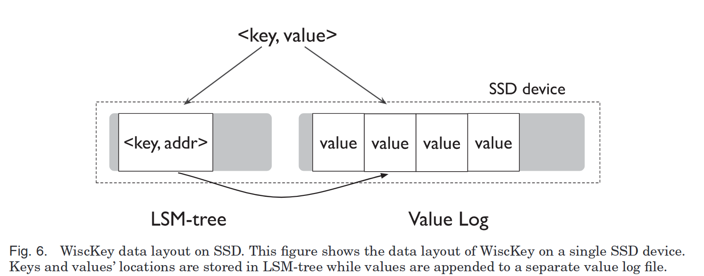

## 背景
LSM Tree 已经在 write-intensive database 中大量应用，但旧的实现存在以下问题：
1. 严重的读写放大（read/write amplification）
2. 没有充份利用 SSD 的内部并行性。

问题 1 尤为严重，LevelDB 的最坏情况下，写放大（从 L0 下沉至 L1）为 50，读放大（从 L0 读取所有 SST，再读穿到 L6）为 24×14 = 366。严重的读写放大不仅会导致 SSD 磨损，还会导致占用大量带宽。

>[!NOTE] LevelDB 的读放大
>读放大主要有两大来源：
>1. LevelDB 的分层设计
>2. 从 SST 中查找 key-value 需要读额外的元数据。
>
>L0 最多 8 个 SST，彼此间可能存在重叠，因此 L0 最多读取 8 个 SST；L1 到 L6 中，同一层中的 SST 彼此不重叠，因此 L1 至 L6 最多读取 6 个 SST。从 L0 到 L6 最多读取 8+6=14 个 SST，这里的写放大是 14。
>
>从 SST 中搜索 key，需要读取 index block + bloom-filter blocks + data block。论文以 1KB 的 key-value 为例，index block 占 16KB，bloom-filter block 占 4KB，data block 占 4KB，总共需要读取 24KB。这里的写放大是 24。
>
>最坏情况下，从 L0 读到 L6，每次读取 SST 的读放大都是 24，读放大总计 14×24=336。

>[!NOTE] LevelDB 的写放大
>LevelDB 的写放大主要来自分层设计。
 为了写一个 SST 被迫进行 comapction，一次 compaction 需要读取同层的其他 SST，最终写入下一层（上下层 SST 大小相差 10 倍）。考虑将某一层写满时，此时的写放大（总写入量/实际数据量 - 1）是 10。comapction 可能会导致更多的 comapction（比如下面某一层已经满了），最坏情况下 LevelDB 有 6 层，因此最坏情况下写放大是 5×10=50。
 >
 >写放大的分析并不直观。考虑写满 L0，此时写放大是 0（即没有放大）。写满 L0 后进行 compaction，将 L0 下移成 L1 的一个 SST，此时写放大 +1；不断写入，再从 L0 下移成 L1 的一个 SST，写放大 +1；L1 写满后，总共进行了 10 次 compaction，因此每一层写满时，写放大 +10。总共有 6 层，其中只有 L1-L5 是 comapction 的得到的，因此最坏情况下写放大是 5×10=50。

论文基于 LevelDB，提出 KV 分离的 LSM Tree，即 key 仍然使用 LevelDB 的 LSM Tree 存储，Value 已 log-structured 方式存储。通常 key 的大小远小于 value，通过 KV 分离可以极大地缓解读写放大。

KV 分离的设计带来了给范围查询、一致性、GC 等带来了挑战，论文巧妙地通过一系列简洁高效的设计解决了这些问题。
## 设计

在 LSM-tree 中存储`<key, addr>`，在 vLog（Value Log）中以 log-structured 方式存储 value。

查询时，在 LSM-tree 查找到`<key, addr>`，拿到地址后从 vLog 中读取 value。
写入时，先在 vLog 中附加 value，再把对应的`<key, addr>`插入到 LSM-tree。

LevelDB 的实现中，KV 一体，查找到 Key 即可读写 Value，KV 一体的设计有以下好处：
- 查询写入都比 Wiskey 少一步（读写 vLog）
- 支持高效的范围查询（KV 在 SST 中有序）
- 容易实现一致性（Key/Value 总是同时写入）

Wiskey 在实现上主要面临以下问题：
- 如何实现高效的范围查询？
- 如何确保崩溃时 key-value 的一致性？
- 如何进行 vLog 的 GC？

## 实现
### 范围查询
Wiskey 分两步进行查询：
1. 从 LSM-tree 查询`<key, addr>`。
2. 从 vLog 读取 value。
value 在 vLog 中不是有序的，因此无法顺序读取。
Wiskey 用一下两种方法实现高效的范围查询：
1. 缓存 LSM-tree 到内存。LSM-tree 只含有 key，通常可以全部或部分缓存到内存中。查询 key 的过程不涉及磁盘 IO。
2. 并发从 vLog 读取 value。SSD 的并发乱序读性能和串行顺序读性能持平。
[评估](#评估)一节可以看到，SSD 在数据大小达到一定阈值后，并发乱序读吞吐量才能和串行顺序读持平，并且并发乱序读性能取决于 SSD 的内部并行程度。因此 Wiskey 范围查询的性能取决于：
1. value 的大小。小对象的范围查询性能不如 LevelDB。
2. SSD 内部并行程度。

### 垃圾回收
key 存储在 LSM-tree 中，compaction 时进行 GC。Wiskey 主要考虑的是 vLog 的垃圾回收，即设计一种在线的垃圾回收算法，尽可能减少对用户写入的干扰。

Wiskey vLog 的 GC 算法和 *Log-structured SSD* 类似。合法的 value  放在连续区域 tail-head 中，tail 标示 GC 起始位置，head 标示 GC 终止位置（同时也是下一次写入位置）。tail 和 head 会被持久化到 LSM-tree 中，GC 时递增 tail，所有写入都递增 head。

GC 流程就是从 tail 开始读取 value，将最新的 value 附加到 head，并更新 tail/head。为了判断 value 是否过时，Wiskey 修改了 vLog 的布局，将 key-value 一起存储到 vLog 中。读取 key-value，并从 LSM-tree 中查询该 key，判断地址是否和 key-value 在 vLog 中的地址相同即可判断该 value 是否过时。

GC 流程如下：
1. 判断 KV 是否过时。读取 key-value，并从 LSM-tree 查询该 key，校验地址是否相同。
2. 以同步（写入后立刻 fsync） append 最新的 value 到 vLog。
3. 以同步修改 LSM-tree 中 value 对应的地址和 tail maker。
当整个 tail-head 区域完成扫描后，释放被回收的 value 占用的存储空间。

>[!NOTE] 文件空间的释放
vLog 实现为一个文件，GC 后被回收的文件范围（tai-head）会变成一个“洞”（hole）。现代文件系统支持通过 fallocate(2) 分配/回收文件空间，Wiskey 就是用 fallocate(2) 释放 GC 回收的空间。

Wiskey 的 GC 是在线算法，GC 和用户写并发进行。这会导致竟态条件：
1. GC 扫描到 key，发现该 key 时最新的。
2. 用户写入该 key 的新 value。
3. GC 将该 key 的旧值的新地址写入 LSM-tree。
4. key 指向旧值，导致新值丢失。
论文没有提到这个问题，但可以猜想，为了避免竟态条件，每个对象的 GC 都要是原子的。

有了以上背景知识，Wiskey 的插入流程可以总结为：
1. 写 vLog。同步写入则立即刷盘。
2. 更新 LSM-Tree。同步方式写 vLog 时，不需要写 WAL。
3. 更新 head。

### 故障一致性
故障一致性（crash consistency）指发生故障时，满足以下两个要求：
1. 插入的 key-value 是原子的。要么 key-value 已插入，要么未插入。
2. 按插入次序恢复 key-value。对于插入的序列 K-V1、K-V2 直至 K-Vn，恢复时也按这个次序恢复。

实现要求 1 原子性的方法如下：
1. 如果未查找到 key，视作 key-value 未被插入。已被插入的 value 后续会被 GC。
2. 如果查找到 key，进行验证（verification）。
    1. key 对应的地址是否在合法的 head-tail 范围内。验证失败的情况是更新 head 前故障。
    2. vLog 中的 key-value 是否和 key 对应。验证失败的情况是 vLog 刷盘（异步写入）前故障。

要求 2 的实现利用了现代文件系统的特性：append 不会乱序。例如，按 v1、v2、v3、v4 次序 append 文件，故障恢复后，成功 append 的序列一定是 v1、v2、v3、v4 的某个前缀（如 v1、v2）。

## 优化
### 消除 LSM-tree 的 WAL
LevelDB 为了实现持久性，写 memtable 前要先写 WAL。在 Wiskey 中，vLog 同时存储了 key-value，而且写 vLog 先于写 LSM-tree。只要保证 vLog 的写入是同步的，vLog 就可以视作 LSM-tree 的 WAL。

### 优化 GC
论文给出了两种 GC 的优化：
1. 并发查找：扫描过程中并发查找 key。
2. 无效 KV 位图：使用 bitmap 记录 tail-head 范围内 key-value 是否过时。论文没有详细说明，猜测是 insert 时更新 bitmap，GC 直接查 bitmap 避免查 LSM-tree。
## 评估
测试表明，Wisckey 的读写放大均远远小于 LevelDB。
- Wiskey 顺序插入（key 递增）性能更好，原因是 Wiskey 不需要写LSM-tree WAL。
- Wiskey 乱序插入性能更好，原因是 Wiskey 的 GC 成本低于 LevelDB 的 compaction，并且 Wiskey 的写放大远远小于 LevelDB（1KB 大小下，Wiskey 的写放大接近 1，LevelDB 大于 12）。
- Wiskey 插入操作的延迟比 LevelDB 更稳定，原因是 LevelDB 的 compaction 导致前台写卡顿。
- Wiskey GC 开启后性能下降最多 30%。
- Wiskey 删除整个数据集 GC 最快，这是因为 GC 的成本来自扫描和将合法 key-value 附加到文件，整个数据集都被删除时没有合法的 key-value 需要附加，因此成本最低。

评估揭示了 LevelDB 性能瓶颈根源：
1. 写放大浪费磁盘带宽。
2. compaction 导致前台写卡顿。
3. 写 LSM-tree log。

